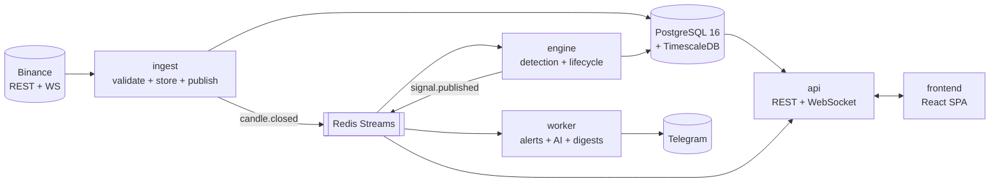

# Institutional AI Crypto Scanner

**The institutional lens for crypto markets.** The platform continuously watches
every liquid Binance spot-USDT market across every relevant timeframe, applies a
deterministic, non-repainting institutional detection doctrine (ICT/SMC), surfaces
only setups that clear strict quality floors, ranks them by evidence-backed
confidence, and explains them with a grounded AI layer.

Its defining commitment is honesty: it keeps an immutable public record of every
signal — wins **and** losses. As the product doctrine puts it, _"The platform
finds and explains; the trader decides."_ (PRD §1). It is not a signal group, not
financial advice, and not an auto-trader.

## Governance

Code follows documents; documents change only by amendment (Constitution §42).
The nine frozen governance documents live in [`docs/governance/`](docs/governance/)
and are read-only by convention (CODEOWNERS-protected):

Constitution · Scanner Logic Specification (SLS) · Technology Decision Record
(TDR) · Product Requirements (PRD) · Technical Architecture (TAD) · Database
Design (DDD) · API Specification · UI/UX Blueprint · Development Roadmap.

Decisions made within that latitude are recorded as immutable ADRs in
[`docs/adr/`](docs/adr/).

## Architecture at a glance

Modular monolith: one Python package `scanner`, four runtime processes composed
via per-process composition roots, Clean/hexagonal layering enforced in CI
(TAD §1, §27).



## Getting started

Prerequisites and the one-command setup are in [`docs/setup.md`](docs/setup.md).

```bash
scripts/bootstrap.sh      # install toolchain + deps + git hooks
scripts/dev-up.sh         # start the dev stack (compose)
cd frontend && pnpm dev   # the app shell (Vite dev server)
scripts/verify-clone.sh   # validate a clean setup (Gate G0 evidence)
```

`dev-up.sh` brings up six containers — `db` (PostgreSQL 16 + TimescaleDB),
`redis`, and the four processes `api` (:8000), `ingest` (:8001), `engine`
(:8002), `worker` (:8003) — each health-checked. Add `--profile obs` for
Prometheus/Grafana/Loki. Verify: `curl localhost:8000/internal/health/live`.

Requires: Git ≥2.40, uv (installs Python 3.12), Node ≥20 + pnpm (via corepack),
Docker + Compose v2. Windows: use WSL2 for `scripts/`.

## Repository map

| Path | What |
|---|---|
| `backend/` | Python `scanner` distribution: `shared` · `domain` · `application` · `infrastructure` · `interfaces` · `runtime` |
| `frontend/` | React 18 + TS strict SPA (UI lands from Sprint S13) |
| `ops/` | compose, Docker, Caddy, Prometheus/Grafana/Loki, Terraform, env catalog |
| `docs/` | governance stack, ADRs, runbooks, setup, security, cache registry |
| `scripts/` | repo lifecycle automation (bootstrap, verify-clone, new-adr) |
| `.github/` | CODEOWNERS, PR template, CI/CD workflows (jobs land in S0.2) |

## Development workflow

Trunk-based (ADR-000 §2). `main` is protected, always green, always deployable.
Work on short-lived `<type>/<sprint>-<slug>` branches; Conventional Commits;
squash-merge with the governance-reference line in the PR. Types: `feat · fix ·
chore · docs · test · refactor`. Sprint cadence and scope are defined in the
[Development Roadmap](docs/governance/DEVELOPMENT_ROADMAP.md).

## Testing

Backend tests mirror `src/scanner` 1:1 (Constitution §32.6). Layers
(Roadmap §8):

| Layer | Location | Run |
|---|---|---|
| unit | `backend/tests/unit/` | `cd backend && uv run pytest tests/unit` |
| property | `backend/tests/property/` | `uv run pytest tests/property` |
| golden | `backend/tests/golden/` | detector datasets (S3) |
| integration | `backend/tests/integration/` | `uv run pytest -m integration` (Docker) |
| e2e / load | `backend/tests/{e2e,load}/` | pipeline / Locust (S9+/S11+) |

Run locally: `scripts/test-backend.sh --lint` (ruff + mypy + import-linter +
pytest) and `scripts/test-frontend.sh` (eslint + tsc + vitest). Coverage floor:
85% repo-wide; `shared/` at 100% by review rule (S0.1 §21).

Frontend: `cd frontend && pnpm test` (Vitest).

## Operations

Runbooks: [`docs/runbooks/`](docs/runbooks/) (backfill live; feed-incidents and
DR arrive with their sprints). Environment catalog:
[`ops/env/.env.example`](ops/env/.env.example). Cache registry:
[`docs/cache-registry.md`](docs/cache-registry.md). Health/metrics endpoints and
the status page are wired from S0.2 onward.

## Staging

Staging is the always-on pre-production truth (Roadmap §10). Deploys are
automatic: merge to `main` → `ci.yml` (green) → `deploy-staging.yml` pulls the
sha-tagged images, decrypts the SOPS env, `compose up`, and gates on all four
processes being ready ≤120s. The host is provisioned from
[`ops/terraform/staging/`](ops/terraform/staging/) — see
[runbooks/staging-provision.md](docs/runbooks/staging-provision.md).

Observe it (SSH-tunnelled, never publicly exposed): **Grafana** (heartbeat +
release annotations), **Loki** (`{service="api", env="staging"}`), **Sentry**
(tagged `environment:staging`, `release:<sha>`). Conventions:
[docs/observability-conventions.md](docs/observability-conventions.md); incident
path: [docs/runbooks/debugging.md](docs/runbooks/debugging.md). The edge blocks
`/internal/*` (403) — internal endpoints are operator-facing only until the
public `/api/v1/status` surface lands in S11.

## License

Proprietary — all rights reserved. See [LICENSE](LICENSE).
