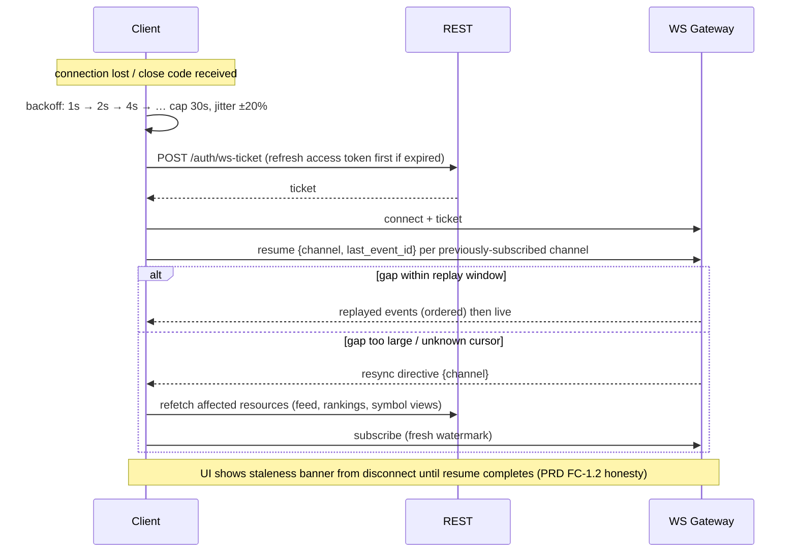

# API SPECIFICATION (API CONTRACT)

## Institutional AI Crypto Scanner — Platform API Contract

**Document Status:** Official API Specification — the binding contract for every platform interface
**Authority:** Subordinate to `PROJECT_CONSTITUTION.md`, `SCANNER_LOGIC_SPECIFICATION.md`, `TECHNOLOGY_DECISION_RECORD.md`, `PRODUCT_REQUIREMENTS_DOCUMENT.md`, `TECHNICAL_ARCHITECTURE_DOCUMENT.md`, and `DATABASE_DESIGN_DOCUMENT.md` (all v1.0.0); authoritative over all endpoint contracts, message schemas, and API policy
**Version:** 1.0.0 | **Ratified:** 2026-07-12
**Amendment Rule:** Contract changes follow the versioning and deprecation rules in §2/§16 of this document (Constitution §15.4)

> This is a contract, not an implementation. The machine-readable OpenAPI 3.1 schema is generated from implementation (TDR §28) and must conform to this document — where they diverge, this document wins and the implementation is defective. Body structures are specified at field-semantics level; exact JSON shapes live in the generated schema.

---

## 1. API Philosophy

1. **The API is the product's honesty made programmatic.** Every response carries the same provenance the UI shows: data freshness, algorithm versions, evidence references. A consumer can never receive a number the platform can't justify (Constitution §23.5 extended to machines).
2. **One API for all consumers.** The SPA, future mobile app, and future public API program consume the same contract with the same semantics — entitlements and rate tiers differentiate access, never endpoint behavior (TAD §11).
3. **Read-heavy by design.** Detection is platform-side; clients read, subscribe, and configure. There is no endpoint that creates market truth — signals cannot be created, edited, or deleted via any API, at any privilege (Constitution §45.5).
4. **Deterministic contracts.** Same request + same platform state ⇒ same response. Ordering rules are total (SLS §9.2); pagination is stable; no endpoint returns nondeterministically ordered collections.
5. **Explicit over clever.** No content negotiation magic, no implicit defaults that change behavior silently, no overloaded endpoints. Every capability is one named operation.
6. **Fail honestly.** Degraded data is labeled degraded in-band (§13); suppressed content reports its suppression; errors are typed, coded, and correlated (§7).

## 2. Versioning Strategy

| Rule | Specification |
|---|---|
| Scheme | URL-prefix major version: `/api/v1/...` — the only version signal a client needs |
| Compatibility promise | Within `v1`: additive-only changes (new endpoints, new optional fields, new enum values *only where the field is documented as open-enum*). Field removal/retyping/semantic change ⇒ `v2` |
| Open vs closed enums | Every enum field is documented `closed` (client may exhaust; e.g., signal `direction`) or `open` (client must tolerate unknown values; e.g., `suppress_reason`) |
| WS message versioning | Every message carries `v` (schema version per channel, §19); channel schema evolution follows the same additive rule |
| Version lifetime | A major version is supported ≥ 12 months after its successor ships (Constitution §15.4); sunset schedule per §16 |
| Internal APIs | Health/metrics/admin are versionless (`/internal/...`, `/admin/v1/...` respectively — admin is versioned; ops plumbing is not part of the public contract) |

## 3. Authentication Strategy

Per TAD §20 (flows are binding; summarized as contract):

| Mechanism | Use | Contract |
|---|---|---|
| Access token (JWT, ≤ 15 min) | All authenticated REST calls | `Authorization: Bearer <token>`; carries user/tenant/entitlement claims; verified per-request incl. revocation bitmap |
| Refresh token (rotating, httpOnly Secure cookie) | `POST /auth/refresh` only | Rotation on every use; reuse detection revokes the session family |
| WS ticket | WebSocket connect | Single-use, 30 s TTL, obtained via REST (§19.2); tokens never appear in URLs |
| TOTP (2FA) | Login step-up + sensitive operations | Sensitive ops (password change, channel unlink, account deletion, API-key issuance) require fresh re-auth (≤ 5 min) or TOTP step-up |
| API keys (C3 program, designed now) | Public API program | `X-API-Key` header; scoped, revocable, per-key rate tiers; never for browser flows |

Unauthenticated surface (exhaustive): registration, login, refresh, verification/reset flows, public track-record page endpoints, health probes. Everything else requires authentication.

## 4. Authorization Rules

1. **Layered decision** (TAD §21): authentication → tenant scoping (structural, repository-level) → entitlements (plan capabilities) → RBAC (staff roles) — deny-by-default at every layer.
2. **Every endpoint declares its permission** in its table row (column *Permissions*): `public` · `user` (any authenticated) · entitlement keys (e.g., `tf:M15`, `alerts:high`, `ai:on_demand`, `api:export`) · staff roles (`support`, `ops`, `superadmin`).
3. **Entitlement failures are honest:** `403 ENTITLEMENT_REQUIRED` includes the missing capability key and the lowest plan providing it — the API-level equivalent of the UI's locked states (PRD FC-15.2). Never `404`-masking for entitlement gates.
4. **Free-tier delay** (PRD FC-15.2) is enforced server-side: delayed variants of live resources are what the entitlement serves; there is no parameter to request undeleted data without the capability.
5. **Tenant isolation:** no endpoint accepts a foreign tenant/user id except staff endpoints under `/admin/v1` (which audit every call — DDD T38).
6. **Staff endpoints** are additionally IP/VPN-restricted at the edge (TAD §23) — network posture is part of the contract.

## 5. REST API Standards

| Standard | Rule |
|---|---|
| Style | Resource-oriented; nouns plural (`/signals`, `/watchlists/{id}/items`); actions that aren't CRUD are explicit sub-resources (`/auth/refresh`, `/signals/{id}/explanation:regenerate` is NOT used — regeneration is `POST /ai/requests`) |
| Methods | GET (safe, cacheable), POST (create/commands), PATCH (partial update — the only update verb; PUT unused), DELETE (idempotent removal) |
| Idempotency | All GET/DELETE idempotent by definition; mutating POSTs accept optional `Idempotency-Key` header (required for billing-adjacent calls); retried keys return the original result |
| Status codes | 200 (read/update), 201 (created, with `Location`), 202 (accepted async, with job ref), 204 (delete), 4xx/5xx per §7 |
| Timestamps | ISO-8601 UTC with `Z`, milliseconds where relevant; candle identity by `open_time` (SLS §0.2) |
| Numbers | All prices/volumes/money as **strings** in JSON (decimal-exact transport; float corruption prohibited — Constitution §45.8); counts/scores as numbers |
| IDs | ULIDs as opaque strings; clients never parse or construct them |
| Nulls | Absent ≠ null: optional absent fields are omitted; null is a meaningful value only where documented |
| Compression/format | JSON UTF-8; gzip/brotli negotiated; no XML, no alternate formats in v1 |

## 6. WebSocket Standards

Binding message envelope (every server→client message):

| Field | Meaning |
|---|---|
| `v` | Channel schema version (integer) |
| `channel` | Fully-qualified channel name (§19.1) |
| `event_id` | ULID, strictly increasing per channel — the resume cursor |
| `type` | Event type within the channel (open enum) |
| `ts` | Server emission timestamp |
| `payload` | Typed body per channel schema |
| `meta` | Optional: freshness/degradation flags applying to this payload |

Client→server messages: `subscribe`, `unsubscribe`, `resume` (with `last_event_id` per channel), `ping`. Full channel catalog, connection, and reconnection rules in §19.

**SSE fallback (TAD §12):** `GET /api/v1/sse?channels=...` serves the same envelope over Server-Sent Events for restrictive networks — read-only (no client commands), same entitlement enforcement, `Last-Event-ID` header as the resume cursor. WS is the primary contract; SSE is a degraded-transport mirror, feature-frozen to it.

## 7. Error Response Standard

One envelope for every error, REST and WS (TAD §16):

```
{ "error": { "code": <MACHINE_CODE>, "message": <human-safe>, "correlation_id": <ulid>, "details": [ {field, code, message}... ]? , "retry_after"? } }
```

| HTTP | Codes (closed enum per endpoint; platform-wide set below) |
|---|---|
| 400 | `VALIDATION_FAILED` (with `details[]`), `MALFORMED_REQUEST` |
| 401 | `AUTH_REQUIRED`, `TOKEN_EXPIRED`, `TOKEN_REVOKED`, `TOTP_REQUIRED` |
| 403 | `ENTITLEMENT_REQUIRED` (+ capability key + minimum plan), `FORBIDDEN`, `TENANT_MISMATCH` |
| 404 | `NOT_FOUND` (true absence only — never entitlement masking) |
| 409 | `CONFLICT`, `IDEMPOTENCY_REPLAY_MISMATCH`, `STATE_TRANSITION_INVALID` |
| 422 | `SEMANTIC_REJECTION` (valid shape, impossible content — e.g., filter referencing unknown archetype) |
| 429 | `RATE_LIMITED` (+ `retry_after`, always) |
| 500 | `INTERNAL` (correlation id; no internals leaked — Constitution §17.10) |
| 503 | `DEGRADED_DEPENDENCY`, `MAINTENANCE` (+ `retry_after`) |

Rules: error messages are user-safe strings, never stack traces or SQL; `details[]` is field-precise for validation failures; every 5xx is Sentry-correlated by the same `correlation_id` the client received.

## 8. Pagination Standard

- **Keyset (cursor) pagination platform-wide** (DDD §21.2): `?cursor=<opaque>&limit=<n>`; response envelope carries `page: { next_cursor?, has_more, count }`. OFFSET pagination does not exist in this API.
- Default `limit` 50, max 200 (per-endpoint overrides documented); cursors are opaque, signed, and expire after 24 h.
- Ordering under pagination is total and documented per endpoint (ULID/timestamp tiebreakers) — a paginated walk never skips or duplicates under concurrent inserts.

## 9. Filtering Standard

- Query-parameter filters, one grammar everywhere: `?filter[field]=value`, `?filter[field][in]=a,b`, `?filter[field][gte]=x`, `?filter[field][lte]=y`.
- Filterable fields are enumerated per endpoint (closed set — unknown filter fields ⇒ `422 SEMANTIC_REJECTION`, never silent ignoring: a filter the server didn't apply is a lie the client believes).
- Signal/setup filters use SLS vocabulary verbatim: `archetype`, `grade`, `timeframe`, `direction`, `tier`, `category`, `htf_alignment`, `rvol_class` (PRD FC-5.1 dimensions).
- Filters narrow only — nothing filterable can surface below-floor or suppressed content (Constitution §23.7).

## 10. Sorting Standard

- `?sort=field` ascending, `?sort=-field` descending; multi-sort comma-separated, applied left-to-right; sortable fields enumerated per endpoint (unknown ⇒ `422`).
- Every sortable collection has a documented default sort; rank-ordered resources (`/rankings`, signal feed) fix their sort to the deterministic SLS §9.2 order — client sort parameters are rejected there (`422 SEMANTIC_REJECTION`) rather than silently overridden.

## 11. Rate Limiting Policy

Token-bucket per user (authenticated) or IP (anonymous), enforced at API layer with edge backstop (TAD §23); every response carries `X-RateLimit-Limit/Remaining/Reset`; 429 always includes `retry_after`.

| Class | Scope | Free | Pro | Desk | Notes |
|---|---|---|---|---|---|
| `auth` | Login/register/reset per IP | 10/min | 10/min | 10/min | + progressive lockout on failures (Constitution §17.9) |
| `read:light` | Single-resource GETs | 120/min | 300/min | 600/min | |
| `read:heavy` | Collections, history, stats | 30/min | 120/min | 300/min | |
| `write` | Watchlists, rules, settings | 30/min | 60/min | 120/min | |
| `ai` | On-demand AI requests | 5/day | 50/day | 200/day | Budget-metered additionally (Constitution §26.7) |
| `export` | Data exports | 2/day | 10/day | 50/day | |
| `ws:connect` | Connections per user | 2 | 5 | 15 | + subscribe ops 30/min |
| `admin` | Staff endpoints | — | — | — | Role-scoped, generous, fully audited |

## 12. Request Validation Rules

1. Every request body/query validated against its schema at the boundary (Pydantic — TAD §11); unknown body fields **rejected** (`VALIDATION_FAILED`), not ignored — silent tolerance breeds client drift.
2. String limits, numeric ranges, array caps documented per field; collection-mutation endpoints enforce entitlement caps at validation time with the honest `403` (§4.3).
3. All identifiers validated for existence *after* authorization scoping (a foreign tenant's resource is `404`, never `403` — existence itself is tenant-scoped information).
4. Semantic validation (§7 `422`): cross-field rules (date ranges, filter coherence) rejected with field-precise details.

## 13. Response Format Standard

Success envelope:

```
{ "data": <resource | resource[]>, "page"?: {...}, "meta": { "generated_at", "freshness"?, "versions"? } }
```

- **`meta.freshness`** appears on every market/detection-derived response: per-source staleness states (SLS §2.12) — a degraded input can never render as fresh (Constitution §45.3). Free-tier delayed responses declare `delay_minutes` explicitly.
- **`meta.versions`** appears on every doctrine-derived response: `algo_version`, `param_set_version` (SLS §15.2) and, where AI content is included, model/prompt versions.
- Resource representations are consistent across endpoints: a Signal is the same shape in feed, detail, history, and WS push (single schema, projection by documented field sets: `summary` vs `full`).
- Confidence values always ship with their factor breakdown (SLS §15.4) — there is no representation of a bare score.

## 14. API Naming Convention

| Element | Convention | Example |
|---|---|---|
| Paths | lowercase; plural nouns; kebab-case for multi-word segments; ULID path params | `/api/v1/signals/{signal_id}`, `/auth/ws-ticket` |
| Query params | `snake_case` | `?filter[timeframe]=H4` |
| JSON fields | `snake_case`, SLS vocabulary verbatim (Constitution §11.1) | `final_confidence`, `entry_band`, `swept_at` |
| Event/WS types | dot-namespaced | `signal.published`, `alert.suppressed` |
| Error codes | `SCREAMING_SNAKE` | `ENTITLEMENT_REQUIRED` |
| Headers | Standard + `X-RateLimit-*`, `Idempotency-Key`, `X-API-Key` | |

A `sweep` in the API is a sweep per SLS §4.6 — API vocabulary and doctrine vocabulary are the same dictionary; no marketing synonyms in field names.

## 15. API Lifecycle

`DESIGNED` (this document) → `IMPLEMENTED` (OpenAPI generated + contract-tested against this spec) → `STABLE` (v1 compatibility promise active) → `DEPRECATED` (§16) → `SUNSET` (410 with pointer). Every endpoint's state is tracked in the generated docs; new endpoints enter under this document via amendment; experimental endpoints (if ever) are explicitly `X-Experimental: true` and excluded from the compatibility promise — none exist in v1.

## 16. Deprecation Policy

1. Deprecation announced in release notes + `Deprecation` and `Sunset` response headers on every call to the deprecated surface, ≥ 90 days before sunset (public API consumers: ≥ 180 days once C3 launches).
2. Replacement documented in the header (`Link: <successor>; rel="successor-version"`).
3. Usage of deprecated endpoints is metered; sunset only executes when usage < 1% of consumers or the window lapses — whichever is later within the Constitution §15.4 12-month floor.
4. Sunset responses: `410 GONE` with error code `ENDPOINT_SUNSET` + successor pointer, retained ≥ 6 months.

## 17. Security Requirements (API Surface)

1. TLS-only (HSTS; no plaintext listener exists); tokens per §3 — access tokens never in URLs, cookies `Secure; HttpOnly; SameSite=Strict` for refresh.
2. All input validated (§12); all output encoded; no user content reflected unsanitized (journal/notes are stored raw, rendered escaped — contract note for clients).
3. Rate limits (§11) + progressive auth lockouts + anomaly alarms (TAD §23).
4. CORS: allowlisted origins only (app domains); public API program will use key auth without CORS relaxation.
5. Sensitive operations require step-up (§3); all such operations audited (DDD T38) with actor, IP, and correlation id.
6. Responses never leak internals: no stack traces, no SQL, no infrastructure hostnames, no other-tenant existence signals (§12.3).
7. Webhooks (billing inbound): signature-verified, replay-protected (timestamp + nonce), processed idempotently — the only inbound non-user surface in v1.
8. Export endpoints watermark provenance (generated_at, account) — data honesty extends to what leaves.

---

## 18. REST Endpoint Groups

Legend — **Auth**: 🔓 public · 🔑 user · 🎫 entitlement (key shown) · 🛡 staff role. **RL**: rate-limit class per §11. Common error set `[C]` = `AUTH_REQUIRED/TOKEN_*`, `RATE_LIMITED`, `INTERNAL`, `VALIDATION_FAILED` — listed errors are the *additional* meaningful ones. All collection endpoints paginate per §8 and filter/sort per §9–§10 unless noted.

### 18.1 Authentication (`/api/v1/auth`)

| Endpoint | Method + Path | Purpose | Auth | Params / Body (high-level) | Response (high-level) | Extra Errors | RL | Permissions | Notes |
|---|---|---|---|---|---|---|---|---|---|
| Register | POST `/auth/register` | Create account | 🔓 | Body: email, password, accepted_terms_version | 201: user summary + verification-pending state | `CONFLICT` (email) | auth | public | Triggers verification email (≤ 60 s, PRD FC-15.1) |
| Verify email | POST `/auth/verify-email` | Confirm address | 🔓 | Body: token | 200: verified state | `TOKEN_EXPIRED` | auth | public | Single-use token |
| Login | POST `/auth/login` | Establish session | 🔓 | Body: email, password, totp_code? | 200: access token + refresh cookie + user summary; or `TOTP_REQUIRED` step | `AUTH_REQUIRED` (bad creds — deliberately same code, no user-enumeration) | auth | public | Progressive lockout §17.3 |
| Refresh | POST `/auth/refresh` | Rotate tokens | 🔓 (cookie) | Refresh cookie | 200: new access token + rotated cookie | `TOKEN_REVOKED` (family reuse ⇒ full revoke, TAD §20) | auth | public | |
| Logout | POST `/auth/logout` | End session family | 🔑 | — | 204 | — | auth | user | Revokes family + revocation bitmap ≤ 30 s |
| Request reset | POST `/auth/password-reset/request` | Start reset flow | 🔓 | Body: email | 202 always (no enumeration) | — | auth | public | |
| Confirm reset | POST `/auth/password-reset/confirm` | Set new password | 🔓 | Body: token, new_password | 200 | `TOKEN_EXPIRED` | auth | public | Revokes all sessions |
| Enroll 2FA | POST `/auth/totp/enroll` | Begin TOTP setup | 🔑 step-up | — | 200: provisioning secret + recovery codes (shown once) | — | write | user | Audited |
| Confirm 2FA | POST `/auth/totp/confirm` | Activate TOTP | 🔑 | Body: totp_code | 200 | `VALIDATION_FAILED` | write | user | |
| Disable 2FA | DELETE `/auth/totp` | Remove TOTP | 🔑 step-up | Body: totp_code or recovery_code | 204 | — | write | user | Audited; email notice |
| List sessions | GET `/auth/sessions` | Active session families | 🔑 | — | 200: sessions[] (device, created, last-used, current flag) | — | read:light | user | PRD FC-9.2 |
| Revoke session | DELETE `/auth/sessions/{session_id}` | Kill one family | 🔑 | Path: session_id | 204 | `NOT_FOUND` | write | user | Effective ≤ 30 s |
| Login history | GET `/auth/login-history` | Recent auth events (PRD FC-9.2) | 🔑 | Keyset paginated | 200: events[] (type, time, IP, device, outcome) | — | read:light | user | Read of the user's own audit-classed auth events (DDD T38) |
| WS ticket | POST `/auth/ws-ticket` | Issue socket ticket | 🔑 | — | 200: ticket (30 s TTL, single-use) | — | read:light | user | §19.2 |

### 18.2 User Profile (`/api/v1/me`)

| Endpoint | Method + Path | Purpose | Auth | Params / Body | Response | Extra Errors | RL | Permissions | Notes |
|---|---|---|---|---|---|---|---|---|---|
| Get profile | GET `/me` | Identity + plan + entitlements snapshot | 🔑 | — | 200: user, tenant, plan, capabilities, usage meters | — | read:light | user | The SPA bootstrap call |
| Update profile | PATCH `/me` | Display fields | 🔑 | Body: display_name?, handle? | 200: updated profile | `CONFLICT` (handle) | write | user | Email change is a separate verified flow |
| Change email | POST `/me/email-change` | Verified email swap | 🔑 step-up | Body: new_email | 202: pending verification | `CONFLICT` | write | user | Old+new notified; audited |
| Change password | POST `/me/password` | Rotate credential | 🔑 step-up | Body: current_password, new_password | 200 | `AUTH_REQUIRED` | write | user | Revokes other sessions |
| List channels | GET `/me/channels` | Linked delivery channels | 🔑 | — | 200: channels[] (type, masked address, verified) | — | read:light | user | |
| Link Telegram | POST `/me/channels/telegram` | Start deep-link binding | 🔑 | — | 200: bot deep-link + binding code (10 min TTL) | — | write | user | Completion arrives via bot; DDD T26 |
| Unlink channel | DELETE `/me/channels/{channel_id}` | Remove channel | 🔑 step-up | Path: channel_id | 204 | `NOT_FOUND` | write | user | Alert rules referencing it flag `channel_missing` |
| Export data | POST `/me/export` | Full account data export | 🔑 step-up | — | 202: job ref → notification with download link | — | export | user | GDPR + user-property principle (DDD §11) |
| Delete account | POST `/me/delete` | Begin deletion workflow | 🔑 step-up | Body: confirmation phrase | 202: scheduled (7-day grace, cancelable) | — | write | user | Purge per DDD T21; audited |

### 18.3 Dashboard (`/api/v1/dashboard`)

| Endpoint | Method + Path | Purpose | Auth | Params / Body | Response | Extra Errors | RL | Permissions | Notes |
|---|---|---|---|---|---|---|---|---|---|
| Overview | GET `/dashboard/overview` | One-call session-start state (PRD FC-2.1) | 🔑 | — | 200: market regime summary, top signals (entitlement-scoped), recent sweeps, compression watchboard, universe stats, active incidents | — | read:heavy | user | Aggregation of other resources; shapes identical to their canonical forms |
| Market regime | GET `/dashboard/regime` | Breadth + condition tags | 🔑 | Query: timeframe? | 200: HTF state distribution, aggregate RVOL, sentiment tag | — | read:light | user | |
| Status strip | GET `/dashboard/status` | Data honesty surface (PRD FC-1.2) | 🔑 | — | 200: feed freshness set, degraded symbol-TFs, last scan cycle ms, storm-mode flag | — | read:light | user | Also pushed on `system.status` channel |

### 18.4 Scanner (`/api/v1/scanner`)

| Endpoint | Method + Path | Purpose | Auth | Params / Body | Response | Extra Errors | RL | Permissions | Notes |
|---|---|---|---|---|---|---|---|---|---|
| Universe | GET `/scanner/universe` | Current scanned universe | 🔑 | Filters: tier, category, status | 200: symbols[] (tier, status, warmup state, TFs scanned) | — | read:heavy | user | DDD T1/T2 view |
| Symbol status | GET `/scanner/universe/{symbol_id}` | One symbol's scan state | 🔑 | Path: symbol_id | 200: full universe record + incident history refs | `NOT_FOUND` | read:light | user | |
| Live feed | GET `/scanner/feed` | Ranked published signals (PRD FC-2.2) | 🔑 | Filters §9 (archetype, grade, tf, direction, tier, category, htf_alignment, watchlist_id); no sort (fixed §10) | 200: signals[] `summary` projection + ranks + decay | — | read:heavy | user (delay per plan) | THE core read; WS `signals.*` maintains it live |
| Momentum board | GET `/scanner/momentum` | RVOL/momentum heat surface (PRD FC-4.2) | 🔑 | Filters: tf, tier, category, rvol_class; sort: rvol, momentum, delta | 200: rows[] (rvol class, momentum score+direction, accel, delta, wash flags) | — | read:heavy | user | Wash-capped symbols flagged, never hidden |
| Compression board | GET `/scanner/compression` | Active coils (SLS §7.3) | 🔑 | Filters: tf, tier | 200: rows[] (coil age, envelope, adjacent pools) | — | read:heavy | user | |

### 18.5 Coins (`/api/v1/coins`)

| Endpoint | Method + Path | Purpose | Auth | Params / Body | Response | Extra Errors | RL | Permissions | Notes |
|---|---|---|---|---|---|---|---|---|---|
| Coin summary | GET `/coins/{symbol_id}` | Header context (PRD FC-3.1) | 🔑 | Path: symbol_id | 200: symbol, metadata (mcap/FDV as_of), tier, HTF bias chain, freshness | `NOT_FOUND` | read:light | user | |
| Structure view | GET `/coins/{symbol_id}/structure` | Doctrine objects for chart overlay | 🔑 | Path + Query: timeframe (required), window? | 200: swings[], trend state, structure events[], PD context — each with ids + state + evidence refs | `NOT_FOUND`, `ENTITLEMENT_REQUIRED` (tf) | read:heavy | 🎫 `tf:{tf}` | Objects match DDD T11–T15 records exactly |
| Zones | GET `/coins/{symbol_id}/zones` | Zone objects + states | 🔑 | Path + Query: timeframe, state? (live default) | 200: zones[] (type, band, grade, state, transitions summary) | as above | read:heavy | 🎫 `tf:{tf}` | |
| Liquidity map | GET `/coins/{symbol_id}/liquidity` | Pools + sweeps (SLS §4.5) | 🔑 | Path + Query: timeframe | 200: active pools[] (side, strength+components), recent sweeps[] | as above | read:heavy | 🎫 `tf:{tf}` | |
| Coin signals | GET `/coins/{symbol_id}/signals` | Signal history for symbol | 🔑 | Path + filters: status, archetype, grade | 200: signals[] summary | `NOT_FOUND` | read:heavy | user | |

### 18.6 Rankings (`/api/v1/rankings`)

| Endpoint | Method + Path | Purpose | Auth | Params / Body | Response | Extra Errors | RL | Permissions | Notes |
|---|---|---|---|---|---|---|---|---|---|
| Current rankings | GET `/rankings` | Deterministic ranked board (SLS §9.2) | 🔑 | Filters: grade, archetype, tf; fixed sort | 200: ranked signals[] with display_rank decay + grade + factor breakdown | — | read:heavy | user (delay per plan) | Client sorts rejected (§10) |
| Weights documentation | GET `/rankings/weights` | User-visible §9.1 table (PRD FC-4.1) | 🔑 | — | 200: weights + justification strings + param_set_version | — | read:light | user | Doctrine transparency endpoint |

### 18.7 Market Data (`/api/v1/market`)

| Endpoint | Method + Path | Purpose | Auth | Params / Body | Response | Extra Errors | RL | Permissions | Notes |
|---|---|---|---|---|---|---|---|---|---|
| Candles | GET `/market/candles` | OHLCV window for charts | 🔑 | Query: symbol_id, timeframe, from?, to?, limit | 200: candles[] (prices as strings; revision, source flags) | `ENTITLEMENT_REQUIRED` (tf) | read:heavy | 🎫 `tf:{tf}` | Closed candles only; forming candle rides WS `symbol.*` with explicit `forming: true` |
| VWAP/session stats | GET `/market/session-stats` | VWAP anchors + session context | 🔑 | Query: symbol_id, timeframe | 200: session/weekly VWAP, session bounds | — | read:light | user | |
| Sentiment | GET `/market/sentiment` | F&G series (context only) | 🔑 | Query: from?, to? | 200: readings[] | — | read:light | user | Tagged context class (SLS §0.1.5) |
| Incidents | GET `/market/incidents` | Data honesty ledger (DDD T8) | 🔑 | Filters: symbol_id?, open_only? | 200: incidents[] | — | read:light | user | Public honesty — not admin-gated |

### 18.8 Signals (`/api/v1/signals`)

| Endpoint | Method + Path | Purpose | Auth | Params / Body | Response | Extra Errors | RL | Permissions | Notes |
|---|---|---|---|---|---|---|---|---|---|
| Signal detail | GET `/signals/{signal_id}` | Full signal (PRD FC-3.2) | 🔑 | Path: signal_id; Query: projection=summary\|full | 200: complete SLS §15.2 payload incl. evidence tree, factor items, versions, lifecycle state | `NOT_FOUND` | read:light | user | `full` includes sealed payload fields; hash included |
| Evidence chain | GET `/signals/{signal_id}/evidence` | Deep-linkable evidence items | 🔑 | Path: signal_id | 200: evidence items[] each with event refs + candle natural keys (chart deep-link data) | `NOT_FOUND` | read:heavy | user | Every item recompute-verifiable (PRD FC-3.2 AC) |
| Lifecycle | GET `/signals/{signal_id}/transitions` | State history (SLS §12) | 🔑 | Path: signal_id | 200: transitions[] incl. stress_test events | `NOT_FOUND` | read:light | user | |
| History | GET `/signals/history` | Immutable archive (PRD FC-10.1) | 🔑 | Filters: outcome, archetype, grade, tf, symbol_id, version, date range | 200: signals[] + outcomes (MFE/MAE R, elapsed) | — | read:heavy | user | Free tier: full access — honesty never paywalled (PRD FC-15.2) |
| Statistics | GET `/signals/statistics` | Aggregate track record | 🔑 | Query: group_by (archetype/grade/tf/version), window | 200: per-group n, success/failed/expired, hit rate + small-sample CI labels | — | read:heavy | user | Version-segmented always; matches T40 snapshots |
| Public track record | GET `/public/track-record` | Marketing-page stats (R2) | 🔓 | Query: window | 200: aggregate stats (as above, curated groups) | — | read:heavy | public | Same numbers as authenticated stats — one truth |

### 18.9 AI Analysis (`/api/v1/ai`)

| Endpoint | Method + Path | Purpose | Auth | Params / Body | Response | Extra Errors | RL | Permissions | Notes |
|---|---|---|---|---|---|---|---|---|---|
| Get explanation | GET `/signals/{signal_id}/explanation` | Auto-generated content (PRD FC-8.1) | 🔑 | Path + Query: function=thesis\|risk\|entry | 200: content + citations[] + model/prompt versions + validation_status (validated\|fallback) | `NOT_FOUND` (not yet generated ⇒ 200 with `status: pending`) | read:light | user (depth per plan) | Never blocks signal visibility (SLS §11.2.5) |
| Request on-demand | POST `/ai/requests` | Teach / Compare / regenerate (PRD FC-8.2/8.4) | 🔑 | Body: function, subject refs (signal_ids[], concept?), params | 202: job ref | `ENTITLEMENT_REQUIRED` (`ai:on_demand`), `SEMANTIC_REJECTION` (invalid subjects) | ai | 🎫 `ai:on_demand` | Result via `notifications.self` WS + GET below |
| Get request result | GET `/ai/requests/{request_id}` | Poll/fetch result | 🔑 | Path: request_id | 200: status + content when ready | `NOT_FOUND` | read:light | user | 202-pattern completion |
| Digest | GET `/ai/digests/latest` | Market/watchlist digest (PRD FC-8.3) | 🔑 | Query: scope=market\|watchlist:{id} | 200: digest content + period + citations | `NOT_FOUND` | read:light | user | Delivery schedule via settings |
| Concept explainer | GET `/ai/concepts/{term}` | Doctrine glossary (Teach) | 🔑 | Path: term | 200: explanation + SLS reference | `NOT_FOUND` | read:light | user | Static-generated from doctrine; AI-personalized variants are on-demand requests |

### 18.10 Alerts & Notifications (`/api/v1/alerts`, `/api/v1/notifications`)

| Endpoint | Method + Path | Purpose | Auth | Params / Body | Response | Extra Errors | RL | Permissions | Notes |
|---|---|---|---|---|---|---|---|---|---|
| List rules | GET `/alerts/rules` | User's alert subscriptions | 🔑 | — | 200: rules[] (scope, predicate, priority, channels, enabled) | — | read:light | user | |
| Create rule | POST `/alerts/rules` | New subscription (PRD FC-7.1) | 🔑 | Body: scope, filter predicate (§9 grammar), min_priority, channels, quiet_hours? | 201: rule | `ENTITLEMENT_REQUIRED` (rule cap / `alerts:high`), `SEMANTIC_REJECTION` (predicate) | write | user | Predicate validated against filter grammar at creation |
| Update rule | PATCH `/alerts/rules/{rule_id}` | Modify subscription | 🔑 | Path + partial body | 200: rule | `NOT_FOUND` | write | user | |
| Delete rule | DELETE `/alerts/rules/{rule_id}` | Remove | 🔑 | Path | 204 | `NOT_FOUND` | write | user | |
| Test rule | POST `/alerts/rules/{rule_id}/test` | Send test delivery | 🔑 | Path | 202: per-channel test dispatch | `NOT_FOUND` | write | user | Onboarding J1 step |
| Alert log | GET `/alerts/events` | Dispatch + suppression ledger (PRD FC-11.1) | 🔑 | Filters: decision, date range, signal_id | 200: events[] (decision, suppress_reason, channel statuses) | — | read:heavy | user | Suppression honesty (SLS §10.3) |
| Quota status | GET `/alerts/quota` | Cap meters | 🔑 | — | 200: daily cap, used, resets_at, storm-mode state | — | read:light | user | |
| Inbox | GET `/notifications` | In-app notification center (PRD FC-11.1) | 🔑 | Filters: category, unread_only?; keyset paginated | 200: notifications[] (category, payload, read state) + unread counts per category | — | read:light | user | 90-day retention (DDD T31); parity with external channels guaranteed |
| Mark read | PATCH `/notifications/{notification_id}` | Set read state | 🔑 | Path + body: read (bool) | 200 | `NOT_FOUND` | write | user | `read_at` is the only mutable field (DDD T31) |
| Mark all read | POST `/notifications/mark-all-read` | Bulk read | 🔑 | Body: category?, before? | 200: affected count | — | write | user | |

### 18.11 Watchlist (`/api/v1/watchlists`)

| Endpoint | Method + Path | Purpose | Auth | Params / Body | Response | Extra Errors | RL | Permissions | Notes |
|---|---|---|---|---|---|---|---|---|---|
| List | GET `/watchlists` | All lists + counts | 🔑 | — | 200: watchlists[] | — | read:light | user | |
| Create | POST `/watchlists` | New list | 🔑 | Body: name | 201: watchlist | `ENTITLEMENT_REQUIRED` (cap), `CONFLICT` (name) | write | user | Over-cap lists read-only after downgrade (PRD FC-15.2) |
| Rename/reorder | PATCH `/watchlists/{watchlist_id}` | Update list | 🔑 | Path + body: name?, sort_order? | 200 | `NOT_FOUND` | write | user | |
| Delete | DELETE `/watchlists/{watchlist_id}` | Remove list | 🔑 | Path | 204 | `NOT_FOUND` | write | user | |
| List items | GET `/watchlists/{watchlist_id}/items` | Members + annotations | 🔑 | Path | 200: items[] (symbol, note, bias tag, delisting flags) | `NOT_FOUND` | read:light | user | |
| Add item | POST `/watchlists/{watchlist_id}/items` | Add symbol | 🔑 | Path + body: symbol_id, note?, bias_tag? | 201 (idempotent on duplicate: 200 existing) | `ENTITLEMENT_REQUIRED` (item cap) | write | user | PRD FC-6.1 idempotent adds |
| Update item | PATCH `/watchlists/{watchlist_id}/items/{symbol_id}` | Annotate | 🔑 | Path + body: note?, bias_tag? | 200 | `NOT_FOUND` | write | user | |
| Remove item | DELETE `/watchlists/{watchlist_id}/items/{symbol_id}` | Remove symbol | 🔑 | Path | 204 | `NOT_FOUND` | write | user | |

### 18.12 Portfolio (`/api/v1/portfolio`) — R2 activation; contract fixed now

| Endpoint | Method + Path | Purpose | Auth | Params / Body | Response | Extra Errors | RL | Permissions | Notes |
|---|---|---|---|---|---|---|---|---|---|
| List positions | GET `/portfolio/positions` | Open/closed lots | 🔑 | Filters: status, symbol_id | 200: positions[] + live P&L (decimal strings) | — | read:heavy | 🎫 `portfolio` | PRD FC-12.1 |
| Open position | POST `/portfolio/positions` | Record lot | 🔑 | Body: symbol_id, direction, size, entry, invalidation, targets[], signal_id?, notes | 201: position | `SEMANTIC_REJECTION` (level coherence) | write | 🎫 `portfolio` | Signal linkage optional |
| Update position | PATCH `/portfolio/positions/{position_id}` | Adjust open lot | 🔑 | Path + partial body | 200 | `NOT_FOUND`, `STATE_TRANSITION_INVALID` (closed) | write | 🎫 `portfolio` | |
| Close position | POST `/portfolio/positions/{position_id}/close` | Full/partial close | 🔑 | Path + body: close_price, size? (partial → child lot) | 200: closed lot (+ remainder ref if partial) | as above | write | 🎫 `portfolio` | Lot accounting per DDD T33 |
| Exposure | GET `/portfolio/exposure` | Aggregate risk view | 🔑 | — | 200: per-symbol/category/direction exposure, aggregate R at risk | — | read:heavy | 🎫 `portfolio` | Constitution §29.3 math |
| Risk calculator | POST `/portfolio/risk-calc` | Sizing math (PRD FC-12.2) | 🔑 | Body: account_size?, risk_pct, entry, invalidation, targets[] OR signal_id | 200: size, R-multiples, exposure delta — calculation language only | `SEMANTIC_REJECTION` | read:light | user | Stateless; no advice strings (Constitution §29.1) |

### 18.13 Trade Journal (`/api/v1/journal`) — R2 activation; contract fixed now

| Endpoint | Method + Path | Purpose | Auth | Params / Body | Response | Extra Errors | RL | Permissions | Notes |
|---|---|---|---|---|---|---|---|---|---|
| List entries | GET `/journal/entries` | Timeline | 🔑 | Filters: tag, symbol_id, signal_id, date range | 200: entries[] | — | read:heavy | 🎫 `journal` | |
| Create entry | POST `/journal/entries` | New entry (PRD FC-13.1) | 🔑 | Body: entry_type, signal_id?, position_id?, structured fields, body | 201: entry (signal evidence snapshot attached server-side) | `NOT_FOUND` (refs) | write | 🎫 `journal` | Snapshot survives archive cycles (DDD T34) |
| Get entry | GET `/journal/entries/{entry_id}` | Full entry + links | 🔑 | Path | 200: entry + snapshot + amendments chain | `NOT_FOUND` | read:light | 🎫 `journal` | |
| Update draft | PATCH `/journal/entries/{entry_id}` | Edit unfinalized | 🔑 | Path + partial body | 200 | `STATE_TRANSITION_INVALID` (finalized) | write | 🎫 `journal` | |
| Finalize | POST `/journal/entries/{entry_id}/finalize` | Seal entry | 🔑 | Path | 200: finalized (immutable; amendments append) | as above | write | 🎫 `journal` | |
| Amend | POST `/journal/entries/{entry_id}/amendments` | Append amendment | 🔑 | Path + body | 201: amendment entry | `NOT_FOUND` | write | 🎫 `journal` | |
| Statistics | GET `/journal/statistics` | Personal analytics (PRD FC-13.2) | 🔑 | Query: group_by, window | 200: per-group stats + platform-baseline comparison + small-sample labels | — | read:heavy | 🎫 `journal` | No streak gamification (Constitution §29.5) |
| Export | POST `/journal/export` | CSV/JSON export | 🔑 | Body: format, window? | 202: job → download link | — | export | 🎫 `journal` | User property (PRD FC-13.1 AC) |

### 18.14 Settings (`/api/v1/settings`)

| Endpoint | Method + Path | Purpose | Auth | Params / Body | Response | Extra Errors | RL | Permissions | Notes |
|---|---|---|---|---|---|---|---|---|---|
| Get preferences | GET `/settings/preferences` | Full preference document | 🔑 | — | 200: prefs (timezone, density, TF defaults, digest schedule, quiet hours) | — | read:light | user | PRD FC-9.1 |
| Update preferences | PATCH `/settings/preferences` | Partial update | 🔑 | Partial prefs body | 200: updated document | `VALIDATION_FAILED` | write | user | Presentation-only powers (Constitution §23.7) |
| Notification prefs | GET/PATCH `/settings/notifications` | Channel + category matrix | 🔑 | Partial matrix body | 200 | — | write | user | Digest scheduling here |
| Apply persona preset | POST `/settings/presets/{persona}` | One-shot preset apply (PRD J1) | 🔑 | Path: persona key | 200: applied prefs + created filter presets | `NOT_FOUND` | write | user | Onboarding + re-applicable |
| List filter presets | GET `/settings/filter-presets` | Saved filter sets (PRD FC-5.1) | 🔑 | — | 200: presets[] (name, filter predicate, surface) | — | read:light | user | Shipped persona presets + user-saved |
| Save filter preset | POST `/settings/filter-presets` | Name a filter set | 🔑 | Body: name, predicate (§9 grammar), surface | 201: preset | `SEMANTIC_REJECTION` (predicate), `CONFLICT` (name) | write | user | One-click promotion to alert rule references preset id (PRD FC-5.1 future) |
| Update/delete preset | PATCH/DELETE `/settings/filter-presets/{preset_id}` | Manage preset | 🔑 | Path + partial body | 200 / 204 | `NOT_FOUND` | write | user | Shipped presets are copy-on-write (system originals immutable) |

### 18.15 Admin (`/admin/v1`) — staff only, IP-restricted, fully audited

| Endpoint | Method + Path | Purpose | Auth | Params / Body | Response | Extra Errors | RL | Permissions | Notes |
|---|---|---|---|---|---|---|---|---|---|
| Search users | GET `/admin/users` | Support lookup | 🛡 | Filters: email, tenant_id, status | 200: users[] (support projection) | — | admin | support | Every call audited with reason header `X-Admin-Reason` (required) |
| User context | GET `/admin/users/{user_id}` | Support view | 🛡 | Path | 200: account, plan, channels, recent events (correlation-linked) | `NOT_FOUND` | admin | support | Content-level data (journal bodies) excluded — consent-gated (TAD FC-16.1) |
| Adjust entitlements | POST `/admin/tenants/{tenant_id}/overrides` | Time-boxed grant | 🛡 | Body: capabilities delta, reason, expires_at (required) | 201: override | `VALIDATION_FAILED` | admin | ops | DDD T25; auto-expiring |
| Manage subscription | POST `/admin/subscriptions/{subscription_id}/actions` | Billing remediation | 🛡 | Body: action (extend_grace, resync_provider…), reason | 200 | `STATE_TRANSITION_INVALID` | admin | ops | Provider remains source of billing truth |
| System health | GET `/admin/system/health` | Ops summary (TAD FC-16.1) | 🛡 | — | 200: feeds, engine lag, funnel ratios, queue depths, storm state | — | admin | support | Read of monitoring truth |
| Data incidents admin | GET `/admin/incidents` · POST `/admin/incidents/{id}/annotate` | Incident ops | 🛡 | Filters / annotation body | 200 | — | admin | ops | Annotations append-only |
| Quality console | GET `/admin/quality/versions` · GET `/admin/quality/funnel` | §FC-16.2 views | 🛡 | Query: version, window | 200: per-version quality stats, funnel drift | — | admin | ops | Same math as public stats — one truth |
| Universe ops | POST `/admin/universe/actions` | Manual quarantine/flag (rare) | 🛡 | Body: symbol_id, action, reason | 200 | `STATE_TRANSITION_INVALID` | admin | superadmin | Cannot touch signal history — no such endpoint exists anywhere |
| Audit log | GET `/admin/audit` | The T38 ledger | 🛡 | Filters: actor, action, entity, range | 200: entries[] (hash-chain verifiable) | — | admin | superadmin | Reads audited too |

### 18.16 Subscription (`/api/v1/billing`) — R2 activation; contract fixed now

| Endpoint | Method + Path | Purpose | Auth | Params / Body | Response | Extra Errors | RL | Permissions | Notes |
|---|---|---|---|---|---|---|---|---|---|
| Plans | GET `/billing/plans` | Public plan catalog | 🔓 | — | 200: plans[] (capabilities, prices) — current versions | — | read:light | public | DDD T23 |
| My subscription | GET `/billing/subscription` | Current state + period | 🔑 | — | 200: subscription (state, plan, period, cancel flag) | — | read:light | user | |
| Checkout | POST `/billing/checkout` | Begin upgrade (PRD FC-15.3) | 🔑 + Idempotency-Key | Body: plan_key, interval | 200: provider checkout session ref | `CONFLICT` (active same-plan) | write | user | Provider-hosted payment; no card data touches platform |
| Change plan | POST `/billing/subscription/change` | Up/downgrade | 🔑 + Idempotency-Key | Body: plan_key | 200: scheduled change (proration summary) | `STATE_TRANSITION_INVALID` | write | user | Downgrade preserves data read-only (PRD FC-15.2) |
| Cancel | POST `/billing/subscription/cancel` | End at period close | 🔑 | — | 200: cancel-at-period-end state | — | write | user | ≤ 3 clicks total (PRD FC-15.3 AC) |
| Invoices | GET `/billing/invoices` | History | 🔑 | — | 200: invoices[] (provider refs, amounts as strings) | — | read:light | user | |
| Provider webhook | POST `/webhooks/billing/{provider}` | Inbound billing events | 🔓 signature | Signed payload | 200 (always after verify; processing async + idempotent) | 401 on bad signature | — | (machine) | §17.7 rules |

### 18.17 Health Checks (`/internal`) — versionless ops plumbing

| Endpoint | Method + Path | Purpose | Auth | Response | Notes |
|---|---|---|---|---|---|
| Liveness | GET `/internal/health/live` | Process alive | 🔓 (network-restricted) | 200 minimal | Per process (TAD §22); no dependency checks |
| Readiness | GET `/internal/health/ready` | Dependencies reachable + state warm | 🔓 (network-restricted) | 200 / 503 + per-dependency detail | Gates rolling deploys |
| Public status | GET `/api/v1/status` | User-facing platform status | 🔓 | 200: capability statuses (data, alerts, dashboard), active incidents summary | Feeds status page (PRD FC-1.2); honest by design |

### 18.18 Metrics (`/internal/metrics`)

| Endpoint | Method + Path | Purpose | Auth | Response | Notes |
|---|---|---|---|---|---|
| Prometheus scrape | GET `/internal/metrics` | Golden signals + domain metrics (TAD §25) | 🔓 (scrape network only) | Prometheus exposition format | Per process; never publicly routable (edge blocks `/internal/*` — contract-level guarantee) |

---

## 19. WebSocket API

### 19.1 Channel Catalog

Endpoint: `WSS /api/v1/ws` (single socket, multiplexed channels; envelope per §6).

| Channel | Purpose | Payload types | Entitlement |
|---|---|---|---|
| `signals.global` | Live Scanner: publications, lifecycle transitions, rank-affecting refreshes | `signal.published`, `signal.updated` (= SLS §10.3 refresh events: evidence appends on duplicate-key merge — never a mutation of published fields), `signal.resolved` | user; free tier auto-bound to delayed variant (server-side, §4.4) |
| `signals.watchlist.{watchlist_id}` | Scoped Live Scanner | as above, scoped | owner |
| `rankings.global` | Live Rankings: ordered board deltas (SLS §9.2/§9.3 decay ticks batched) | `rankings.changed` (delta list) | user (delay per plan) |
| `symbol.{symbol_id}.{tf}` | Live Market: closed candles + forming tick summary + object state changes for open chart | `candle.closed`, `candle.forming` (explicit `forming: true`, never a detection input), `zone.transition`, `pool.transition`, `structure.event` | 🎫 `tf:{tf}` |
| `momentum.board` | Live momentum/RVOL surface deltas | `momentum.updated` (batch) | user |
| `alerts.self` | Live Alerts: user's dispatches + suppressions in real time | `alert.dispatched`, `alert.suppressed` | user |
| `notifications.self` | Inbox pushes: AI results ready, digests, system notices | `notification.created`, `ai.request_completed` | user |
| `system.status` | Live AI/data/platform state: freshness transitions, degradation, storm mode, maintenance | `status.changed`, `incident.opened/resolved` | user |

Subscription rules: explicit `subscribe` per channel; server ACKs with `subscribed` + current snapshot sequence point (`event_id` watermark); entitlement checked at subscribe AND enforced continuously (entitlement loss mid-session ⇒ server `unsubscribed` message with reason — honest, in-band).

### 19.2 Connection Rules

1. Connect with single-use ticket (§18.1) as first message — never in URL.
2. Per-user connection cap by plan (§11 `ws:connect`); exceeding ⇒ oldest connection receives `connection.superseded` close (code 4001).
3. Heartbeat: server ping every 20 s; two missed pongs ⇒ server close (4002); client should treat silence > 45 s as dead.
4. Backpressure: per-connection bounded queue; market channels drop-oldest + `resync` directive on overflow (TAD §19); command channels (`alerts.self`, `notifications.self`) never drop — they disconnect (4003) rather than lose, forcing clean resume.
5. Close codes (closed enum): 4000 auth-invalid · 4001 superseded · 4002 heartbeat-timeout · 4003 backpressure-integrity · 4004 entitlement-revoked · 1012 server-restart (reconnect immediately).

### 19.3 Reconnection Strategy (Client Contract)



Replay window per channel ≥ 5 minutes of events (Redis stream tail — TAD §19); clients must treat `resync` as mandatory, not advisory. During any reconnect state, cached data renders with explicit staleness labeling — the honesty rule survives network failure.

---

## 20. Cross-Cutting Contract Guarantees (Summary)

1. **No API can mutate the signal record** — no such endpoint exists at any privilege level (Constitution §45.5); admin surface has structurally no route to it.
2. **One truth, many surfaces:** public track-record numbers = authenticated stats = quality console math (same T40 source).
3. **Doctrine vocabulary end-to-end:** field names are SLS terms; a client developer reading the SLS can predict the API.
4. **Honesty in-band:** freshness, delay, degradation, suppression, and version metadata ride the payloads they describe — never side-channel documentation.
5. **Entitlements shape access, never truth:** a free user sees delayed data labeled delayed — never silently altered data.

**— End of API Specification v1.0.0 —**