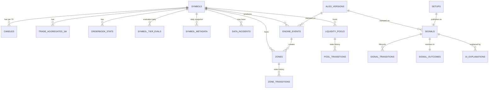
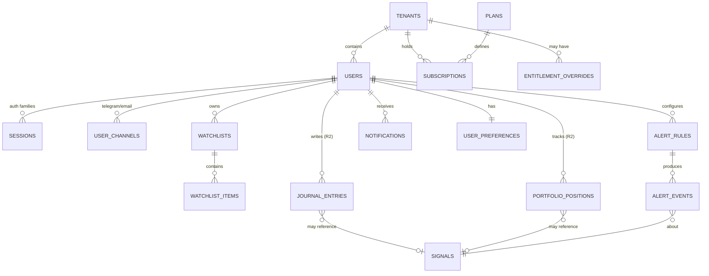
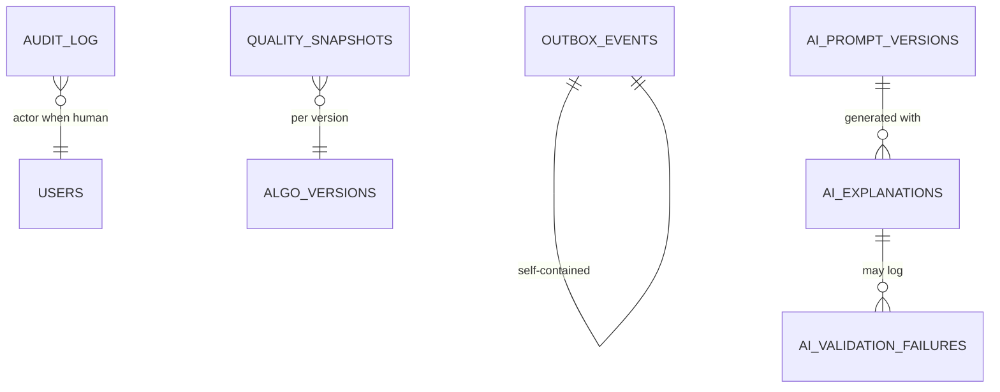

# DATABASE DESIGN DOCUMENT (DDD)

## Institutional AI Crypto Scanner — Data Architecture

**Document Status:** Official Database Design Document — defines the complete persistence architecture
**Authority:** Subordinate to `PROJECT_CONSTITUTION.md`, `SCANNER_LOGIC_SPECIFICATION.md`, `TECHNOLOGY_DECISION_RECORD.md`, `PRODUCT_REQUIREMENTS_DOCUMENT.md`, and `TECHNICAL_ARCHITECTURE_DOCUMENT.md` (all v1.0.0); authoritative over all database structure, retention, and data-operations policy
**Version:** 1.0.0 | **Ratified:** 2026-07-12
**Amendment Rule:** Schema evolution follows expand-migrate-contract discipline (Constitution §33.6); structural changes require a DDD revision

> Engine: PostgreSQL 16 + TimescaleDB (TDR §8). Access exclusively through the repository layer (TAD §13). This document defines structure and policy — no SQL, no migrations, no ORM models. Field lists name the semantically required columns; exact column naming follows Constitution §11 conventions at implementation.

---

## 1. Database Overview

One PostgreSQL cluster serves two workload profiles deliberately (TDR §8): **relational OLTP** (identity, subscriptions, workspace, signals, audit) and **time-series at volume** (candles, trade aggregates, book statistics, detection events) via TimescaleDB hypertables. Redis (TDR §9) holds only derived, disposable state — **PostgreSQL is the sole system of record** (Constitution §16.5).

| Property | Value |
|---|---|
| Engine | PostgreSQL 16, TimescaleDB extension |
| Logical organization | 6 schemas mirroring TAD bounded contexts |
| Tables | 40 (38 active v1; 2 designed-now/activated-R2: portfolio, journal) |
| Time-series tables | 5 hypertables |
| Scale envelope (v1) | ~400 symbols × 5 TFs; M5+M15+H1+H4+D1 candle flow ≈ 600k candles/day → ~220M rows/year raw (pre-compression, pre-downsampling) |
| Money/price types | `NUMERIC` everywhere — floats prohibited (Constitution §45.8) |
| Time | `timestamptz` UTC everywhere; candle identity by open time (SLS §0.2) |
| Access path | Repository layer only; tenant scoping structural (TAD §13) |

## 2. Database Philosophy

1. **The signal record is the crown jewel.** `signals`, `signal_transitions`, `signal_outcomes` are append-only, immutable, hash-sealed (SLS §15.3.5). No UPDATE/DELETE path exists at any privilege level used by the application; backups verify their checksums every cycle (TAD §26).
2. **Facts are append-only; state is a fold of facts.** Zones, pools, and signals change state via transition tables — current-state columns exist as *materialized reads* of their transition history, recomputable at any time. This gives audit, replay, and no-repaint enforcement in the storage design itself.
3. **Evidence is stored, not implied.** Every detection row carries its versioned evidence payload (typed JSONB + extracted queryable columns). A signal's full SLS §15.2 payload must be reconstructable from the database alone, forever, regardless of later algo versions.
4. **Hybrid normalization, deliberately.** Core queryable attributes (symbol, TF, timestamps, prices, states, versions, grades) are typed columns with constraints; deep evidence detail (per-factor itemizations, measurement chains) is versioned JSONB. *Compared:* full normalization of evidence (≈20 extra tables, join-storms for every evidence read, brittle to SLS evolution) vs full-document storage (unqueryable, unconstrained). The hybrid keeps hot queries indexed and evidence complete.
5. **Retention is doctrine, not disk panic.** Every table below declares retention aligned to SLS §2 and product needs — enforced by scheduled policy, never by ad-hoc deletion (Constitution §16.7).
6. **Derived data declares its source.** Continuous aggregates, quality snapshots, and tier evaluations are rebuildable; the document marks every such table `derived: yes`.

## 3. Schema Design (Logical Namespaces)

| Schema | Bounded context (TAD §2.2) | Content class |
|---|---|---|
| `market` | Market Data | Symbols, candles, aggregates, book stats, metadata, incidents |
| `detection` | Detection | Engine events, zones, pools, setups, signals, outcomes, versions |
| `identity` | Identity & Access | Tenants, users, auth, plans, subscriptions, entitlements |
| `workspace` | Trader Workspace | Watchlists, alert rules, notifications, preferences, portfolio/journal (R2) |
| `ai` | AI | Explanations, prompt versions, validation failures |
| `ops` | Platform Ops | Audit log, outbox, quality snapshots |

Cross-schema foreign keys are permitted **only** in the directions the TAD dependency rules allow (e.g., `workspace` → `detection.signals` reference; never `detection` → `workspace`). Detection tables never reference identity — the doctrine does not know users exist.

## 4. Entity Relationship Diagrams

### 4.1 Market + Detection Core

### 4.2 Identity + Workspace

### 4.3 Ops + AI

## 5. Tables

Each table: Purpose / Description / Main Fields / Relationships / Index Requirements / Expected Growth / Read-Write Pattern / Retention Policy.

### 5.1 `market` Schema

#### T1 `market.symbols`

- **Purpose:** Universe registry — every instrument the platform has ever known.
- **Description:** One row per (base, quote, venue); carries lifecycle status (QUARANTINE / ACTIVE / DELISTING / DELISTED per SLS §1), category tags, listing date, current tier (materialized from T2).
- **Main Fields:** id (ULID), venue, base_asset, quote_asset, exchange_symbol, status, category tags, listed_at, delisted_at, current_tier, tier_since, warmup_state per TF.
- **Relationships:** Parent of all market/detection per-symbol tables.
- **Index Requirements:** Unique (venue, exchange_symbol); status + tier partial index (active universe scan).
- **Expected Growth:** Hundreds of rows; trivial.
- **Read/Write Pattern:** Read-hot (every pipeline pass), write-rare (daily universe evaluation).
- **Retention:** Forever — delisted symbols retained for history integrity (SLS §1.7).

#### T2 `market.symbol_tier_evals`

- **Purpose:** Daily liquidity-tier evaluation history (SLS §1.5) with hysteresis inputs.
- **Description:** One row per symbol per evaluation day: the three metric medians, resulting tier, hysteresis counters. `derived: yes` (recomputable from candles/book stats) but retained as decision record.
- **Main Fields:** symbol_id, eval_date, median_quote_volume, median_spread_bps, median_depth_2pct, computed_tier, applied_tier, hysteresis_state.
- **Relationships:** → T1.
- **Index Requirements:** PK (symbol_id, eval_date); eval_date for daily batch reads.
- **Expected Growth:** ~400 rows/day ≈ 150k/year.
- **Read/Write Pattern:** Write once daily; read by universe manager + admin console.
- **Retention:** 2 years online, then archive (§12).

#### T3 `market.candles` ⏱ hypertable

- **Purpose:** The canonical OHLCV record — the platform's ground truth (SLS §2.1).
- **Description:** One row per (symbol, TF, open_time). All prices/volumes NUMERIC; carries taker-buy volume (SLS §2.5), quote volume, validation revision, source flag (stream/backfill/rebuilt).
- **Main Fields:** symbol_id, timeframe, open_time, open, high, low, close, volume, quote_volume, taker_buy_volume, trade_count, revision, source, inserted_at.
- **Relationships:** → T1. No FKs pointing at it from detection (detection references candles by natural key inside evidence — hypertable FK targets are an anti-pattern at this volume).
- **Index Requirements:** PK (symbol_id, timeframe, open_time) — the only index needed; Timescale chunk pruning handles time ranges.
- **Expected Growth:** ≈ 600k rows/day; ~220M/year raw. Compression ≥ 10× after 7 days (TDR §8).
- **Read/Write Pattern:** Append-heavy (stream), read-hot on recent windows (engine 1,000-candle lookbacks — served mostly from engine memory, DB on rebuild), range reads for charts/backtests.
- **Retention:** M5: 1 year full → daily-downsampled thereafter; M15/H1/H4/D1/W1: indefinite (compressed). Backtesting (R3) depends on this depth (PRD FC-14.1).

#### T4 `market.trade_aggregates_1m` ⏱ hypertable

- **Purpose:** Taker-side flow per minute (SLS §2.2) feeding delta and institutional-volume evidence.
- **Description:** One row per (symbol, minute): buy/sell taker volumes, trade count, size distribution stats (mean, p90, max).
- **Main Fields:** symbol_id, minute_ts, taker_buy_vol, taker_sell_vol, trade_count, mean_trade_size, p90_trade_size, max_trade_size.
- **Relationships:** → T1.
- **Index Requirements:** PK (symbol_id, minute_ts).
- **Expected Growth:** ~576k rows/day (400 symbols × 1440 min); ~210M/year.
- **Read/Write Pattern:** Append-only; read by volume engine (recent windows) and future whale module.
- **Retention:** 90 days full → hourly rollup aggregate retained 2 years → archive.

#### T5 `market.orderbook_stats` ⏱ hypertable

- **Purpose:** Depth/spread statistics for tiering and volume validation (SLS §2.4) — snapshots are context, medians are the durable product.
- **Description:** 10-second snapshot rows: best bid/ask, spread bps, cumulative depth at ±0.5/1/2% bands.
- **Main Fields:** symbol_id, ts, best_bid, best_ask, spread_bps, depth_bands (typed columns per band).
- **Relationships:** → T1.
- **Index Requirements:** PK (symbol_id, ts).
- **Expected Growth:** Largest raw writer (~3.5M rows/day at full universe) — sampled to Tier 1–2 symbols at 10 s, Tier 3 at 60 s to bound it (~1.2M/day).
- **Read/Write Pattern:** Append-only; read by daily tier evaluation + fake-volume tests.
- **Retention:** Raw 7 days (SLS §2.4); daily median/percentile rollups retained 2 years.

#### T6 `market.symbol_metadata`

- **Purpose:** Daily market-cap/FDV/category snapshot (SLS §2.11) — classification data, never detection input.
- **Description:** One row per symbol per day from metadata provider, with provenance and `as_of`.
- **Main Fields:** symbol_id, as_of_date, market_cap, fdv, circulating_supply, rank, categories, provider, fetched_at.
- **Relationships:** → T1.
- **Index Requirements:** PK (symbol_id, as_of_date).
- **Expected Growth:** ~150k rows/year.
- **Read/Write Pattern:** Daily batch write; dashboard/AI context reads.
- **Retention:** 2 years online → archive.

#### T7 `market.sentiment_readings`

- **Purpose:** Fear & Greed and future sentiment series (context tags only, SLS §0.1.5).
- **Description:** One row per source per reading timestamp.
- **Main Fields:** source, ts, value, classification, fetched_at.
- **Relationships:** None (global context).
- **Index Requirements:** PK (source, ts).
- **Expected Growth:** Trivial (daily readings).
- **Read/Write Pattern:** Daily write; digest/AI reads.
- **Retention:** Indefinite (tiny).

#### T8 `market.data_incidents`

- **Purpose:** The honesty ledger — every SUSPECT/DEGRADED/gap episode (SLS §2.13–§2.16).
- **Description:** One row per incident: scope (symbol-TF or feed-wide), type, detected/resolved timestamps, affected span, resolution (backfilled/unfillable), downstream flags applied.
- **Main Fields:** id, scope_type, symbol_id?, timeframe?, incident_type, started_at, resolved_at, candle_span, resolution, notes.
- **Relationships:** → T1 (nullable — feed-wide incidents).
- **Index Requirements:** (symbol_id, started_at); open-incident partial index (resolved_at IS NULL).
- **Expected Growth:** Low (hundreds/month in healthy operation — its growth rate is itself a monitored quality metric).
- **Read/Write Pattern:** Written by ingest; read by status surfaces (PRD FC-1.2), evidence flagging, ops.
- **Retention:** Forever — degradation history is part of the audit story.

#### T9 `market.instrument_events`

- **Purpose:** Exchange lifecycle facts: delisting announcements, halts, listing events (SLS §1.6–§1.7).
- **Description:** Append-only event rows with source and effective times driving symbol status transitions.
- **Main Fields:** id, symbol_id, event_type, announced_at, effective_at, source, payload.
- **Relationships:** → T1.
- **Index Requirements:** (symbol_id, announced_at).
- **Expected Growth:** Low.
- **Read/Write Pattern:** Written on ingestion of announcements; read by universe manager.
- **Retention:** Forever.

### 5.2 `detection` Schema

#### T10 `detection.algo_versions`

- **Purpose:** Registry of every deployed (algo_version, param_set_version) pair (SLS §0.4) — the version spine of the entire record.
- **Description:** One row per version pair: parameter-set content (JSONB), checksum, spec reference, deployed/retired timestamps. Engine boot verifies checksum against this table (TAD §14).
- **Main Fields:** id, algo_version, param_set_version, param_payload, checksum, sls_reference, deployed_at, retired_at.
- **Relationships:** Referenced by engine events, setups, signals, quality snapshots.
- **Index Requirements:** Unique (algo_version, param_set_version).
- **Expected Growth:** Dozens of rows over years.
- **Read/Write Pattern:** Write per release; read at boot + every version-segmented stat.
- **Retention:** Forever.

#### T11 `detection.engine_events` ⏱ hypertable

- **Purpose:** Every structural/liquidity/volume/momentum fact the engines emit: swings, labels, BOS/CHoCH/MSS, sweeps, stop hunts, displacement records, RVOL classes, momentum readings (SLS §3–§7).
- **Description:** Hybrid rows: typed core (event_type, symbol, TF, event candle open_time, confirmed_at, direction, primary price levels, version) + evidence JSONB (measurements, references to contributing event ids). Append-only; failure flags (`failed`, `reclaimed`) are *later appended events* referencing the original — original rows never mutate (no-repaint in storage).
- **Main Fields:** id (ULID), symbol_id, timeframe, event_type, candle_open_time, confirmed_at, direction, level_a, level_b, magnitude_atr, algo_version_id, evidence, refs (ULID array).
- **Relationships:** → T1, T10; self-referencing via refs (evidence chains, e.g., MSS → sweep id).
- **Index Requirements:** PK (id) + (symbol_id, timeframe, confirmed_at); (event_type, confirmed_at) for cross-market queries; GIN on refs for chain walks.
- **Expected Growth:** The largest detection table: est. 1–3M events/month at full universe.
- **Read/Write Pattern:** Append-heavy on candle closes; read by evidence panel, AI assembly, quality analysis, state rebuilds.
- **Retention:** 18 months online → archived (evidence referenced by *signals* is snapshotted into the signal payload, so signal permanence never depends on this table's hot window).

#### T12 `detection.zones`

- **Purpose:** Zone object registry: OB, Breaker, Mitigation, FVG, IFVG, BPR, OTE (SLS §5).
- **Description:** One row per zone: type, band (proximal/distal NUMERIC), refined sub-zone, grade, polarity, creating event ref, current_state (materialized from T13), created/expired bounds.
- **Main Fields:** id, symbol_id, timeframe, zone_type, direction, band_proximal, band_distal, refined_proximal, refined_distal, grade, created_event_id, algo_version_id, current_state, state_since, expires_after_candle.
- **Relationships:** → T1, T10, T11 (creator); ← T13 transitions.
- **Index Requirements:** (symbol_id, timeframe, current_state) partial on live states (FRESH/TESTED — the hot working set); zone_type + created bounds for analytics.
- **Expected Growth:** Bounded live set (≤ 60/symbol-TF, SLS §5.1) + historical accumulation ~100k/month.
- **Read/Write Pattern:** Insert on creation, current_state updated only by transition-applier (single writer); read-hot by chart overlays and confluence context.
- **Retention:** Live + 12 months post-terminal online → archive.

#### T13 `detection.zone_transitions`

- **Purpose:** Append-only zone state history (FRESH→TESTED→MITIGATED→INVALIDATED/EXPIRED, SLS §5.9) — the fold source for T12.current_state.
- **Description:** One row per transition: zone, from/to state, triggering candle, triggering event ref.
- **Main Fields:** id, zone_id, from_state, to_state, at_candle_open_time, confirmed_at, trigger_event_id.
- **Relationships:** → T12, T11.
- **Index Requirements:** (zone_id, confirmed_at).
- **Expected Growth:** ~2–4× zone row count.
- **Read/Write Pattern:** Append-only; read by evidence panel + state rebuild.
- **Retention:** Matches T12 (a zone and its history archive together).

#### T14 `detection.liquidity_pools` + T15 `detection.pool_transitions`

- **Purpose:** Pool registry + state history (ACTIVE→SWEPT/BROKEN/EXPIRED, SLS §4.2) — structurally identical pattern to zones/transitions.
- **Description:** Pool rows: side (BSL/SSL), price, cluster band, strength score + component breakdown, classification (internal/external); transitions as T13 pattern.
- **Main Fields (T14):** id, symbol_id, timeframe, side, price_level, band_min, band_max, strength, strength_components, liquidity_class, source_event_ids, current_state, algo_version_id.
- **Relationships:** → T1, T10, T11; ← T15.
- **Index Requirements:** (symbol_id, timeframe, current_state) partial on ACTIVE (resting-liquidity map reads, SLS §4.5); (side, strength) for ranked pool queries.
- **Expected Growth:** Bounded live (≤ 40/symbol-TF) + ~80k/month historical.
- **Read/Write Pattern:** As T12/T13.
- **Retention:** As T12/T13.

#### T16 `detection.setups`

- **Purpose:** Every confluence candidate that passed gates — published *and* below-floor (SLS §8.6: floor rejects are recorded calibration data).
- **Description:** One row per candidate: archetype, gate results, factor scores F1–F6 with evidence refs, adjustments itemized, base + final confidence, published flag.
- **Main Fields:** id, symbol_id, timeframe, direction, archetype, gate_results, factor_scores, adjustments, base_confidence, final_confidence, floor_passed, algo_version_id, evaluated_at, evidence.
- **Relationships:** → T1, T10; ← T17 (published setups).
- **Index Requirements:** (evaluated_at); (archetype, floor_passed, evaluated_at) for calibration queries.
- **Expected Growth:** ~5–20× published-signal volume.
- **Read/Write Pattern:** Append-only; read by quality console + calibration analysis.
- **Retention:** 12 months online → archive (published ones live forever via T17's snapshot).

#### T17 `detection.signals` 🔒 immutable

- **Purpose:** THE published signal record — the product's crown jewel (PRD FC-10.1).
- **Description:** One row per published signal: complete SLS §15.2 payload **snapshotted** (evidence chain, factor breakdown, zones, levels, versions, HTF states) as sealed JSONB + extracted queryable columns; payload hash (SLS §15.3.5). Append-only forever; no UPDATE surface exists.
- **Main Fields:** id, setup_id, symbol_id, timeframe, direction, archetype, grade, final_confidence, entry_band, invalidation_level, target_bands, published_at, ttl_candles, algo_version_id, payload (sealed JSONB), payload_hash, dedup_key.
- **Relationships:** → T16, T1, T10; ← T18, T19, AI explanations, alert events, journal references.
- **Index Requirements:** PK (id); (published_at); (symbol_id, published_at); (archetype, grade, published_at) for stats; unique partial on dedup_key for active window (SLS §10.3).
- **Expected Growth:** Quality floors make this deliberately small: est. 1,500–6,000/month.
- **Read/Write Pattern:** Insert-once; read constantly (feed history, track record, evidence, backtest comparison).
- **Retention:** **Forever. Constitutionally immutable (Constitution §45.5).** Checksum-verified in every backup cycle.

#### T18 `detection.signal_transitions`

- **Purpose:** Lifecycle history per SLS §12 state machine (PUBLISHED→ACTIVE→…), append-only.
- **Description:** One row per transition with triggering candle and premise-check evidence; includes `stress_test` wick events (SLS §12.3).
- **Main Fields:** id, signal_id, from_state, to_state, at_candle_open_time, recorded_at, trigger_evidence.
- **Relationships:** → T17.
- **Index Requirements:** (signal_id, recorded_at).
- **Expected Growth:** ~4–8× signal count.
- **Read/Write Pattern:** Append-only; read with signal views.
- **Retention:** Forever (part of the record).

#### T19 `detection.signal_outcomes` 🔒 immutable

- **Purpose:** Terminal results: SUCCESS/FAILED/EXPIRED classes + MFE/MAE in R, elapsed candles (SLS §12.4).
- **Description:** Exactly one row per resolved signal; the source of every public statistic.
- **Main Fields:** signal_id (PK), outcome, resolved_at, elapsed_candles, mfe_r, mae_r, excluded_from_stats (delisting flag, SLS §1.7), resolution_evidence.
- **Relationships:** → T17 (1:1).
- **Index Requirements:** PK; (outcome, resolved_at) for stats windows.
- **Expected Growth:** = signal volume.
- **Read/Write Pattern:** Insert-once; read by track record, quality snapshots, journal comparisons.
- **Retention:** Forever, immutable, checksum-verified.

### 5.3 `identity` Schema

#### T20 `identity.tenants`

- **Purpose:** Tenancy root — separate from users from day one (Desk teams later without migration pain).
- **Description:** One row per tenant (v1: one per individual account); carries plan linkage and status.
- **Main Fields:** id, kind (individual/team), display_name, status, created_at.
- **Relationships:** ← users, subscriptions, entitlement overrides; tenant_id threads through all `workspace` tables.
- **Index Requirements:** PK; status.
- **Expected Growth:** = account growth (thousands).
- **Read/Write Pattern:** Read on every authorized request (cached, TAD §21); write rare.
- **Retention:** Forever (soft-delete status; purge via deletion workflow T21 note).

#### T21 `identity.users`

- **Purpose:** User identity + credentials.
- **Description:** One row per user: email (unique, case-folded), Argon2id hash, TOTP secret (encrypted at rest, app-layer envelope), status, role (user/support/ops/superadmin).
- **Main Fields:** id, tenant_id, email, password_hash, totp_secret_enc, totp_enabled, role, status, email_verified_at, created_at, deleted_at.
- **Relationships:** → T20; ← sessions, channels, all workspace ownership.
- **Index Requirements:** Unique (email); (tenant_id).
- **Expected Growth:** Thousands.
- **Read/Write Pattern:** Read-hot (auth path, cached); write on account events.
- **Retention:** Until account deletion → GDPR purge workflow (PII columns nulled + tombstone retained for referential integrity of immutable records; audit trail of the deletion kept — Constitution §35.3).

#### T22 `identity.sessions`

- **Purpose:** Refresh-token family tracking with rotation + reuse detection (TAD §20).
- **Description:** One row per session family: current refresh hash, rotation counter, device/user-agent info, revocation state.
- **Main Fields:** id (family), user_id, refresh_hash, rotated_at, rotation_count, device_label, ip_created, revoked_at, revoke_reason.
- **Relationships:** → T21.
- **Index Requirements:** (user_id, revoked_at) partial on active; refresh_hash unique.
- **Expected Growth:** Few per user; pruned.
- **Read/Write Pattern:** Read+write on every refresh (hot; Redis fronts the revocation check, this is the record).
- **Retention:** Revoked/expired families pruned after 90 days (auth events persist in audit log).

#### T23 `identity.plans`

- **Purpose:** Declarative plan definitions (Free/Pro/Desk) — entitlements as data (Constitution §36.2).
- **Description:** Versioned plan rows: capability document (JSONB: TF access, delay, watchlist caps, alert quotas, AI budgets, API access), price references, active flag. Plan changes create new versions (grandfathering support, §36.6).
- **Main Fields:** id, plan_key, version, capabilities, price_ref, active, created_at.
- **Relationships:** ← subscriptions.
- **Index Requirements:** Unique (plan_key, version).
- **Expected Growth:** Dozens.
- **Read/Write Pattern:** Read-hot (cached 60 s, TAD §21); write per pricing event.
- **Retention:** Forever (subscriptions reference historical versions).

#### T24 `identity.subscriptions`

- **Purpose:** Tenant ↔ plan state through the billing lifecycle (Constitution §36.5 states).
- **Description:** One row per subscription: state machine (TRIAL/ACTIVE/PAST_DUE/CANCELED/EXPIRED), period bounds, provider references (customer/subscription ids — no card data ever), cancel-at-period-end flag.
- **Main Fields:** id, tenant_id, plan_id, state, current_period_start/end, provider, provider_refs, trial_ends_at, canceled_at, created_at.
- **Relationships:** → T20, T23; ← billing events (audit log entries + provider webhooks recorded in ops.audit_log with payload refs).
- **Index Requirements:** (tenant_id, state); period_end for renewal sweeps.
- **Expected Growth:** = tenant growth.
- **Read/Write Pattern:** Read-hot via entitlement cache; writes on billing events.
- **Retention:** Forever (financial record).

#### T25 `identity.entitlement_overrides`

- **Purpose:** Audited, expiring admin capability grants (TAD FC-16.1 edge case).
- **Description:** One row per override: capability delta, reason, granting admin, expiry (mandatory).
- **Main Fields:** id, tenant_id, capabilities_delta, reason, granted_by, granted_at, expires_at, revoked_at.
- **Relationships:** → T20, T21 (admin).
- **Index Requirements:** (tenant_id) partial on active.
- **Expected Growth:** Low.
- **Read/Write Pattern:** Read in entitlement resolution; write rare.
- **Retention:** Forever (audit).

#### T26 `identity.user_channels`

- **Purpose:** Linked delivery channels: Telegram chat binding, verified emails (PRD FC-15.1).
- **Description:** One row per channel per user: type, address/chat-id, verification state, linked_at.
- **Main Fields:** id, user_id, channel_type, address, verified_at, unlinked_at.
- **Relationships:** → T21.
- **Index Requirements:** (user_id, channel_type) unique on active; address lookup for Telegram webhook resolution.
- **Expected Growth:** ~2/user.
- **Read/Write Pattern:** Read by alert dispatch; write on link events.
- **Retention:** Unlinked rows pruned after 90 days.

### 5.4 `workspace` Schema (all tables tenant_id-scoped)

#### T27 `workspace.watchlists` + T28 `workspace.watchlist_items`

- **Purpose:** Named symbol focus sets + membership (PRD FC-6.1).
- **Description:** Watchlists: name, position, caps enforced at service layer per entitlements. Items: symbol ref, user note, own-bias tag, added_at.
- **Main Fields (T27):** id, tenant_id, user_id, name, sort_order, created_at. **(T28):** watchlist_id, symbol_id, note, bias_tag, added_at.
- **Relationships:** T27 → T21/T20; T28 → T27, market.symbols.
- **Index Requirements:** T27 (user_id); T28 PK (watchlist_id, symbol_id).
- **Expected Growth:** Tens of thousands of items at scale.
- **Read/Write Pattern:** Read-hot (feed scoping, alert matching); interactive writes.
- **Retention:** Life of account; over-cap lists read-only on downgrade, never deleted (PRD FC-15.2).

#### T29 `workspace.alert_rules`

- **Purpose:** User alert subscriptions: scopes, thresholds, schedules (PRD FC-7.1).
- **Description:** One row per rule: scope (global/watchlist/symbol/strategy-R3), filter predicate (validated JSONB matching the filter grammar), priority threshold, channels, quiet hours, enabled.
- **Main Fields:** id, tenant_id, user_id, scope_type, scope_ref, filter_predicate, min_priority, channels, quiet_hours, enabled, created_at.
- **Relationships:** → T21; scope_ref → T27 when watchlist-scoped.
- **Index Requirements:** (enabled) + (user_id); matcher loads all enabled rules into worker memory — table stays small enough by design (rule caps per tier).
- **Expected Growth:** ~3–10/user.
- **Read/Write Pattern:** Bulk-read by alert engine on signal events (cached with event-driven refresh); interactive writes.
- **Retention:** Life of account.

#### T30 `workspace.alert_events`

- **Purpose:** Every dispatch AND suppression — the honest alert ledger (SLS §10.3, PRD FC-11.1).
- **Description:** One row per (signal × user × decision): matched rule, decision (dispatched/suppressed+reason), per-channel delivery status + timestamps.
- **Main Fields:** id, tenant_id, user_id, signal_id, rule_id, decision, suppress_reason, channel_statuses, created_at, delivered_at.
- **Relationships:** → T17 (signals), T29, T21.
- **Index Requirements:** (user_id, created_at); (signal_id); partial on undelivered for retry sweeps.
- **Expected Growth:** Highest workspace volume: signals × subscribed users — est. 1–5M rows/month at scale.
- **Read/Write Pattern:** Append-heavy bursts on publication; read by notification center + delivery metrics.
- **Retention:** 12 months online → archive (delivery-stat rollups retained).

#### T31 `workspace.notifications`

- **Purpose:** In-app inbox (PRD FC-11.1) — unified record of everything told to the user.
- **Description:** One row per notification: category, payload (title/body/link refs), read state.
- **Main Fields:** id, tenant_id, user_id, category, payload, created_at, read_at.
- **Relationships:** → T21; payload refs signals/system events by id.
- **Index Requirements:** (user_id, created_at desc); partial unread count index.
- **Expected Growth:** Parallel to T30 + system notices.
- **Read/Write Pattern:** Append + read-recent; read_at is the only mutable field.
- **Retention:** 90 days (PRD FC-11.1 AC) → pruned.

#### T32 `workspace.user_preferences`

- **Purpose:** Settings document per user (PRD FC-9.1).
- **Description:** Single row per user: versioned typed preference document (timezone, density, TF defaults, digest schedule, quiet hours default).
- **Main Fields:** user_id (PK), tenant_id, prefs (versioned JSONB, schema-validated at boundary), updated_at.
- **Relationships:** → T21.
- **Index Requirements:** PK only.
- **Expected Growth:** = users.
- **Read/Write Pattern:** Read on session start (cached); occasional writes.
- **Retention:** Life of account.

#### T33 `workspace.portfolio_positions` (designed now, activated R2)

- **Purpose:** Manual position ledger (PRD FC-12.1).
- **Description:** One row per position lot: symbol, direction, size, entry, invalidation, targets, optional signal linkage, open/close bounds, close price(s) with partial-close child lots.
- **Main Fields:** id, tenant_id, user_id, symbol_id, direction, size, entry_price, invalidation_price, target_prices, signal_id?, opened_at, closed_at, close_price, parent_lot_id?, notes.
- **Relationships:** → T21, market.symbols, T17 (nullable).
- **Index Requirements:** (user_id) partial on open positions; (signal_id).
- **Expected Growth:** Moderate (thousands of rows per active user-year).
- **Read/Write Pattern:** Read-hot for exposure views (joined to live prices from cache, not DB); interactive writes.
- **Retention:** Life of account; user-exportable.

#### T34 `workspace.journal_entries` (designed now, activated R2)

- **Purpose:** Trade journal with immutable finalized entries (PRD FC-13.1).
- **Description:** One row per entry: structured fields (thesis, execution, emotion tag, outcome), free text, refs (signal with **evidence snapshot copied at creation** — survives archive cycles), position ref, finalized flag; amendments append child rows.
- **Main Fields:** id, tenant_id, user_id, entry_type, signal_id?, signal_evidence_snapshot?, position_id?, structured_fields, body, finalized_at, amended_by_entry_id?, created_at.
- **Relationships:** → T21, T17 (nullable), T33 (nullable).
- **Index Requirements:** (user_id, created_at); (signal_id).
- **Expected Growth:** Moderate.
- **Read/Write Pattern:** Interactive; finalized rows never update (append amendments).
- **Retention:** Life of account; user-exportable (PRD FC-13.1 AC); never leaves tenant scope (Constitution §26.9).

### 5.5 `ai` Schema

#### T35 `ai.prompt_versions`

- **Purpose:** Versioned prompt template registry (SLS §11.2.5; Constitution §14.6).
- **Main Fields:** id, function (explain/thesis/risk/teach/compare/digest), version, template_ref, checksum, active_from, retired_at.
- **Description / Relationships / Indexes:** As T10 pattern; ← T36. Unique (function, version).
- **Expected Growth:** Dozens. **Read/Write:** read per generation; write per prompt release. **Retention:** Forever.

#### T36 `ai.explanations`

- **Purpose:** Generated AI content with full provenance (PRD FC-8.x).
- **Description:** One row per generated artifact: signal/subject ref, function, content, model id, prompt_version, evidence hash (must match the signal payload hash lineage), validation status (validated/fallback), tenant attribution for on-demand generations (budget metering).
- **Main Fields:** id, signal_id?, subject_ref, function, content, model_id, prompt_version_id, evidence_hash, validation_status, generated_at, tenant_id? (on-demand only), latency_ms, token_costs.
- **Relationships:** → T17 (nullable — digests span signals), T35.
- **Index Requirements:** (signal_id, function); (generated_at); (tenant_id, generated_at) for metering.
- **Expected Growth:** ~1–3× signal volume + on-demand.
- **Read/Write Pattern:** Insert-once; read with signal views.
- **Retention:** Signal-attached: forever (part of what users saw); digests 12 months.

#### T37 `ai.validation_failures`

- **Purpose:** Grounding-validator rejection log (SLS §11.2.2) — prompt-engineering feedback loop.
- **Main Fields:** id, explanation_attempt_ref, failure_class, offending_claims, model_id, prompt_version_id, occurred_at.
- **Description / Relationships:** Append-only; → T35. **Indexes:** (occurred_at), (failure_class). **Growth:** low (rate itself is a quality metric). **Read/Write:** append; weekly review reads. **Retention:** 12 months.

### 5.6 `ops` Schema

#### T38 `ops.audit_log` 🔒 append-only

- **Purpose:** The tamper-evident record of privileged and security-relevant actions (Constitution §17.6, §35.5).
- **Description:** One row per event: actor (user/admin/system), action key, entity ref, before/after summary refs, correlation id, IP/user-agent for human actors. Hash-chained (each row carries hash of previous) for tamper evidence.
- **Main Fields:** id, actor_type, actor_id?, action, entity_type, entity_id, summary, correlation_id, ip, occurred_at, row_hash, prev_hash.
- **Relationships:** Actor → T21 when human.
- **Index Requirements:** (occurred_at); (actor_id, occurred_at); (entity_type, entity_id).
- **Expected Growth:** Steady; moderate volume.
- **Read/Write Pattern:** Append-only; read by admin/audit/compliance views.
- **Retention:** Forever (admin/billing/security classes); routine auth events 2 years → archive.

#### T39 `ops.outbox_events`

- **Purpose:** Transactional outbox (TAD §12) — events persisted in-transaction, relayed to Redis Streams, marked relayed.
- **Main Fields:** id, aggregate_type, aggregate_id, event_type, payload, created_at, relayed_at, relay_attempts.
- **Description / Relationships:** Self-contained. **Indexes:** partial on unrelayed (relayed_at IS NULL) — the relay's work queue. **Growth:** high-churn, small live set. **Read/Write:** append + relay sweep. **Retention:** Relayed rows pruned after 7 days (stream + consumers own delivery from there).

#### T40 `ops.quality_snapshots`

- **Purpose:** Periodic per-(version, archetype, grade, TF) quality aggregates feeding the console and public stats (PRD FC-16.2, FC-10.1). `derived: yes` — recomputable from T17/T19; snapshotted for query speed and historical "as-published" stat records.
- **Main Fields:** id, algo_version_id, archetype, grade, timeframe, window_start/end, n_signals, n_success, n_failed, n_expired, mfe_mae_stats, computed_at.
- **Relationships:** → T10.
- **Index Requirements:** (algo_version_id, archetype, window_end).
- **Expected Growth:** Small (periodic rollups).
- **Read/Write Pattern:** Batch write (worker); read-hot by track record surfaces.
- **Retention:** Forever (published-statistics history is itself part of honesty).

---

## 6. Primary Key Strategy

| Class | Strategy | Rationale |
|---|---|---|
| Business entities (signals, zones, users, watchlists…) | **ULID stored as UUID** (TAD §15) | Time-sortable (index locality for append-heavy tables), collision-safe across processes, no sequence contention, safe to expose in APIs |
| Hypertable time-series (candles, aggregates, book stats) | **Natural composite: (symbol_id, timeframe?, time)** | The natural key IS the identity (SLS §2.1); surrogate keys on hypertables waste space and defeat chunk pruning |
| Pure history/transition tables | ULID PK + FK to parent | Ordered inserts, cheap |
| 1:1 extensions (outcomes, preferences) | Parent's key as PK | Enforces the 1:1 in structure |

## 7. Foreign Key Strategy

- **Enforced FKs everywhere except onto hypertables:** referencing `market.candles` rows by FK is prohibited (constraint cost at ingest volume + chunk-drop conflicts); candle references inside evidence use natural keys (symbol, TF, open_time) — validated at write by the repository, resolvable forever.
- **Cross-schema FK direction** follows §3 rules (workspace→detection allowed; detection→identity prohibited).
- **Delete behavior:** RESTRICT by default (nothing cascades away records); user deletion uses the GDPR workflow (T21) — explicit service-layer orchestration, never `ON DELETE CASCADE` through financial or immutable records.
- **Nullable FKs** only where the domain says optional (journal→signal), never as modeling laziness.

## 8. Index Strategy

1. **Design rule:** every index exists for a named query pattern documented beside it; unindexed-scan alarms on hot tables (Constitution §16.9 N+1/scan discipline).
2. **Hot working sets get partial indexes:** active signals (dedup window), live zones/pools (FRESH/TESTED/ACTIVE), unrelayed outbox, unread notifications, open incidents, open positions — small, hot, precise.
3. **Hypertables:** composite natural-key index only; time-range access rides chunk pruning; compression ordering by (symbol_id, time) for segment-by locality.
4. **JSONB:** GIN indexes only where query patterns demand (engine_events.refs chain-walks); evidence payloads are *retrieved*, not queried into — extracted columns exist precisely so JSONB never needs deep indexing.
5. **Covering indexes** for the two hottest reads: signal feed (published_at DESC + display columns) and track-record aggregation (archetype, grade, published_at + outcome join key).
6. **Review gate:** new endpoint/query → EXPLAIN review in PR when touching T3, T11, T17, T30 (the volume tables).

## 9. Constraints

| Class | Application |
|---|---|
| CHECK — domain enums | status/state/grade/archetype/outcome columns constrained to their SLS-defined value sets (states can't be invented by bugs) |
| CHECK — data sanity | OHLC ordering (H ≥ max(O,C) etc. — SLS §2.15 mirrored at storage as last defense), non-negative volumes, band ordering (proximal vs distal per direction), confidence ∈ [0,100] |
| UNIQUE | Natural identities: (venue, exchange_symbol); candle composite PK; (email); dedup_key partial-unique on active signals; (algo_version, param_set_version) |
| NOT NULL | Default posture; nullable is a documented decision per column |
| Immutability | T17/T19/T38 (+ finalized T34): enforced by (a) no UPDATE grants to the application role on these tables, (b) trigger-guard rejecting UPDATE/DELETE (defense in depth), (c) hash chains/payload hashes for tamper evidence |
| Temporal | period_end > period_start; resolved_at ≥ started_at; expiry mandatory on overrides |

## 10. Relationships (Cross-Context Rules)

| From → To | Nature | Rule |
|---|---|---|
| workspace.alert_events → detection.signals | Fact reference | FK enforced; signals are forever, so no dangling risk |
| workspace.journal/portfolio → detection.signals | Optional reference + **snapshot copy** | Journal keeps its own evidence snapshot — user records never depend on detection archive cycles |
| ai.explanations → detection.signals | Provenance | Evidence-hash lineage must match (validated at write) |
| detection.* → identity.* | **Prohibited** | Doctrine is tenant-blind |
| detection.* → market.symbols / algo_versions | Foundation references | RESTRICT deletes — symbols and versions are permanent |
| ops.audit_log → anything | Loose refs (type + id) | Audit must outlive its subjects; no FK enforcement by design |

---

## 11. Data Retention Policy (Consolidated)

Retention is doctrine-driven and enforced by scheduled policies (Timescale retention jobs + worker sweeps) — never manual deletion.

| Class | Tables | Online retention | Then |
|---|---|---|---|
| **Immutable forever** | signals (T17), outcomes (T19), transitions (T18), audit critical classes (T38), quality snapshots (T40), algo/prompt versions (T10, T35), symbols (T1), incidents (T8), instrument events (T9), signal-attached explanations (T36) | Forever online | Never deleted; archived copies additionally verified |
| **Market series** | candles (T3) | M5: 1 y full; higher TFs indefinite (compressed) | M5 → daily downsample retained indefinitely |
| | trade aggregates (T4) | 90 d raw | Hourly rollups 2 y → archive |
| | book stats (T5) | 7 d raw | Daily rollups 2 y |
| **Detection working history** | engine events (T11) | 18 mo | Archive (§12); signal payload snapshots keep published evidence independent |
| | zones/pools + transitions (T12–T15) | Live + 12 mo post-terminal | Archive |
| | setups (T16) | 12 mo | Archive |
| **User-facing operational** | alert events (T30) | 12 mo | Archive; delivery rollups kept |
| | notifications (T31) | 90 d | Pruned |
| **User property** | watchlists, prefs, portfolio, journal (T27–T28, T32–T34) | Life of account | Exported + purged on deletion workflow |
| **Housekeeping** | outbox relayed (T39), expired sessions (T22), unlinked channels (T26) | 7–90 d | Pruned |
| **Metadata/context** | tier evals (T2), symbol metadata (T6) | 2 y | Archive |

## 12. Archiving Strategy

- **Mechanism:** monthly archive job exports aging partitions/chunks to compressed columnar files (Parquet) on the encrypted Storage Box (TDR §19), with manifest + checksums recorded in `ops` (manifest is itself audit-classed).
- **Verifiability:** archive manifests record row counts + content hashes; quarterly DR drills (§17) include one archive-restore verification.
- **Access path:** archived data is *offline by policy* — restoring it is an ops runbook action (R3 backtesting depth requirements are served by retained candle history, which never archives on higher TFs; if archived M5 depth is later needed, restore-to-side-table is the path).
- **Rule:** archive never contains the only copy of anything immutable-forever — those classes archive as *additional* copies, not as migration off the primary.

## 13. Partition Strategy

| Table | Partitioning | Boundary | Why |
|---|---|---|---|
| T3 candles | Timescale hypertable chunks | 7 days (M5/M15), 30 days (H1+) via space+time (symbol_id space dimension evaluated at scale) | Chunk pruning for range reads; retention = chunk drops (instant, no vacuum storms) |
| T4 trade aggregates | Hypertable | 7-day chunks | Same |
| T5 book stats | Hypertable | 1-day chunks | Highest churn; fast drops at 7-day retention |
| T11 engine events | Hypertable (confirmed_at) | 30-day chunks | Volume + time-windowed reads + clean archival boundaries |
| T30 alert events | Native declarative partitioning by month (created_at) | Monthly | High volume, monthly archive cadence; no Timescale features needed |
| All others | Unpartitioned | — | Volumes don't justify it; partitioning small tables is pure overhead |

## 14. Time-Series Strategy

- **Compression:** columnar compression on chunks older than 7 days (candles, aggregates, book stats) and 30 days (engine events); segment-by symbol_id, order-by time — matching read patterns and achieving the ≥10× target (TDR §8).
- **Continuous aggregates (`derived: yes`):** daily candle rollups from M5 (downsample target); hourly trade-aggregate rollups; daily book-stat medians/percentiles (tier evaluation inputs — SLS §1.5 reads these, not raw snapshots). Refresh policies lag real time by one boundary; consumers are batch jobs, so lag is harmless.
- **Real-time reads never depend on aggregates:** engine hot windows come from in-memory state (TAD §4.2); charts read raw recent chunks; aggregates serve statistics and batch evaluation only.
- **Clock discipline:** all series keyed by exchange-reported open time (SLS §0.2); `inserted_at` records platform receipt separately (freshness diagnostics — the two must never be conflated).

## 15. Caching Strategy (Database Perspective)

The TAD §18 registry governs; database-relevant rules:

1. **PostgreSQL is always right.** Every Redis key family is rebuildable from tables above; cold-cache start is a latency event, never a correctness event.
2. **Cache-fronted hot reads:** published-signal working set (T17 active window), latest ranks, resting-liquidity map (T14 ACTIVE), entitlement resolutions (T23/T24/T25 fold), session revocation (T22), symbol registry (T1).
3. **Write-path caches are event-driven:** writers update cache in the same flow that publishes the outbox event — TTLs are backstops, not primary invalidation.
4. **The database never sees per-render traffic:** feed/dashboard reads hit L2; PG serves misses, rebuilds, history pages, and analytics. Connection-pool sizing assumes this shape (Constitution §20.4 capacity math documented per process).

## 16. Backup Strategy

| Layer | Mechanism | Cadence | Target |
|---|---|---|---|
| Continuous | WAL archiving | Continuous | Encrypted Storage Box (independent failure domain) |
| Base | Full physical base backup | Nightly | Same, 14 daily retained |
| Weekly | Base backup long-cycle | Weekly | 8 weekly + 12 monthly retained |
| Replica | Streaming replication to node B | Continuous | Hot standby (TAD §22) |
| Logical | Schema-versioned logical export of identity/workspace/ops (small, restore-flexible) | Weekly | Same target |
| Integrity | **Crown-jewel verification:** T17/T19/T38 hash-chain + payload-hash re-verification inside every backup cycle | Nightly | Alarm on any mismatch — a checksum failure is a P1 incident |

All backups encrypted (age keys held offline, TDR §24); backup success/duration/size are monitored metrics with missed-backup paging (Constitution §16.8).

## 17. Recovery Strategy

| Scenario | Path | Objective |
|---|---|---|
| Single-process crash | No DB action; crash-only restart | Seconds |
| Primary node loss | Promote replica (runbook); DNS failover | RTO ≤ 60 min, RPO ≤ 5 min (TAD §26) |
| Data corruption (logical) | PITR from base+WAL to pre-corruption timestamp; engine state rebuilt from candles (never restored — TAD §4.2); derived aggregates recomputed | RTO ≤ 4 h for full PITR |
| Accidental destructive migration | Contract-phase deferral makes rollback DB-compatible (Constitution §33.6); restore path as corruption scenario if data affected |
| Storage Box loss | Primary + replica unaffected; re-seed offsite from fresh base backup | No user impact |
| Full-region catastrophe | Restore to fresh nodes from offsite (annually drilled) | RTO ≤ 24 h documented-honest |

**Restore drills quarterly, timed, with a written report** (Constitution §16.8): one random nightly backup restored to staging + crown-jewel checksum verification + one archive-manifest verification. An untested backup is presumed broken.

## 18. Data Validation Rules (Storage Layer)

Validation is layered (Constitution §9.3): boundary (Pydantic) → application invariants → **storage as the final tripwire**:

1. CHECK constraints mirror SLS §2.15 candle sanity (OHLC ordering, non-negatives) — a bug that slips application validation cannot persist impossible market data.
2. Enum CHECKs freeze state vocabularies to SLS definitions; adding a state is a migration (i.e., a governed spec event), not an insert.
3. Composite uniqueness makes duplicates structurally impossible where doctrine demands identity (candle keys, dedup windows, version pairs).
4. Immutability triggers (T17/T19/T38/finalized-T34) reject UPDATE/DELETE regardless of application-role misconfiguration.
5. FK integrity per §7; evidence natural-key references validated by repositories at write (the one place FK enforcement is deliberately waived).
6. **Rule of role separation:** the application role owns DML on its schemas only; migration role owns DDL; no superuser in any runtime path.

## 19. Audit Logging Strategy

- **What is audited (T38):** all admin actions (mandatory reason strings), auth events (login/2FA/reset/session revoke), entitlement/subscription changes, billing webhook applications, GDPR workflows, parameter-set deployments, manual ops interventions (backfills, state rebuilds).
- **Tamper evidence:** per-row hash chain; chain-head anchored into each nightly backup manifest (an alteration would have to rewrite history *and* every backup).
- **Separation of concerns:** audit ≠ logs (TAD §17): Loki is diagnostics with retention; T38 is the system of record with permanence. Business events (signal publication) are *not* duplicated into audit — the immutable detection tables ARE their own record.
- **Access:** audit reads are themselves role-gated and… audited (read-access rows for compliance-sensitive views).

## 20. Multi-Tenant Readiness

- **Model:** shared schema, tenant_id column scoping (v1) — the right cost/isolation point for thousands of individual tenants.
- **Structural enforcement (TAD §13):** repositories require tenant context by constructor; **PostgreSQL Row-Level Security policies on all `workspace` + tenant-scoped `identity` tables as defense-in-depth** — the application role runs with RLS active, so a repository bug yields empty results, not cross-tenant leaks.
- **Tenant-blind zones:** `market` and `detection` schemas carry no tenant data by design (§3) — the doctrine is a shared fact universe; entitlements gate *access*, not storage.
- **Desk/team readiness:** tenants ≠ users from day one (T20); team seats are additional users under one tenant + role fields — no migration required.
- **Enterprise path:** self-hosted deployments (TDR §15) get schema-identical single-tenant databases; schema-per-tenant or database-per-tenant is the named escalation if regulated customers demand it (repository seam absorbs it).

## 21. Performance Optimization

1. **Write path:** ingestion uses batched COPY through asyncpg repositories (TAD §13); hypertable chunk-local indexes keep append cost flat; outbox writes ride the same transaction (one commit per batch).
2. **Read path:** hot reads cache-fronted (§15); covering indexes on the two hottest queries (§8.5); feed pagination is keyset-based (ULID ordering), never OFFSET.
3. **Statistics honesty at speed:** track-record aggregations read T40 snapshots; recomputation from T17/T19 is a verification job, not a per-request cost.
4. **Connection discipline:** per-process pools sized against measured concurrency (Constitution §20.4); PgBouncer added at the K3s stage trigger, not before.
5. **Autovacuum tuning** per table class: high-churn small tables (outbox, sessions) aggressive; append-only immutables minimal (no dead tuples by design).
6. **Query review gates** on volume tables (§8.6) + pg_stat_statements review monthly (slowest/most-frequent — regressions are defects per Constitution §20.7).
7. **Measured ceilings → named successors:** read saturation → replica routing; analytics weight → ClickHouse CDC offload (TDR §8.11); the DDD changes by amendment when triggers fire.

## 22. Future Expansion

| Expansion | Database readiness built in now |
|---|---|
| Futures universe (SLS §1.3) | New `market` series tables (funding, OI, liquidations — hypertable pattern per T4/T5); symbols table already venue+instrument-kind capable |
| Multi-exchange | venue column threads T1 down through series tables; one-canonical-series rule keeps candle identity clean (SLS §1.1) |
| Portfolio exchange-import (post-R2) | T33 lot model already supports import-sourced lots (source field); read-only key custody lives outside the DB (TDR §24.11) |
| Backtesting (R3) | Candle depth retained by policy (§11); versioned params (T10) + deterministic domain = replay needs no new storage; run configs/results get two new `detection` tables (designed at R3 PRD commit) |
| Strategy Builder | Strategy definitions as versioned workspace documents (T29 pattern extended); performance tracking joins T17/T19 by strategy tag |
| ClickHouse analytics | CDC from T3/T11/T17 outward; PG remains OLTP truth (TDR §8.11); no schema change required here |
| Plugin system (Phase 6–7) | Scoped API keys + quota tables under `identity`; event consumption needs no new DB surface (Constitution §37 governs first) |
| Public API program (C3) | API-key + usage-metering tables under `identity`/`ops`; track-record endpoints read existing immutables |

---

## 23. Closing Statement

This design encodes the platform's core promise at the storage layer: **facts are append-only, evidence is permanent, derived state is disposable, and the signal record cannot be edited by anyone — including us.** The two-workload split (OLTP + time-series) lives in one operationally boring PostgreSQL cluster with every scale ceiling measured and its successor named. Repositories implement against this document; where a storage question is not answered here, the answer is a DDD amendment, never an improvised table.

**— End of Database Design Document v1.0.0 —**