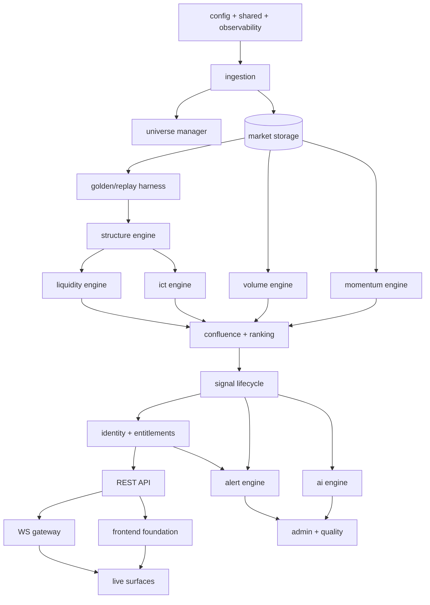

# DEVELOPMENT ROADMAP

## Institutional AI Crypto Scanner — Build Plan to Production

**Document Status:** Official Development Roadmap — the executable build sequence for the frozen governance stack
**Authority:** Subordinate to all eight governance documents (Constitution, SLS, TDR, PRD, TAD, DDD, API Specification, UI/UX Blueprint — frozen; each document's current version is stated in its own header); authoritative over build order, sprint scope, and release gating
**Version:** 2.0.0 | **Ratified:** 2026-07-12 · **Last amended:** 2026-08-17 (resequenced for time-to-first-value; see Amendment History at the end of this document)
**Sprint IDs are stable identifiers, not an execution order.** S0–S22 keep the numbers they were ratified with — they are cited by the SLS, the ADRs, and code docstrings, and renumbering them would edit a frozen document to no purpose. §7 is the only authority on what runs when. A `b` suffix (S4b) means *reopened*: scope that its original sprint was declared done without.
**Team model:** One developer + AI assistance (Claude / ChatGPT), full-time equivalent
**Amendment Rule:** Scope moves between sprints via roadmap revision; governance documents are never modified by scheduling pressure (Constitution §43.5, §46.1)

> Planning doctrine for a solo+AI team: AI multiplies *throughput*, not *judgment* — sprints are sized for one person's review bandwidth, because every AI-produced line must be understood, tested, and owned by the developer (Constitution §5: production-only code, no unreviewed generation). Every sprint ends in a state that runs, is tested, and could be walked away from safely.

---

## 1. Project Timeline

| Milestone | Week | Calendar (from start) |
|---|---|---|
| M0 — Foundations complete (CI, stack, skeleton) | 2 | +0.5 mo |
| M1 — Market data flowing 24/7 (staging) | 8 | +2 mo |
| M2 — Detection doctrine complete, golden-verified | 20 | +5 mo |
| M3 — Platform API + realtime live | 26 | +6 mo |
| M4 — The terminal usable end-to-end (J2 flow) | 34 | +8 mo |
| M5 — Alerts + AI complete (J3 flow) | 40 | +9.5 mo |
| M6 — Production-hardened, beta launch | 46 | +11 mo |
| **Beta period (R1 free beta, PRD §10)** | 46–54 | +11 → +13 mo |
| **R1 public launch** | ~54 | +13 mo |
| R2 (commercial: billing, portfolio, journal) | +12–16 wks after R1 | +16–17 mo |
| R3 (moat: backtesting, news, strategy) | phased after R2 | — |

Sprint length: **2 weeks**, 23 sprints (S0–S22) to beta. The timeline carries **~15% integration reserve** inside phases (Constitution §41.7: schedules include reality). Detection (Phase 2) is deliberately the longest phase — it is the product; nothing downstream can compensate for weakness there.

### 1.1 Revised milestones (v2.0.0)

The milestone *contents* above are unchanged. What changed is when the product becomes **observable**, and the removal of two items from the beta cut.

| Milestone | Old | New | What moved |
|---|---|---|---|
| **M-live — the engine runs by itself** | *(never existed)* | **+1 mo** | S4's orchestrator deliverable, reopened as S4b |
| **M-visible — the doctrine drawn on a live chart** | implicit at M4, +8 mo | **+2 mo** | A thin slice of S10/S13 pulled forward |
| M2 — Detection complete, golden-verified | +5 mo | +6 mo | Slips one month; buys M-live and M-visible |
| M6 — beta | +11 mo | **+8–9 mo** | AI engine and the full admin console deferred past beta |

The headline is not that the total shrinks — it shrinks modestly. It is that **time-to-first-visible-product falls from about eight months to about two**, and every month after that is spent looking at real output instead of at test fixtures.

### 1.2 Why this reordering, in one paragraph

An audit on 2026-08-17 established that `runtime/engine.py` is a 21-line health-server skeleton, that `DetectionOrchestrator` has no production caller, and that `xadd` appears zero times in the source tree. Detection therefore runs **only** when a human types `engine run --symbol … --start … --end …`. Roughly seventeen thousand lines of doctrine — structure, liquidity, and the ICT zone engine — exist as a library with a manual replay tool attached. Under the v1 order the next three sprints add three more engines to that library and the developer first *sees* the product around month eight. That back-loads the single largest unknown in the project (does this doctrine produce sane output on real Binance data at scale?) behind eight months of work that assumes the answer is yes.

## 2. Development Phases

| Phase | Sprints | Theme | Exit gate (§9) |
|---|---|---|---|
| **P0 — Bootstrap** | S0 | Repo, CI, dev stack, config, observability skeleton | G0 |
| **P1 — Market Data Foundation** | S1–S3 | Ingest, validation, storage, universe, replay tooling | G1 |
| **P2 — Detection Doctrine** | S4–S9 | All SLS engines, confluence, ranking, signal lifecycle | G2 |
| **P3 — Platform Access** | S10–S12 | Identity, REST API, WS gateway | G3 |
| **P4 — The Terminal** | S13–S16 | Design system, scanner, coin/signal detail, dashboard | G4 |
| **P5 — Reach & Voice** | S17–S19 | Watchlists/settings, alerts+Telegram, AI engine | G5 |
| **P6 — Production Readiness** | S20–S22 | Admin, hardening, DR, beta launch | G6 |

Phase rules: no phase begins until the previous gate passes; inside a phase, sprints are strictly ordered; R2 scope (billing, portfolio, journal) is **designed everywhere but built after R1 beta feedback** (PRD §10 sequencing — the track record must exist before it sells).

**v2.0.0 amendment to this table.** A phase named **P1b — The Spine** now sits between P1 and P2, holding S4b, S3b, S10a and S13a, and exiting at the new gate **G1b**. The phase-gate law above is unchanged and still binding; what changed is that two of P1b's four blocks are *reopened P1/P2 scope* (work their sprint was closed without) and two are thin slices of P3/P4 pulled forward for the reason given in §8.2. P2's sprint contents are untouched — only their position in §7.2 and their golden-coverage bar in §8.1. This is scope moving between sprints, which §Amendment Rule assigns to this document.

## 3. Sprint Structure

Every sprint follows the same shape (solo+AI cadence):

| Day | Activity |
|---|---|
| 1 | Sprint spec: re-read governing sections; write the sprint's mini-spec (what, from which doc §); AI used for spec cross-checking |
| 2–8 | Build loop: AI-assisted implementation in review-sized increments; every increment lands with its tests; daily golden/CI runs |
| 9 | Integration day: full-stack run on staging; budget measurements vs SLS §14 where applicable |
| 10 | Verification + close: DoD checklist, docs/ADRs, demo recording (the solo team's "sprint review" — a 5-min screen capture, kept as project history), retro note |

Standing rules: red main = stop-the-line (Constitution §33.3); no sprint borrows from the next sprint's scope to "finish"; anything cut is cut visibly into the backlog, never hidden.

## 4–5. Sprint Goals & Deliverables

Consolidated per sprint in §6-adjacent phase sections below — each sprint block carries the mandated nine fields (Objective / Features / Backend / Frontend / Database / APIs / Testing / Expected output / DoD).

## 6. Module Dependencies

## 7. Build Order (Binding Sequence)

### 7.1 Standing dependency laws (unchanged from v1.0.1)

1. Foundations before data; data before doctrine; everything before hardening claims.
2. Within detection: **shared swing engine first** (Constitution §30.3 — everything cites it), then structure → liquidity/ICT (structure-dependent) → volume/momentum (independent, parallelizable) → confluence → lifecycle.
3. No screen is built against an uncontracted endpoint. The generated client is the frontend's foundation (TAD §3.2).
4. Alerts before AI: alerts are R1-critical path (J3); AI degrades gracefully by design (SLS §11.2.5).
5. Admin/quality console after the things it *reads*.

> **v2.0.0 note on law 3.** v1 stated this as *"frontend starts only after the API contract is contract-tested (S11)"*. That conflated two different things: building UI against an **unstable** API (genuinely reckless) and building UI against a **frozen spec that has not been implemented yet** (ordinary contract-first development). The API Specification is one of the eight frozen documents. A screen written against a frozen contract is safe; what is unsafe is a screen written against an endpoint somebody is still designing. Law 3 now says what was meant.

### 7.2 Execution order (v2.0.0 — binding)

Sprint IDs are labels; this table is the order. `b` = reopened scope.

| # | Sprint | Scope | Why it sits here |
|---|---|---|---|
| 1 | **S4b** | Engine process: candle-close → Redis Stream (T39) → `DetectionOrchestrator` → existing detectors → events. Idempotent, resumable, HTF-first. | The S4 orchestrator deliverable, never built. **Nothing else in this table is reachable without it.** |
| 2 | **S3b** | Populate `market.symbols`; backfill ≥ 300 closed candles per context so the SLS §1.9 warm-up gate opens; ingest running continuously. | The engine has nothing to chew on otherwise. |
| 3 | **S10a** | Thin read API — symbols, candles, detected objects for one symbol+timeframe. Contract-exact against the frozen API Spec, but only the endpoints step 4 consumes. | Minimum surface to get output out of the database. |
| 4 | **S13a** | One screen: candlestick chart with the doctrine drawn on it (swings, pools, sweeps, zones). | ⭐ **First visible product.** Also the verification instrument — see §8.1. |
| 5 | **S6b** | ICT completion: `ict_ob_replay`, `ict_ote_replay`, `ict_interaction_replay` into the golden harness. | Now checkable against a chart instead of by hand. |
| 6 | **S5b** | Wire EQH/EQL clustering; unpin `cluster_factor` from its constant 0.25. | Changes pool strength, so it wants the chart to confirm against. |
| 7 | S7 | Volume + momentum. | Independent of 5–6; first genuinely new doctrine. |
| 8 | S8 | Confluence, factors, archetypes, ranking. | Needs every engine above. |
| 9 | S9 | Signal lifecycle, immutability, budgets → **Gate G2**. | Detection is done here. |
| 10 | S10–S12 | Full API + WS gateway + identity → **G3**. | |
| 11 | S13–S16 | Full terminal → **G4**. | S13a already proved the chart plumbing. |
| 12 | S17–S18 | Watchlists, settings, alerts + Telegram → **G5** (revised, see §9). | |
| 13 | S20–S21 | Hardening, DR drills, thin admin → **G6**. | |
| 14 | S22 | Beta cutover. | |
| — | ~~S19~~ | **AI engine — deferred past beta.** | Scope cut, not a quality cut. See §7.3. |

### 7.3 What was cut from the beta line, and why that is legitimate

Constitution §43.5 permits exactly one response to time pressure: *"when time is short, scope shrinks — quality never does."* These are scope cuts. Nothing kept has had its bar lowered.

| Cut | Rationale | Cost of deferring |
|---|---|---|
| **S19 — AI engine** | It narrates and explains signals. The signals are the product; the narration is a layer on top, and SLS §11.2.5 already requires it to degrade gracefully to absent. | Beta users see evidence trees rather than prose. |
| **Full admin console (part of S20)** | A private beta's user administration is a handful of SQL statements and existing CLI commands. A console is for when strangers self-serve. | The developer runs SQL for the beta. Honest, not elegant. |
| **SSE fallback transport** | API Spec §12 calls it a degraded mirror of WS. Beta cohorts are invited, small, and can be told to use a modern browser. | Restrictive corporate networks are unsupported at beta. |
| **Endpoints no screen consumes** | The API Spec is frozen and complete; that does not oblige us to implement it in one pass. Endpoints land when a screen needs them. | The OpenAPI surface at beta is a subset. Documented as such. |

None of these are deleted. They re-enter after R1 beta feedback, alongside R2.

---

## Phase 0 — Bootstrap

### Sprint S0 — The Skeleton That Runs

- **Objective:** A deployable, observable, CI-guarded monorepo skeleton — the TAD §30 tree standing empty but alive.
- **Features to build:** None user-facing; engineering platform itself.
- **Backend work:** Monorepo per TAD §30; `shared/` (decimal, time, ULIDs, result types — property-tested day one); `config/` (Pydantic Settings per process, boot-fatal validation); 4 process entrypoints with composition roots (empty wiring); structlog JSON + /metrics + health endpoints; import-linter contracts active.
- **Frontend work:** Vite + React + TS strict scaffold; token file stub (§20-Blueprint namespace); ESLint boundaries; builds in CI.
- **Database work:** PG16 + TimescaleDB + Redis via compose (dev + staging); Alembic wired; empty baseline migration; backup script skeleton.
- **APIs:** `/internal/health/live|ready`, `/internal/metrics` only.
- **Testing:** CI pipeline (lint, type-check, unit, import-linter, gitleaks, CVE scan) — red-blocks-merge from day one; shared/ property tests.
- **Expected output:** `docker compose up` → 4 healthy processes + FE dev server; staging deploys via pipeline; Grafana shows heartbeats.
- **DoD:** Fresh-clone → running stack ≤ 15 min documented; CI green; staging auto-deploy works; ADR-000 (repo conventions) written.

---

## Phase 1 — Market Data Foundation

### Sprint S1 — Candles In, Verified

- **Objective:** Binance REST path: symbols, backfill, validation, storage — the ground truth pipeline (SLS §2) in batch mode.
- **Features to build:** FC-1.1 (partial: historical data layer).
- **Backend work:** Binance REST adapter behind provider port (rate-budget authority, token bucket per TDR §29); symbol registry sync; candle backfill orchestration (all TFs, chunked); validation battery (SLS §2.15: OHLC sanity, continuity, cross-TF aggregation check); quarantine + refetch path.
- **Frontend work:** None (CLI era).
- **Database work:** `market` schema migrations: T1 symbols, T3 candles hypertable (chunking + compression policies), T8 incidents; repositories with COPY bulk path; retention policies.
- **APIs:** None public; CLI: `backfill`, `verify-continuity`.
- **Testing:** Adapter tests against recorded fixtures; validation battery unit tests incl. malformed-data cases; integration vs real testcontainers PG; a full BTCUSDT 2-year backfill verified on staging.
- **Expected output:** CLI backfills the top-50 universe across M5–W1 with zero continuity violations; compression measured ≥ 10×.
- **DoD:** SLS §2.15 checks all implemented + tested; backfill idempotent (re-run = no-op); incidents recorded for injected gaps; runbook: backfill ops.

### Sprint S2 — The Live Feed

- **Objective:** 24/7 streaming ingest with close verification, gap recovery, and event publication — the platform's heartbeat (TAD §9).
- **Features to build:** FC-1.1 (live core), FC-1.2 (freshness states).
- **Backend work:** Binance WS adapter (combined streams, connection budgets, heartbeat/resume per SLS §2.14); candle-close detection + native-vs-aggregated verification; gap detection → REST backfill → ordered replay (TAD §29.2 sequence); freshness state machine (FRESH/STALE/SUSPECT/DEGRADED per SLS §2.12–13); transactional outbox + relay; `candle.closed` events on sharded Redis Streams.
- **Frontend work:** None.
- **Database work:** T39 outbox; T4 trade aggregates (1m buckets from aggTrade); freshness persistence; incident lifecycle completion; **staging backup regime live from this sprint (continuous WAL archiving + nightly base per DDD §16) — DR posture begins with the first persistent data, not at hardening**.
- **APIs:** CLI: `ingest run`, `ingest status`; internal readiness reflects feed health.
- **Testing:** Chaos harness: kill WS mid-candle, inject out-of-order/duplicate frames, force gaps — recovery must be automatic and evidenced in incidents; 72-hour staging soak with zero unexplained gaps; event ordering property tests.
- **Expected output:** Staging ingests the top-50 universe continuously; Grafana feed-freshness wall live; kill-and-recover demo recorded.
- **DoD:** 72 h soak clean; every SLS §2.13 degradation state reachable in test and visibly logged; publication-after-validation invariant proven by test; on-call runbook: feed incidents.

### Sprint S3 — Universe, Context & the Replay Machine

- **Objective:** Full universe management + context data + the golden/replay harness that Phase 2 lives on.
- **Features to build:** FC-1.3 (universe/tiers), metadata/sentiment context.
- **Backend work:** Universe manager (tier evaluation, hysteresis, quarantine, delisting protocol per SLS §1); order-book stats sampler (tiered cadence per DDD T5); CoinGecko + Alternative.me adapters (daily jobs via worker/APScheduler); **replay harness**: deterministic candle-stream replay from storage into any consumer (the golden-dataset engine, SLS §13-adjacent + Constitution §32.5) + golden dataset format + first curated dataset (BTC swing/structure cases, hand-labeled).
- **Frontend work:** None.
- **Database work:** T2 tier evals, T5 book stats hypertable, T6 metadata, T7 sentiment, T9 instrument events; continuous aggregates (daily rollups, book-stat medians).
- **APIs:** CLI: `universe evaluate`, `replay run`, `golden verify`.
- **Testing:** Tier hysteresis property tests (flapping prevention); replay determinism test (same input → byte-identical event stream, run 3×); golden harness self-test.
- **Expected output:** Full ~400-symbol universe ingesting at tier-appropriate cadence on staging; `golden verify` runs a labeled dataset end-to-end.
- **DoD:** Universe transitions logged + evidenced; replay produces identical runs (hash-compared); golden harness documented as THE detector-development workflow; **Gate G1 review passed**.

---

## Phase 1b — The Spine (v2.0.0, runs before everything below)

> These four blocks are positions 1–4 of §7.2. Three of them are **reopened scope** — work their original sprint was declared complete without. The fourth is a deliberate slice pulled forward. None of them is new scope: every deliverable here is already mandated by the TAD, the DDD, or the API Specification.

### Sprint S4b — Make the Engine Run By Itself

- **Objective:** The detection pipeline runs unattended on candle closes. Today `runtime/engine.py` is a 21-line health-server skeleton and `DetectionOrchestrator` has no production caller; detection happens only when a human types `engine run --symbol … --start … --end …`.
- **Features to build:** No user-facing feature. This is the S4 deliverable *"detection orchestrator: shard consumers, HTF-first ordering, per-context sequential execution, idempotent processing"*, which was never built.
- **Backend work:** Ingest publishes a closed-candle event to a Redis Stream (**T39 outbox** — `xadd` currently appears zero times in the source tree); engine process consumes with a consumer group, per-context sequential execution, HTF-first ordering; `DetectionOrchestrator` wired to the real structure/liquidity/structure-shift/ICT detectors instead of to tests only; at-least-once delivery made safe by the existing persistence uniqueness; resume from last acknowledged entry after a kill; per-stage timing emitted.
- **Frontend work:** None.
- **Database work:** T39 outbox; consumer-group offsets recorded; `docs/cache-registry.md` entry for every Redis key touched (Roadmap §12 — an S5 debt already outstanding for `RedisLiquidityStateStore`).
- **APIs:** None. `engine run` survives as a backfill/replay tool, no longer as the only path.
- **Testing:** Integration: stream → orchestrator → events against real Redis and PG; **kill -9 mid-batch loses no closes and duplicates none** (asserted, not reasoned about); ordering property — HTF before LTF within a context, under shuffled arrival; idempotency under deliberate double-delivery.
- **Expected output:** Start the stack, walk away, return to detection events accumulating without a keystroke.
- **DoD:** 72 h unattended run on the dev stack with zero manual invocations; resume proven by kill; every Redis key registered; S4 evidence checklist finally written, recording honestly what the original S4 did not do.

### Sprint S3b — Give It Something To Chew On

- **Objective:** A real universe with real history, continuously fed. `market.symbols` currently has zero rows — `symbol_sync` has never run — so the warm-up gate could not open even if the engine were live.
- **Features to build:** None user-facing.
- **Backend work:** Run and schedule `symbol_sync`; backfill ≥ 300 closed candles per active context so SLS §1.9's detection gate opens; keep live ingest running continuously; verify gap recovery against a deliberately interrupted feed.
- **Frontend work:** None.
- **Database work:** Populated `market.symbols`; candle coverage report per context.
- **APIs:** CLI: a coverage/readiness command that answers *"which contexts are warm?"* in one line.
- **Testing:** Warm-up gate integration test against real backfilled data (today it is only unit-tested against synthetic padding); gap-recovery drill.
- **Expected output:** A named set of symbols, warm, ingesting live.
- **DoD:** Every active context reports warm; 72 h ingest with gap incidents recorded rather than silently absent; S3 evidence checklist written.

### Sprint S10a — A Thin Way Out Of The Database

- **Objective:** The minimum contract-exact API surface needed to draw a chart. Not the whole API Specification.
- **Features to build:** Read-only access to symbols, candles, and detected objects for one symbol + timeframe + window.
- **Backend work:** FastAPI routers for exactly the endpoint rows S13a consumes; envelopes, error codes, and pagination exactly as the frozen API Spec defines them — a subset of rows, never a variation on them.
- **Frontend work:** Generated client from the emitted OpenAPI.
- **Database work:** Read paths and indexes for the object queries.
- **APIs:** The chosen subset, marked `IMPLEMENTED` in the Spec's lifecycle; everything else stays `DESIGNED`.
- **Testing:** Contract tests asserting the implemented rows against the Spec, row for row — the same suite S11 will extend, not a throwaway.
- **Expected output:** `curl` returns real detected objects.
- **DoD:** Implemented rows contract-green; OpenAPI diff gate active; unimplemented rows explicitly listed so the subset is never mistaken for the whole.

### Sprint S13a — See The Doctrine

- **Objective:** One screen: a candlestick chart with the engine's own output drawn on it. **This is the project's first visible product and, per §8.2, the verification instrument for Gate G2.**
- **Features to build:** Symbol + timeframe selection; candles; overlays for swings, pools, sweeps, and zones, each carrying its evidence on inspection.
- **Frontend work:** Chart component against the generated client; design tokens per Blueprint §20 (tokens only — the full design system remains S13); overlay rendering driven by object type and state.
- **Backend work:** Only what S10a left missing.
- **Database work:** None.
- **APIs:** Consumes S10a.
- **Testing:** Component tests for overlay placement; one E2E that loads a known window and asserts a known object renders at a known price; a11y (axe) clean on the screen.
- **Expected output:** The developer opens a browser, picks BTCUSDT H1, and looks at their own doctrine on a live chart.
- **DoD:** **Gate G1b.** Plus: the first disagreement between the chart and the developer's reading of the SLS is written up as a golden case — proving the instrument works by using it once.

---

## Phase 2 — Detection Doctrine

> Working method for every engine sprint: (1) transcribe the SLS section into test cases *first* (the spec is the test plan); (2) build the pure domain module; (3) verify against golden datasets; (4) wire into the orchestrator; (5) extend datasets with discovered edges. AI assists at steps 1–2; the developer owns 3–5 personally — detector correctness is never delegated (Constitution §5).

### Sprint S4 — The Spine: Swings & Structure

- **Objective:** THE shared swing engine + full structure doctrine (SLS §3) + the orchestrator skeleton that hosts everything after.
- **Features to build:** FC-3.1 objects (structure layer, backend truth).
- **Backend work:** Swing engine (k_int=2/k_ext=5, confirmation rules); HH/HL labeling; trend state machine; BOS (close-break law), CHoCH, MSS (displacement + origin + follow-through per SLS §3.6); detection orchestrator: shard consumers, HTF-first ordering, per-context sequential execution, idempotent processing; engine state manager (rebuild-from-history + snapshot).
- **Frontend work:** None.
- **Database work:** `detection` schema: T10 algo_versions, T11 engine_events hypertable; state snapshot storage (Redis).
- **APIs:** CLI: `engine run`, `engine rebuild-state`, `golden verify structure`.
- **Testing:** Golden coverage map over SLS §3 per §8.1 — every rule and named edge holds ≥ 1 hand-labelled case, CI-enforced, across 5 symbols × 3 TFs; property tests (no swing repaint under append-only streams — the no-repaint theorem as executable property); replay determinism ×3.
- **Expected output:** Live staging structure events for the universe; a labeled BTC chart section reproduced exactly by the engine.
- **DoD:** 100% golden pass; zero-repaint property holds over 10k-candle random streams; orchestrator recovers cleanly from kill (idempotency proven); `algo_version` stamped on every event.

### Sprint S5 — Liquidity Intelligence

- **Objective:** Pools, equal-level clustering, sweeps, stop hunts — SLS §4 complete.
- **Features to build:** FC-3.1 liquidity layer; sweep events (dashboard/feed inputs).
- **Backend work:** Pool detection + strength scoring (component breakdown); EQH/EQL clustering (ATR-banded); classification (internal/external); sweep detection (penetration + rejection close + 15-candle expiry + `reclaimed` flag); stop-hunt composite; pool state machines.
- **Frontend work:** None.
- **Database work:** T14 pools + T15 transitions; resting-liquidity Redis snapshot (cache registry entry).
- **APIs:** CLI golden extensions.
- **Testing:** Golden coverage map over SLS §4 per §8.1 (sweep vs break disambiguation carries extra cases beyond the one-per-rule floor — the doctrine's hardest call); strength-component attribution tests; state-resurrection prohibition tests.
- **Expected output:** Live pools/sweeps on staging; sweep events feeding the (future) dashboard panel verified via CLI.
- **DoD:** Golden 100%; every pool/sweep carries full evidence (SLS §15.2 slice); terminal states proven permanent.

### Sprint S6 — Zone Doctrine (ICT Engine)

- **Objective:** All zone types + the uniform interaction grammar — SLS §5 complete. The doctrine's centerpiece sprint.
- **Features to build:** FC-3.1 zone layer (OB, Breaker, Mitigation, FVG, IFVG, BPR, OTE, PD).
- **Backend work:** Displacement primitive; OB detection + refinement + grading; Breaker/Mitigation transformations; FVG (+IFVG inversion, BPR composition); OTE windows; premium/discount + dealing ranges; the shared zone state machine (FRESH→TESTED→MITIGATED→INVALIDATED/EXPIRED) with close-confirmed transitions; zone interaction grammar evaluated per close.
- **Frontend work:** None.
- **Database work:** T12 zones + T13 transitions; live-zone partial indexes; zone Redis working set.
- **APIs:** CLI golden extensions.
- **Testing:** Golden coverage map over SLS §5 per §8.1 — every zone type × state transition × named edge incl. gap-adjacent flags (still the largest map); state-machine exhaustive transition tests (illegal transitions must hard-error); interaction grammar property tests.
- **Expected output:** Staging maintains live zone maps; a full ICT markup of a known chart section reproduced object-for-object.
- **DoD:** Golden 100%; bounded object counts enforced (SLS §5.1 caps); contradictory-transition quarantine path tested; zone evidence chains complete.

### Sprint S7 — Participation & Force (Volume + Momentum)

- **Objective:** The independent evidence engines — SLS §6 + §7 complete.
- **Features to build:** FC-4.2 backend (RVOL/momentum surfaces).
- **Backend work:** RVOL (time-of-day baselines, classes); volume spikes/expansion; institutional-volume heuristics + fake-volume defense (wash-risk caps *inside* scoring per SLS §6.6); delta from taker aggregates; momentum score + components; acceleration; compression detection (coil envelope); NEUTRAL forcing.
- **Frontend work:** None.
- **Database work:** RVOL baseline aggregates (continuous aggregate); engine events extended.
- **APIs:** CLI golden extensions.
- **Testing:** Golden coverage maps over SLS §6 and §7 per §8.1; wash-trading fixture suite (synthetic manipulated tapes must cap scores); NEUTRAL-forcing property (no-dominance windows never emit direction).
- **Expected output:** Live RVOL classes + momentum readings + coil flags for the universe on staging.
- **DoD:** Golden 100%; wash caps demonstrably bound scores; baselines rebuild deterministically from history.

### Sprint S8 — Confluence & Ranking

- **Objective:** Gates → factors → adjustments → archetypes → FinalConfidence → deterministic ranking — SLS §8 + §9 complete.
- **Features to build:** FC-4.1 backend (ranking + grades + weight documentation data).
- **Backend work:** Gate battery (G1–G7 with recorded results); factor scoring F1–F6 (itemized attribution trees); adjustment stack (caps enforced); archetype classifier (A1–A5, rule-ordered first-match, confidence floors 75/72/70/70/74); base→final confidence math (SLS §8.7 worked example as a unit test); cross-symbol ranking with total tie-break chain; grade assignment (S≥90/A80–89/B70–79); param-set checksum verification at boot.
- **Frontend work:** None.
- **Database work:** T16 setups (published + below-floor); versioned param-set records (T10 payloads).
- **APIs:** CLI: `rank snapshot`, golden extensions.
- **Testing:** Golden coverage map over SLS §8 and §9 per §8.1 (each archetype × pass/floor-reject boundary is a named edge, so each holds a case); SLS §8.7 exact-math test (base 82.25 → final 95); determinism: identical inputs across shuffled symbol order → identical ranking; missing-factor ⇒ gate-fail tests (absence never defaults neutral).
- **Expected output:** Staging produces ranked setup candidates market-wide each close; floor-rejects recorded for calibration.
- **DoD:** Golden 100%; ranking proven order-independent; every published candidate carries the full factor evidence tree; weights/version exposed for the API.

### Sprint S9 — The Signal Record

- **Objective:** Lifecycle, immutability, dedup/refresh, and the SLS §14 performance budgets proven at full universe scale. **Detection is done after this sprint.**
- **Features to build:** FC-10.1 backend (immutable record); signal lifecycle (SLS §12).
- **Backend work:** Signal instantiation (sealed §15.2 payload + hash); lifecycle state machine (incl. stress-test wick events, TTL expiry); outcome classification (MFE/MAE in R); dedup keys + refresh-event merging (SLS §10.3); immutability enforcement (role grants + trigger guards); engine sharding tuned + budget instrumentation per pipeline stage (TAD §10 allocation).
- **Frontend work:** None.
- **Database work:** T17 signals (immutable), T18 transitions, T19 outcomes; hash-chain groundwork for audit; crown-jewel checksum job.
- **APIs:** CLI: `signals tail`, `signals verify-hashes`.
- **Testing:** Lifecycle exhaustive transition tests; immutability attack tests (UPDATE/DELETE attempts at app role must fail); refresh-merge property (duplicate key never re-alerts); **load verification: full-universe simultaneous H1 close ⇒ close→detection p95 ≤ 2 s on staging hardware** (SLS §14); 7-day staging soak producing real signals.
- **Expected output:** Staging runs the complete doctrine 24/7, producing sealed, hash-verified signals with outcomes resolving.
- **DoD:** Budgets met and dashboarded; immutability proven; 7-day soak signal set manually spot-audited by the developer against charts (the founder's own J4); **Gate G2 passed — the product's core claim is now real**.

---

## Phase 3 — Platform Access

### Sprint S10 — Identity & Entitlements

- **Objective:** Auth, sessions, tenancy, plans — TAD §20/§21 running (free plan active, paid plans defined-inactive).
- **Features to build:** FC-15.1 (accounts), FC-9.2 backend (sessions/2FA), entitlement engine.
- **Backend work:** Registration/verification/login (Argon2id, progressive lockout); **transactional email adapter behind the channel port (verification, reset, security notices — a registration flow without email is untestable)**; TOTP enroll/confirm/disable + recovery codes; refresh rotation + family reuse detection + revocation bitmap; tenant model; plans-as-data (T23 capability documents: Free/Pro/Desk per PRD FC-15.2); entitlement resolution service (+ Redis cache + event bust); audit log with hash chain (T38); GDPR deletion + export workflows (202-pattern jobs).
- **Frontend work:** None (S13 consumes).
- **Database work:** `identity` schema T20–T26; `ops` audit T38; RLS policies on tenant-scoped tables (defense-in-depth per DDD §20).
- **APIs:** §18.1 auth group + §18.2 profile group implemented (contract-tested), with two explicitly deferred rows: WS-ticket lands S12 (with the gateway that consumes it), Telegram-channel link rows land S18 (with the bot that completes them) — contract tests for those rows are written now, marked pending.
- **Testing:** Auth flow integration suite (every §18.1 row); token-reuse attack test (family revocation); RLS leak test (repository-bug simulation returns empty, never foreign rows); entitlement cache-bust timing test (≤ 60 s).
- **Expected output:** cURL-driven full account lifecycle on staging; audit trail visible.
- **DoD:** API contract tests green for both groups; security checklist (Constitution §17 rows applicable) signed; lockout/2FA/recovery paths all exercised.

### Sprint S11 — The REST Contract

- **Objective:** Every R1 read/config REST endpoint live, OpenAPI-generated, contract-verified against API Spec v1.0.
- **Features to build:** Backend of: FC-2.2 feed, FC-3.1 coin views, FC-4.1 rankings, FC-10.1 history/stats, FC-1.2 status, FC-5.1 filter grammar.
- **Backend work:** Error envelope + correlation middleware; keyset pagination + filter-grammar parser (§9-API: unknown field ⇒ 422) + fixed-sort enforcement; endpoint groups: dashboard (status + regime; overview aggregation completes in S16 with its consumer), scanner (universe/feed/momentum/compression), coins (structure/zones/liquidity/signals), rankings (+weights), market (candles/sentiment/incidents), signals (detail/evidence/transitions/history/statistics), settings/preferences + filter presets; L2 cache fronting hot reads (cache registry per TAD §18); rate limiting per §11-API classes.
- **Frontend work:** OpenAPI client generation pipeline proven (CI artifact).
- **Database work:** T27–T32 workspace tables (watchlists/rules/notifications tables land now for S17 use); T40 quality snapshots + snapshot job.
- **APIs:** All §18.3–§18.8, §18.14 (prefs+presets). Notification-inbox rows of §18.10 are deliberately deferred to S17 where their writer is built — an endpoint whose data source doesn't exist yet cannot pass honest contract tests.
- **Testing:** **Contract test suite: every endpoint row of the API Spec asserted** (status codes, error codes, envelope, pagination stability under concurrent inserts); perf: feed p95 < 300 ms cached / < 800 ms cold (NFR 9.3-derived); filter-grammar fuzzing.
- **Expected output:** Scalar-rendered API docs live on staging; the full R1 read surface consumable.
- **DoD:** Contract tests = the API Spec (traceable row-for-row); OpenAPI diff gate active in CI (breaking change = red); rate limits verified.

### Sprint S12 — Realtime

- **Objective:** WS gateway per API §19 + TAD §19 — the platform goes live-feeling.
- **Features to build:** FC-2.2 live layer backend; FC-1.2 status channel.
- **Backend work:** WS gateway in api process: ticket auth, channel model (all 8 §19.1 channels), entitlement filtering + delayed variants (server-side free-tier delay), resume via last_event_id + stream-tail replay, resync directives, backpressure classes (drop-oldest market / disconnect-integrity command channels), close-code contract; Redis pub/sub fanout wiring from engine/worker events; SSE fallback endpoint (read-only mirror).
- **Frontend work:** WS client module (subscribe/resume/reconcile per §19.3) built + tested against staging (lands in app at S13).
- **Database work:** None new (stream tails per TAD).
- **APIs:** `WSS /api/v1/ws`, `GET /api/v1/sse`, ws-ticket endpoint (completes the §18.1 row deferred from S10).
- **Testing:** Resume/gap protocol tests (kill gateway, verify replay vs resync paths); entitlement-filter tests (free client provably cannot receive undelayed data — wire-level assertion); backpressure chaos (slow consumer simulation); 1k-connection soak on staging (TDR-validated headroom).
- **Expected output:** `wscat` demo: candle close → signal event on subscribed channel ≤ 1 s after publication (SLS §14 dashboard budget).
- **DoD:** All §19 rules implemented per contract; close codes exact; delay enforcement wire-proven; **Gate G3 passed**.

---

## Phase 4 — The Terminal

### Sprint S13 — Design System & Shell

- **Objective:** Evidence Terminal foundations: tokens, primitives, chrome, auth — the app exists.
- **Features to build:** FC-9.1 (density/theme foundations), FC-15.1 UI (auth screens), Blueprint §21.1/21.2.
- **Frontend work:** Token system (§20-Blueprint namespace → Tailwind config); primitives + platform atoms (C4, C5, C7, C9, C17 stubs); C16 state patterns (loading/empty/error/locked) as enforced wrappers; app shell (rail, status strip C13, header, ⌘K C18 skeleton); auth screens (login/TOTP/register/verify/reset/persona picker); generated API client + TanStack Query + query-key registry + WS client integration; route guards.
- **Backend work:** Persona preset apply endpoint verified; any contract gaps found by real consumption ⇒ fixed under contract-test discipline.
- **Database work:** None.
- **APIs:** Consumption only.
- **Testing:** Vitest component tests for every atom incl. all C16 states; Playwright: full auth journey (register→verify→persona→dashboard shell); axe accessibility scan wired into CI (Blueprint §14 baseline).
- **Expected output:** Deployed staging app: login → empty-but-honest dashboard shell with live status strip (real freshness data).
- **DoD:** Token-only styling verified by lint rule; auth E2E green; a11y scan clean; density toggle works shell-wide.

### Sprint S14 — Scanner & Rankings Boards

- **Objective:** The core product surface live: ranked feed + filters + rankings board (Blueprint §21.4/§21.8/§21.13).
- **Features to build:** FC-2.2, FC-4.1, FC-5.1 (UI).
- **Frontend work:** C1 SignalRow/Card; C8 LiveBoard (virtualized, tick-in-place, column shed); C3 ConfidenceMeter; scanner screen (filter chips + sheet + presets + promote-to-alert stub); rankings screen (+ weights panel); live updates via WS with entrance pulses (no-jank per §2.5-Blueprint); locked-row treatment for unentitled TFs.
- **Backend work:** Feed/rankings read-path tuning from real usage.
- **Database work:** None.
- **APIs:** Consumption.
- **Testing:** Playwright: filter → save preset → feed narrows → row → (stub detail); virtualization perf test (500-row board scroll at 60fps budget on reference laptop); WS-update visual regression (no layout shift assertions).
- **Expected output:** Staging feed shows real live signals from the S9 soak, ranked, filtered, ticking.
- **DoD:** J2 steps 1–2 usable; zero-layout-shift verified; empty/quiet-market state renders the Blueprint §21.19 copy.

### Sprint S15 — Coin Detail & Search

- **Objective:** The chart truth surface: DoctrineChart with full object overlays + global search (Blueprint §21.5/§21.12).
- **Features to build:** FC-3.1, search (⌘K complete).
- **Frontend work:** C6 DoctrineChart (LWC wrapper: candle canvas, object layers — structure/zones/liquidity/PD, state treatments per §16.3, forming-candle ghost, object click → inspector, highlight-on-deep-link); coin screen (header, TF tabs + locked chips, right stack panels, event timeline); C18 CommandPalette full (symbols/signals/screens/actions/concepts); symbol WS channel wiring.
- **Backend work:** Coin-view endpoint tuning; search backend (symbol + signal-ID + concept lookup).
- **Database work:** None.
- **APIs:** Consumption + the unified search endpoint via **API Spec amendment** (the Spec's groups cover symbols/signals/concepts individually; a consolidated `⌘K` search resource is added under §15-API lifecycle discipline — amendment before implementation, never silent endpoint invention).
- **Testing:** Chart object rendering vs golden fixtures (a labeled markup renders exactly its objects); deep-link highlight E2E; palette keyboard-only E2E; chart perf: object-heavy symbol at 60fps pan.
- **Expected output:** The "30-minute markup, instant" demo: open any symbol, see the full doctrine annotation live.
- **DoD:** All object classes render with correct state treatments; evidence deep-link → highlight works; palette reaches everything (§23.4-Constitution).

### Sprint S16 — Signal Detail, Dashboard & Track Record

- **Objective:** The conviction surface + the hub + the honesty archive — **the J2 journey closes end-to-end** (Blueprint §21.3/§21.6; FC-10.1 UI).
- **Features to build:** FC-3.2, FC-2.1, FC-10.1 (UI).
- **Frontend work:** C2 EvidencePanel (evidence tree ↔ chart bidirectional highlighting); C14 LevelLadder; signal screen (factors expandable, lifecycle timeline incl. stress-tests, outcome banners, provenance footer + hash disclosure); dashboard assembly (regime ribbon, top signals, sweeps, compression, watchlist pulse stub, data status); history/track-record screen (filterable archive + C15 stats with small-sample labels + version segmentation).
- **Backend work:** Statistics endpoint tuning; dashboard overview aggregation endpoint.
- **Database work:** None.
- **APIs:** Consumption.
- **Testing:** Playwright J2 full journey: login → dashboard → feed → signal detail → evidence → coin chart → back (≤ 15-min flow, instrumented); outcome-banner rendering for all outcome classes; stats cross-check: UI numbers = API = T40 snapshot (one-truth test).
- **Expected output:** A stranger with an account can run session prep on staging, verify a signal's evidence candle-by-candle, and audit the track record.
- **DoD:** J2 E2E green; evidence chain complete for every rendered signal; **Gate G4 passed — the terminal exists**.

---

## Phase 5 — Reach & Voice

### Sprint S17 — Workspace: Watchlists, Settings, Notifications

- **Objective:** The trader's personal layer complete (Blueprint §21.9/§21.11/§21.14/§21.15).
- **Features to build:** FC-6.1, FC-9.1/9.2 (UI), FC-11.1 (inbox), profile/security surfaces.
- **Backend work:** Watchlist services (caps, over-cap read-only states); notification service (inbox writer consuming events, categories, read state); preference document validation.
- **Frontend work:** Watchlist screens (tabs, annotations, bias-divergence chip, list-scoped signal chips); **dashboard watchlist-pulse panel completed (replaces the S16 stub)**; notification drawer + archive page (deep links); settings suite (display, notification matrix, presets manager, data export); profile/security (sessions, login history, 2FA management, channels list); step-up auth modal pattern.
- **Database work:** Workspace tables live (T27–T32 already migrated in S11 — now exercised); notification retention job.
- **APIs:** §18.11 watchlists; **§18.10 notification-inbox rows implemented here with their writer (deferred from S11)**; §18.14 settings consumption — gaps contract-fixed.
- **Testing:** Watchlist flow E2E (add from 4 surfaces); notification parity test (every dispatched external alert has an inbox row — the FC-11.1 guarantee asserted); export job E2E; session-revoke ≤ 30 s test.
- **Expected output:** Personal workspace fully usable; the platform remembers and respects the trader.
- **DoD:** All workspace E2Es green; cap/downgrade honesty states render per Blueprint; preference changes survive session cycles.

### Sprint S18 — The Alert Engine

- **Objective:** The always-on watcher: rules → matching → discipline → Telegram/in-app delivery — **J3 closes** (SLS §10; Blueprint §21.10).
- **Features to build:** FC-7.1, FC-11.1 (delivery log).
- **Backend work:** Alert worker: subscription compilation (predicates from filter grammar), matching on signal events, priority rules, cooldowns/dedup keys, quiet hours, daily caps, storm mode (digest grouping); channel adapters: Telegram bot (deep-link binding flow, delivery, failure fallback chain), in-app (inbox), email skeleton (digest-class); delivery/suppression ledger; alert-latency instrumentation (≤ 3 s dispatch budget).
- **Frontend work:** Alert screens: rule cards + C11 builder (live predicate validation + "would have matched N last 7d" preview), delivery log with suppression rows, quota meter C12, Telegram link flow UI; promote-filter-to-rule completion (S14 stub).
- **Database work:** T29 rules, T30 alert events (monthly partitions); quota counters (Redis, atomic).
- **APIs:** §18.10 alerts group complete; Telegram webhook (inbound binding); **§18.2 Telegram-channel link rows completed (deferred from S10 — the bot now exists)**.
- **Testing:** Matching correctness suite (predicate × signal matrix); discipline tests (cooldown/cap/quiet-hours/storm each provable via suppression rows); Telegram delivery E2E on staging bot; latency: publication → Telegram ≤ 3 s p95 under signal-burst simulation; **fallback chaos: kill Telegram adapter ⇒ in-app + email notice path fires**.
- **Expected output:** Real staging signals arrive on the developer's phone via Telegram, deep-linking to Signal Detail; suppressions visible in the log.
- **DoD:** J3 E2E green (alert → phone → decision surface ≤ 2 taps); SLS §10.3 honesty rows render; budgets dashboarded; no duplicate deliveries under replay chaos.

### Sprint S19 — The AI Voice

- **Objective:** Grounded explanation engine + AI surfaces — the product learns to speak (SLS §11; Blueprint §21.7).
- **Features to build:** FC-8.1 (explain/thesis/risk), FC-8.2 (Teach), FC-8.3 (digest), FC-8.4 (compare).
- **Backend work:** AI worker: evidence assembler (structured payloads only), versioned prompt templates (T35), provider adapter (budget/timeout/circuit-broken), grounding validator (citation binding, numeric integrity, advice-language scan), single-regen + deterministic fallback templates; job queue with grade-priority; digest generator (market + watchlist, scheduled); cost metering per tier.
- **Frontend work:** C10 AIBlock everywhere designed (signal detail auto-blocks streaming in, on-demand request bar + quota, digest reading page, concept explainers via C17 popovers); locked states for `ai:on_demand`.
- **Database work:** `ai` schema T35–T37; explanation persistence + provenance.
- **APIs:** §18.9 AI group complete.
- **Testing:** **Validator adversarial suite: prompt-injected/hallucinated fixtures must be rejected** (uncited claims, wrong numbers, advice language); fallback path E2E (provider killed ⇒ template renders labeled); citation-resolution test (every superscript resolves to a real evidence item); cost-cap enforcement test.
- **Expected output:** Every published staging signal carries a validated thesis + risk block; Teach answers doctrine questions with citations.
- **DoD:** Zero unvalidated AI text can reach a response (asserted structurally in tests); versions stamped on all content; **Gate G5 passed — R1 feature-complete**.

---

## Phase 6 — Production Readiness

### Sprint S20 — Admin & Quality Console

- **Objective:** Operate the platform with evidence — staff surfaces + the quality instrument (PRD FC-16; Blueprint §21.17).
- **Features to build:** FC-16.1, FC-16.2.
- **Backend work:** Admin services (user search/context with privacy masking, entitlement overrides with mandatory expiry, subscription remediation stubs); system health aggregation; quality console queries (per-version stats, funnel ratios + drift alarm, floor-reject calibration views); audit read API + chain verification job.
- **Frontend work:** Admin zone (distinct chrome, reason-first action modals, users/system/incidents/quality/universe/audit screens); desktop-only policy state.
- **Database work:** T25 overrides; quality snapshot job hardening; audit chain-head → backup manifest anchoring; **DDD §12 archive job implemented (Parquet export + checksummed manifests to Storage Box) — S21 verifies what this sprint builds**.
- **APIs:** §18.15 admin group.
- **Testing:** RBAC matrix tests (support vs ops vs superadmin per endpoint); audit completeness test (every mutating admin call writes its row — asserted by middleware test); privacy masking test (journal/watchlist content never in support views).
- **Expected output:** The developer operates staging entirely through the admin panel (no psql needed for routine ops).
- **DoD:** Every admin action auditable + reasoned; quality console numbers = public stats (one-truth test); no signal-mutation affordance exists (verified by route audit).

### Sprint S21 — Hardening: Security, Load, DR

- **Objective:** Prove every operational claim before humans arrive (Constitution §16–§21, §34; TAD §22–§26).
- **Features to build:** None — verification sprint.
- **Backend work:** Full security pass (Constitution §17 checklist + STRIDE worksheet review + dependency audit + secrets rotation drill); rate-limit tuning from load data; missing runbooks written (12-runbook minimum: feed, engine lag, WS storm, DB failover, restore, cert, deploy rollback, Telegram outage, AI outage, quota abuse, backup failure, security incident).
- **Frontend work:** Error-page/edge-state completeness audit vs Blueprint §21.18–21.20; bundle/perf budget enforcement (route-level code splitting verified).
- **Database work:** **Restore drill: nightly backup → staging restore, timed, crown-jewel checksums verified; replica failover drill, timed vs RTO/RPO targets**; retention/archive jobs verified end-to-end.
- **APIs:** None new.
- **Testing:** Locust load suite: 1k concurrent users browsing + 2k WS connections + signal-burst storm — all §14-SLS/NFR budgets held simultaneously; chaos day: kill each process class under load, measure user-visible impact vs degradation contracts; pen-test pass (self-conducted OWASP checklist + automated scanning).
- **Expected output:** A signed pre-production readiness report (the G6 evidence pack): every budget measured, every drill timed, every runbook tested.
- **DoD:** All drills within targets (RPO ≤ 5 min, RTO ≤ 60 min proven, not assumed); load targets met with ≥ 30% headroom; zero criticals open; alert-fatigue review done (every prod alarm has owner+runbook).

### Sprint S22 — Beta Launch

- **Objective:** Production cutover + beta cohort onboarding — real users on the honest instrument.
- **Features to build:** Onboarding polish (persona presets + J1 empty-state guidance verified with fresh eyes); public status endpoint surfacing; beta feedback channel (in-app link → tracked inbox); invite-code gate (beta scope control).
- **Backend work:** Production environment provisioning (Hetzner topology per TAD §22, DNS failover, backups live from hour zero); production secrets ceremony; beta invite mechanism; final data seed (full-universe backfill + 30-day warmup validation per SLS §1).
- **Frontend work:** First-run experience final pass; "beta" labeling (honest expectations: free beta, R1 scope); feedback affordance.
- **Database work:** Production migration run + verification; backup verification on production from day one.
- **APIs:** None new.
- **Testing:** Production smoke suite (synthetic probes live: login, feed, WS, Telegram test); 72-hour production soak *before* first invite; go/no-go checklist execution.
- **Expected output:** **Beta live**: invited cohort (target 50–150 users per PRD KPI baseline needs) scanning real markets on production.
- **DoD:** Production stable 72 h pre-invite; monitoring green; support loop functioning (feedback → triage → fix cadence defined); **Gate G6 passed — beta declared**.

---

## 8. Testing Strategy

| Layer | Tooling | Coverage law |
|---|---|---|
| Unit (domain) | pytest + hypothesis | Detection modules: 100% branch + property suites (no-repaint, determinism, boundedness); `shared/` 100% |
| Golden datasets | Replay harness (S3) | Every SLS section has a curated, versioned dataset; 100% pass is a merge gate for any detection change — **the doctrine's regression armor** |
| Integration | pytest + testcontainers | Repositories, adapters, event flows against real PG/Redis |
| Contract | Spec-derived suite (S11) | Every API Spec endpoint row asserted; **WS message envelopes + close codes + resume protocol asserted per §19-API**; OpenAPI diff gate |
| E2E | Playwright | The PRD journeys as executable tests (J1–J4 minimum); a11y (axe) per screen |
| Visual regression | Playwright screenshot baselines | Design-system components + the four core boards; required on any PR touching tokens or shared components (Blueprint §20 law) |
| Load | Locust | §14-SLS budgets + NFR targets under composite load; run at G3/G4/G6 |
| Chaos | Custom harness | Feed kill, process kill, provider outage, Redis flush — degradation contracts asserted, not hoped |
| Security | gitleaks, CVE scans, OWASP checklist | CI-blocking; full pass at S10 and S21 |

Testing philosophy for solo+AI: AI writes test *scaffolding* freely, but every golden dataset label and every assertion about doctrine behavior is developer-verified against the SLS by hand — tests are the developer's contract with their future self.

### 8.1 The golden bar is rule coverage, not case count (v2.0.0)

The row above already states the real law: *"every SLS section has a curated, versioned dataset."* The per-sprint Testing fields then restate it as raw counts — ≥ 60 structure cases, ≥ 50 liquidity, ≥ 80 zone, ≥ 40 each for volume and momentum, ≥ 60 confluence. Those two are not the same requirement, and where they disagree the row above governs.

**A count is a proxy that can be satisfied without satisfying the thing it proxies for.** Sixty structure cases that all exercise the same three rules leave the other rules unproven while reporting 60/60. The count is also the single largest line item left in the plan, and it is the one the developer cannot delegate (Constitution §5).

So the bar becomes, for every detection sprint:

> **Every rule and every named edge case in the governing SLS section has at least one golden case asserting it, and the mapping from SLS clause → dataset is machine-checked in CI. A clause with no case fails the build.**

Three consequences, stated plainly:

1. **This is a stronger bar, not a weaker one.** A count cannot fail for the right reason; a coverage map fails precisely when a rule is unproven. It also makes the gap *visible* — today nobody can say which of SLS §3's rules are covered by the four structure datasets, and after this anybody can.
2. **It will probably mean fewer cases** — on a first reading of §3–§8, something near 90–120 rather than 330. That is a side effect of measuring the right thing, not the goal. If a section turns out to need 70 cases, it gets 70.
3. **The coverage map is itself a deliverable**, and writing it is the first task of each detection sprint — because enumerating a section's rules before building is just the working method in §Phase 2 restated.

### 8.2 Where golden labels get verified (v2.0.0)

Constitution §5 makes detector correctness the developer's personal, non-delegable responsibility, and every dataset currently in the repository carries `labelled_by: "... pending developer verification"`. That debt cannot be discharged by an assistant asserting the labels are fine.

v1 offered no instrument for discharging it either: verifying a hand-written candle series in the abstract means re-deriving the arithmetic that produced it, which is the same work twice and no more trustworthy the second time.

**S13a is the instrument.** Once the doctrine is drawn on a live chart, verification becomes an act the developer can actually perform — look at marked-up BTC, judge whether the markup is right, and turn every disagreement into a golden case. This is why a charting screen sits at position 4 in §7.2 rather than in Phase 4: it is not an interface deliverable pulled forward for morale, it is **the verification tooling for Gate G2**, and G2 cannot honestly be certified without it.

Standing rule, unchanged: **derive the expectation from the SLS; never paste the detector's output.** A chart makes a disagreement *visible* — it never supplies the correct answer. The SLS does that.

## 9. Validation Gates

| Gate | After | Pass criteria (all mandatory, evidence recorded) |
|---|---|---|
| **G0** | S0 | Clean-clone bootstrap ≤ 15 min; CI red-blocks; staging pipeline works |
| **G1** | S3 | 72 h clean ingest soak; replay determinism ×3; golden harness operational; all SLS §2 validation implemented |
| **G1b** ⭐ | S13a | **The doctrine is observable.** Engine runs unattended ≥ 72 h; every candle close for the seeded universe produces a detection pass with no manual invocation; the chart renders live structure/liquidity/zone objects for a symbol the developer did not pre-select; kill -9 on the engine loses no closes (resume proven, not assumed) |
| **G2** | S9 | Golden **rule-coverage map complete and CI-enforced** per §8.1, 100% pass; **zero datasets left `pending developer verification`** (§8.2); no-repaint properties hold; close→detection p95 ≤ 2 s full-universe; 7-day signal soak hand-audited; immutability attack-tested |
| **G3** | S12 | Contract suite green (row-for-row vs API Spec); WS resume/entitlement wire-proven; 1k-conn soak |
| **G4** | S16 | J2 journey E2E; one-truth stats test; a11y clean; zero-layout-shift verified |
| **G5** | S18 | J3 E2E ≤ 3 s alert p95. *(v2.0.0: the AI validator criteria move with S19 past beta — they gate the AI release, not this one. No criterion is dropped; it is attached to the thing it actually guards.)* |
| **G6** | S21–22 | Readiness report: all drills timed within targets, load with headroom, runbooks tested, 72 h production soak |

Gate discipline: a failed gate consumes the next sprint's start until passed — gates gate, they don't advise (Constitution §43.5).

## 10. Deployment Milestones

| Milestone | Environment event |
|---|---|
| S0 | Staging exists; pipeline-only deploys from day one (no SSH-deploys ever, Constitution §33.2) |
| S2 | Staging runs 24/7 ingest — from here staging is *always live*, treated as pre-prod truth; **backup regime live (WAL + nightly base) from the first persistent data** |
| S9 | Staging produces real signals continuously (the internal track record begins — later marketing evidence) |
| S12 | Staging fully API-consumable; contract-frozen |
| S16 | Staging is a usable product (internal dogfooding daily from here) |
| S22 | **Production cutover**: provisioned, seeded, soaked, then beta invites |
| Post-beta | R1 public: registration opens (invite gate removed) |

## 11. Rollback Strategy

1. **Code:** previous image redeploy ≤ 5 min (TAD §22.1); every release tagged; rolling per-process (a bad engine deploy rolls back without touching api).
2. **Database:** expand-migrate-contract law (Constitution §33.6) — contract phases deploy only after the release stabilizes, so rollback is DB-compatible *by default*; destructive migration + release never share a deploy.
3. **Detection versions:** algo/param changes are *versioned data + code*, never in-place edits — "rollback" of doctrine = redeploy prior version; the signal record survives either way (immutable, version-stamped — SLS §0.4).
4. **Feature flags:** risky user-facing additions ship default-off with owner + removal condition (Constitution §33.7); flag-off is the first rollback lever, redeploy the second.
5. **Data incidents:** bad ingested data ⇒ quarantine + refetch path (S1) — never manual UPDATEs; engine state ⇒ rebuild from candles, never patched.
6. **Drill:** rollback rehearsed at S21 chaos day; the runbook includes the decision matrix (flag-off vs rollback vs roll-forward).

## 12. Documentation Requirements

| Artifact | Cadence | Sprint enforcement |
|---|---|---|
| ADRs (`docs/adr/`) | Every architecturally-relevant decision within TAD latitude | DoD item wherever a choice was made |
| Runbooks (`docs/runbooks/`) | Grown per phase; 12-runbook minimum by S21 | Listed per sprint above |
| Cache registry (`docs/cache-registry.md`) | Every new key family (TAD §18) | DoD wherever Redis touched |
| API docs | Generated (OpenAPI/Scalar) — never hand-drifted | CI artifact from S11 |
| Golden dataset docs | Provenance + labeling rationale per dataset | Part of dataset merge |
| Sprint demos | 5-min recording per sprint | Close-day ritual (§3) |
| Ops diary | Incidents, drills, soak observations | Continuous; feeds beta report |

Documentation law: docs describe what IS (Constitution §13.4) — a doc contradicting deployed reality is a defect to fix in the same PR.

## 13. Release Plan

| Release | Content | Criteria to ship |
|---|---|---|
| **R1 beta** (S22) | Full free product per PRD §10.1: scanner, evidence, track record, alerts, AI, workspace | G6 passed |
| **R1 public** (~wk 54) | Same + registration open, public status page | Beta exit criteria (§14) |
| **R2** (+12–16 wks) | Billing/plans activation (contracts already built), portfolio, journal, public track-record page, Pro/Desk tiers | R1 stable 4+ wks; 90-day internal track record accrued (PRD §11 KPI baseline); payment provider integrated + webhook-hardened |
| **R3** | Backtesting, news/calendar, strategy preview | Per PRD §10.3 triggers |

Versioning: platform SemVer; `algo_version` moves independently (SLS §0.4); release notes public from beta onward — including honest "known limitations" sections (the voice is the brand).

## 14. Beta Plan

- **Cohort:** 50–150 invited users, recruited for persona coverage (priority: P3/P4/P7 skeptics — the hardest judges first, per PRD §3.10); invite-gated.
- **Duration:** 8 weeks minimum (allows H4/D1 signals to accumulate outcomes — the track record needs time to mean something).
- **Instrumentation:** activation funnel (PRD KPIs 11.1–11.4), J2/J3 completion rates, evidence-panel engagement (the conviction metric), alert relevance feedback (in-alert 👍/👎), discrepancy reports (first-class channel per PRD J4 doctrine).
- **Weekly cadence:** triage → fix → release → changelog note to cohort (visible responsiveness is beta UX).
- **Exit criteria to R1 public:** crash-free sessions ≥ 99.5%; J2 completion without support intervention; zero unresolved doctrine-discrepancy reports (each one either a fixed defect or a documented SLS-correct explanation); NFR budgets held under real traffic; week-2 retention ≥ PRD baseline target.
- **Honesty rule:** beta users see the same immutable record and the same degradation states as future paying users — there is no "beta polish mode"; the beta *is* the trust audition.

## 15. Production Launch Plan (R1 Public)

1. **T-2 wks:** beta exit review against §14 criteria; load re-test at 3× beta peak; security re-scan; support runway check (docs, FAQ from beta tickets, response SLA defined).
2. **T-1 wk:** production scale-up per TDR triggers if beta data demands; DNS/failover verification; backup + restore final drill; go/no-go checklist signed.
3. **Launch day:** invite gate removed; registration monitored (auth rate limits watched); synthetic probes at 1-min cadence; the developer's only job is watching dashboards — **no deploys on launch day**.
4. **T+1 wk:** stability report; KPI baseline snapshot (the 90-day precision clock starts for R2 marketing claims); R2 sprint planning begins from real usage data.
5. **Standing posture from launch:** error-budget-driven release pace (Constitution §35.2); the immutable track record now runs in public — the product's core promise is live and irreversible by design.

---

## 16. Closing Statement

This roadmap's sequencing encodes one belief: **the doctrine is the product, so the doctrine is built first, verified hardest, and never rushed by interface hunger.** Twenty-three sprints, each ending in something that runs; six gates that gate; one developer whose AI assistants multiply hands but never replace judgment. Where scheduling pressure meets a governance document, the document wins and the schedule moves — that is what the stack being *frozen* means.

v2.0.0 does not soften that belief; it removes a way of failing it. Doctrine built first is not the same as doctrine built *blind*. A detector that has never met a real candle is not verified hardest — it is verified narrowly, against series written by the same mind that wrote the detector. The chart moves forward so that the doctrine can be argued with. **Interface hunger is not the reason it moves; verification is.**

---

## 17. Amendment History

### v2.0.0 — 2026-08-17 — Resequenced for time-to-first-value

**Trigger.** A full-codebase audit run before answering a scope question found that the detection pipeline has no unattended execution path: `runtime/engine.py` is a 21-line health-server skeleton, `DetectionOrchestrator` has no production caller, and `xadd` appears zero times in the source tree. Detection ran only under manual CLI invocation with an explicit symbol, timeframe and date window. Approximately seventeen thousand lines of doctrine existed as a library with a replay tool attached, and the v1 order added three more engines to that library before anything ran on its own.

**Impact review against dependent sections.**

| Section | Change | Nature |
|---|---|---|
| §1 | Added §1.1 revised milestones, §1.2 rationale | Additive |
| §7 | Rewrote as §7.1 laws / §7.2 execution order / §7.3 cuts; law 3 reworded | Resequencing |
| §8 | Added §8.1 rule-coverage bar, §8.2 verification instrument | Resolves an existing internal conflict |
| §9 | Added G1b; G2 criteria strengthened; G5 moved S19 → S18 | Gate change |
| Phase 1b | New section: S4b, S3b, S10a, S13a | Reopened + resequenced scope |
| Phase 2 sprint blocks | Golden case counts restated as coverage maps | Conforms to §8 |

**What was NOT changed.** No frozen document was touched. No feature definition, detector behaviour, schema, or API contract moved. Sprint IDs S0–S22 keep their numbers, because the SLS, the ADRs, and code docstrings cite them.

**Rationale for each judgement call.**

1. *Sprint IDs kept, order changed.* Renumbering would edit the frozen SLS for cosmetic gain. IDs are now explicitly labels; §7.2 is the order.
2. *Case counts → rule coverage.* §8's own coverage law already said "every SLS section has a curated dataset"; the per-sprint counts restated it as a proxy that can be met without meeting it. This resolves a conflict in favour of the stronger reading. It is expected to reduce case volume substantially, but that is a consequence, not the objective — and it is recorded here so nobody later mistakes it for a quietly lowered bar.
3. *Chart pulled to position 4.* Justified by §8.2, not by wanting something to look at: Constitution §5 makes label verification personal and non-delegable, and no instrument for performing it existed. G2 cannot be honestly certified without one.
4. *S19 deferred, admin thinned, SSE and unused endpoints deferred.* Constitution §43.5 permits scope to shrink and forbids quality to. Each cut is listed in §7.3 with its cost. Nothing is deleted; all re-enter after R1 beta feedback.
5. *G5 moved from S19 to S18.* Its AI-validator criteria travel with S19 rather than being dropped. A gate should guard the thing it names.

**Known debt this amendment does not discharge.** The BPR parent-state no-op (SLS §5.6 as implemented); EQH/EQL clustering unwired, pinning `cluster_factor` at 0.25; SLS §4.6's `i−1`/`i+1` typo and §5.5's `FRESH`/`UNPROVEN` self-contradiction, both requiring SLS amendments; the open §3.5 question of whether a level left behind while RANGING stays breakable; and every golden dataset still carrying `pending developer verification`. Each is scheduled in §7.2 or is a governance amendment awaiting the developer.

### v1.0.1 — 2026-08-17 — Consequential edit under SLS v1.0.1

See the SLS's own Amendment History.

**— End of Development Roadmap v2.0.0 —**