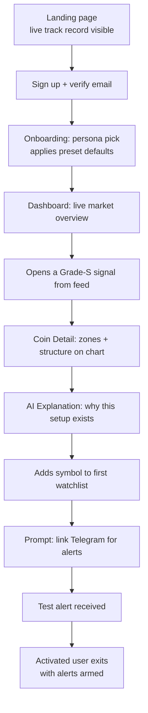
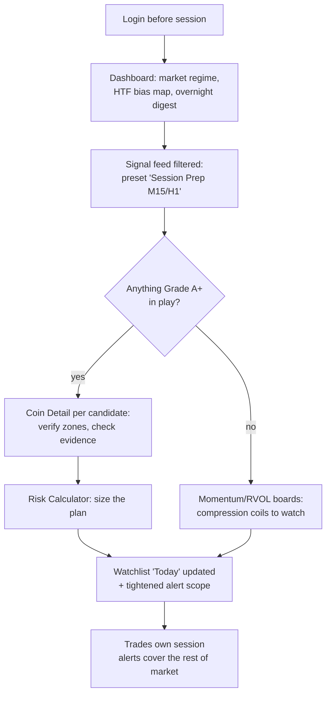
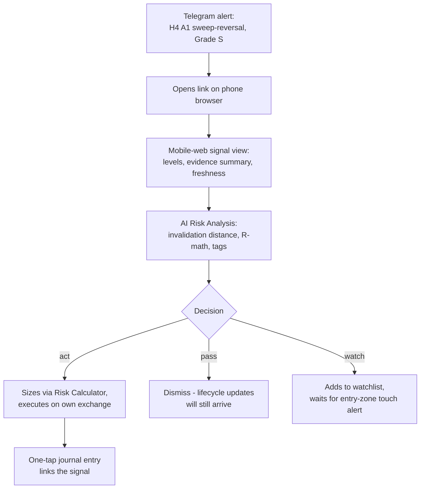
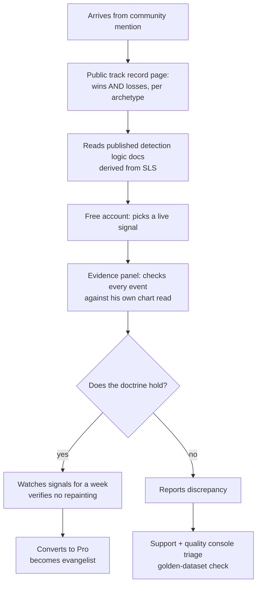
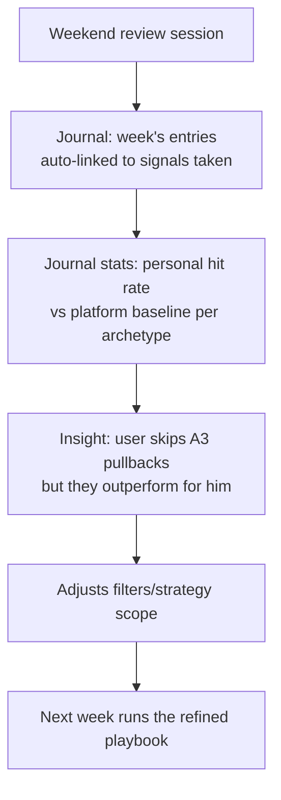
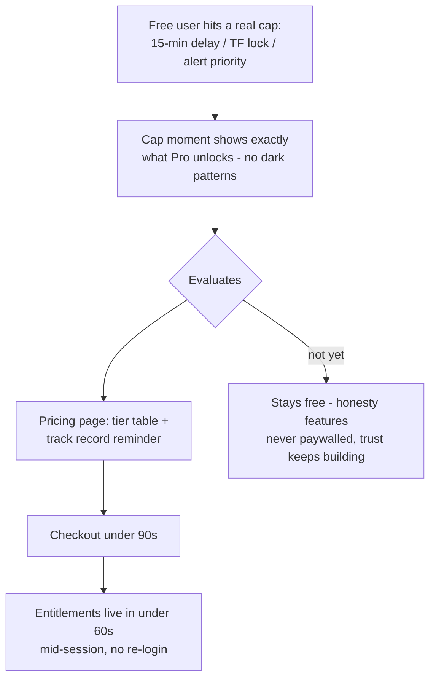

# PRODUCT REQUIREMENTS DOCUMENT (PRD)

## Institutional AI Crypto Scanner

**Document Status:** Official Product Requirements Document — defines WHAT is built, WHO it serves, and WHY
**Authority:** Subordinate to `PROJECT_CONSTITUTION.md` v1.0.0, `SCANNER_LOGIC_SPECIFICATION.md` v1.0.0, and `TECHNOLOGY_DECISION_RECORD.md` v1.0.0; authoritative over product scope, features, priorities, and release composition
**Version:** 1.0.0 | **Ratified:** 2026-07-12
**Amendment Rule:** Scope and priority changes require a versioned PRD revision (Constitution §42.2)

> This document defines the product. It does not define implementation — the Constitution governs how engineering works, the SLS governs how detection thinks, the TDR governs what it is built with. Where a feature here references detection behavior, the SLS is the source of truth and this document cites it rather than re-specifying it.

---

## 1. Product Vision

**One sentence:** The institutional lens for crypto markets — a scanner that finds high-probability smart-money setups across the whole market before they become obvious, explains exactly why each one matters, and never lies about its own performance.

**The problem.** Professional and aspiring crypto traders face a market of 400+ liquid instruments trading 24/7. Manually applying institutional analysis (market structure, liquidity, ICT/SMC concepts) across that universe is humanly impossible: by the time a trader finds a setup on chart 47, it has either played out or become the crowded trade. Existing tools fail in three ways: retail screeners scan indicators, not institutional logic; signal groups are black boxes with fabricated track records; and TradingView-class charting shows one chart at a time — it doesn't hunt.

**The product answer.** A platform that watches every eligible market on every relevant timeframe simultaneously, applies a rigorous, non-repainting institutional detection doctrine (SLS), surfaces only setups that clear strict quality floors, ranks them by evidence-backed confidence, explains each one in professional language via grounded AI, and keeps an immutable public record of every signal it ever published — wins and losses alike.

**What this product is NOT.** Not a signal group. Not financial advice. Not an auto-trader. Not an indicator soup. It is a professional decision-support instrument: the platform finds and explains; the trader decides.

## 2. Mission Statement

Give serious crypto traders institutional-grade market coverage they could never achieve manually, with signal honesty no competitor dares offer — and build it into the commercial SaaS standard for smart-money crypto scanning.

---

## 3. Target Users — Personas

### 3.1 Persona Overview

| # | Persona | Archetype name | Experience | Primary TFs | Willingness to pay |
|---|---|---|---|---|---|
| P1 | Beginner Trader | "Learning Lukas" | < 1 year | H4, D1 | Low → grows |
| P2 | Intermediate Trader | "Developing Dana" | 1–3 years | H1, H4 | Medium |
| P3 | Professional Trader | "Full-time Felix" | 5+ years, income-dependent | M15–D1 | High |
| P4 | ICT Trader | "Doctrine Dev" | 2–6 years, methodology-committed | M15, H1, H4 | High |
| P5 | SMC Trader | "Structure Sara" | 2–5 years | H1, H4 | Medium-High |
| P6 | Scalper | "Rapid Rachel" | 3+ years | M1–M15 | High but partially served (§3.7) |
| P7 | Day Trader | "Session Sam" | 2–5 years | M15, H1 | High |
| P8 | Swing Trader | "Patient Pavel" | 3+ years, often employed elsewhere | H4, D1, W1 | Medium-High |

### 3.2 P1 — Beginner Trader ("Learning Lukas")

- **Goals:** Learn to trade without blowing up his first account; understand *why* a setup is good, not just receive arrows; build a repeatable process instead of gambling.
- **Pain Points:** Overwhelmed by 400 coins and 50 indicators; falls for influencer signal groups; can't tell a quality setup from noise; loses money to FOMO entries at obvious levels; every tool assumes knowledge he doesn't have.
- **Experience Level:** Knows candlesticks and basic support/resistance; has heard of ICT from YouTube but cannot apply it; small account ($500–$5k).
- **Product Expectations:** Wants the platform to teach while it scans — every signal explained in plain language (AI Teach function, SLS §11.1); conservative defaults; a "why this signal exists" narrative; protection from his own worst instincts (the platform's anti-overtrading stance, Constitution §29.5, is a feature *for* him, not against him).

### 3.3 P2 — Intermediate Trader ("Developing Dana")

- **Goals:** Graduate from inconsistent wins to a positive-expectancy process; stop missing setups she knows how to trade but can't find in time; validate her own analysis against something rigorous.
- **Pain Points:** Can analyze one chart well but can't cover the market; second-guesses entries; her watchlist is stale by the time she updates it; has been burned by repainting indicators that looked perfect in hindsight.
- **Experience Level:** Understands market structure, S/R, basic SMC vocabulary; trades part-time around a job; account $5k–$50k.
- **Product Expectations:** A ranked feed she can trust during the hours she's available; alerts that respect her attention; the evidence panel to check the platform's reasoning against her own read; honest signal history so she can calibrate trust.

### 3.4 P3 — Professional Trader ("Full-time Felix")

- **Goals:** Consistent monthly income from trading; maximize coverage without hiring analysts; protect capital with disciplined risk framing; integrate scanning into an existing professional workflow (multiple monitors, journaling, review).
- **Pain Points:** Time is his scarcest asset — a tool must earn its screen real estate in a week or it's gone; despises marketing dressed as analysis; needs to know *when the tool is degraded* more than when it's working; has seen every scam and demands verifiable track records.
- **Experience Level:** Expert; opinionated; will stress-test the platform's logic against his own; account $50k+, possibly OPM.
- **Product Expectations:** Dense, fast, keyboard-friendly dashboard (Constitution §23.4); full provenance on every number (§23.5); data-freshness and degradation labels visible at all times (§27.5); export and API access eventually; will churn instantly on any dishonesty — retained precisely by the immutable signal record.

### 3.5 P4 — ICT Trader ("Doctrine Dev")

- **Goals:** Trade the ICT methodology (liquidity sweeps → displacement → MSS → OTE/OB entries) at market scale; find every clean A1 Sweep-Reversal-class setup the market offers, not just the two charts he watches.
- **Pain Points:** Every existing "ICT indicator" repaints, mislabels structure, or draws order blocks with arbitrary logic; manual top-down analysis across 6 timeframes per symbol caps his coverage at ~10 symbols; killzone timing means setups form while he sleeps.
- **Experience Level:** Deep methodology knowledge, often more precise than the tools he's forced to use; medium-large account.
- **Product Expectations:** The most demanding persona for detection fidelity — he will verify the platform's BOS/CHoCH/MSS/sweep logic candle by candle against the published specification (the SLS being public-facing documentation of logic is a *selling point* to him); archetype filtering (only A1/A2 setups); non-repainting guarantee as a headline feature; will become the product's loudest evangelist if the doctrine holds.

### 3.6 P5 — SMC Trader ("Structure Sara")

- **Goals:** Trade structure and zones (BOS-retest continuations, breaker plays) across the top-100 universe; align lower-timeframe entries with higher-timeframe bias without manually maintaining 100 bias maps.
- **Pain Points:** HTF/LTF alignment bookkeeping consumes her prep hours; zone freshness is impossible to track manually across many charts (which OBs are mitigated? which FVGs still open?); free SMC tools disagree with each other about the same chart.
- **Experience Level:** Solid SMC practitioner, less dogmatic than P4 about specific ICT sub-concepts; account $10k–$100k.
- **Product Expectations:** The zone-state ledger (FRESH/TESTED/MITIGATED/INVALIDATED, SLS §5) as a first-class UI surface; multi-timeframe bias chain visible per symbol (SLS §3.7); continuation archetypes (A3/A4) filtered to HTF-aligned only.

### 3.7 P6 — Scalper ("Rapid Rachel")

- **Goals:** 5–20 trades per session on M1–M5; needs instruments with immediate volatility, liquidity events in progress, and tight spreads *right now*.
- **Pain Points:** By the time anything appears on a scanner, her edge window is half gone; spread and depth matter as much as the setup; existing scanners are too slow and too HTF-focused.
- **Experience Level:** High skill, high intensity, low patience; demands sub-second tooling.
- **Product Expectations & honest scope note:** v1 serves Rachel *partially and deliberately*: M5 is the lowest signal TF and exists as trigger-refinement for Tier-1 symbols only (SLS §0.3); M1 scanning is out of scope by doctrine (noise fails the quality mandate). What she gets: the live momentum/RVOL heat surfaces, compression-coil watchlists (pre-breakout states, SLS §7.3), sweep-in-progress notifications on M5/M15, and spread/tier data. She is a *secondary* persona in v1, a growth persona for a future intraday module.

### 3.8 P7 — Day Trader ("Session Sam")

- **Goals:** 1–4 quality intraday trades per session on M15/H1; flat by end of session; trades the London/NY overlap windows around a flexible schedule.
- **Pain Points:** Session prep takes 90 minutes he'd rather spend trading; misses half the market's intraday setups because he can only pre-mark 15 charts; chases moves he finds late — the exact "obvious to the public" losses this product exists to prevent.
- **Experience Level:** Competent intraday structure trader; account $10k–$150k.
- **Product Expectations:** A pre-session dashboard state ("what's in play today": active sweeps, fresh zones, compression coils, HTF bias map) that compresses prep to 15 minutes; M15/H1 signal feed live during session; TTL-decaying ranks (SLS §9.3) so stale opportunities sink visibly; Telegram alerts when away from desk.

### 3.9 P8 — Swing Trader ("Patient Pavel")

- **Goals:** 2–8 positions at a time on H4/D1, held days to weeks; wants the highest-conviction institutional setups with wide, structurally-defined invalidation; manages positions around a full-time job.
- **Pain Points:** Checks markets twice a day — needs everything material queued for those moments; most tools are intraday-biased noise machines for him; needs risk framing (invalidation distance, R-multiple) more than entry precision.
- **Experience Level:** Experienced, systematic, patient; account often large; lowest tolerance for alert spam of all personas.
- **Product Expectations:** Digest-first experience (daily summary over push storm); H4/D1 archetype filtering; the risk panel (SLS §15.2) front and center; portfolio/journal integration (R2) matters more to him than to any other persona.

### 3.10 Persona Priority for Product Decisions

Primary design targets (v1): **P4, P3, P7** (doctrine-fidelity, professional-density, session-workflow — these three stress every quality dimension). Strongly served: P5, P8, P2. Deliberately partial: P6 (§3.7). Growth/education persona: P1 (served by AI Teach + conservative defaults; never targeted with hype).

---

## 4. Business Objectives

### 4.1 Primary Goals (Product-Market)

1. Establish the platform as the *reference tool* for institutional-concept crypto scanning — the tool serious ICT/SMC traders name when asked "what do you scan with?"
2. Prove signal quality publicly: an immutable, auditable signal history with published per-archetype statistics (Constitution §28.5) as the core differentiator no black-box competitor can copy without exposing themselves.
3. Deliver a daily-habit product: the pre-session dashboard and alert loop become part of users' trading routine within their first week.

### 4.2 Secondary Goals

1. Build the doctrine brand: the public SLS-derived education layer (AI Teach, concept documentation) makes the platform the place traders *learn* institutional scanning, feeding the top of funnel.
2. Accumulate the outcome dataset (signal → result, MFE/MAE per archetype per regime) that compounds into an unassailable calibration moat (SLS §12.4).
3. Establish operational credibility: public status page, honest degradation labels, and uptime discipline that professional users notice and talk about.

### 4.3 Commercial Goals

1. **Phase C1 (launch):** Free tier + single Pro subscription; target conversion of engaged free users (those with ≥ 3 active watchlist symbols or ≥ 5 alert interactions/week) to paid at ≥ 5%.
2. **Phase C2 (+6–12 months):** Tiered subscriptions (per Constitution §36 entitlement model): Free / Pro / Desk — differentiated by TF access, alert volume, AI usage depth, watchlist size, and API access. Target: MRR covering infrastructure ≥ 10× over.
3. **Phase C3 (enterprise):** Desk/team licensing, API program, and self-hosted enterprise deployments (TDR §15 Compose deliverable) for prop firms and funds.
4. Pricing posture: premium-honest — priced above retail signal toys, below institutional data terminals; the immutable track record justifies the position.

### 4.4 Long-Term Vision

The institutional operating system for crypto trading decisions: scanning, analysis, journaling, backtesting, and strategy construction in one evidence-first platform (Constitution roadmap Phases 1–7) — extensible via plugins, portable to mobile, licensable to desks, and trusted because every claim it ever made is still on the record.

---

## 5. Product Scope

### 5.1 In Scope (this PRD's release horizon: R1–R3 + Enterprise)

- Real-time scanning of the Binance spot USDT universe per SLS §1 (tiers, quarantine, delisting rules).
- Full SLS detection doctrine surfaced as product: structure, liquidity, ICT zones, volume, momentum, confluence archetypes A1–A5, ranking, signal lifecycle.
- Professional dashboard (dark-first, Constitution §22–§23), coin detail analysis, ranked signal feed, filters, watchlists.
- Grounded AI explanation suite (SLS §11 functions: Explain, Summarize, Compare, Teach, Thesis, Risk Analysis, Entry Explanation, advisory re-rank).
- Telegram + in-app + email notification channels with priority/cooldown discipline (SLS §10).
- Signal history with immutable outcomes and public per-archetype statistics.
- Accounts, subscriptions, entitlements, admin operations tooling.
- Portfolio tracking (manual + read-only exchange import), trade journal, risk calculator, performance analytics (R2).
- Backtesting against the versioned doctrine and strategy builder composing within doctrine (R3, per SLS §13 constraints).
- News/economic-calendar risk windows as alert-suppression context (R3; suppress-only authority per SLS §13).

### 5.2 Out of Scope (explicitly, with reason)

| Exclusion | Reason |
|---|---|
| Trade execution / auto-trading / exchange order placement | Constitutional boundary (Constitution §24.8, §45.14); requires separate governance amendment ever to exist |
| Financial advice, "buy now" language, profit promises | Constitution §29.1, §45.15 |
| M1 scanning / sub-M5 signals | Quality doctrine (SLS §0.3); see persona P6 note |
| Signal marketplace / copy-trading of other users | Contradicts evidence-first positioning; regulatory quicksand |
| Custom user-defined detection logic (beyond Strategy Builder composition) | Doctrine integrity (SLS §13 Strategy Builder constraint: compose within, never loosen) |
| On-chain/DEX scanning | Different data universe and quality regime; future evaluation, not this horizon |
| Multi-exchange scanning in R1–R3 | Universe doctrine starts Binance-first (SLS §1.1); provider ports keep the door open |
| Social feed / chat rooms | Attention product, not decision product; dilutes positioning |

### 5.3 Future Scope (beyond R3, governed by Constitution roadmap Phases 6–7)

Mobile app (React Native path per TDR §3); plugin marketplace (Constitution §37); whale/flow tracking; futures universe scanning (SLS §1.3); heatmap suite expansion; public API program; internationalization beyond formatting readiness; enterprise SSO; additional exchanges via provider adapters.

---

## 6. Feature Catalog

Priorities use MoSCoW *per release horizon*: a "Must Have (R2)" is essential to Release 2, not to MVP. Release composition is consolidated in §10. Every feature that displays or claims detection behavior inherits its acceptance criteria from the SLS section cited — QA tests against the SLS, not against this summary.

### FC-1 Market Scanner

#### FC-1.1 Live Universe Scanner

- **Purpose:** The core engine surface — continuous scanning of the entire eligible universe per SLS doctrine.
- **Description:** All Tier 1–3 Binance spot USDT symbols scanned on their tier-permitted TFs (M5–W1) on every candle close; detections flow to feed, dashboard, and alerts. Universe membership, quarantine, and delisting per SLS §1.
- **Business Value:** The product's reason to exist; every other feature consumes it.
- **User Value:** Coverage no human can achieve — the market watched whole.
- **Priority:** Must Have (R1)
- **Dependencies:** None upstream (it is the root); SLS §1–§9 define behavior.
- **Inputs:** Market data feeds (SLS §2); universe configuration.
- **Outputs:** Detections, setups, signals with full evidence payloads (SLS §15.2).
- **Acceptance Criteria:** Scan-cycle and latency budgets per SLS §14 met at full universe; zero repaint incidents in golden-dataset verification; every published signal carries the complete §15.2 payload; universe changes (tier moves, quarantine, delisting) reflected within their SLS-defined windows.
- **Edge Cases:** Exchange outage → degradation labels not silence (SLS §2.13); mass-listing days → quarantine holds; symbol halted mid-signal → lifecycle force-expiry per SLS §1.7.
- **Future Improvements:** Futures universe; additional exchanges via provider ports.

#### FC-1.2 Scanner Status & Data Honesty Surface

- **Purpose:** Always-visible truth about what the scanner can currently see.
- **Description:** Global status strip: feed freshness, symbols in DEGRADED/SUSPECT state, last scan-cycle time, active storm-mode notice (SLS §10.2). Per-symbol staleness labels propagate to every surface showing that symbol.
- **Business Value:** The trust feature — professionals (P3) churn from tools that hide degradation; this retains them.
- **User Value:** Never unknowingly trades on stale data.
- **Priority:** Must Have (R1)
- **Dependencies:** FC-1.1.
- **Inputs:** Freshness states (SLS §2.12), engine health.
- **Outputs:** Status indicators, degradation banners, status page.
- **Acceptance Criteria:** Any feed crossing stale threshold shows degraded within one refresh cycle; a degraded input can never render as fresh (Constitution §45.3); status history retained.
- **Edge Cases:** Partial degradation (one TF of one symbol) labels only affected surfaces; total outage → dashboard enters explicit degraded mode with last-known timestamps.
- **Future Improvements:** Public status page with SLO history (Commercial C-phase).

### FC-2 Dashboard

#### FC-2.1 Market Overview Home

- **Purpose:** Answer "where is institutional activity right now?" in one glance (Constitution §23.1).
- **Description:** Default landing surface: top-ranked active signals, market-regime summary (breadth of bullish/bearish HTF states, aggregate RVOL, F&G context tag), recent sweep events, compression watchboard, tier/universe stats. Information order follows Constitution §23.2 workflow.
- **Business Value:** The daily-habit anchor (Business Goal 4.1.3); first screen of every session.
- **User Value:** Session prep compressed from 90 minutes to minutes (P7's core pain).
- **Priority:** Must Have (R1)
- **Dependencies:** FC-1.1, FC-4.1.
- **Inputs:** Published signals, market-condition tags, detection events.
- **Outputs:** Rendered overview with progressive disclosure into every deeper surface.
- **Acceptance Criteria:** State changes visible ≤ 1 s from publication (SLS §14); no layout jumps on live update (Constitution §23.6); every number links to provenance (§23.5); designed empty/loading/error states (§22.8).
- **Edge Cases:** Quiet market (zero active signals) → honest "no qualifying setups" state with market context, never filler; storm mode → banner + prioritized rendering.
- **Future Improvements:** User-configurable layout grid (within §23.7 honesty limits); multi-monitor detach.

#### FC-2.2 Signal Feed

- **Purpose:** The ranked, live list of everything the doctrine currently endorses.
- **Description:** All ACTIVE/PUBLISHED signals ranked per SLS §9.2 with display-rank decay (§9.3); card shows: symbol, TF, direction, archetype, grade, confidence + factor breakdown sparkline, age/TTL, entry/invalidation/target zones, freshness. Click-through to Coin Detail.
- **Business Value:** The product's "front page of the market" — the surface users screenshot and share.
- **User Value:** Instant triage: what deserves attention, in what order, and why.
- **Priority:** Must Have (R1)
- **Dependencies:** FC-1.1, FC-4.1, FC-5.1.
- **Inputs:** Signal lifecycle states, ranks.
- **Outputs:** Ordered live feed, filterable (FC-5).
- **Acceptance Criteria:** Order matches SLS §9.2 deterministic ranking exactly; decay sinks stale signals per §9.3; lifecycle transitions (SUCCESS/FAILED/EXPIRED) update in place ≤ 1 s; confidence always shown with breakdown, never bare (SLS §15.4).
- **Edge Cases:** Duplicate-key refresh events update the existing card, never spawn twins (SLS §10.3); signal on newly-degraded symbol shows degradation chip.
- **Future Improvements:** Saved feed layouts; keyboard-first navigation (P3).

### FC-3 Coin Analysis

#### FC-3.1 Coin Detail — Structure & Zone View

- **Purpose:** The full institutional read of one instrument: everything the engines know, on one chart.
- **Description:** TradingView-class candle chart (TDR §6) with doctrine overlays: swing structure + labels, trend state, BOS/CHoCH/MSS markers, liquidity pools with strength, sweep events, all zone objects (OB/Breaker/FVG/IFVG/BPR/OTE) with live state coloring, premium/discount bands, session VWAP. Per-TF tabs (tier-permitted TFs); HTF bias chain header (SLS §3.7).
- **Business Value:** The conversion surface — where skeptical P4/P5 verify the doctrine holds and decide to pay.
- **User Value:** The 30-minute manual markup, delivered instantly and consistently.
- **Priority:** Must Have (R1)
- **Dependencies:** FC-1.1.
- **Inputs:** Detection objects with states, candle data.
- **Outputs:** Interactive annotated chart; object inspector (click any zone → evidence, age, state history).
- **Acceptance Criteria:** Every rendered object matches its stored detection exactly (id-verifiable); state colors follow one legend; overlays toggleable per class; no rendered object ever disappears retroactively within a session (no-repaint made visible); chart interactive at 60 fps target with all overlays on.
- **Edge Cases:** Warm-up symbols show WARMUP state + what's missing (SLS §1.9); dense overlap zones → clustering with count badges; PD_SUSPENDED ranges show suspension notice (SLS §5.7).
- **Future Improvements:** Replay mode (step through historical closes — powerful education tool); user drawing layer.

#### FC-3.2 Evidence Panel

- **Purpose:** The provenance chain behind any signal or detection — the honesty feature as UI.
- **Description:** For any signal: complete evidence tree (SLS §15.2) rendered readably — contributing events with timestamps and candle references, factor scores F1–F6 with per-item attribution, synergy/penalty itemization, gate results, algo/param versions.
- **Business Value:** The differentiator black-box competitors cannot copy; P3/P4 retention anchor.
- **User Value:** Trust through verifiability; learning through worked examples.
- **Priority:** Must Have (R1)
- **Dependencies:** FC-2.2 / FC-3.1.
- **Inputs:** Signal evidence payloads.
- **Outputs:** Structured evidence view; deep-links to chart locations of each event.
- **Acceptance Criteria:** Every evidence item clickable → highlights source candles/objects on chart; scores recompute-verifiable from displayed items (SLS §8.3); versions always visible.
- **Edge Cases:** Evidence referencing gap-adjacent structures shows the flag (SLS §2.16); very long chains paginate without omission.
- **Future Improvements:** Evidence export (PDF/JSON) for journaling and community sharing.

### FC-4 Ranking

#### FC-4.1 Confidence Ranking Board

- **Purpose:** Market-wide comparable ordering of opportunity quality (SLS §9).
- **Description:** The ranking surface behind feed and dashboard: grades S/A/B, deterministic tie-breaking, factor-weight transparency (the §9.1 table is user-visible documentation), display decay.
- **Business Value:** "Ranked by evidence, not by hype" is the marketing sentence; this feature makes it true.
- **User Value:** Triage confidence; comparable quality across 400 symbols.
- **Priority:** Must Have (R1)
- **Dependencies:** FC-1.1.
- **Inputs:** FinalConfidence + factors per signal.
- **Outputs:** Ranked orderings consumed by feed/dashboard/alerts.
- **Acceptance Criteria:** Byte-deterministic order per SLS §9.2; grade thresholds exact (§9.4); weight documentation matches deployed `param_set_version`.
- **Edge Cases:** Ties resolved per the full §9.2 chain, never arbitrarily; empty grade classes render honestly.
- **Future Improvements:** Per-user advisory AI re-rank within grades (SLS §11.1) as a clearly-labeled overlay — never altering the deterministic order.

#### FC-4.2 Momentum / RVOL Heat Surfaces

- **Purpose:** The "what's moving with participation right now" market pulse — P6/P7's live surface.
- **Description:** Sortable live boards: RVOL classes, momentum scores + acceleration, volume delta, compression coils; tier and category filters; per-TF views.
- **Business Value:** Serves the intraday personas between signals; high session-time driver.
- **User Value:** Early context — activity visible before it matures into setups.
- **Priority:** Must Have (R1)
- **Dependencies:** FC-1.1 (volume/momentum engines).
- **Inputs:** SLS §6–§7 measurements.
- **Outputs:** Live sortable boards → coin detail.
- **Acceptance Criteria:** Values match engine measurements exactly; suspect-volume/wash tags always shown where scores are capped (SLS §6.4/§6.6); update cadence per TF close.
- **Edge Cases:** Wash-tagged symbols visibly flagged, not hidden (honesty over cleanliness); warm-up symbols excluded with count shown.
- **Future Improvements:** Treemap heatmap visualization (R3 heatmap suite).

### FC-5 Filters

#### FC-5.1 Signal & Market Filters

- **Purpose:** Let each persona shape the firehose to their strategy without breaking honesty.
- **Description:** Filter dimensions: archetype (A1–A5), grade, TF set, direction, liquidity tier, category (incl. meme in/out), RVOL class, HTF-alignment state, freshness, watchlist-only. Filters compose (AND across dimensions, OR within); presets per persona shipped as starting points ("ICT Sweeps H1+", "Swing D1 A-grade", "Session Prep").
- **Business Value:** Personalization without doctrine compromise; presets shorten time-to-value in trials.
- **User Value:** P4 sees only A1/A2; P8 sees only H4/D1 A-grade; everyone's feed is *their* feed.
- **Priority:** Must Have (R1)
- **Dependencies:** FC-2.2, FC-4.
- **Inputs:** User filter state; signal attributes.
- **Outputs:** Filtered views; saved filter sets (named, per user).
- **Acceptance Criteria:** Filters narrow only — can never surface below-floor or suppressed signals (Constitution §23.7); filter state visible and shareable as preset; empty results state honest.
- **Edge Cases:** Filters excluding everything → explicit "0 match, N hidden by your filters" (never ambiguous emptiness); preset referencing a TF the user's tier lacks → shown locked with upgrade path (C2 phase).
- **Future Improvements:** Filter → alert-rule promotion in one click (any saved filter becomes an alert subscription).

### FC-6 Watchlist

#### FC-6.1 Watchlists

- **Purpose:** Persistent per-user symbol focus sets driving views and alert scoping.
- **Description:** Multiple named lists; add from any surface; watchlist-scoped dashboard/feed views; per-list alert scoping; annotations per symbol (user note + optional own-bias tag).
- **Business Value:** The stickiness feature — populated watchlists are the #1 leading indicator of conversion (engagement metric, §4.3).
- **User Value:** The platform bends around the user's book.
- **Priority:** Must Have (R1)
- **Dependencies:** Accounts (FC-15.1).
- **Inputs:** User selections, annotations.
- **Outputs:** Lists; scoped views; alert scopes.
- **Acceptance Criteria:** List operations instant (< 200 ms perceived); limits per entitlement tier enforced at platform layer (Constitution §36.2); symbols entering DELISTING flagged in-list.
- **Edge Cases:** Watchlisted symbol delisted → retained with terminal state + history until user removes; duplicate adds idempotent.
- **Future Improvements:** Shared/team lists (Desk tier); import from exchange holdings (with FC-12 portfolio link).

### FC-7 Alerts

#### FC-7.1 Alert Subscriptions & Delivery

- **Purpose:** The platform's reach beyond the open tab — quality-gated, attention-respecting notification of what matters (SLS §10 doctrine).
- **Description:** Channels: Telegram (primary), in-app, email (digest-class). User scoping: watchlists, filters-as-rules, priority threshold, quiet hours, per-TF toggles. All SLS §10 discipline applies: priority classes, cooldowns, duplicate merge, storm mode, daily caps with honest suppression reporting.
- **Business Value:** Retention loop; the free→paid conversion moment often follows a good alert; alert volume is a paid-tier differentiator (C2).
- **User Value:** P7/P8 live on this — the market watched while they aren't watching.
- **Priority:** Must Have (R1)
- **Dependencies:** FC-1.1, FC-5.1, FC-15.1.
- **Inputs:** Published signals + lifecycle transitions; user rules.
- **Outputs:** Channel deliveries; alert log with delivery status; suppression digest.
- **Acceptance Criteria:** High-priority end-to-end ≤ 10 s p99 (SLS §14); alert content includes symbol, TF, archetype, grade, direction, entry/invalidation/target, link — never advice language (Constitution §29.1); lifecycle-close notifications always delivered for alerted signals (SLS §10.3); caps enforce with visible suppression reporting.
- **Edge Cases:** Telegram unreachable → retry then fallback to in-app + email notice of delivery failure; user in quiet hours → queued to digest, urgent lifecycle closes optionally exempt (user setting).
- **Future Improvements:** Mobile push (future app); webhook channel (API program, C3).

### FC-8 AI Analysis

#### FC-8.1 Signal Explanation & Trade Thesis

- **Purpose:** Institutional-quality narrative for every signal — grounded, cited, honest (SLS §11).
- **Description:** Per signal: structured thesis (context → liquidity story → entry logic → confirmation/invalidation view), risk analysis (R-math, condition tags, category risk), entry explanation. Every claim evidence-cited; template fallback when AI unavailable (SLS §11.2.5).
- **Business Value:** The "AI" in the product name delivered credibly — a visible premium-tier differentiator (AI depth per tier, C2).
- **User Value:** P1/P2 learn from every signal; P3/P7 get desk-note quality summaries in seconds.
- **Priority:** Must Have (R1)
- **Dependencies:** FC-3.2 (evidence), AI provider (TDR §1/§11).
- **Inputs:** Evidence payloads only (never raw charts — SLS §11.2.1).
- **Outputs:** Explanations with citation links; model/prompt versions visible.
- **Acceptance Criteria:** 100% of factual claims citation-bound (validator-enforced, SLS §11.2.2); zero advice language (validated); generation ≤ 10 s or graceful async delivery; fallback templates always available.
- **Edge Cases:** Validator rejection → regenerate once → template (logged); evidence with degraded-data flags → explanation must mention the degradation.
- **Future Improvements:** Persona-adaptive depth (Lukas gets glossary expansions, Felix gets terse desk notes) as explicit user setting.

#### FC-8.2 AI Teach Mode

- **Purpose:** Turn every signal into a lesson — the education moat (Business Goal 4.2.1).
- **Description:** Any doctrine term anywhere → inline explainer; per-signal "teach me this setup" walks the archetype using *this* signal's actual evidence as the worked example (SLS §11.1 Teach); concept library generated from doctrine definitions.
- **Business Value:** Top-of-funnel content engine + beginner retention; differentiates from every scanner that assumes expertise.
- **User Value:** P1's primary feature; P2's calibration tool.
- **Priority:** Should Have (R1) — ships in R1 if capacity allows, else R2-early.
- **Dependencies:** FC-8.1.
- **Inputs:** Doctrine vocabulary + signal evidence.
- **Outputs:** Inline explainers, guided walkthroughs.
- **Acceptance Criteria:** Every SLS-defined term has an explainer; walkthrough claims cite the signal's evidence; no walkthrough on signals with incomplete evidence.
- **Edge Cases:** Terms with suspended context (PD_SUSPENDED) explain the suspension too.
- **Future Improvements:** Structured learning paths; replay-mode integration (FC-3.1 future).

#### FC-8.3 Market & Watchlist Digest

- **Purpose:** AI-composed periodic summaries: "what happened, what's in play" (SLS §11.1 Summarize).
- **Description:** Daily market digest + per-watchlist digest (session-start for P7, evening for P8): new signals, lifecycle closes with outcomes, regime shifts, notable sweeps/compressions — all from recorded events.
- **Business Value:** The re-engagement email/message that brings users back daily.
- **User Value:** P8's twice-daily check-in served completely.
- **Priority:** Should Have (R1)
- **Dependencies:** FC-8.1, FC-7.1 channels.
- **Inputs:** Event/outcome records for the period.
- **Outputs:** Digest messages (in-app/email/Telegram per user preference).
- **Acceptance Criteria:** Outcome reporting exact (wins AND losses — Constitution §28.6); delivery timing per user schedule ±5 min; unsubscribe honored instantly.
- **Edge Cases:** Quiet periods → short honest digest, never padded; degraded-data periods disclosed in digest.
- **Future Improvements:** Voice-note format; per-persona tone setting.

#### FC-8.4 Setup Comparison

- **Purpose:** Side-by-side evidence comparison of 2–3 candidate signals (SLS §11.1 Compare).
- **Description:** Select signals → structured comparison: factor deltas, risk framing, HTF context, AI commentary on trade-offs — advisory only, deterministic ranks unchanged.
- **Business Value:** Deepens the decision-support positioning; Desk-tier collaboration seed.
- **User Value:** P3/P7's "which of these three do I take?" moment served.
- **Priority:** Could Have (R1) → Should Have (R2)
- **Dependencies:** FC-8.1.
- **Inputs:** Selected signal evidence records.
- **Outputs:** Comparison view + commentary.
- **Acceptance Criteria:** Comparisons only between concurrently-valid signals; commentary cites both evidence sets; no "better" verdict without criteria statement.
- **Edge Cases:** Signals on same symbol/different TF → TF-context differences must be explicit.
- **Future Improvements:** Compare vs user's historical journal patterns (R2+, with FC-13).

### FC-9 Settings

#### FC-9.1 Preferences & Display

- **Purpose:** Bend presentation around the user without ever bending the data.
- **Description:** Display timezone (storage stays UTC — Constitution §39.5), default TF set, feed density (compact/comfortable), theme (dark-first; light if/when offered), quiet hours, channel preferences, digest schedule, persona-preset application (P1 conservative defaults, P3 dense defaults).
- **Business Value:** Perceived product maturity; persona presets shorten time-to-value.
- **User Value:** The platform fits the user's routine on day one.
- **Priority:** Must Have (R1)
- **Dependencies:** FC-15.1.
- **Inputs:** User selections.
- **Outputs:** Applied preferences across all surfaces, synced per account.
- **Acceptance Criteria:** Preference changes apply instantly and persist across devices; no preference can alter data truth (only presentation — Constitution §23.7); timezone changes never shift stored history.
- **Edge Cases:** DST transitions handled by named-zone rules; conflicting quiet hours vs urgent lifecycle-close exemption follows explicit user setting (FC-7.1).
- **Future Improvements:** Per-workspace profiles (desk vs home); export/import settings.

#### FC-9.2 Security Settings

- **Purpose:** User-facing control of account security posture.
- **Description:** Password management (strength enforcement), TOTP 2FA enrollment/recovery codes, active session list with revocation, login history, connected channels (Telegram link/unlink).
- **Business Value:** Table stakes for a financial-adjacent product; enterprise due-diligence checkbox.
- **User Value:** P3 with capital-adjacent workflows demands this before trusting the platform.
- **Priority:** Must Have (R1)
- **Dependencies:** FC-15.1; auth stack (TDR §10).
- **Inputs:** User security actions.
- **Outputs:** Updated security state; audit trail entries.
- **Acceptance Criteria:** 2FA enrollment < 2 min flow; session revocation effective ≤ 30 s; all security events logged and visible to the user; recovery codes single-use.
- **Edge Cases:** Lost 2FA device → recovery-code flow with cooldown + notification to registered email; concurrent session limit per tier.
- **Future Improvements:** Passkeys/WebAuthn; SSO (Enterprise, TDR §10.11).

### FC-10 Signal History & Track Record

#### FC-10.1 Immutable Signal History Explorer

- **Purpose:** The product's honesty made browsable — every signal ever published, with its outcome, forever (Constitution §45.5).
- **Description:** Searchable/filterable archive of all published signals: outcome (SUCCESS/FAILED/EXPIRED classes per SLS §12), MFE/MAE in R, elapsed time, full evidence snapshot, algo/param versions. Aggregate statistics per archetype × grade × TF × version: hit rate, expectancy proxy, distribution views. Personal view: "signals I was alerted on."
- **Business Value:** THE differentiator (Business Goal 4.1.2); converts skeptics (P3/P4) no marketing could; internally, it is the §44-Constitution quality instrument.
- **User Value:** Calibrated trust — users know exactly what a Grade-S A1 on H4 has historically done.
- **Priority:** Must Have (R1 internal + user-facing archive; public marketing page Should Have R2)
- **Dependencies:** FC-1.1 lifecycle records.
- **Inputs:** Immutable outcome records (SLS §12.4).
- **Outputs:** Archive views, aggregate statistics, per-signal deep links.
- **Acceptance Criteria:** Zero mutability — no edit/delete surface exists at any privilege level (Constitution §45.5); stats recompute-verifiable from records; version boundaries visible in all aggregates (no mixing algo versions silently); EXPIRED reported separately, never hidden in win rates (SLS §12.4).
- **Edge Cases:** Delisting-expired signals excluded from quality stats but present in archive (SLS §1.7); early-version small-sample stats display confidence-interval honesty ("n=14 — insufficient for inference").
- **Future Improvements:** Public API access to track record (C3); third-party attestation/export.

### FC-11 Notifications

#### FC-11.1 In-App Notification Center

- **Purpose:** One inbox unifying everything the platform told the user, with read state and links.
- **Description:** Chronological center: alerts, lifecycle closes, digests, system notices (degradation events affecting user's watchlists, maintenance), account/billing events. Read/unread, per-category mute, deep links to source surfaces.
- **Business Value:** Reduces Telegram dependence risk; the re-engagement surface inside the product.
- **User Value:** "What did I miss?" answered in one place.
- **Priority:** Should Have (R1) / Must Have (R2)
- **Dependencies:** FC-7.1 event stream, FC-15.1.
- **Inputs:** All user-scoped notification events.
- **Outputs:** Unified inbox; unread counts.
- **Acceptance Criteria:** Parity with external channels (nothing delivered externally is absent here); suppression events (caps, storm mode) visible per SLS §10.3 honesty rule; retention ≥ 90 days.
- **Edge Cases:** Notification referencing an expired/archived signal links to archive view, never 404s.
- **Future Improvements:** Mobile push mirror (future app); granular per-watchlist mute.

### FC-12 Portfolio

#### FC-12.1 Portfolio Tracking

- **Purpose:** The user's actual book, inside the platform that informs it.
- **Description:** Manual position entry (symbol, size, entry, invalidation, target, notes) with optional signal linkage; open/closed position views; exposure overview (per symbol, category, direction, aggregate R at risk); live P&L against scanner market data. Read-only exchange import evaluated post-R2 (custody-free, Constitution §17.7 key discipline).
- **Business Value:** Deepens daily engagement; feeds journal and analytics; Desk-tier foundation.
- **User Value:** P8's twice-daily check becomes complete: signals + book in one view.
- **Priority:** Must Have (R2)
- **Dependencies:** FC-15.1; market data (FC-1.1); FC-13 linkage.
- **Inputs:** User position entries; market prices.
- **Outputs:** Position ledger, exposure dashboards, P&L (decimal-exact, Constitution §45.8).
- **Acceptance Criteria:** P&L accuracy to the tick vs source data; aggregate risk math per Constitution §29.3 conventions; positions never auto-modified; delisted holdings flagged with last valid price and timestamp.
- **Edge Cases:** Position on symbol that leaves the scanned universe → tracking continues from retained data with staleness labeling; partial closes supported with lot accounting.
- **Future Improvements:** Read-only exchange API sync; multi-portfolio (accounts/strategies); Desk-tier shared visibility.

#### FC-12.2 Risk Calculator

- **Purpose:** Professional position-sizing math, one click from any signal (Constitution §29.3).
- **Description:** Account-risk-percentage sizing from any signal's entry/invalidation (or manual levels): position size, R-multiple to targets, exposure impact if portfolio exists. Conservative defaults (Constitution §29.4).
- **Business Value:** The bridge from "interesting signal" to "actionable decision" — increases signal engagement quality (a §44 metric).
- **User Value:** P1 is protected from oversizing; P3 saves the spreadsheet step.
- **Priority:** Must Have (R2) (Could Have late-R1 if capacity allows)
- **Dependencies:** FC-2.2/FC-3.1 signal context; FC-12.1 optional.
- **Inputs:** Account size, risk %, signal levels.
- **Outputs:** Size, R-math, exposure delta — displayed as calculation, never as instruction (Constitution §29.1).
- **Acceptance Criteria:** Decimal-exact math; defaults conservative (≤ 1% risk pre-set); output language advice-free (validated copy).
- **Edge Cases:** Invalidation tighter than spread/tier reality → warning surfaced; zero/absent account size → calculator functions in pure-R mode.
- **Future Improvements:** Fee/slippage modeling per tier data; portfolio-heat guardrails (warning-only, never blocking).

### FC-13 Trade Journal

#### FC-13.1 Journal Entries

- **Purpose:** Close the loop: what the user did with what the platform showed (Constitution §29.7).
- **Description:** Entries created from a signal (one click — evidence snapshot attached automatically), from a position (FC-12.1), or standalone; structured fields (thesis, execution notes, emotion tag, outcome, screenshots) + free text; immutable once finalized (append-only amendments).
- **Business Value:** Retention moat — a populated journal is the highest switching cost in the product; feeds FC-13.2/FC-8 insights.
- **User Value:** The improvement flywheel every serious trader knows they need and few maintain.
- **Priority:** Must Have (R2)
- **Dependencies:** FC-15.1; FC-2.2/FC-12.1 linkage.
- **Inputs:** User entries; linked platform records.
- **Outputs:** Journal timeline; linked-record views.
- **Acceptance Criteria:** Signal-linked entries carry the immutable evidence snapshot (survives later algo versions); finalized entries append-only; export (CSV/JSON) available — user data is user property.
- **Edge Cases:** Journaling a suppressed/expired signal permitted (learning includes misses); privacy: journal content never leaves tenant scope, never feeds AI providers without explicit consent (Constitution §26.9).
- **Future Improvements:** Templates per persona; voice-note entries; review-session mode.

#### FC-13.2 Journal Statistics & Review

- **Purpose:** Confront the user with their real numbers (Constitution §29.7 — accuracy is a hard requirement).
- **Description:** Per-tag/archetype/TF personal stats: win rate, expectancy, R distribution, discipline metrics (took signal vs deviated), streaks presented statistically — never gamified (Constitution §29.5).
- **Business Value:** The "this product made me better" testimonial engine.
- **User Value:** P2's calibration; P8's monthly review, automated.
- **Priority:** Should Have (R2)
- **Dependencies:** FC-13.1.
- **Inputs:** Finalized journal entries.
- **Outputs:** Personal analytics views; period reviews.
- **Acceptance Criteria:** Stats mathematically exact from entries; no streak celebration mechanics; small-sample honesty labels (as FC-10.1).
- **Edge Cases:** Mixed-size positions → R-normalized views default; incomplete entries excluded with visible count.
- **Future Improvements:** AI review commentary (grounded in the user's own entries only); comparison vs platform-signal baseline ("your execution delta").

### FC-14 Backtesting

#### FC-14.1 Doctrine Backtesting

- **Purpose:** Let users interrogate history with the exact live doctrine (SLS §13: the backtester is the reference implementation — live/backtest divergence is a critical defect).
- **Description:** User-facing runs: choose archetypes/filters/universe/TF/date-range → replay versioned doctrine over stored history → results: signal list (each with full evidence, as if live), outcome stats, equity-curve-style R aggregation, comparison to published live record for overlapping periods.
- **Business Value:** Converts quants and educators; validates the platform's honesty claim independently; Desk-tier anchor feature.
- **User Value:** P4/P5 verify doctrine behavior across regimes before trusting capital to it.
- **Priority:** Must Have (R3)
- **Dependencies:** FC-1.1 (historical data + versioned algorithms); FC-10.1.
- **Inputs:** Run configuration; historical data (SLS §2.9 quality-controlled).
- **Outputs:** Run reports (reproducible: config + versions recorded), saved runs.
- **Acceptance Criteria:** Identical config + version + data ⇒ identical results (determinism law); results clearly labeled with data-coverage caveats (gaps honored per SLS §2.16 — never interpolated in backtests either); no forward-looking leakage (closed-candle law in replay).
- **Edge Cases:** Requested range predating a symbol's warm-up → excluded with notice; runs across param-version boundaries → segmented reporting, never blended silently.
- **Future Improvements:** FC-14.2; walk-forward views; regime-tagged breakdowns.

#### FC-14.2 Parameter-Version Comparison

- **Purpose:** Transparency across doctrine evolution: how did v1.2 differ from v1.3 on the same history?
- **Description:** Side-by-side runs of two param/algo versions over identical data; delta report per archetype.
- **Business Value:** Public spec-evolution honesty (SLS §30.8-Constitution culture) as a user-visible asset; internal calibration tool exposed at Desk tier.
- **User Value:** Power users see the platform improving *with evidence*.
- **Priority:** Could Have (R3, Desk tier)
- **Dependencies:** FC-14.1.
- **Inputs:** Two version selections, shared config.
- **Outputs:** Comparative report.
- **Acceptance Criteria:** Version isolation absolute (no cross-contamination); deltas attributed per changed parameter set.
- **Edge Cases:** Versions with different universe rules → intersection universe with disclosure.
- **Future Improvements:** Full changelog integration (each spec amendment links its measured impact).

### FC-15 Accounts & Subscription

#### FC-15.1 Accounts & Authentication

- **Purpose:** Identity, access, and channel linkage foundation for every user-scoped feature.
- **Description:** Email registration + verification, login, password reset, TOTP 2FA (FC-9.2), session management, Telegram account linking (deep-link flow), account deletion with data export (Constitution §35.3 right-to-be-forgotten).
- **Business Value:** Foundation of tenancy, entitlements, and every commercial motion.
- **User Value:** Fast, secure, unremarkable — auth is only noticed when it fails.
- **Priority:** Must Have (R1)
- **Dependencies:** None (root user-domain feature); auth stack per TDR §10.
- **Inputs:** Credentials, verification actions.
- **Outputs:** Authenticated sessions; linked channels; audit events.
- **Acceptance Criteria:** Registration→scanning value < 2 minutes; verification email < 60 s; deletion executes full tenant purge with confirmation + export offer; brute-force protection active (Constitution §17.9).
- **Edge Cases:** Telegram re-link to different account → old link invalidated with notice; concurrent registration race on same email → deterministic single-account outcome.
- **Future Improvements:** OAuth social sign-in (evaluated against security posture); passkeys; SSO (Enterprise).

#### FC-15.2 Subscription Tiers & Entitlements

- **Purpose:** The commercial capability model — declarative plans per Constitution §36.2.
- **Description:** Tiers (launch structure): **Free** (delayed feed 15 min, H4/D1 only, 1 watchlist ×10 symbols, Low-priority alerts only, limited AI, full track-record access — honesty is never paywalled), **Pro** (real-time, all tier-permitted TFs, full alerts, full AI suite, 10 watchlists, journal/portfolio), **Desk** (team seats, API access, backtesting depth, comparison tools, priority support). Every capability check flows through entitlements; caps metered visibly to the user.
- **Business Value:** The revenue engine; visible-meter design converts at the moment of hitting a cap.
- **User Value:** Clear value ladder; no surprise lockouts (graceful states per Constitution §36.5).
- **Priority:** Must Have (R2) — R1 runs free-beta with entitlement plumbing active (single free plan).
- **Dependencies:** FC-15.1; FC-15.3.
- **Inputs:** Plan definitions (configuration); subscription states.
- **Outputs:** Enforced capabilities; usage meters; upgrade prompts (honest, non-manipulative).
- **Acceptance Criteria:** Tier changes apply ≤ 60 s; downgrade never destroys data (watchlists over cap → read-only, not deleted); meters accurate to the event (Constitution §36.3); free-tier delay exact and disclosed.
- **Edge Cases:** Mid-cycle upgrades prorate; payment failure → PAST_DUE grace state with defined capability curve, never instant lockout (Constitution §36.5).
- **Future Improvements:** Usage-based AI add-ons; regional pricing; grandfathering automation (Constitution §36.6).

#### FC-15.3 Billing & Checkout

- **Purpose:** Money in, invoices out, zero billing disputes lost for lack of records.
- **Description:** Provider-abstracted checkout (Constitution §36.4), subscription lifecycle (trial → active → past-due → canceled), invoices, payment-method management, tax via provider (Constitution §36.8), full billing history.
- **Business Value:** Revenue-critical path — highest testing/monitoring tier by constitutional mandate (§36.7).
- **User Value:** Boring, trustworthy, reversible.
- **Priority:** Must Have (R2)
- **Dependencies:** FC-15.2.
- **Inputs:** Payment events, plan selections.
- **Outputs:** Subscription states, invoices, receipts, metering-backed records.
- **Acceptance Criteria:** Checkout completion < 90 s happy path; every state transition audited; cancellation self-serve in ≤ 3 clicks with end-of-period access honored; refund policy published and executable.
- **Edge Cases:** Chargeback → automated state handling + record preservation; currency of record fixed per account.
- **Future Improvements:** Crypto payment rail (evaluated for compliance cost first); annual plans; team seat management (Desk).

### FC-16 Admin Panel

#### FC-16.1 Operations Console

- **Purpose:** Run the platform: users, entitlements, health — with audited hands (Constitution §35.5).
- **Description:** Internal console: user/tenant search and management, plan overrides (audited), system health summary (feeds, engines, funnel, delivery — from monitoring stack), degradation event log, storm-mode history, support tooling (user-context view via correlation IDs — read-only into user data, consent-gated where content-level).
- **Business Value:** Support cost control; incident response speed; enterprise operational credibility.
- **User Value:** Indirect — faster support resolution, honest incident handling.
- **Priority:** Must Have (R2) — minimal internal version ships with R1 (health + user lookup).
- **Dependencies:** FC-15.x; monitoring stack (TDR §20).
- **Inputs:** Admin actions (role-scoped), platform telemetry.
- **Outputs:** Managed state changes, all admin-audited.
- **Acceptance Criteria:** Every admin action logged immutably with actor + reason; role-based access (support ≠ superadmin); no admin surface can mutate signal history (Constitution §45.5 applies to staff too).
- **Edge Cases:** Emergency entitlement grant during billing-provider outage → time-boxed, auto-expiring, audited.
- **Future Improvements:** FC-16.2 quality console; anomaly-flag queue (§34.3-Constitution business-truth monitors feeding humans).

#### FC-16.2 Signal Quality Console

- **Purpose:** The internal instrument for Constitution §44 quality governance.
- **Description:** Per-version quality dashboards (hit rates, funnel ratios, MFE/MAE distributions, drift alarms), golden-dataset regression status, release-gate views (quality regressions block release — Constitution §28.8).
- **Business Value:** Makes the quality-over-quantity promise operationally enforceable.
- **User Value:** Indirect but existential — this console is why user-facing stats stay defensible.
- **Priority:** Should Have (R2)
- **Dependencies:** FC-10.1 records; FC-16.1.
- **Inputs:** Outcome records, funnel diagnostics, test results.
- **Outputs:** Quality reports; release-gate signals.
- **Acceptance Criteria:** Metrics match public track-record math exactly (one truth); version comparisons standard-formatted; drift alarms actionable with runbooks.
- **Edge Cases:** Small-n new archetypes flagged as non-inferential.
- **Future Improvements:** Automated spec-amendment impact reports (with FC-14.2).

### FC-17 News

#### FC-17.1 News Feed & Asset Context

- **Purpose:** The *fact layer* of market context — what happened, tagged to assets (SLS §31.4-Constitution separation: fact / data / interpretation).
- **Description:** Aggregated crypto news (free sources first, TDR §29 posture) tagged per asset/category; shown on coin detail and dashboard context rail; timestamped, sourced, deduplicated.
- **Business Value:** Session completeness — one less tab open elsewhere.
- **User Value:** "Why is this moving?" gets a fact-based first answer.
- **Priority:** Should Have (R3)
- **Dependencies:** Provider adapters; FC-3.1 surfaces.
- **Inputs:** News provider feeds.
- **Outputs:** Tagged, sourced news items.
- **Acceptance Criteria:** Source + timestamp always visible; no headline ever presented as platform analysis; dedup across syndication.
- **Edge Cases:** Contradictory reports → both shown with sources, never editorially merged.
- **Future Improvements:** AI summarization layer (clearly interpretation-labeled, SLS §31.4).

#### FC-17.2 News Risk Windows

- **Purpose:** Protect users from trading signals into scheduled/breaking chaos — suppress-only authority (SLS §13).
- **Description:** High-impact events create asset-scoped risk windows; user-configurable behavior: tag signals (default) or suppress alerts during window; never creates or blocks signal *detection* (doctrine untouched).
- **Business Value:** Risk hygiene differentiator; institutional-feel judgment encoded.
- **User Value:** P7 stops getting sweep alerts 3 minutes before a listing announcement plays out.
- **Priority:** Should Have (R3)
- **Dependencies:** FC-17.1, FC-7.1.
- **Inputs:** Event classifications, user preference.
- **Outputs:** Window tags on signals; suppression events (reported honestly per SLS §10.3).
- **Acceptance Criteria:** Windows visible on affected signals; suppression logged and disclosed to the user; detection stream provably unaffected.
- **Edge Cases:** Overlapping windows merge; false-alarm events → window closes early with notice.
- **Future Improvements:** Severity-graded window policies.

### FC-18 Economic Calendar

#### FC-18.1 Macro Calendar & Event Windows

- **Purpose:** Scheduled macro context (CPI, FOMC, major unlocks/upgrades) with the same suppress-only window mechanics.
- **Description:** Calendar surface (day/week views) + configured risk windows for high-impact macro events (SLS §13: windows are configuration with provenance); dashboard countdown chips for imminent events.
- **Business Value:** Completes the professional prep surface; cheap to provide, high perceived value.
- **User Value:** P8's position-holding decisions get the macro tripwires they need.
- **Priority:** Should Have (R3)
- **Dependencies:** Provider adapter; FC-7.1 for windows.
- **Inputs:** Calendar provider data; window configuration.
- **Outputs:** Calendar views; event window effects (as FC-17.2).
- **Acceptance Criteria:** Event times exact in user timezone with UTC anchor visible; provider revisions propagate ≤ 1 h; window behavior identical in mechanics to FC-17.2.
- **Edge Cases:** Unscheduled emergency events (exchange incidents) enter via FC-17.2 path, not calendar.
- **Future Improvements:** Historical event-impact overlays on charts (with FC-14 data).

### FC-19 Strategy Builder

#### FC-19.1 Doctrine Composer

- **Purpose:** Let power users compose *within* doctrine: their universe, their archetypes, their floors — tighten-only (SLS §13 constraint).
- **Description:** Named strategies = universe filter + archetype set + minimum grade/floor (≥ platform floors) + TF set + HTF-alignment requirement + alert routing; strategies drive scoped feeds, alerts, and backtests (FC-14.1 run-from-strategy).
- **Business Value:** Desk-tier anchor; the personalization endgame that never compromises doctrine integrity.
- **User Value:** P4 encodes "external-sweep A1s, H1+, Tier 1–2, HTF-aligned, ≥ 80 confidence" once — the platform runs his playbook.
- **Priority:** Must Have (Enterprise release; Could Have late-R3 for Pro preview)
- **Dependencies:** FC-5.1, FC-7.1, FC-14.1.
- **Inputs:** Strategy definitions.
- **Outputs:** Strategy-scoped feeds/alerts/backtests; strategy performance tracking vs its own backtest.
- **Acceptance Criteria:** No composition can loosen a constitutional gate or floor (structurally enforced, SLS §13); strategy edits are versioned (performance history segments per version); live-vs-backtest tracking per strategy honest by construction.
- **Edge Cases:** Strategy whose filters can never match (contradictory) → validation warning at save; strategies referencing retired parameters → migration prompt on doctrine version change.
- **Future Improvements:** Strategy sharing (Desk teams); plugin-provided strategy blocks (Constitution §37 governance first).

### FC-20 Future Expansion (Catalogued, Not Committed)

All items below are **Won't Have (this horizon)** — catalogued so roadmap governance (Constitution §6) has named successors. Full 12-field specs will be authored in the PRD revision that commits each one.

| Future feature | One-line purpose | Earliest phase | Governing constraint |
|---|---|---|---|
| Mobile app (iOS/Android) | Monitoring, alerts, quick decisions away from desk | Post-R3 | Constitution §38; TDR §3 RN path |
| Heatmap suite (liquidity/market treemaps) | Visual market-wide density surfaces | R3+ | SLS §13: recorded objects only |
| Whale & flow tracking | Large-participant context tags | Phase 6 | SLS §13: bounded adjustments via amendment |
| Futures universe scanning | Perp-native universe with funding/OI/liq context | Phase 6 | SLS §1.3, §2.7–§2.9 |
| Multi-exchange support | Additional venues via provider ports | Phase 6–7 | SLS §1.1: no silent price blending |
| Plugin system & marketplace | Vetted third-party extensions | Phase 6–7 | Constitution §37 governance amendment first |
| Public API program | Programmatic access to signals/track record | C3 | Constitution §15 API standards |
| AI assistant (conversational) | Bounded-authority platform copilot | Phase 6 | SLS §31.3 authority limits |
| Internationalization (languages) | Localized product beyond formatting readiness | Phase 7 | Constitution §39 |
| Replay/education mode | Step-through historical doctrine playback | R3+ | Closed-candle law in replay |

---

## 7. User Journeys

### 7.1 J1 — New User Activation (Visitor → First Alert)

Target: value visible before signup, activation complete inside one session. Activation definition (KPI §11): watchlist populated + alert channel linked within 24 h.

Design rules for this journey: persona pick is skippable (defaults to Intermediate); no feature tour walls — the live feed *is* the tour; the first AI explanation is the "aha" checkpoint and must render within its budget even for free users.

### 7.2 J2 — Daily Session Prep (Day Trader, P7)

Success condition: prep ≤ 15 minutes. Every surface in this loop must be reachable ≤ 2 clicks from dashboard.

### 7.3 J3 — Alert to Decision, Away From Desk (Swing Trader, P8)

Design rule: the alert → readable signal view path must survive on a phone browser (NFR §9.10) even before a native app exists.

### 7.4 J4 — Skeptic Verification (ICT Trader, P4)

The highest-value conversion journey in the product. Dev arrives hostile — every ICT tool has burned him.

Product implication: discrepancy reports are a first-class support category routed to the quality console (FC-16.2) — a skeptic who files one is one honest answer away from being either the best marketing or the loudest warning.

### 7.5 J5 — Review Loop (R2: Journal + Analytics)

### 7.6 J6 — Free → Paid Upgrade

Conversion doctrine: upgrade prompts appear only at genuine capability moments, never as interruption marketing (Constitution §35.8 posture).

---

## 8. User Stories

Grouped by feature area; priorities inherit from the catalog. Format per Agile convention.

**Scanner & Feed**
1. As a day trader, I want the entire USDT universe scanned on every candle close, so that I never miss a qualifying setup because I wasn't watching that chart.
2. As a professional trader, I want visible data-freshness and degradation labels on every surface, so that I never make a decision on stale data presented as live.
3. As an ICT trader, I want signals classified by setup archetype (A1–A5), so that I can trade only the patterns in my playbook.

**Ranking & Quality**
4. As a swing trader, I want signals graded S/A/B with visible factor breakdowns, so that I can triage quality across 400 symbols in seconds.
5. As an intermediate trader, I want stale signals to sink automatically as they age, so that my feed reflects what is actionable now.
6. As a skeptical trader, I want the ranking weights and logic documented in-product, so that I can judge the scoring instead of trusting a black box.

**Coin Analysis & Evidence**
7. As an SMC trader, I want every order block, FVG, and breaker rendered with its live state (fresh/tested/mitigated/invalidated), so that I never trade a spent zone.
8. As an ICT trader, I want to click any evidence item and see the exact candles that produced it, so that I can verify the platform's logic against my own read.
9. As a day trader, I want the HTF bias chain visible on every coin view, so that my intraday entries always have top-down context.

**Filters & Watchlists**
10. As a trader, I want to filter coins by relative volume, so that I can quickly discover institutional activity.
11. As a swing trader, I want saved filter presets for my H4/D1 A-grade playbook, so that my feed opens ready for my strategy.
12. As a professional trader, I want multiple named watchlists with notes, so that the platform organizes around my book, not the other way around.

**Alerts**
13. As a day trader, I want Telegram alerts within seconds of signal publication, so that I can act while the setup is fresh.
14. As a swing trader, I want quiet hours and a daily digest instead of a push storm, so that the platform respects my attention.
15. As any user, I want to be told when alerts were suppressed by caps or storm mode, so that silence is never ambiguous.
16. As a trader who acted on an alert, I want the outcome notification when that signal resolves, so that the loop always closes.

**AI Analysis**
17. As a beginner trader, I want every signal explained in plain language with every term clickable, so that the scanner teaches me while I use it.
18. As a professional trader, I want AI theses grounded in cited evidence with the model version visible, so that I can trust but verify every claim.
19. As a swing trader, I want an AI risk analysis with invalidation distance and R-math, so that I can frame the trade before committing capital.
20. As a busy trader, I want a session digest of what happened and what's in play, so that a 5-minute read replaces an hour of catch-up.

**Track Record & History**
21. As a skeptical trader, I want the full immutable history of every signal including failures, so that I can calibrate trust on evidence rather than marketing.
22. As a returning user, I want per-archetype statistics segmented by algorithm version, so that I know what the current logic — not an old one — has delivered.

**Portfolio, Journal & Risk (R2)**
23. As a swing trader, I want my open positions tracked next to live signals, so that my exposure and my opportunities live in one view.
24. As a disciplined trader, I want one-click journal entries that snapshot the signal's evidence, so that my review sessions have complete context.
25. As a beginner, I want a risk calculator with conservative defaults, so that position sizing protects me from my own excitement.
26. As an improving trader, I want my personal hit rate compared against the platform baseline per archetype, so that I can see whether my execution adds or destroys edge.

**Backtesting & Strategy (R3/Enterprise)**
27. As a quant-minded trader, I want to replay the exact live doctrine over history, so that I can validate behavior across regimes before trusting it.
28. As an ICT trader, I want to encode my playbook as a strategy (archetypes + floors + universe), so that the platform runs my rules continuously.

**Account, Subscription & Admin**
29. As a security-conscious user, I want TOTP 2FA and session revocation, so that my account is protected like the financial tool it is.
30. As a free user hitting a cap, I want to see exactly what the paid tier changes, so that upgrading is an informed decision, not a trap.
31. As a downgrading user, I want my data preserved read-only rather than deleted, so that leaving a tier never costs me my history.
32. As a support admin, I want audited, role-scoped tools with correlation IDs, so that I can resolve issues fast without unaccountable power.

**News & Calendar (R3)**
33. As a day trader, I want signal alerts tagged or suppressed during high-impact event windows, so that I don't trade structure into a news candle.
34. As a swing trader, I want macro events visible with countdowns in my timezone, so that position decisions account for scheduled risk.

---

## 9. Non-Functional Requirements

| # | Area | Requirement (product-level; engineering budgets per SLS §14 / Constitution) |
|---|---|---|
| 9.1 | **Performance** | Dashboard state changes visible ≤ 1 s from publication; full scan cycle ≤ 30 s p95; candle close → detection ≤ 2 s; High-priority alert end-to-end ≤ 10 s p99; coin detail interactive < 2 s on first load; chart 60 fps target with full overlays |
| 9.2 | **Reliability** | No silent failure anywhere — every degradation user-visible; signal record integrity absolute (zero loss, zero mutation); alert delivery tracked with status; crash recovery without data corruption (Constitution §18.9) |
| 9.3 | **Availability** | 24/7 operation; SLO ≥ 99.5% (R1–R2) → ≥ 99.9% (commercial scale) per capability (data freshness, alerts, dashboard measured separately per Constitution §34.6); maintenance announced ≥ 24 h ahead; public status page from R2 |
| 9.4 | **Usability** | Evidence reachable ≤ 2 clicks from any signal; session prep journey ≤ 15 min (J2); zero unexplained empty states (Constitution §22.8); progressive disclosure everywhere (§23.3); keyboard navigation on core surfaces (P3) |
| 9.5 | **Accessibility** | WCAG 2.1 AA contrast on all text/semantic color (dark-first); color never the sole information carrier (direction/state also iconographic); reduced-motion mode; keyboard operability (Constitution §22.9) |
| 9.6 | **Scalability** | Thousands of registered users, thousands of concurrent WebSocket sessions (TDR §12), full-universe scanning at SLS §14 capacity assumptions; growth events are capacity ops, not redesigns (Constitution §21.8) |
| 9.7 | **Security** | 2FA available to all tiers; tenant isolation structural (Constitution §17.5); no withdrawal-permission exchange keys ever accepted (§17.7); user journals/portfolios never leave tenant scope without explicit consent (§26.9); all traffic encrypted |
| 9.8 | **Maintainability** | Doctrine version visible in-product on every signal (SLS §15.2); features flag-gated for staged rollout (Constitution §33.7); every user-facing metric recompute-verifiable from records |
| 9.9 | **Localization** | English at launch; i18n-ready by construction — no hardcoded strings, locale-aware formatting, UTC-anchored market times with user-timezone display (Constitution §39); doctrine vocabulary stays canonical English (§39.4) |
| 9.10 | **Responsiveness** | Full experience at ≥ 1280 px (multi-monitor dense layouts supported); functional at ≥ 768 px; mobile-web (alert → signal view journey J3) readable and actionable on phone browsers; native mobile deferred to future scope (Constitution §38) |

---

## 10. Phase Planning

### 10.1 Release 1 — MVP: "The Honest Scanner" (Constitution Phases 1–3 core)

- **Objectives:** Prove the two claims everything else depends on — the doctrine finds quality setups, and the platform never lies. Reach activation and week-2 retention benchmarks with a free beta cohort.
- **Features:** FC-1.1, FC-1.2, FC-2.1, FC-2.2, FC-3.1, FC-3.2, FC-4.1, FC-4.2, FC-5.1, FC-6.1, FC-7.1 (Telegram + in-app), FC-8.1, FC-8.2*, FC-8.3*, FC-9.1, FC-9.2, FC-10.1 (user-facing), FC-11.1*, FC-15.1, FC-16.1 (internal-minimal). (*Should-Have: ship if quality bar met without schedule damage; else first R2 items.)
- **Reasoning:** MVP composition is ruthless about the core loop: scan → rank → explain → alert → record outcome. No monetization (free beta) because the track record must exist before it can sell; no portfolio/journal because the retention they add only matters after signal trust exists. Every R1 feature feeds the J1/J2/J4 journeys.

### 10.2 Release 2 — "The Professional Toolkit + Commercial Launch" (Phases 4–5 + Constitution §36)

- **Objectives:** Launch monetization on top of a demonstrable track record; complete the daily professional loop (positions, journal, review); establish support/admin operations for paying customers.
- **Features:** FC-8.4, FC-11.1 (Must), FC-12.1, FC-12.2, FC-13.1, FC-13.2, FC-15.2, FC-15.3, FC-16.1 (full), FC-16.2, FC-10.1 public page; heatmap v1 surfaces if capacity (FC-4.2 extension).
- **Reasoning:** Monetization waits for R2 deliberately: J6 conversion depends on caps against *proven* value, and the public track record (built during R1 beta) is the pricing-power asset. Journal/portfolio arrive exactly when users trust signals enough to act on them — retention compounding at the right moment.

### 10.3 Release 3 — "The Moat" (Phase 5 completion + Phase 6 openers)

- **Objectives:** Build what competitors can't copy quickly: user-verifiable backtesting on versioned doctrine, context layers (news/calendar), and the strategy preview that seeds enterprise.
- **Features:** FC-14.1, FC-14.2 (Desk), FC-17.1, FC-17.2, FC-18.1, FC-19.1 (Pro preview), heatmap suite, replay-mode evaluation, public API beta (read-only track record + signals for Desk).
- **Reasoning:** Backtesting requires accumulated quality-controlled history and battle-hardened versioning — sequencing it here is honesty, not delay. News/calendar are cheap completeness wins once alert plumbing is mature. Strategy preview validates enterprise demand before enterprise investment.

### 10.4 Enterprise Version — "The Desk" (Phase 6–7)

- **Objectives:** Convert desks, prop firms, and educators into contract revenue; establish the platform as licensable infrastructure.
- **Features:** FC-19.1 (full, team-shared), Desk seats/team admin, SSO (TDR §10.11), self-hosted deployment offering (TDR §15 Compose deliverable), public API program (C3), plugin system per Constitution §37 governance amendment, white-label evaluation, SLA-backed support tiers.
- **Reasoning:** Enterprise sells operational credibility — uptime history, audit trails, self-hosting, SSO — all of which exist by this point as by-products of constitutional discipline rather than as a crash program.

---

## 11. Success Metrics (KPIs)

| KPI | Definition | Target | Cadence |
|---|---|---|---|
| Activation rate | Signup → watchlist populated + alert channel linked ≤ 24 h | ≥ 40% | Weekly |
| D7 / D30 retention | Return with meaningful action (view signal / receive alert) | ≥ 45% / ≥ 25% (beta) → ≥ 35% D30 post-R2 | Weekly |
| DAU/MAU (paid) | Stickiness of paying users | ≥ 0.40 | Monthly |
| Signal precision | Per archetype × grade × version: SUCCESS / (SUCCESS+FAILED) per SLS §12.4 | 90-day baseline first, then: no version ships that regresses it (Constitution §28.8); published honestly regardless | Per release + monthly |
| Expired-signal share | EXPIRED_* / all resolved | ≤ 25% (target-selection health, SLS §12.4) | Monthly |
| Scanner speed | Full-universe scan cycle p95 | ≤ 30 s | Continuous |
| Detection latency | Candle close → detection complete p95 | ≤ 2 s | Continuous |
| Alert delivery | Publication → Telegram delivered p99 | ≤ 10 s | Continuous |
| Dashboard latency | Publication → visible p95 | ≤ 1 s | Continuous |
| Platform uptime | Per-capability SLO attainment | ≥ 99.5% → ≥ 99.9% | Monthly |
| Alert engagement | Alerts opened/acted (click-through) | ≥ 30%; opt-out rate < 10% | Monthly |
| Free → paid conversion | Engaged free users converting (per §4.3 definition) | ≥ 5% | Monthly |
| Churn (paid) | Monthly logo churn post-R2 | < 6% → < 4% at maturity | Monthly |
| NPS | Professional-segment NPS | ≥ 40 | Quarterly |
| Support responsiveness | First response / resolution medians | < 12 h / < 72 h | Weekly |
| Discrepancy reports | Doctrine-accuracy reports filed vs confirmed | 100% triaged ≤ 72 h; confirmed defects → golden dataset | Weekly |

Anti-metric rule (Constitution §44.9): raw signal counts, total alerts sent, and feature counts are explicitly **not** KPIs — optimizing them damages the product.

---

## 12. Risks & Mitigations

### 12.1 Business Risks

| Risk | Likelihood | Impact | Mitigation |
|---|---|---|---|
| Binance API policy/geo changes restrict free data | Medium | Critical | Provider-port architecture (TDR §29.2); EU hosting; rate-budget headroom ≥ 30%; premium-provider budget pre-approved in principle |
| Crypto bear market shrinks the paying audience | Medium | High | Costs flat and low (TDR §18); swing/investor personas (P8) less cycle-sensitive; journal/education value persists in quiet markets |
| Competitor (TradingView/LuxAlgo/CoinGlass class) ships SMC scanning | High | Medium | The moat is the immutable public track record + published doctrine — copying features doesn't copy years of honest history; speed to R2 public stats page |
| Regulatory tightening on trading-signal products | Low-Med | High | Analysis-not-advice posture enforced in every string (Constitution §29.1/§29.8); jurisdiction tracking from C2; disclaimers versioned |

### 12.2 Technical Risks

| Risk | Likelihood | Impact | Mitigation |
|---|---|---|---|
| Free-tier rate limits throttle full-universe coverage | Medium | High | Central rate-budget authority (TDR §29.1); tier-scoped TF scanning already shapes load (SLS §1.5); degradation honesty prevents silent quality loss |
| Data-quality incidents (gaps, bad candles) corrupt detections | Medium | High | SLS §2 validation/gap doctrine; DEGRADED suspension; golden-dataset regression; incidents visible, never patched over |
| AI provider outage/cost spike | Medium | Medium | Template fallback (SLS §11.2.5) keeps product functional; provider-adapter swap (Constitution §26.6); per-tier AI budgets (§26.7) |
| Detection defect ships and damages track record | Low | Critical | Golden datasets + determinism tests + quality-gate releases (Constitution §28.8, §32); if it happens: public post-mortem, version-segmented stats make the blast radius honest and bounded |

### 12.3 Product Risks

| Risk | Likelihood | Impact | Mitigation |
|---|---|---|---|
| Signal volume too low in quiet regimes ("dead feed") | Medium | Medium | Quality floors are non-negotiable — mitigate with context surfaces (momentum boards, coils, digest narrative) so quiet markets still inform; set expectation in onboarding: silence is a feature |
| Alert fatigue despite discipline | Medium | High | SLS §10 caps/cooldowns/dedup; per-persona defaults; opt-out-rate KPI watched weekly; digest-first mode for P8 |
| Complexity overwhelms beginners | Medium | Medium | Persona presets, progressive disclosure, AI Teach as the on-ramp; beginner mode never dumbs down data — it explains more, hides nothing |
| Early hit-rate honesty deters shallow users | High | Low-Med | Accepted cost of the honesty strategy — the retained audience is the valuable one; education on expectancy vs win rate baked into Teach content |

### 12.4 User Adoption Risks

| Risk | Likelihood | Impact | Mitigation |
|---|---|---|---|
| ICT community skepticism (burned by bad tools) | High | High | J4 journey is designed for exactly this; published logic docs; discrepancy-report channel; no-repaint guarantee front and center |
| "Another AI trading scam" association | High | High | Positioning discipline: AI explains, never predicts; grounding contract public; zero profit-promise language anywhere ever |
| Telegram dependence (users without it) | Low | Medium | In-app + email channels at parity (FC-11.1); push arrives with mobile app |
| Niche positioning caps market size | Medium | Medium | ICT/SMC is the wedge, not the ceiling — volume/momentum surfaces serve general traders; category expansion follows traction, not precedes it |

---

## 13. Assumptions

1. Binance public REST/WS APIs remain accessible at current or comparable free limits from EU infrastructure through R2.
2. Binance spot USDT-pair liquidity remains representative enough of crypto price discovery for v1 product value (perp-native universe deferred per SLS §1.3).
3. The ICT/SMC trader segment continues growing and remains underserved by rigorous tooling through the launch horizon.
4. ICT/SMC terminology is methodology vocabulary, not protected IP; the platform implements published-concept detection under its own specification (SLS) — legal review of marketing language occurs before public launch regardless.
5. Target users overwhelmingly have Telegram or accept in-app/email alternatives.
6. Primary usage is desktop-first (professional multi-monitor workflows); phone-browser support suffices for the away-from-desk journey until the native app.
7. At least one commercial LLM API remains available at economics compatible with per-tier AI budgets (TDR §1, Constitution §26.7).
8. CoinGecko free tier (or equivalent) continues to provide metadata at sufficient freshness for the non-detection uses defined in SLS §2.11.
9. A free beta cohort of sufficient size (≥ 300 active) is recruitable from ICT/SMC communities for R1 validation without paid acquisition.
10. The 90-day baseline period yields archetype sample sizes sufficient for honest (confidence-interval-labeled) public statistics.
11. Users accept signal-honesty (visible losses) as a trust feature rather than a weakness — the product's core bet, tested earliest by design.
12. Payment processing for a crypto-adjacent (non-custodial, non-exchange) SaaS is obtainable from mainstream providers in the operating jurisdiction.
13. No custody, execution, or fund-handling occurs anywhere in the product — keeping the platform outside most financial-services licensing regimes (verified per jurisdiction at C2).
14. EU data-protection compliance (GDPR) is the binding privacy baseline from day one; user-data features (journal, portfolio) are designed to it rather than retrofitted.
15. The solo/small-team development reality is compensated by the constitutional documentation discipline — any competent engineer can onboard from the four governing documents.

---

## 14. Closing Statement

This PRD defines a product with one unifying bet: **in a market of black boxes, the honest instrument wins.** Every feature above either finds institutional setups, explains them with evidence, protects the user's attention and capital discipline, or proves the platform's record — and nothing in it is permitted to lie, repaint, or overpromise. The Constitution governs how it is engineered, the SLS governs how it thinks, the TDR governs what it is built with; this document governs what ships and why.

**— End of Product Requirements Document v1.0.0 —**
