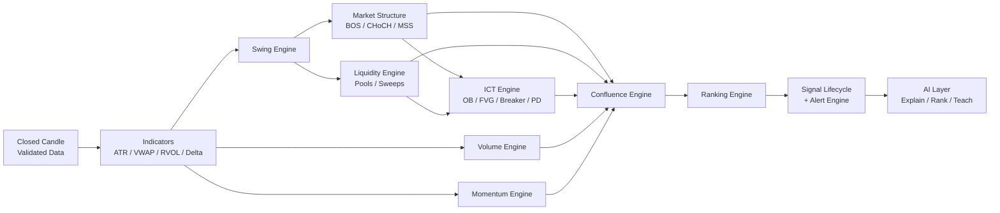
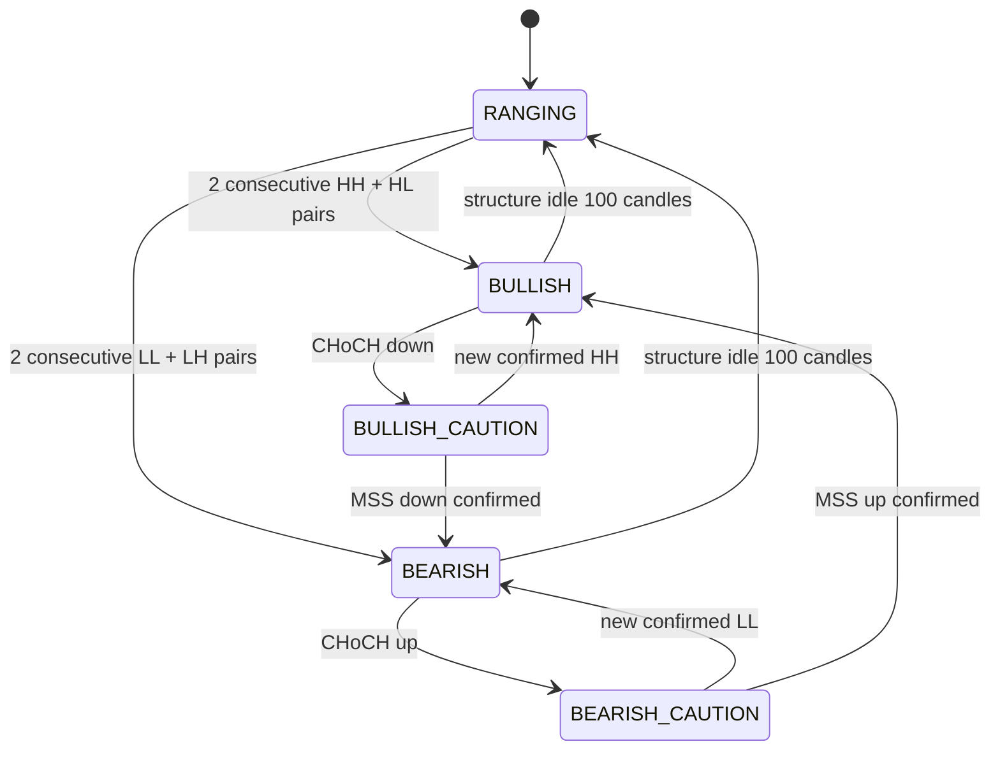
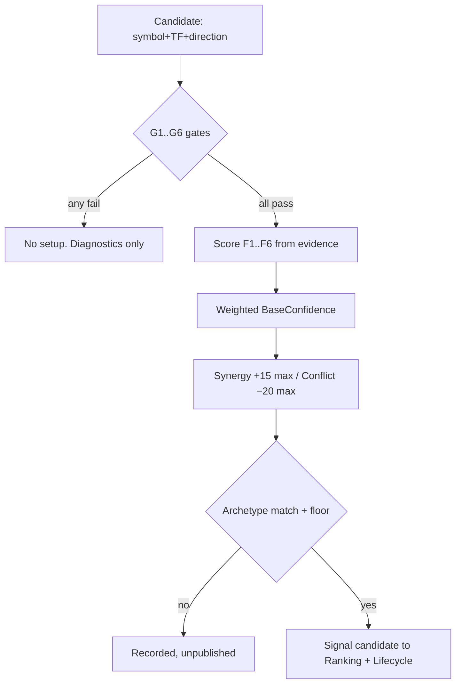
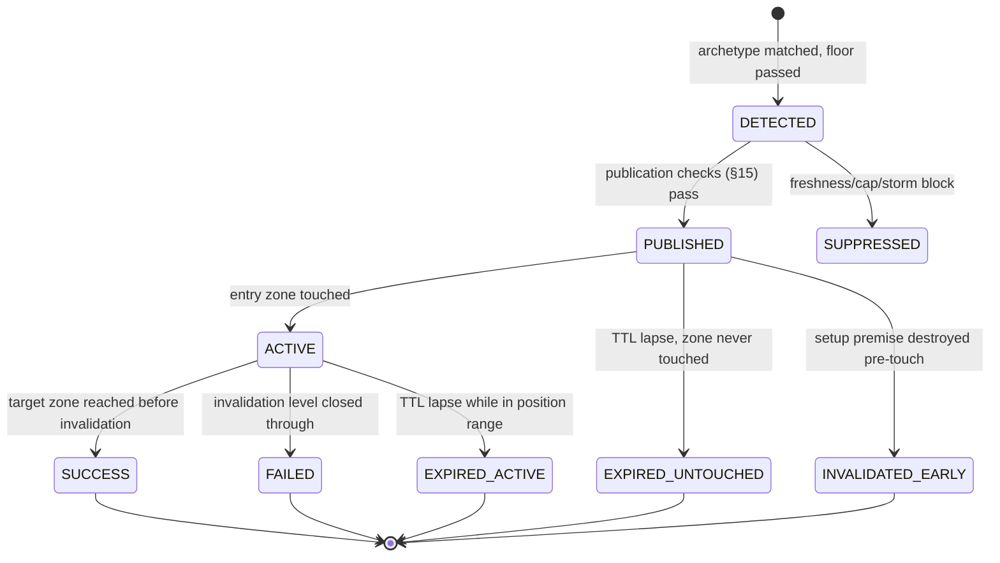

# SCANNER LOGIC SPECIFICATION (SLS)

## Institutional AI Crypto Scanner — Official Detection Doctrine

**Document Status:** Authoritative specification for all detection, scoring, ranking, alerting, and AI-interpretation logic
**Authority:** Subordinate only to `PROJECT_CONSTITUTION.md` v1.0.0; supreme over all implementation decisions concerning trading logic
**Version:** 1.0.6
**Ratified:** 2026-07-12 · **Last amended:** 2026-08-28 (see Amendment History)
**Amendment Rule:** Any change to detection logic requires a versioned revision of this document, per Constitution §30.8 and §42.7

> Every algorithm, detector, AI prompt, ranking formula, alert rule, and dashboard element in this platform implements THIS document. If the code and this document disagree, the code is wrong. No engineer may resolve an ambiguity by guessing: ambiguities are resolved by amending this specification.

---

## 0. Foundations, Notation, and Global Conventions

All subsequent sections depend on the definitions in this section. They are binding everywhere.

### 0.1 Candle Notation

| Symbol | Meaning |
|---|---|
| `C[i]` | Candle at index `i` on the active timeframe. `C[0]` = currently forming candle. `C[1]` = most recently **closed** candle. Indices increase into the past. |
| `O[i], H[i], L[i], Cl[i], V[i]` | Open, High, Low, Close, base-asset Volume of `C[i]` |
| `body[i]` | `abs(Cl[i] − O[i])` |
| `range[i]` | `H[i] − L[i]` |
| `upper_wick[i]` | `H[i] − max(O[i], Cl[i])` |
| `lower_wick[i]` | `min(O[i], Cl[i]) − L[i]` |
| `bullish[i]` | `Cl[i] > O[i]` ; `bearish[i]` ≡ `Cl[i] < O[i]` ; `doji[i]` ≡ `Cl[i] = O[i]` |
| `mean_body_20[i]` | Arithmetic mean of `body[i+1 .. i+20]` (the 20 closed candles preceding `i`) |
| `ATR[i]` | Wilder ATR(14) as of candle `i` (defined in §2.9) |

### 0.2 The Closed-Candle Law (Non-Repainting Guarantee)

1. **All detection logic evaluates closed candles only.** `C[0]` (the forming candle) is invisible to every detector. No exceptions in v1.
2. A detection, once confirmed and emitted, is **immutable**: it may change *state* (e.g., a zone becomes mitigated) but may never be deleted, moved, or retro-classified.
3. Any detector that in a future version operates intrabar must be explicitly labeled `intrabar: true` in its spec and its outputs visually and programmatically distinguished. No such detector exists in v1.
4. Determinism requirement: identical candle history + identical parameter set ⇒ byte-identical detector output. This is verified by automated determinism tests (Constitution §32.5).

### 0.3 Timeframes

| Code | Interval | Role |
|---|---|---|
| M5 | 5 min | Execution-refinement TF (Tier 1 symbols only) |
| M15 | 15 min | Lowest general scanning TF |
| H1 | 1 hour | Core intraday structure TF |
| H4 | 4 hours | Primary institutional structure TF (**default signal TF**) |
| D1 | 1 day | Bias and dealing-range TF |
| W1 | 1 week | Macro bias TF (context only, no signals) |

- Canonical ingestion granularity is the 1-minute candle; all higher TFs are deterministically aggregated from 1m (§2.1). Candle identity = UTC open time.
- **HTF bias chain:** W1 → D1 → H4 → H1 → M15 → M5. Each TF's directional context is supplied by the TF above it (§3.7, §8).

### 0.4 Global Parameters

- Every threshold in this document is a named parameter with the notation `P.<domain>.<name>`; defaults are consolidated in **Appendix A**.
- Parameters are configuration, versioned as `param_set_version`. Every emitted detection records the `algo_version` + `param_set_version` that produced it (Constitution §14.5).
- **Normalization doctrine:** all price-distance thresholds are expressed in ATR multiples, never fixed percentages. *Rationale (compared alternatives):* fixed-percent thresholds systematically over-trigger on high-volatility assets and under-trigger on majors; ATR normalization makes one rule set behave consistently across BTC and a mid-cap meme coin. Fixed-percent is retained only as a floor/ceiling guard where noted.
- **Tolerance unit:** `ε = P.global.tolerance_atr × ATR` (default `0.05 × ATR(14)`) — used wherever two prices are compared for "equality."
- **Recorded precision of derived measurements.** Every *derived* quantity written to evidence, an event payload, or any user-facing surface — ATR multiples, ratios, percentages, scores — is quantised to `P.global.derived_dp = 4` decimal places (`ROUND_HALF_EVEN`) at the moment of recording. **Comparisons, thresholds and state transitions always use unquantised values**; quantisation is a presentation rule, never a decision rule, so it cannot change a verdict.
  *Rationale (compared alternatives):* full-context Decimal division yields 28 significant digits, so a sweep depth is recorded as `0.9854242054724053640232107909`. That is false precision — ATR is itself an estimate — and it defeats the platform's core promise that a trader can audit the evidence, since nobody can read it. (a) Recording raw was rejected on those grounds. (b) Rounding *inputs* before comparison was rejected because it would move thresholds and therefore change detections. (c) Quantising at the recording boundary only — **chosen**: evidence becomes legible, every decision is unaffected, and golden labels stay derivable by hand from the specification.
  **Prices are not derived quantities** and are never quantised by this rule; they retain their storage scale (`numeric(38,18)`, DDD §18).

### 0.5 Detection Pipeline (Logical Order)

Detectors run in strict dependency order per symbol per TF at each candle close:

The Swing Engine (§3.1) is the **single shared implementation** consumed by structure, liquidity, and ICT detectors (Constitution §30.3). Parallel swing logic anywhere is a constitutional violation.

### 0.6 Detector Specification Template

Every detector in Sections 3–7 is specified with: **Purpose · Inputs · Detection Logic · Validation Rules · Invalidation Rules · Edge Cases · Performance Considerations · Future Improvements.** An implementation that satisfies fewer than all eight is incomplete.

---

## 1. Market Universe

### 1.1 Exchanges

- **v1 source of truth: Binance Spot.** Deepest global liquidity, most reliable streaming interface, broadest pair coverage — detection quality depends on data quality first.
- **v1.5 data expansion: Binance USDT-M Perpetual Futures** as an *additional data source* (funding, OI, liquidations, perp volume) attached to the same logical symbol. Futures data enriches context; it does not create a separate scanned universe until explicitly enabled.
- All exchange access is adapter-isolated (Constitution §7.7); adding an exchange is a configuration + adapter event, never a doctrine change. Cross-exchange aggregation is a future module and is **prohibited from silently blending prices** — each symbol's canonical price series comes from exactly one venue.

### 1.2 Spot vs. Futures Roles

| Concern | Spot | Futures (when enabled) |
|---|---|---|
| Canonical OHLCV for structure detection | ✅ Yes | ❌ Never (perp prices embed funding distortion) |
| Volume analysis | Primary | Additive context |
| Funding / OI / liquidation context | — | Primary |
| Signal universe | Yes | Only as explicit separate universe, future phase |

*Compared alternatives:* running detection on perp candles (higher volume, more symbols) vs. spot candles. **Spot chosen** — perp price series contain funding-driven basis artifacts and liquidation wicks that corrupt structural analysis; institutional narrative reads the spot market as the truth anchor and derivatives as positioning context.

### 1.3 Trading Pairs

1. **Quote asset: USDT only in v1** (`P.universe.quote_assets = [USDT]`). One quote currency makes RVOL, ranking, and liquidity thresholds directly comparable across the entire universe. BTC-quoted and ETH-quoted pairs are excluded: they express cross-rates already captured by the two USDT legs and would double-count signals.
2. A **symbol** = base asset + quote asset + venue. The base asset carries metadata: category tags (L1, DeFi, meme, AI, etc.), market cap, FDV.
3. Exclusion list (hard, evaluated before liquidity tiers): stablecoin bases (§1.6), leveraged tokens (§1.7), fiat-pegged assets, wrapped duplicates of an already-included base (e.g., WBTC when BTC is present), symbols flagged `DELISTING` (§1.5).

### 1.4 Minimum Liquidity — Eligibility Tiers

Liquidity metrics are computed daily at 00:00 UTC over the trailing 7 days (medians, not means — robust to single-day wash spikes).

| Tier | 7d median daily quote volume | 7d median top-of-book spread | 7d median depth within ±2% | Scanned TFs | Alert-eligible |
|---|---|---|---|---|---|
| **T1** | ≥ $100M | ≤ 2 bps | ≥ $1.0M | M5–W1 | All priorities |
| **T2** | ≥ $20M | ≤ 5 bps | ≥ $250k | M15–W1 | All priorities |
| **T3** | ≥ $5M | ≤ 10 bps | ≥ $100k | H1–W1 | Medium/Low only |
| **Ineligible** | below T3 on any column | — | — | Not scanned | None |

- **Hysteresis (anti-flapping):** promotion to a higher tier requires meeting that tier's thresholds for 7 consecutive daily evaluations; demotion occurs after 3 consecutive failures. A symbol never changes tier intraday.
- All three columns must pass; volume alone is insufficient (volume is the most manipulable metric — §6.6).
- Tier changes are logged events; active signals survive a demotion but new signals obey the new tier immediately.

### 1.5 Delisting Rules

1. On exchange delisting announcement: symbol state → `DELISTING` at the next universe evaluation (or immediately upon announcement ingestion when available). No new detections, no new signals, no alerts.
2. Active signals transition to `EXPIRED` with reason `delisting` (outcome excluded from signal-quality statistics — the market ended, the logic didn't fail).
3. Historical data and historical signals are retained permanently (Constitution §45.5).
4. If trading halts without announcement (feed shows no trades for `P.universe.halt_minutes = 60` on a T1/T2 symbol), symbol → `SUSPENDED_DATA` pending investigation; treated as degraded data, not as delisting.

### 1.6 Stablecoins

- Stablecoin **base** assets are excluded from the scanned universe (structure analysis of a peg is meaningless; any depeg event is a risk event, not a setup).
- Detection is dual: curated list (USDC, DAI, FDUSD, TUSD, …) **plus** automatic classifier — 30-day close-price standard deviation vs. 1.00 USD < 1% ⇒ flagged stable, quarantined for manual confirmation. Auto-classification alone never removes a symbol; it flags.
- Future improvement: a dedicated depeg monitor as a risk-alert module (outside signal doctrine).

### 1.7 Leveraged Tokens

Excluded permanently: bases matching exchange leveraged-token naming (`*UP`, `*DOWN`, `*BULL`, `*BEAR`, `*3L`, `*3S`, etc.) **and** exchange metadata flag where available. These instruments decay structurally (daily rebalancing); market-structure doctrine does not apply to them. This exclusion is not configurable.

### 1.8 Meme Coins

- **Included** when they satisfy tier criteria — liquidity discipline, not category prejudice, governs eligibility. Institutional flows demonstrably trade large meme assets.
- Tagged `category: meme` (curated metadata). Consequences: (a) enhanced fake-volume scrutiny weight in §6.6; (b) AI explanations must state the category and its risk profile; (c) optional user filter.
- ATR normalization (§0.4) automatically adapts all thresholds to their volatility; no special detection rules exist for memes. *Compared alternative:* separate meme parameter sets — rejected as parameter drift risk (Constitution §30.8); one doctrine, volatility-normalized, wins.

### 1.9 New Listings

| Capability | Warm-up requirement per TF |
|---|---|
| Volume / RVOL analytics | ≥ 100 closed candles on that TF |
| Momentum analytics | ≥ 100 closed candles |
| Structure / Liquidity / ICT detection | ≥ 300 closed candles on that TF **and** ≥ 14 calendar days since listing |
| Alert eligibility | All of the above + tier qualification (§1.4) |

*Rationale:* swing structure, ATR baselines, and RVOL medians are statistically undefined on short histories; listing-day price action is dominated by allocation flows and is untradeable by structural doctrine. The 14-day floor also filters listing-pump manipulation. New listings appear in the dashboard as `WARMUP` (visible, honest, not scored).

---

## 2. Market Data

Every data type below specifies: source, computation, freshness contract, validation, and missing-data behavior. Data integrity outranks every feature (Constitution §27.1).

### 2.1 OHLCV

- **Source:** exchange candle stream per TF + 1m base stream. **Canonical rule:** higher-TF candles are *verified against* (and on discrepancy, rebuilt from) 1m aggregation: `O = first O`, `H = max H`, `L = min L`, `Cl = last Cl`, `V = Σ V`, bucketed by UTC open time.
- A candle is **closed** when a candle with a later open time arrives on the same TF *or* exchange close-flag is received; detectors fire only on closed candles (§0.2).
- History requirement: ≥ 1,000 closed candles per active TF held hot for detection (`P.data.hot_window = 1000`).

### 2.2 Trades (Aggregated)

- Aggregated trade stream per symbol: price, quantity, timestamp, **taker side**. Primary uses: volume delta (§2.14), per-trade size statistics (§6.6), candle verification.
- Raw individual ticks are **not** retained beyond aggregation in v1 (cost/benefit: aggTrades preserve taker side and size distribution, which is all current doctrine consumes). Re-evaluated when footprint/CVD-profile modules arrive.

### 2.3 Tick Data

- Defined as sub-aggregation granularity. **Not a v1 dependency.** Any future detector requiring true tick data must declare it and pass a cost review. Nothing in Sections 3–8 depends on ticks — this is deliberate, keeping the doctrine reproducible from candles + aggTrades.

### 2.4 Order Book

- Snapshots every 10 seconds: best bid/ask + cumulative depth at ±0.5%, ±1%, ±2% bands.
- Uses: liquidity tiering (§1.4), spread/depth validation of volume (§6.7), future heatmap module.
- Order-book data **never gates detection** in v1 (books are spoofable; candles + trades are the deterministic record). It contextualizes and validates.
- Daily metrics use medians of snapshots (spoof-resistant).

### 2.5 Funding Rate (Futures Phase)

- Per funding interval + predicted rate, from perp feed. Role: **context factor** — extreme funding (`|rate|` above the 90th percentile of its own trailing 30-day distribution) is recorded as a market-condition tag on signals (crowded positioning raises sweep probability). Never a detection gate in v1.

### 2.6 Open Interest (Futures Phase)

- Sampled every 5 minutes. Derived: OI change % over 1h/4h/24h, OI-vs-price divergence tags (price up + OI down = short covering, etc. — the four-quadrant classification, each quadrant deterministically defined by sign pairs). Context factor and future AI-explanation input.

### 2.7 Liquidations (Futures Phase)

- Liquidation event stream, aggregated per candle: long-liq notional, short-liq notional. A **liquidation cascade** = candle where liq notional > `P.data.liq_cascade_mult = 5` × trailing 20-candle median. Cascades tag candles as forced-flow; used by AI explanation and future whale/flow modules; also corroborates sweep classification (§4.6).

### 2.8 Volume, VWAP

- Canonical volume = base-asset volume; quote volume stored for liquidity metrics. Taker-buy volume stored per candle.
- **VWAP:** session VWAP anchored daily 00:00 UTC (crypto's institutional accounting boundary) and weekly VWAP anchored Monday 00:00 UTC. Formula: `Σ(typical_price × V) / Σ(V)` from anchor, `typical_price = (H+L+Cl)/3`. Uses: momentum context, AI explanation, dashboard. Rolling VWAP rejected for v1 — anchored VWAP has an institutional interpretation (session cost basis); rolling VWAP is a smoothed average with none.

### 2.9 ATR

- Wilder ATR, period 14: `TR = max(H−L, |H−Cl_prev|, |L−Cl_prev|)`; `ATR = (ATR_prev × 13 + TR) / 14`, seeded with SMA of first 14 TR values. Computed per TF. This is the platform's universal volatility unit (§0.4).

### 2.10 Market Cap & FDV

- External metadata provider, refreshed daily; values carry `as_of` timestamps. Used for classification (size buckets: mega ≥ $50B, large ≥ $10B, mid ≥ $1B, small ≥ $100M, micro < $100M), AI context, and user filters — **never** for detection. FDV/MC ratio > `P.data.fdv_ratio_flag = 3` tags "high unlock overhang" (AI risk narrative input).

### 2.11 Relative Volume (RVOL)

- **Intraday TFs (M5, M15, H1):** `RVOL[i] = V[i] / median(V of same time-of-day slot over prior 20 days)`. Time-of-day adjusted because crypto volume has strong intraday seasonality (Asia/EU/US session waves); a flat rolling baseline systematically misfires at session opens.
- **H4, D1, W1:** `RVOL[i] = V[i] / median(V[i+1..i+20])` (rolling 20-candle median; seasonality is negligible at these horizons).
- *Compared alternatives:* mean-based baselines (distorted by single spikes — rejected), time-of-day for all TFs (unnecessary complexity on HTF — rejected). Median + seasonality-aware split is the institutional-grade choice.

### 2.12 Data Freshness

| Feed | Fresh | Stale (label degraded) | Dead (suspend detection) |
|---|---|---|---|
| Candle/trade stream lag | ≤ 2 s | > 5 s | > 30 s |
| Candle close → available to detectors | ≤ 1 s | > 3 s | > 15 s |
| Order book snapshot age | ≤ 30 s | > 60 s | > 5 min |
| Metadata (MC/FDV) age | ≤ 36 h | > 48 h | n/a (context only) |

Freshness state is attached to every downstream output; a signal computed from any non-fresh feed is barred from publication (§15.3).

### 2.13 Data Validation

Every incoming candle passes, in order: (1) `H ≥ max(O, Cl)`, `L ≤ min(O, Cl)`, `H ≥ L`, `V ≥ 0`; (2) timestamp = expected next open time (else gap protocol §2.15); (3) duplicate open-time ⇒ keep exchange-final version, log; (4) sanity: `|Cl − Cl_prev| / Cl_prev > 40%` in one candle on a T1/T2 symbol ⇒ quarantine candle, cross-verify against aggTrade prints before release to detectors; (5) 1m-aggregation cross-check on each higher-TF close (mismatch beyond rounding ⇒ rebuild from 1m, log discrepancy). Failed candles never reach detectors.

### 2.14 Volume Delta

- Per candle: `delta[i] = taker_buy_V[i] − taker_sell_V[i]`; normalized `delta_pct[i] = delta[i] / V[i]` ∈ [−1, +1]. Cumulative delta maintained per session (daily anchor). Uses: displacement corroboration (§5.10), institutional-volume scoring (§6.6), divergence tags.

### 2.15 Missing Data Handling

1. Gap detected (missed candle(s)) ⇒ immediate REST backfill attempt, up to 3 retries with backoff.
2. Backfilled span is re-validated (§2.13) and affected TFs recompute derived state deterministically from the corrected series.
3. Unfillable gap ⇒ symbol-TF → `DEGRADED`: detection suspended on that TF, existing zones/structures frozen (state preserved, flagged `stale_context`), dashboard labels the symbol honestly.
4. Recovery: continuous verified data for `P.data.recovery_candles = 20` closed candles ⇒ `DEGRADED` lifts; structure older than the gap remains flagged until a new confirmed external swing forms post-gap (structure must re-prove itself across a data hole).
5. Gaps are never interpolated. Interpolated prices are fabricated evidence — constitutionally prohibited (§45.3).

---

## 3. Market Structure Engine

The structural skeleton of all doctrine. One shared swing implementation feeds everything downstream.

### 3.1 Detector: Swing High / Swing Low

**Purpose.** Identify the pivot points from which all structure, liquidity, and zone logic derives. This is the platform's single source of structural truth.

**Inputs.** Closed candle series per TF; parameters `k` (fractal strength), `ε` (equality tolerance, §0.4).

**Detection Logic.**
- **Swing High of strength `k`:** candle `s` where `H[s] > H[s+j]` for all `j ∈ [1..k]` (the `k` candles before it) **and** `H[s] > H[s−j]` for all `j ∈ [1..k]` (the `k` candles after it), using strict inequality.
- **Swing Low:** mirror definition on lows.
- **Confirmation timing:** a swing at candle `s` is confirmed exactly at the close of the `k`-th subsequent candle. Confirmation is dated to that close — the swing *point* is at `s`, but no downstream logic may consume it earlier (non-repainting: the swing never existed for the engine before its confirmation moment).
- **Two strength classes, same algorithm:**
  - Internal swings: `k_int = P.structure.k_internal = 2` (5-candle fractal)
  - External swings: `k_ext = P.structure.k_external = 5` (11-candle fractal)
  - Every external swing is by construction also an internal swing; it is stored once with `strength = external`.
- **Equal-extreme rule (ties):** if the strict inequality fails only because one or more candles within the window have highs within `ε` of `H[s]`, no strict swing is confirmed yet; the scan continues. The **last** candle of the equal set that is subsequently followed by `k` strictly lower highs becomes the confirmed swing point, and *all* members of the equal set are emitted to the Liquidity Engine as an equal-high cluster (§4.3). This keeps swing identity unique and deterministic while preserving the liquidity information carried by the tie.

*Compared alternatives.* (a) `k=1` (3-candle fractal) for internal — rejected: crypto wick noise generates swing spam that degrades every downstream detector. (b) ZigZag %-reversal swings — rejected: percentage thresholds repaint until reversal completes and violate ATR-normalization doctrine. (c) `k=2/5` fractal — **chosen**: fully deterministic, fixed confirmation delay, testable candle-by-candle.

**Validation Rules.** Swing must have `k` closed candles on both sides within continuous (non-gap) data; swings may not be confirmed across a `DEGRADED` span (§2.15.4). Consecutive same-type swings are permitted (two swing highs with no intervening swing low) and are resolved by structure pairing (§3.3).

**Invalidation Rules.** Swings are historical facts and are never invalidated or deleted. Their *structural relevance* ends when they are consumed by a break (§3.5) or aged out of the hot window.

**Edge Cases.** (1) A candle qualifying as both swing high and swing low (wide outside bar): both are emitted; pairing logic (§3.3) orders them by which extreme was made first — determined by comparing the candle's open-to-close direction: bearish candle ⇒ high first, bullish ⇒ low first, doji ⇒ high first by convention (logged as convention-resolved). (2) Doji at the pivot: allowed; swing identity is about extremes, not bodies. (3) Flat market where no `k`-strength swings form for > 200 candles: structure state → `STRUCTURE_IDLE` (honest absence, no forced swings).

**Performance Considerations.** O(1) incremental evaluation per candle close using a rolling window; no full-history rescans.

**Future Improvements.** Adaptive `k` per volatility regime — only via spec amendment with golden-dataset re-validation.

### 3.2 Internal vs. External Structure

- **External structure** = the sequence of confirmed external swings (`k_ext`). It defines trend, dealing ranges (§5.7), and BOS/MSS levels. It answers: *what is the market doing?*
- **Internal structure** = the sequence of confirmed internal swings between two external swings. It defines CHoCH warnings, internal liquidity (§4.7), and entry-refinement structure. It answers: *what is the market doing inside the current leg?*
- Rule of authority: internal events may never override external state; they may only *warn* (CAUTION flag, §3.6) or *refine* (entry logic).

### 3.3 HH / HL / LH / LL Classification

**Purpose.** Label each confirmed swing relative to the previous confirmed swing of the same type (per strength class).

**Detection Logic.** At confirmation of swing high `s_new` with previous swing high `s_prev`: `HH` if `H[s_new] > H[s_prev] + ε`; `LH` if `H[s_new] < H[s_prev] − ε`; `EQH` if within `ε` (also forwarded to Liquidity Engine). Mirror for lows (`HL` / `LL` / `EQL`). Consecutive same-type swings: each is classified against its immediate same-type predecessor; pairing for trend evaluation always uses the **most recent confirmed** high and low.

**Validation / Invalidation.** Labels are immutable once assigned (facts). **Edge Cases.** The first swing of each kind in a series has no same-kind predecessor and is assigned the label `SEED`, which is **emitted as a classification event like any other label** — it is a recorded fact that a reference point was established, not a silent omission. `SEED` asserts no direction and is excluded from every directional set: it never participates in trend evaluation (§3.4), CHoCH/MSS failure-swing tests (§3.6), or any pairing rule. After a `DEGRADED` gap, the first post-gap swing of each kind is likewise `SEED` (no cross-gap comparisons — §2.15.4).

### 3.4 Trend State Machine

**Purpose.** Maintain one authoritative directional state per symbol per TF from external structure only.

**States and transitions:**

- `BULLISH` requires two consecutive completed bullish pairs (HH followed by HL, twice) on external structure; mirror for `BEARISH`. One pair is insufficient — single-pair "trends" in crypto are statistically indistinguishable from range rotation.
- `RANGING` additionally applies when price has closed inside the current external dealing range without external BOS for `P.structure.idle_candles = 100` closed candles.
- **Trend Shift** is exclusively the `MSS` transition (§3.6). CHoCH alone never flips trend.

### 3.5 Detector: Break of Structure (BOS)

**Purpose.** Confirm trend continuation: the market absorbing an external level in the direction of the prevailing trend.

**Inputs.** Trend state; most recent unconsumed confirmed external swing high/low; closed candles; `ε`.

**Detection Logic.**
- Bullish BOS: trend ∈ {BULLISH, BULLISH_CAUTION} **and** a candle **closes** above the most recent confirmed external swing high: `Cl[i] > H[swing] + ε`. Mirror for bearish BOS below the external swing low.
- The break candle is the first closing candle beyond the level. The broken swing is marked `consumed_by: BOS#id` (a swing is broken at most once).
- A **wick-only** penetration (`H[i] > H[swing]` but `Cl[i] ≤ H[swing] + ε`) is **not** BOS — it is routed to the Liquidity Engine as a sweep candidate (§4.6). This single rule is the doctrine's principal false-breakout filter.

*Compared alternatives.* Wick-break BOS (fastest, worst false-positive rate — rejected); single-close BOS (**chosen**: deterministic, timely, filters pure stop-hunts); two-consecutive-close BOS (available as strict mode `P.structure.bos_strict = false` by default — slower by one full candle, materially late on H4/D1).

**Validation Rules.** Level must be a confirmed external swing not previously consumed; data continuity across break; trend-direction agreement. BOS quality grade recorded: `displaced` (break candle or the candle before it satisfies §5.10 displacement) vs `plain` — grade affects scoring (§8), not validity.

**Invalidation Rules.** BOS is a fact once confirmed. A **failed break** is recorded (fact, not deletion) if within `P.structure.failed_break_candles = 3` closed candles price closes back beyond the broken level in the opposite direction; downstream consumers (confluence, lifecycle) treat `failed: true` as strong contrary evidence.

**Edge Cases.** (1) One candle closes beyond both an external high and low (extreme outside bar): resolve by close direction — bullish close ⇒ bullish BOS only; the opposite penetration becomes a sweep candidate. (2) Break of a level within `ε`: not a break (tolerance is absolute). (3) Gapped breaks (open beyond level): valid if close confirms; the gap itself is evidence of displacement.

**Performance.** O(1) per close: compare against at most two tracked levels per direction. **Future.** Break-volume percentile as a quality dimension.

### 3.6 Detectors: Change of Character (CHoCH) & Market Structure Shift (MSS)

**Purpose.** CHoCH = the earliest structural warning that the prevailing trend is losing control. MSS = the confirmed reversal event that flips the trend state. Separating them is the doctrine's protection against reversal-chasing.

**Inputs.** Trend state; last confirmed internal + external swings; displacement detector (§5.10); liquidity sweep records (§4.6).

**Detection Logic — CHoCH.**
- In BULLISH: first candle **close** below the most recent confirmed swing low that initiated the current up-leg (the latest confirmed HL; internal HL qualifies if no external HL exists in the current leg). `Cl[i] < L[swing] − ε`.
- Mirror in BEARISH. Effect: trend state → `*_CAUTION`. CHoCH consumes its swing (marked `consumed_by: CHOCH#id`).

**Detection Logic — MSS.** MSS confirms when **all** of the following hold:
1. A CHoCH exists (as above), and its break leg satisfies **displacement** (§5.10) on the break candle or either adjacent closed candle;
2. The broken structure follows either (a) a **liquidity sweep** of external liquidity (§4.6) within the preceding `P.structure.mss_sweep_lookback = 10` closed candles, or (b) a **failure swing** (in BULLISH: the most recent external swing high attempt was a LH);
3. **Follow-through:** after the CHoCH close, a subsequent candle closes beyond the CHoCH break candle's extreme in the break direction within `P.structure.mss_followthrough = 5` closed candles.

On MSS confirmation: trend flips; the MSS origin range becomes prime zone territory for the ICT engine (§5). If follow-through fails within the window, the CHoCH remains a recorded warning, the trend returns from CAUTION to its prior state, and the MSS candidate is recorded `failed: true` (fact, never deleted).

*Compared alternatives.* (a) CHoCH-equals-reversal (LuxAlgo-style) — rejected: one internal break flips bias far too often in crypto chop. (b) MSS as CHoCH+displacement only — rejected: still fires mid-range. (c) Three-condition MSS (**chosen**): sweep/failure-swing origin + displacement + follow-through is the institutional sequence (engineer liquidity → displace → confirm), and every leg of it is independently testable.

**Validation Rules.** All contributing events must reference confirmed, unconsumed swings; every MSS stores its full evidence chain (sweep id / failure-swing id, displacement measurements, follow-through candle) — an MSS without a complete chain is unpublishable.

**Invalidation Rules.** Post-MSS, if price closes back beyond the pre-MSS extreme (the swept low/high) within `P.structure.mss_invalid_candles = 10`, the new trend is demoted to RANGING and the MSS marked `low_quality: true` (fact preserved; scoring consequences in §8/§9).

**Edge Cases.** (1) CHoCH and BOS conditions on the same candle (violent V-reversal): CHoCH evaluates against the *pre-candle* trend state; state transitions apply in event order swing→BOS→CHoCH within one close, and the resulting state is deterministic. (2) Multiple candidate HLs (nested legs): CHoCH always references the **most recent confirmed** HL at evaluation time. (3) MSS across a data gap: prohibited — evidence chain may not span `DEGRADED` data.

**Performance.** All checks are O(1) per close against tracked state. **Future.** MSS quality percentile from historical outcome base rates per symbol class.

### 3.7 Multi-Timeframe Structure Rules

1. Each TF computes structure independently — no TF borrows another's swings.
2. **HTF bias** for TF `t` = trend state of the next TF above (§0.3). Signals aligned with HTF bias receive alignment credit; counter-HTF signals are only publishable as `Liquidity Sweep Reversal` archetypes at HTF extremes (§8.6) — reversals are permitted precisely where the HTF itself is at a decision point.
3. Structure evaluation order on simultaneous closes (e.g., 00:00 UTC closes M5–D1 together): highest TF first, so lower-TF evaluation reads updated HTF state within the same cycle. Deterministic, single ordering rule.

### 3.8 Structure Confirmation & Invalidation Summary

| Event | Confirmed by | Invalidated / failure recorded by |
|---|---|---|
| Swing | `k` closed candles beyond pivot | Never (fact) |
| HH/HL/LH/LL | At swing confirmation | Never (fact) |
| BOS | Close beyond external swing ± ε | Failed-break: opposite close ≤ 3 candles |
| CHoCH | Close beyond trigger swing ± ε | Superseded by new HH/LL (state returns) |
| MSS | CHoCH + sweep/failure-swing + displacement + follow-through ≤ 5 | Close beyond pre-MSS extreme ≤ 10 candles ⇒ low_quality |
| Trend | 2 consecutive structural pairs | MSS (flip) or 100-candle idle (RANGING) |

---

## 4. Liquidity Engine

Doctrine premise: price is drawn toward resting liquidity and reacts after consuming it. The Liquidity Engine maintains the map of where stops and orders rest, and records when they are taken.

### 4.1 Buy-Side & Sell-Side Liquidity (BSL / SSL)

- **BSL** rests **above** price: buy-stops of shorts + breakout buy orders — concentrated above swing highs, equal highs, and range highs.
- **SSL** rests **below** price: sell-stops of longs + breakdown sell orders — below swing lows, equal lows, range lows.
- Every confirmed external swing high automatically registers a BSL **level**; every external swing low an SSL level. Internal swings register *internal* liquidity levels (lower weight, §4.7).

### 4.2 Detector: Liquidity Pools

**Purpose.** Aggregate individual liquidity levels into ranked pools — the targets institutional flow trades toward.

**Inputs.** Confirmed swings (with strength class), equal-extreme clusters (§3.1), dealing ranges (§5.7), candle series, `ε`.

**Detection Logic.** A pool is created for: (a) each unconsumed external swing extreme; (b) each equal-extreme cluster (§4.3) — cluster pools rank above single-swing pools; (c) each dealing-range extreme (range high = BSL pool, range low = SSL pool). Pool price = exact extreme (clusters: the extreme of the member candles; the cluster band `[min, max]` of member extremes is retained for sweep tolerance).

**Pool strength score (0–100, deterministic):** `strength = 25×min(touches,3)/3 + 25×tf_weight + 25×age_factor + 25×cluster_factor`, where `touches` = number of separate approaches that reversed within `ε` without breaching; `tf_weight` = TF rank / max rank (W1 = 1.0); `age_factor = min(age_candles, 200)/200`; `cluster_factor` = 1 for ≥ 3-member cluster, 0.5 for 2-member, 0.25 for single swing. Every component is recomputable from stored evidence.

**Validation Rules.** Pool must reference confirmed, unconsumed source swings; pools are directional (BSL pools only relevant while price is below them, and vice versa).

**Invalidation Rules.** Pool state machine: `ACTIVE → SWEPT` (§4.6) or `ACTIVE → BROKEN` (BOS consumes it — the level was absorbed, not swept) or `ACTIVE → EXPIRED` (age > `P.liquidity.pool_max_age = 500` candles). Terminal states are permanent; no resurrection.

**Edge Cases.** Overlapping pools within `ε` merge into one pool with combined evidence (dedup rule: one price zone = one pool per side per TF). Pools never span `DEGRADED` gaps.

**Performance.** Pool set per symbol-TF bounded (`P.liquidity.max_pools = 40`, evict lowest-strength expired first). **Future.** Order-book confirmation of pool density (v2, once spoof-filtering is validated).

### 4.3 Detectors: Equal Highs (EQH) / Equal Lows (EQL)

**Purpose.** Equal extremes are engineered liquidity — the market rarely respects the same level twice by accident; twin highs advertise a stop cluster.

**Inputs.** Swing extremes; `ε = 0.05 × ATR`; separation bounds.

**Detection Logic.** Two or more swing highs (any strength) where each pair differs by ≤ `ε`, separated by ≥ `P.liquidity.eq_min_gap = 3` and ≤ `P.liquidity.eq_max_gap = 100` candles, with an intervening swing low between consecutive members ≥ `P.liquidity.eq_min_depth = 0.5 × ATR` below the cluster band (a true retest, not one sideways shelf). Cluster confirmed when its second member swing confirms; later qualifying members join incrementally (join events are appends, never rewrites). Mirror for EQL.

**Validation.** All members individually confirmed swings; cluster band width ≤ `ε`. **Invalidation.** Cluster pool follows §4.2 states; a member being *swept* transitions the whole cluster pool to `SWEPT` (one sweep takes the cluster's stops).

**Edge Cases.** (1) Three near-equal highs where outer pair differs > `ε` but adjacent pairs pass: chain rule — membership is pairwise-adjacent, band = full min/max of members (band may exceed ε across the chain; sweep tolerance uses band edges). (2) Stablecoin-like flat shelves are pre-excluded by the min-depth rule.

**Performance.** Incremental cluster maintenance on each swing confirmation. **Future.** Rounded-number confluence (psychological levels) as a strength bonus.

### 4.4 Internal vs. External Liquidity

- **External liquidity:** pools at/beyond the current external dealing range extremes (§5.7). Consuming it is a *range-resolving* event — eligible to seed MSS (§3.6) and Sweep-Reversal archetypes.
- **Internal liquidity:** pools and inefficiencies (FVGs, §5.4) *inside* the dealing range. Consumed during normal leg rotation; used for target-setting (§15) and entry refinement — never as reversal evidence on its own.
- Classification is recomputed when the dealing range updates (a new confirmed external swing re-brackets the range); reclassification events are logged.

### 4.5 Resting Liquidity

Definition: the *current* unconsumed pool map — all `ACTIVE` pools, both sides, ranked by strength × proximity. Exposed to: target selection (nearest opposing external pool = default target zone, §15.6), AI narrative ("price has $X-strength BSL 2.1×ATR overhead"), and the dashboard liquidity map. Deterministic snapshot at every candle close.

### 4.6 Detector: Liquidity Sweep

**Purpose.** Identify the institutional signature event: price *takes* resting stops beyond a level and returns — the fuel-collection move that precedes displacement. The single most important precursor in the doctrine.

**Inputs.** Active pools (§4.2); closed candles; displacement detector; `ε`.

**Detection Logic (per closed candle, per adjacent pool).** For a BSL pool at price `Pl` (band-aware for clusters):
1. **Penetration:** `H[i] > Pl + ε` — the wick trades through the pool;
2. **Rejection close:** `Cl[i] < Pl` — the candle closes back below the level. If instead `Cl[i] > Pl + ε`, the event is routed to BOS evaluation (§3.5): close-through = absorption/break, not sweep;
3. **Sweep confirmation window:** if `Cl[i] < Pl` ⇒ sweep confirms **immediately at that close** (single-candle sweep). If the penetration candle closes marginally above (`Pl < Cl[i] ≤ Pl + ε`), a **two-candle sweep** confirms if `Cl[i+1] < Pl` on the very next close; otherwise the pool is `BROKEN`.
4. Classification: `sweep_depth = (H[i] − Pl) / ATR` (recorded); `sweep_class = external | internal` (per §4.4); `displaced_after` = displacement in the reversal direction within `P.liquidity.sweep_disp_window = 3` closed candles (recorded; feeds Stop Hunt §4.7 and MSS §3.6).
   Mirror all rules for SSL pools.

*Compared alternatives.* Requiring intrabar reversal % (repaint-prone — rejected); requiring displacement for sweep validity (conflates two facts — rejected: sweep and follow-through are recorded separately so the confluence engine can weigh them independently). **Chosen:** penetration + rejection close, with follow-through as a separate recorded dimension.

**Validation Rules.** Pool must be `ACTIVE` and on the correct side of price; penetration must exceed `ε` (sub-tolerance ticks are noise, not sweeps); evidence stored: pool id, penetration depth, close-back price, window used (1 or 2 candles).

**Invalidation Rules.** A confirmed sweep is a fact. **Sweep expiry for setup purposes:** a sweep's *setup relevance* expires `P.liquidity.sweep_expiry = 15` closed candles after confirmation — beyond that window it may no longer seed MSS or Sweep-Reversal archetypes (stale sweeps explain nothing about current flow). If price closes back beyond the swept level within the expiry window, the sweep is marked `reclaimed: true` — strong evidence the sweep was actually absorption; consumers must treat reclaimed sweeps as contrary evidence.

**Edge Cases.** (1) One candle sweeps both BSL above and SSL below (violent outside bar): both sweeps record; the close direction determines which can seed a reversal narrative (close in lower half ⇒ BSL sweep dominant). (2) Sequential sweeps of stacked pools in one candle: all penetrated-and-rejected pools transition `SWEPT`, deepest penetration is the reference sweep. (3) Sweep of a cluster band: penetration measured against band max (BSL) / band min (SSL). (4) Gap-open beyond a pool that closes back inside: valid sweep, `gap_sweep: true` tag.

**Performance.** Only pools within `P.liquidity.sweep_scan_range = 3 × ATR` of the candle extreme are evaluated per close. **Future.** Liquidation-cascade corroboration (§2.7) as a sweep-quality tag when futures data lands.

### 4.7 Detector: Stop Hunt

**Purpose.** The named, tradeable compound event: sweep + immediate violent reversal — institutional stop-run followed by the real move.

**Inputs.** Confirmed sweeps (§4.6); displacement (§5.10); structure state.

**Detection Logic.** Stop Hunt confirms when, for a confirmed **external** sweep: a displacement candle (§5.10) in the reversal direction closes within `P.liquidity.stophunt_window = 3` closed candles of sweep confirmation, **and** that displacement leg closes back through at least 50% of the **penetration candle's** total range. Records: sweep id, displacement id, elapsed candles.
**Which candle is measured (two-candle sweeps).** The reference is always the candle that *penetrated* the pool, never the candle that confirmed the rejection. For a single-candle sweep (§4.6) these are the same candle, so one rule covers both windows. For a two-candle sweep the penetration candle sits one index before `confirmed_index`. *Rationale:* the stop-run is the penetration — that is the move that took the resting orders, and §4.6 already treats that candle as authoritative by recording `penetration_price` from it. The confirmation candle merely records the market declining to accept the level. Measuring against the confirmation candle would also make the 50% threshold easier to clear precisely where the evidence is weakest, since it is the narrower range.

**Validation.** Underlying sweep not `reclaimed`; displacement direction opposes sweep penetration direction. **Invalidation.** If within `P.liquidity.stophunt_invalid = 5` closed candles price closes beyond the sweep extreme, the stop hunt is marked `failed: true` (fact, preserved, penalized in scoring).

**Edge Cases.** Multiple sweeps in the window: the stop hunt binds to the deepest external sweep. Internal sweeps never produce stop hunts (definitional — internal liquidity consumption is rotation, not reversal evidence).

**Performance.** Event-driven; evaluated only on sweep confirmation and the following 3 closes. **Future.** Session-context weighting (hunts during low-liquidity hours have different base rates) — requires session-statistics module.

### 4.8 Liquidity Validation & Invalidation Summary

| Object | Created | Terminal states |
|---|---|---|
| Pool | Swing confirmation / cluster confirmation / range extreme | SWEPT · BROKEN · EXPIRED |
| EQH/EQL cluster | 2nd member confirmation | (pool states) |
| Sweep | Penetration + rejection close (≤ 2 candles) | Fact; setup-relevance expires after 15 candles; `reclaimed` flag |
| Stop Hunt | Sweep + displacement ≤ 3 candles + 50% range reclaim | Fact; `failed` flag ≤ 5 candles |

---

## 5. ICT Engine

Zones and context: where institutional orders were placed, where inefficiency remains, and where price sits inside its dealing range. All zone detectors consume the shared Swing Engine and the displacement primitive (§5.10).

### 5.1 Detector: Order Blocks (OB)

**Purpose.** Locate the origin candle of an institutional displacement — the footprint of accumulated orders likely to be defended on return.

**Inputs.** Closed candles; displacement detector; BOS/MSS events; FVG detector; ATR.

**Detection Logic (bullish OB; bearish is the mirror).**
1. **Candidate:** the last bearish-bodied candle (or contiguous run of ≤ `P.ict.ob_max_run = 3` bearish candles, zone = their combined extremes) immediately preceding an upward move;
2. **Qualifying move — within `P.ict.ob_window = 5` closed candles after the candidate, BOTH:** (a) a displacement candle (§5.10) occurs, and (b) the move produces a structural consequence: closes above a confirmed swing high (internal or external) **or** creates a confirmed bullish FVG (§5.4);
3. **Zone geometry:** proximal edge = candidate high; distal edge = candidate low (**full-range zone**). Sub-zone recorded: body-only edges, exposed as `refined_zone` for LTF entry logic.
4. **Grade:** `OB_A` if the qualifying move broke *external* structure or the candidate sits at the origin of an MSS; `OB_B` if internal break or FVG-only qualification. Grade is evidence-derived and immutable.

*Compared alternatives (zone geometry).* Body-only zones (tighter, misses wick-origin fills), 50%-of-candle zones (arbitrary midpoint), full-range (**chosen default**) with body sub-zone recorded — captures the complete order footprint while still offering the refined edge; both edges are testable facts rather than a single compromise.

**Validation Rules.** OB confirms only when its qualifying move's structural consequence is itself confirmed (closed-candle law end-to-end); zone height must be ≥ `0.15 × ATR` (sub-noise candles cannot be institutional footprints) and ≤ `3 × ATR` (beyond that it is a range, not a block).

**Invalidation Rules.** State machine: `FRESH → TESTED` (price trades into zone and leaves without close-through) → `MITIGATED` (price has filled ≥ 50% of zone depth — measured to `refined` midpoint — and reversed) → `INVALIDATED` (any candle **closes** beyond the distal edge) → `EXPIRED` (age > `P.ict.ob_max_age = 250` closed candles without a test). INVALIDATED OBs become Breaker candidates (§5.2). All transitions are close-confirmed and logged.

**Edge Cases.** (1) Candidate is a doji: permitted if zone height passes the floor (order blocks are about position, not body color purity — but the run rule uses *bodied* candles, doji joins the run silently). (2) Displacement with no prior opposing candle (V-continuation): no OB — the doctrine requires an origin footprint. (3) Overlapping OBs (nested displacements): both exist independently; the confluence engine deduplicates by awarding zone-confluence once per price band. (4) OB formed pre-gap: flagged `stale_context` per §2.15.

**Performance.** Candidate tracking is O(1) per close; zone set bounded at `P.ict.max_zones = 60` per symbol-TF (evict oldest EXPIRED first). **Future.** Volume-profile validation of the candidate candle (requires footprint data).

### 5.2 Detector: Breaker Blocks

**Purpose.** A failed OB whose polarity flips — the strongest reversal zone in the doctrine because it embeds trapped positions *plus* a structural break.

**Inputs.** INVALIDATED OBs; sweeps; structure events.

**Detection Logic (bullish breaker; mirror for bearish).** A *bearish* OB transitions to bullish Breaker when: (1) the OB is INVALIDATED by an upward close through its distal edge; (2) that invalidating move satisfies displacement **and** breaks structure (internal BOS minimum); (3) qualifying precondition: the bearish OB's own down-move had swept a liquidity pool (`sweep-origin breaker`, grade `BRK_A`) or was preceded by a failure swing (`BRK_B`). Zone geometry inherited from the OB; polarity flipped; state machine restarts at `FRESH`.

**Validation.** The invalidating break must be confirmed before breaker registration (no simultaneous-candle promotion). **Invalidation.** Same state machine as OB; a breaker invalidated in turn is terminal (no second polarity flip — re-flipping zones is curve-fitting, not doctrine).

**Edge Cases.** OB invalidated by a gap-through: breaker still valid (`gap_break: true`), displacement test applied to the gap candle. Breaker whose zone overlaps an active opposing FVG: both recorded; confluence engine resolves precedence via grade.

**Performance.** Pure state-transition logic; no scanning. **Future.** Outcome-tracked breaker base rates per grade for scoring calibration.

### 5.3 Detector: Mitigation Blocks

**Purpose.** The breaker's weaker sibling: an OB invalidated after a *failure swing* (no liquidity sweep at origin). Still a polarity-flip zone, graded below breakers.

**Detection Logic.** Identical to §5.2 with precondition inverted: origin move swept **no** pool and the pre-invalidation structure shows a failure swing (LH before upward invalidation / HL before downward). Grade fixed `MIT`. All state, validation, invalidation, and edge-case rules identical to breakers.

**Doctrine note:** breaker vs. mitigation is distinguished *only* by origin-sweep evidence — one deterministic bit, stored on the OB at creation. No judgment calls.

### 5.4 Detector: Fair Value Gaps (FVG)

**Purpose.** Three-candle inefficiency — one-sided delivery the market tends to revisit. Primary entry-zone and internal-target primitive.

**Inputs.** Closed candles; ATR; displacement detector.

**Detection Logic (bullish; mirror bearish).** For consecutive closed candles `c1, c2, c3` (oldest first): gap exists when `L[c3] > H[c1] + ε_gap` where `ε_gap = 0` (any true gap) but **registration filter:** gap height `(L[c3] − H[c1]) ≥ P.ict.fvg_min = 0.25 × ATR` **or** `c2` satisfies displacement. Zone = `[H[c1], L[c3]]`; **Consequent Encroachment (CE)** = zone midpoint, stored. Confirms at close of `c3`.

**Validation Rules.** All three candles closed, continuous, non-degraded. Sub-filter gaps are not stored at all (noise economy — storing everything and filtering later bloats state and invites parameter abuse downstream).

**Invalidation Rules / State.** `OPEN → TOUCHED` (price entered zone) → `CE_FILLED` (traded through midpoint) → `FILLED` (traded through distal edge intrabar; zone spent as support/resistance) → `INVERTED` (a candle **closes** beyond the distal edge ⇒ becomes IFVG candidate §5.5). Age expiry: `P.ict.fvg_max_age = 200` candles. Wick-fill vs close-through distinction is the critical rule: wick-through = FILLED (inefficiency rebalanced), close-through = INVERTED (polarity event).

**Edge Cases.** (1) `c2` does not overlap the gap fully (rare with wicks): irrelevant — definition uses `c1`/`c3` extremes only. (2) Nested FVGs in one displacement leg: all register; confluence dedups per band. (3) Weekend/maintenance gaps: crypto trades continuously; any exchange-maintenance gap candle is handled by §2.15, never registered as FVG across missing data.

**Performance.** O(1) sliding three-candle check per close. **Future.** Volume-weighted FVG significance (delta of `c2`).

### 5.5 Detector: Inverse FVG (IFVG)

**Purpose.** An FVG closed-through flips role: failed inefficiency becomes the opposing side's shelf — bullish FVG inverted becomes resistance, and vice versa.

**Detection Logic.** On FVG → `INVERTED` transition, register IFVG with same band, flipped polarity, state `UNPROVEN`. **Activation validation:** IFVG becomes scoreable only after its first successful retest — price returns to the band and a candle closes rejecting it (close on the far side of the band in the flip direction, rejection wick ≥ `0.3 × ATR` into the band); that retest transitions it `UNPROVEN → FRESH`. Until then it is `UNPROVEN` (recorded, not scored).

**Invalidation.** Close back through the IFVG against flip polarity ⇒ `DEAD` (terminal — a twice-failed zone carries no doctrine meaning). Age: inherits remaining FVG age budget.

**Edge Cases.** FVG inverted by a single giant candle that also creates a new opposing FVG: both objects exist; the confluence engine's band-dedup prevents double counting.

**Performance / Future.** Trivial state logic / outcome base-rate tracking per activation quality.

### 5.6 Detector: Balanced Price Range (BPR)

**Purpose.** Overlap of a bullish and bearish FVG from opposing displacements — a violently contested band that acts as a strong reaction zone.

**Detection Logic.** When a bullish FVG and bearish FVG (both age ≤ `P.ict.bpr_pair_age = 30` candles, both created within the same dealing range) have band intersection ≥ 50% of the smaller band: register BPR = intersection band, polarity = direction of the **later** FVG, state `FRESH`. **Validation.** Both parents must still be `OPEN`/`TOUCHED` at registration. **Invalidation.** Close through the far edge against polarity ⇒ `DEAD`; parents' state changes do not retro-modify the BPR (it is its own object once born). **Edge cases.** Multiple overlaps: keep the maximal-intersection pair per band (dedup). **Performance.** Pair-check only on new FVG registration. **Future.** BPR as backtest-verified reversal-quality feature.

### 5.7 Premium / Discount / Equilibrium (PD Arrays Context)

**Purpose.** Locate price within its dealing range — the doctrine's *where* filter: institutional buying happens at discount, selling at premium.

**Detection Logic.**
- **Dealing range:** most recent confirmed external swing low ↔ external swing high that bracket current price (re-anchored whenever a new external swing confirms or a range extreme is consumed by BOS/sweep-with-MSS). Both anchors are confirmed-swing facts.
- **Equilibrium (EQ)** = 50% of the range. **Premium** = price > EQ + `ε`; **Discount** = price < EQ − `ε`; **At-EQ** otherwise. Zone context is computed per closed candle: `range_position = (Cl − range_low) / (range_high − range_low)` ∈ [0,1], stored to 4 decimals.
- **Directional gate (used by §8):** long-side setups require `range_position ≤ 0.5`; short-side require `≥ 0.5`. Sweep-Reversal archetypes additionally require the extreme third (`≤ 0.33` / `≥ 0.67`).

**Validation.** Range height ≥ `1.5 × ATR` (narrower brackets are noise ranges; PD context suspends — recorded as `PD_SUSPENDED`, and PD-gated archetypes are unavailable). **Invalidation.** Re-anchoring replaces the range prospectively; historical `range_position` values are never recomputed (facts). **Edge cases.** Price exactly at a re-anchor moment mid-evaluation: PD context always uses the range as of the evaluated candle's close, single ordering rule (§3.7.3).

### 5.8 Detector: Optimal Trade Entry (OTE)

**Purpose.** The institutional retracement pocket: 62–79% pullback of an impulse leg, in trend direction, inside correct PD context.

**Detection Logic.** After a confirmed BOS/MSS with displacement, define the impulse leg from origin swing to the post-break extreme (leg finalizes when a confirmed internal swing forms at that extreme — the leg-end is then a fact). OTE band = retracement `0.62 → 0.79` of the leg (bullish: measured down from leg high). Registered as a zone object, state `FRESH`, valid only while: trend unchanged, leg-end swing unconsumed, and PD gate (§5.7) satisfied at touch time.

**Validation.** Leg length ≥ `P.ict.ote_min_leg = 2 × ATR` (retracements of noise legs are noise). **Invalidation.** Close beyond 100% retracement (leg origin) ⇒ `DEAD`; trend flip ⇒ `DEAD`; age > `P.ict.ote_max_age = 100` candles ⇒ `EXPIRED`. **Edge cases.** Overlap with OB/FVG inside the band is the *expected* A+ configuration — recorded as zone-stack evidence, §8.6. **Performance.** One live OTE per direction per TF (newest leg replaces prospectively). **Future.** Fib-level sub-grading (70.5% sweet spot) after outcome data.

### 5.9 Rejection, Mitigation, Confirmation (Zone Interaction Grammar)

Uniform interaction rules for **all** zone objects (OB, Breaker, Mitigation, FVG, IFVG, BPR, OTE):

| Event | Deterministic definition |
|---|---|
| **Touch** | Candle range intersects zone band |
| **Rejection** | Touch + close outside zone on polarity side + rejection wick ≥ `0.3 × ATR` into zone |
| **Mitigation** | Price reaches ≥ 50% of zone depth then closes outside on polarity side |
| **Respect** | Rejection or Mitigation without any close-through |
| **Violation** | Close beyond distal edge (state-machine invalidation per zone type) |
| **Confirmation (entry-grade)** | Respect event + LTF structural agreement: on the TF one step below, a confirmed internal BOS in polarity direction within 5 LTF-equivalent candles of the touch |

The grammar is defined once, tested once, applied everywhere — zone types differ only in creation and grading, never in interaction mechanics.

### 5.10 Primitive: Displacement

**Purpose.** The doctrine's energy test — distinguishing institutional initiative from drift. Consumed by BOS grading, MSS, sweeps, OBs, FVGs.

**Detection Logic.** Candle `i` is a displacement candle iff **all**: (1) `body[i] ≥ P.ict.disp_body_mult = 2.0 × mean_body_20[i]`; (2) `range[i] ≥ P.ict.disp_range_mult = 1.5 × ATR[i]`; (3) close-position: `Cl[i]` within the extreme `P.ict.disp_close_pct = 25%` of `range[i]` in the move direction; (4) direction = body sign. Recorded with measured multiples (evidence, not just a boolean).

**Validation.** `mean_body_20` requires 20 closed candles (else displacement undefined — warm-up rule §1.9 guarantees this). **Invalidation.** None — a displacement candle is a permanent measurement. **Edge cases.** Doji cannot displace (body = 0 fails condition 1). Post-gap first candle: `mean_body_20` must not span the gap (else undefined, no displacement evaluable until 20 post-gap candles). **Performance.** O(1) with rolling mean. **Future.** Delta-corroborated displacement (`delta_pct` alignment ≥ 0.3) as a quality tag — recorded from v1, gating deferred until outcome data justifies it.

---

## 6. Volume Engine

Volume is confirmation evidence, never a standalone signal — and in crypto it is the most manipulable data dimension, so this engine is built defensively.

### 6.1 Detector: Relative Volume (RVOL) Classification

**Purpose.** Normalize participation so "high volume" means the same thing on BTC and a mid-cap.
**Inputs.** RVOL per §2.11.
**Detection Logic.** Per closed candle: `NORMAL` (RVOL < 1.5) · `ELEVATED` (1.5–3.0) · `SPIKE` (3.0–5.0) · `ABNORMAL` (≥ 5.0). Class boundaries are `P.volume.rvol_bands`.
**Validation.** Baseline requires full lookback (§1.9); baseline windows never span DEGRADED gaps.
**Invalidation.** Classes are per-candle measurements — permanent facts.
**Edge Cases.** Session-boundary candles on intraday TFs use time-of-day baselines (§2.11) precisely to avoid false spikes at session opens; candle with V = 0 (halt): routed to §1.5.4, not classified.
**Performance.** Rolling medians, O(1) amortized. **Future.** Exchange-event calendar exclusions (airdrops/listings distort baselines).

### 6.2 Detector: Volume Spike

**Purpose.** Flag candles where participation demands attention; corroborates displacement and sweeps.
**Detection Logic.** `SPIKE` or `ABNORMAL` class (§6.1) **and** quote-volume ≥ `P.volume.spike_floor = $250k` on the candle (absolute floor prevents micro-cap "spikes" of $8k from scoring). Direction tag = candle body sign; conviction tag = `|delta_pct| ≥ 0.25`.
**Validation.** Passing candle must also pass §2.13 sanity checks. **Invalidation.** None (measurement). **Edge Cases.** Spike on a doji (high volume, no progress) is tagged `absorption_candidate` — meaningful to AI narrative and future absorption logic, but scores as neutral, not bullish/bearish. **Performance.** O(1). **Future.** Absorption detector as first-class module.

### 6.3 Detectors: Volume Expansion / Contraction

**Purpose.** Regime context: expanding participation validates moves; contracting participation warns of exhaustion and precedes breakouts.
**Detection Logic.** **Expansion:** 3 consecutive closed candles with rising volume (`V[i] > V[i+1] > V[i+2]`) and mean RVOL of the 3 ≥ 1.2 **while** price makes net directional progress (|Cl[i] − O[i+2]| ≥ 0.75 × ATR). **Contraction:** 5-candle mean RVOL ≤ 0.6 **and** 5-candle mean range ≤ 0.6 × ATR (both dimensions must contract — volume-only lulls during grinding trends are not contraction). States are per-candle context flags.
**Validation/Invalidation.** Context flags recompute each close; no persistence beyond evidence recording. **Edge Cases.** Expansion in *opposing* direction to an active setup is contrary evidence (consumed as a penalty in §8.5, never silently ignored). **Performance.** O(1). **Future.** Volatility-regime segmentation of thresholds.

### 6.4 Abnormal Volume

`ABNORMAL` class (≥ 5× baseline) triggers mandatory cross-validation before it may contribute positive score: (1) trade-count on candle ≥ 3× its 20-candle median (many participants, not one wash loop); (2) order-book depth (nearest snapshot) not anomalously thin (depth ≥ 50% of its 7-day median). Failing either ⇒ tag `suspect_volume`, volume factor contribution capped at neutral (50), symbol fake-volume counter incremented (§6.6).

### 6.5 Detector: Institutional Volume Signature

**Purpose.** Approximate "smart" participation from public data — size-skewed, direction-consistent flow at structurally meaningful moments.
**Inputs.** aggTrades per-trade size distribution; delta; displacement/sweep/BOS events.
**Detection Logic.** Candle earns `institutional_volume: true` when **all**: (1) RVOL ≥ 1.5; (2) 90th-percentile trade size on the candle ≥ 2× its trailing 20-candle median of the same percentile (size skew: big prints present); (3) `|delta_pct| ≥ 0.30` (one-sided intent); (4) coincides with a structural event candle (displacement, sweep, BOS/CHoCH break, or zone Respect per §5.9) — institutional volume *at random locations* is not evidence in this doctrine.
**Validation.** aggTrade data fresh; not tagged `suspect_volume`. **Invalidation.** None (measurement). **Edge Cases.** Iceberg-style execution (many small prints, strong delta): passes (1)+(3)+(4) but fails (2) ⇒ tagged `stealth_flow` — scored midway between retail and institutional (the size test is sufficient, not necessary, for smart flow; the tag preserves the distinction honestly). **Performance.** Percentile via per-candle streaming aggregation. **Future.** CVD divergence library.

### 6.6 Detector: Fake Volume Defense

**Purpose.** Protect ranking integrity from wash trading and painted tape — a first-class institutional requirement for crypto.
**Detection Logic (symbol-level, daily).** Fake-volume score 0–100 from four tests, 25 points each: (1) volume/depth ratio > 97.5th percentile of universe (volume unsupported by book); (2) round-trip symmetry — daily |cum delta| / total volume < 0.02 with elevated RVOL (perfectly two-sided tape); (3) trade-size uniformity — coefficient of variation of trade sizes < 0.2 (algorithmic wash signature); (4) `suspect_volume` candle count (§6.4) > 5 in 24h. Score ≥ 50 ⇒ symbol tagged `wash_risk`; consequences: volume factor globally capped at 50 for the symbol, alert priority capped at Medium, AI explanations must disclose the tag, meme-category symbols get test thresholds tightened by 20% (§1.8).
**Validation/Invalidation.** Recomputed daily; tag lifts after 3 consecutive clean days (hysteresis, §1.4 pattern). **Edge Cases.** Legitimate high-frequency market-making can trip (3): the composite (need ≥ 2 tests) plus hysteresis protects against single-test false positives — no single test may tag a symbol. **Performance.** Daily batch over stored aggregates. **Future.** Cross-exchange volume-consistency test once multi-venue data exists.

### 6.7 Volume Ranking Output

The engine emits per symbol-TF-candle a **Volume Factor Score 0–100**: base 50; +15 spike aligned with setup direction; +15 `institutional_volume`; +10 expansion regime aligned; +5 `stealth_flow`; −15 contraction against an active-move claim; −20 opposing-direction spike; capped [0,100]; hard cap 50 if `wash_risk` or `suspect_volume` involved. Every adjustment stores its evidence id — the score is an auditable sum, not a number.

---

## 7. Momentum Engine

Momentum answers *when*: is energy building, releasing, or fading. All measures are ATR-normalized for cross-symbol comparability.

### 7.1 Detector: Momentum Score

**Purpose.** One auditable 0–100 energy reading per symbol-TF-candle.
**Inputs.** Closed candles; ATR; RVOL; structure events.
**Detection Logic.** Four sub-components, each 0–25, summed:
- **Directional ROC (0–25):** `roc_n = (Cl[1] − Cl[n+1]) / (ATR × √n)` for n = 10; mapped: |roc| ≥ 2.5 → 25, linear below. Sign sets momentum direction.
- **Close consistency (0–25):** count of last 10 closed candles closing in the dominant direction; 8+ → 25, linear from 5.
- **Body dominance (0–25):** mean(body/range) of last 10 candles in dominant direction vs. counter candles; ratio ≥ 2 → 25.
- **Participation (0–25):** mean RVOL of dominant-direction candles ÷ mean RVOL of counter candles over the window; ≥ 1.5 → 25.
**Validation.** Requires 30-candle warm-up; undefined during DEGRADED. **Invalidation.** Per-candle measurement (fact). **Edge Cases.** Mixed window with no dominant direction (5/5 split, |roc| < 0.5): score forced ≤ 35 and direction `NEUTRAL` — the engine must not manufacture direction from noise. **Performance.** Rolling windows, O(1). **Future.** Component weights recalibration from outcome data (spec amendment path only).

### 7.2 Acceleration / Deceleration

`accel[i] = MomentumScore[i] − MomentumScore[i+3]` (3-candle differential). **Accelerating:** ≥ +10 with score ≥ 50. **Decelerating:** ≤ −10. Deceleration while price makes marginal new extremes (< 0.5 × ATR progress per candle) tags `exhaustion_watch` — a warning input to §8.5 penalties and prime context for Sweep-Reversal archetypes (tired trends get swept).

### 7.3 Expansion / Compression

- **Range expansion:** 3-candle mean range ≥ 1.4 × ATR — trend-phase confirmation.
- **Compression:** 7 consecutive candles each with range ≤ 0.7 × ATR **and** the 7-candle total high-low envelope ≤ 2 × ATR (NR7-style coil). Compression is the doctrine's *pre-breakout state*: compression adjacent to a liquidity pool is the classic engineered-breakout configuration, and the subsequent sweep-or-break resolution is exactly what Sections 3–4 detect. Compression state feeds §8 as opportunity context, never as a directional claim (coils are directionless until resolved).

### 7.4 Trend Strength

Composite 0–100 recorded per TF: structural quality (count of consecutive unbroken HH/HL or LL/LH pairs, 0–40) + momentum alignment (score direction agrees with trend state, 0–30) + pullback shallowness (mean retracement depth of last 3 legs vs. OTE band, 0–30). Published to ranking (§9 factor) and AI context. Purely derived — no new detection surface.

### 7.5 Impulse / Retracement Legs

**Purpose.** Segment price into institutional legs so targets, OTE, and trend strength read from the same skeleton.
**Detection Logic.** A leg begins/ends at confirmed internal swings. **Impulse leg:** contains ≥ 1 displacement candle and net progress ≥ 1.5 × ATR in trend direction. **Retracement leg:** counter-direction leg retracing ≤ 100% of the prior impulse with no counter-displacement. A counter-leg **with** displacement or > 100% retrace is neither — it escalates to structure evaluation (CHoCH territory, §3.6).
**Validation.** Legs finalize only when their terminal swing confirms (closed-candle law). **Invalidation.** None post-finalization. **Edge Cases.** Overlapping micro-legs in chop: legs below 0.75 × ATR net progress are `micro` and excluded from trend-strength and OTE anchoring. **Performance.** Event-driven on swing confirmations. **Future.** Leg-symmetry analytics (measured-move projection) for target refinement.

---

## 8. Confluence Engine

Where detections become a *setup*. The engine is a deterministic evidence-combination model: gates first, weighted evidence second, synergy and conflict adjustments third, archetype classification last. No step contains discretion.

### 8.1 Combination Model — Compared and Chosen

| Model | Verdict |
|---|---|
| Hard checklist (all conditions or nothing) | Rejected — brittle; misses graded quality; encourages threshold gaming |
| Pure weighted sum | Rejected — allows garbage-in-quantity to buy a high score with no structural spine |
| ML-learned combination | Prohibited in v1 by design principles (black-box detection path) |
| **Gates → weighted evidence → bounded adjustments → archetype floor** | **Chosen** — structural necessities are absolute (gates), quality is graded (weights), known institutional patterns are recognized (archetypes), and every point is traceable |

### 8.2 Stage 1 — Hard Gates (Binary, No Score Can Compensate)

A candidate setup on symbol S, timeframe T, direction D must pass **all**:

| # | Gate |
|---|---|
| G1 | Data: all feeds fresh (§2.12), symbol-TF not DEGRADED, warm-up complete (§1.9), tier permits T (§1.4) |
| G2 | Structure: trend state on T compatible with D (trend-following: state matches D; reversal: valid MSS or Sweep-Reversal conditions §8.6) |
| G3 | PD context: §5.7 directional gate satisfied (or PD_SUSPENDED ⇒ only continuation archetypes eligible) |
| G4 | Zone: ≥ 1 ACTIVE/FRESH zone object (OB/Breaker/FVG/OTE/BPR) of polarity D whose band contains or is adjacent (≤ 0.5 × ATR) to current price |
| G5 | No live contrary fact: no unexpired opposing sweep-reclaim (§4.6), no `failed` stop-hunt/BOS against D within its window, no opposing displacement in last 3 candles |
| G6 | Volume integrity: symbol not `wash_risk`-capped below the archetype's minimum volume requirement |

Failing any gate ⇒ no setup exists; nothing is scored, nothing is logged as a signal (gate failures are counted in diagnostics only).

### 8.3 Stage 2 — Evidence Factors (Each 0–100, Fully Attributed)

| Factor | Source | What earns points |
|---|---|---|
| F1 Structure | §3 | Confirmed BOS/MSS quality (displaced > plain; external > internal), trend state maturity, absence of failed breaks |
| F2 Liquidity | §4 | Sweep quality (external, deep, unclaimed, fresh), stop-hunt confirmation, target-side resting pool strength |
| F3 Zone (ICT) | §5 | Zone grade (BRK_A > OB_A > OB_B > FVG > MIT > IFVG), state freshness (FRESH > TESTED), zone-stack depth, entry-grade Confirmation (§5.9) |
| F4 Volume | §6.7 | Volume Factor Score as published |
| F5 Momentum | §7 | Score aligned with D, acceleration, absence of exhaustion_watch against D |
| F6 HTF Alignment | §3.7 | HTF trend state vs D: aligned=100 · HTF CAUTION toward D=70 · RANGING=50 · opposed=0 (opposed passes only inside Sweep-Reversal archetype, §8.6) |

Every factor's score is a sum of enumerated evidence contributions with stored event ids — reproducible from the evidence alone.

#### 8.3.1 Contribution Tables (added v1.0.5)

The table above states what earns points. These state how many. Each factor is
the sum of its components, clamped to [0,100]; every component stores the
evidence id of the fact that awarded it. Values are `P.confluence.factor_points`
and change only by amendment (Constitution §30.8).

**F1 Structure** — the break is the claim; the trend is the context it is made in.

| Component | Range | Award |
|---|---|---|
| Break quality | 0–45 | 15 for a confirmed break · **+18 displaced** · **+12 external** |
| MSS present | 0–10 | 10 when the break is an MSS rather than a plain BOS |
| Trend maturity | 0–30 | `min(pairs, 4) / 4 × 30` over consecutive unbroken HH/HL or LL/LH pairs (§7.4) |
| Clean break record | 0–15 | 15 with no failed break against D in 20 candles · 7 with one · 0 with two or more |

*Why these sizes.* Displacement outranks externality (18 vs 12) because §3.5's
close-break law already requires a real break — displacement is the evidence
that it was *intended*, while external/internal describes only which swing set
it crossed. MSS is worth less than either (10) despite being the stronger event:
§8.6 already routes MSS-dependent setups to A1, so paying it heavily here would
charge the same fact twice.

**F2 Liquidity** — sweep quality dominates because the sweep *is* the narrative.

| Component | Range | Award |
|---|---|---|
| Sweep quality | 0–60 | 20 for a confirmed sweep · **+16 external** · **+12 depth** (`min(depth_atr, 1.0) × 12`) · **+6 unclaimed** · **+6 fresh** (inside the §4.6 expiry) |
| Stop-hunt confirmed | 0–15 | 15 when §4.7's composite confirms |
| Target-side pool strength | 0–25 | `pool_strength / 100 × 25` (§4.2) |

*Why these sizes.* `reclaimed: true` costs the whole 6-point unclaimed award
rather than a fraction, because §4.6 calls a reclaimed sweep "contrary
evidence" — partial credit would let it still read as support. Stop-hunt sits
at 15, below sweep quality, because §4.7 is a composite *built on* the sweep;
weighting it higher would double-count the same penetration.

**F3 Zone** — location quality, ordered exactly as §8.3 orders it.

| Component | Range | Award |
|---|---|---|
| Zone grade | 0–50 | BRK_A 50 · OB_A 40 · OB_B 32 · FVG 25 · MIT 18 · IFVG 10 |
| State freshness | 0–25 | FRESH 25 · TESTED 15 · CE_FILLED 6 · anything further 0 |
| Stack depth | 0–15 | 2 overlapping zones 15 · 3 or more 15 (no further credit) |
| Entry-grade Confirmation | 0–10 | 10 when §5.9 records a Confirmation |

*Why these sizes.* The grade spread is wide (50 down to 10) because §8.3 gives
the ordering explicitly and it is the single strongest statement in the factor.
Stack depth stops paying after two zones: §8.5 already awards a zone-stack
synergy bonus, and an unbounded stack term would reward piling weak zones on
one another.

**F5 Momentum** — the most transient factor, so alignment carries it and the
rest are qualifiers.

| Component | Range | Award |
|---|---|---|
| Aligned momentum | 0–55 | `momentum_score × 0.55` when direction matches D · **0 when opposed or NEUTRAL** |
| Acceleration | 0–25 | accelerating 25 · neither 12 · decelerating 0 (§7.2) |
| No exhaustion against D | 0–20 | 20 when `exhaustion_watch` is absent · 0 when present |

*Why these sizes.* Opposed momentum scores zero on its largest component rather
than scaling down, because §7.1 already forces NEUTRAL where there is no
dominant direction — a momentum score pointing the other way is not weak
support, it is absence of support. `exhaustion_watch` is worth a flat 20
because §8.5 also penalises it: the two act on different stages, and §7.2 calls
it "prime context for Sweep-Reversal" — a tired trend is exactly where a
continuation setup should lose weight.

**Anchor check.** Scored against §8.7's own illustration:

| | Components | This table | §8.7 |
|---|---|---|---|
| F1 | displaced external BOS, no MSS, 3 pairs, clean: 45 + 0 + 22.5 + 15 | **82.5** | 85 |
| F2 | external sweep at 0.8 ATR, unclaimed, fresh, no stop hunt, pool 76: 57.6 + 0 + 19 | **76.6** | 80 |
| F3 | OB_A in an OTE stack, FRESH, with Confirmation: 40 + 25 + 15 + 10 | **90** | 90 |
| F5 | momentum 60 aligned, steady, unexhausted: 33 + 12 + 20 | **65** | 65 |

F3 and F5 reproduce the illustration exactly. F1 and F2 do not, and the two
residuals differ in kind:

* **F2 is 3.4 low, and closes.** §8.7 does not state its target-pool strength;
  at 90 rather than the 76 assumed above, F2 scores 80.1. The assumption is
  ordinary for the scenario, so the gap is an unstated input rather than a
  disagreement.
* **F1 is 2.5 low, and does not close.** §8.7 does not state its unbroken-pair
  count either, but no count reaches 85: three pairs give 82.5 and four give
  90. The illustration's figure sits between two adjacent states of this table
  and is unreachable by any input.

F1 is left as it stands. §8.7 is headed *Normative Illustration* — it fixes the
combination arithmetic, which §8.4 already reproduces exactly, not the factor
internals, which did not exist when it was written. Retuning the F1 components
to land on one illustrative number would be fitting four values to a datum the
section never claimed to derive, and would move the displaced-vs-external
spread that §8.3 does assert.

Recorded plainly because the first draft of this paragraph claimed F1 reached 85
at four pairs. It does not; the arithmetic was not run before the claim was
written. Both figures above are now asserted in
`tests/unit/domain/confluence/test_factor_points.py`.

### 8.4 Stage 3 — Weighted Base Confidence

`BaseConfidence = Σ (F_k × W_k)` with weights fixed by §9. Result ∈ [0,100].

### 8.5 Stage 4 — Bounded Adjustments

- **Synergy bonuses** (institutional sequences worth more than their parts): sweep→MSS→zone-retest chain intact: +8; displacement created both the qualifying BOS *and* the entry FVG: +5; zone-stack (OTE ∩ OB/FVG overlap): +5; compression resolved by the setup's displacement: +4. Max total +15.
- **Conflict penalties:** `exhaustion_watch` against D: −8; opposing internal liquidity within 1 × ATR before target: −5; setup TF at CAUTION state: −5; `stealth_flow`-only volume support: −3. Max total −20.
- `FinalConfidence = clamp(BaseConfidence + bonuses − penalties, 0, 100)`. All applied adjustments are itemized in the evidence record.

### 8.6 Stage 5 — Setup Archetypes

Every publishable setup must match exactly one archetype (classification is rule-ordered, first match wins):

| Archetype | Core required chain | Extra requirements | Confidence floor |
|---|---|---|---|
| **A1 Sweep Reversal** | External sweep → MSS → retest of MSS-origin zone | Range-extreme PD (≤0.33/≥0.67); stop-hunt confirmed | 75 |
| **A2 Breaker Retest** | Breaker formed → first retest with Respect (§5.9) | BRK_A grade or entry-grade Confirmation | 72 |
| **A3 Continuation Pullback** | Trend + displaced BOS → retrace into OTE/OB/FVG | HTF aligned; retracement leg (§7.5), not counter-displacement | 70 |
| **A4 FVG Continuation** | Displacement FVG → first touch in trend direction | HTF aligned; FVG age ≤ 30 candles | 70 |
| **A5 Range Liquidity Play** | RANGING state; sweep of range extreme → rejection | Target = opposing range extreme; range ≥ 2 × ATR | 74 |

Below-floor candidates are recorded internally (calibration data) but never published — the floor is the quality-over-quantity mechanism.

### 8.7 Worked Example (Normative Illustration)

H4 BULLISH; D1 BULLISH. External SSL sweep (depth 0.8 ATR) → MSS not needed (continuation case): displaced BOS up; price retraces into OTE ∩ OB_A stack at range_position 0.38. F1=85, F2=80, F3=90, F4=70, F5=65, F6=100 → Base = 85×.20 + 80×.15 + 90×.20 + 70×.15 + 65×.15 + 100×.15 = 17 + 12 + 18 + 10.5 + 9.75 + 15 = **82.25**. Synergy: zone-stack +5, sweep-chain +8 → 95.25; penalty: none. FinalConfidence **95** (floored int). Archetype A3 (floor 70) ⇒ publishable, Grade S (§9.4). Every number above traces to stored events; this example is the canonical unit-test fixture.

---

## 9. Ranking Engine

Converts per-setup confidence into a market-wide, comparable ordering, and grades what deserves the trader's attention first.

### 9.1 Factor Weights — Values and Justification

| Factor | Weight | Why this weight exists |
|---|---|---|
| F1 Market Structure | **20%** | Structure is the doctrine's context spine: every other factor is interpreted *through* it. It cannot dominate alone (a clean trend with no entry logic is not a setup), but nothing outranks it — a setup against structure is not a setup at all (enforced by gate G2, so the weight expresses *quality*, not permission). |
| F3 ICT Zone Quality | **20%** | The zone is the entry edge — it defines *where* risk is placed and why the location is defensible. Equal to structure because location quality and context quality are the two halves of the institutional entry thesis. |
| F2 Liquidity | **15%** | The narrative driver (what was engineered, what is targeted). Weighted below structure/zone because liquidity evidence is already partially embedded in MSS/breaker/stop-hunt construction — full weight would double-count the sweep chain (the synergy bonus §8.5 rewards the *intact chain* explicitly instead). |
| F4 Volume | **15%** | Participation confirms institutional presence — but crypto volume is the most manipulable factor (§6.6). Deliberately **below** the 20% a naive design would assign: the fake-volume defense caps corrupt inputs, and the reduced weight bounds the damage of what slips through. This is a defensive weighting decision, not a statement that volume matters little. |
| F5 Momentum | **15%** | Timing quality: energy alignment separates a zone that will be defended from one that will be sliced through. Kept moderate because momentum is the most transient factor — it decays within candles, and over-weighting it biases the scanner toward chasing. |
| F6 HTF Alignment | **15%** | Top-down doctrine made numeric. Material enough that counter-HTF continuation setups can rarely reach publication floors; bounded because the gate system (G2) and archetype rules already encode the hard constraint — the weight prices *degree* of alignment (aligned vs. caution vs. ranging). |
| **Total** | **100%** | Weights are `P.rank.weights`, versioned; any change requires spec amendment + full golden-dataset and outcome re-validation (Constitution §30.8). |

### 9.2 Cross-Symbol Ranking

Published signals rank by: (1) FinalConfidence (desc); (2) tie-break: archetype priority A1 > A2 > A5 > A3 > A4 (reversal-class setups are rarer and time-critical); (3) tie-break: higher TF; (4) tie-break: higher liquidity tier; (5) tie-break: symbol lexicographic; (6) final deterministic tie-break: direction lexicographic (`DOWN` before `UP`). No randomness anywhere. Key (6) exists because one symbol may carry a long and a short signal at the same close (§10.3 dedup is per direction); without it the chain is not a total order on published signals, which §9.2 requires of itself.

### 9.3 Score Decay

A published signal's *display rank* (not its recorded confidence) decays linearly to zero across its TTL (§12.5) — stale opportunities sink without their historical record changing. Decay is presentation-layer arithmetic: `display_rank = FinalConfidence × remaining_ttl / ttl`.

### 9.4 Grades

| Grade | FinalConfidence | Meaning |
|---|---|---|
| S | ≥ 90 | Full-chain institutional setup, all factors strong |
| A | 80–89 | Strong setup, minor factor weakness |
| B | 70–79 | Valid setup at publication floor |
| — | < 70 / below archetype floor | Never published |

---

## 10. Alert Engine

Alerts spend user attention — the scarcest resource in the system. The engine is designed to under-alert.

### 10.1 Priorities

| Priority | Criteria | Delivery |
|---|---|---|
| **High** | Grade S, archetype A1/A2/A5, TF ≥ H1, Tier 1–2 symbol | Immediate push (Telegram v1) |
| **Medium** | Grade A any archetype, or Grade S on M15/A3/A4, Tier 1–3 | Push, batchable ≤ 60 s |
| **Low** | Grade B | No push; dashboard feed + optional digest |

User filters may *narrow* eligibility (symbols, TFs, archetypes, categories) but never widen beyond these caps. `wash_risk` symbols cap at Medium (§6.6).

### 10.2 Noise Filtering

An alert requires a published signal (all §8 gates + archetype floor already passed) **plus:** symbol not in warm-up/DEGRADED/DELISTING; no data-freshness violation at dispatch moment; market-wide circuit breaker not active (if > `P.alert.storm_count = 40` signals publish within 5 minutes — a cascade event — only High priority dispatches until the storm window closes; storm events are logged and reported as market condition, not silently dropped).

### 10.3 Duplicate Suppression & Cooldowns

- **Duplicate key:** `(symbol, TF, direction, archetype, zone_band_rounded)`. A signal matching an ACTIVE signal's key is merged as a *refresh event* on the existing signal (evidence appended) — never a second alert.
- **Cooldowns (per key):** High: 1 alert / 4 × TF duration; Medium: 1 / 2 × TF duration; Low: dashboard only (no cooldown needed). A **state-change exception** bypasses cooldown once: transition to `INVALIDATED` or `TARGET_REACHED` on an alerted signal always notifies (closing the loop is not noise).
- **Per-user global ceiling:** `P.alert.user_daily_cap = 25` push alerts/day default (user-configurable downward only in v1); when the cap binds, lowest-priority pending alerts drop first, and the digest reports what was suppressed — honest suppression, never silent.

---

## 11. AI Engine

Boundary restated as law: **AI never detects. AI never overrides. AI interprets what the deterministic engines proved.** (Constitution §26.)

### 11.1 Permitted Functions

| Function | Contract |
|---|---|
| Explain | Natural-language explanation of a signal from its evidence record only |
| Rank (advisory) | Secondary ordering *within* equal deterministic grades; displayed as "AI preference," never altering §9.2 order |
| Summarize | Market/watchlist digests from published detections and market-condition tags |
| Compare | Side-by-side setup comparison from evidence records |
| Teach | Doctrine education: explain any SLS concept using the signal at hand as the worked example |
| Trade Thesis | Structured narrative: context → liquidity story → entry logic → what confirms/what kills it — every clause bound to evidence ids |
| Risk Analysis | Invalidation distance, R-multiple math, market-condition tags (funding extreme, wash_risk, exhaustion_watch), category risk profile |
| Entry Explanation | Why this zone, why this TF, what the entry-grade confirmation was (§5.9) |

### 11.2 Grounding Contract (Hard Requirements)

1. AI input = the signal's structured evidence record (events, measurements, versions) + SLS-defined vocabulary. AI receives no raw candles and no leave to "analyze the chart."
2. Every factual claim in AI output must cite an evidence id. A post-generation validator parses output claims against the evidence record; any unattributable market-fact claim ⇒ output rejected, regenerated once, then falls back to deterministic template text. Rejections are logged and reviewed.
3. Numeric claims (prices, distances, R-multiples) are computed deterministically and injected — the model formats, never calculates.
4. Prohibited outputs: predictions of certainty, position-size advice beyond the deterministic risk calculator's numbers, any statement contradicting a recorded detection, financial-advice language (Constitution §29.1).
5. Model + prompt versions stamp every output (Constitution §14.6). AI unavailability degrades to template explanations — publication never blocks on AI (Constitution §26.4).

---

## 12. Signal Lifecycle

One immutable state machine governs every signal.

### 12.1 Creation (DETECTED)

Instantiated by the Confluence Engine with the complete §15.2 payload. Id, timestamps, versions assigned. Immutable core: evidence, zones, levels never mutate post-creation (refresh events append).

### 12.2 Validation (DETECTED → PUBLISHED)

Publication checklist (§15.3) evaluated exactly once, atomically: payload completeness, data freshness at publish moment, dedup key check, tier/priority rules. Fail ⇒ `SUPPRESSED` with recorded reason (auditable funnel: candidates → published is a monitored ratio, §14).

### 12.3 Monitoring (PUBLISHED / ACTIVE)

Per closed candle on the signal's TF: entry-zone touch check (→ ACTIVE); invalidation check — a candle **close** beyond the invalidation level (wick-through alone records `stress_test: true` but does not fail the signal; consistent with zone grammar §5.9); target check — **touch** of target zone suffices (targets are liquidity pools; a wick into the pool is the pool being consumed — asymmetry with invalidation is deliberate and doctrine-consistent); premise checks — sweep reclaimed, MSS demoted, zone violated ⇒ `INVALIDATED_EARLY` (pre-touch only).

### 12.4 Success / Failure Accounting

`SUCCESS`: target touched before invalidation close. `FAILED`: invalidation close first. Both record: elapsed candles, max favorable excursion (MFE), max adverse excursion (MAE) in R units (R = |entry mid − invalidation|). Outcomes are immutable and feed §28-Constitution signal-quality metrics per algo version. Expired states are excluded from hit-rate but reported (a scanner that times out constantly has a target-selection problem — visible, not hidden).

### 12.5 Expiration (TTL)

| TF | TTL (closed candles) | Wall-clock |
|---|---|---|
| M5 | 24 | 2 h |
| M15 | 24 | 6 h |
| H1 | 24 | 24 h |
| H4 | 18 | 3 d |
| D1 | 15 | 15 d |

TTL = `P.lifecycle.ttl[TF]`. Rationale: a setup's evidence is a snapshot of flow; beyond ~20 bars the causal chain is archaeology. Display-rank decay (§9.3) runs across the same window.

The table is complete as written: W1 carries no row because §0.3 declares it *"context only, no signals"*, and a timeframe that cannot publish has nothing to expire. A W1 row here would imply the opposite.

---

## 13. Future Modules — SLS Interface Contracts

Each future module consumes SLS outputs under fixed constraints; none may alter detection doctrine.

| Module | Consumes | Constraints imposed now |
|---|---|---|
| **Heatmaps** | Resting-liquidity map (§4.5), pool strengths, zone bands, order-book depth | Visualizes recorded objects only; may never render inferred/interpolated liquidity as detected |
| **Whale Tracking** | aggTrade size percentiles (§6.5), future on-chain/flow feeds | Whale events are context tags entering §8.5 as bounded adjustments via spec amendment — never a new gate without amendment |
| **News Engine** | Market-condition tags; publishes `news_risk` windows per asset | May *suppress* alerts during defined event windows (risk hygiene); may never *create* signals |
| **Economic Calendar** | Scheduled event windows (CPI, FOMC, …) | Same suppress-only authority; windows are configuration with provenance |
| **Backtesting** | Full SLS parameter set + versioned algorithms + historical data (§2) | Must execute *this specification byte-for-byte* — the backtester is the SLS reference implementation; live/backtest divergence on identical data is a critical defect (Constitution §32.9) |
| **Strategy Builder** | Archetypes, factors, gates as composable named blocks | Users compose *within* doctrine (choose archetypes, tighten floors, filter universes); user strategies may tighten but never loosen constitutional gates |
| **Portfolio** | Published signals, outcomes, R-accounting (§12.4) | Read-only consumer of immutable outcome records |
| **Trade Journal** | Signal evidence records, AI explanations, user annotations | User data private (§26.9-Constitution); journal statistics computed from immutable records |

## 14. Performance Targets

Binding maxima (p95 unless noted), measured continuously, regressions block release (Constitution §20):

| Metric | Target |
|---|---|
| Full-universe scan cycle (all due TFs at any close boundary) | ≤ 30 s; ≤ 60 s p99 |
| Candle close → all detectors evaluated (per symbol-TF) | ≤ 2 s |
| Detection → signal published (gates, scoring, lifecycle) | ≤ 1 s |
| Signal published → alert dispatched (High priority) | ≤ 3 s; end-to-end close→Telegram ≤ 10 s p99 |
| Signal/state change → dashboard visible (stream push) | ≤ 1 s |
| Stream ingestion lag (exchange event → engine-visible) | ≤ 2 s (per §2.12) |
| Universe evaluation (daily tiering) | ≤ 5 min, off-peak |
| Candidate→published funnel ratio | Monitored; alert on ±50% day-over-day shift (doctrine drift detector) |

Capacity assumption for targets: ~400 symbols × 5 TFs, Tier-scoped. Expansion is a measured capacity decision (Constitution §25.8).

## 15. Quality Rules — The Publishable Signal

### 15.1 Principle

A signal is a claim backed by evidence (Constitution §28.1). Anything less than the full payload below is constitutionally unpublishable.

### 15.2 Mandatory Signal Payload

| Field | Content | Source |
|---|---|---|
| Evidence | Complete event-id chain: swings, structure events, sweeps, zones, volume/momentum measurements, every score component and adjustment | §3–§8 |
| Confidence | FinalConfidence + grade + factor breakdown F1–F6 | §8–§9 |
| Reason | Archetype + deterministic reason string (template, human-readable) + AI thesis (when available, evidence-cited) | §8.6, §11 |
| Risk | Invalidation distance in ATR and %, R-multiple to target, market-condition tags (wash_risk, funding extreme, exhaustion_watch, news_risk) | §12, §6, §7 |
| Invalidation | Exact price level + rule that set it (zone distal edge / swept extreme per archetype) | §5, §8.6 |
| Entry Zone | Zone band [proximal, distal] + zone object id + refined sub-zone where defined | §5 |
| Target Zone | Primary: nearest opposing external liquidity pool band; Secondary: next pool / range extreme; both with pool ids and strengths | §4.5 |
| Supported Timeframes | Signal TF + HTF bias chain states at creation (snapshot) | §3.7 |
| Versions | algo_version, param_set_version, model/prompt versions (if AI text attached) | §0.4 |

### 15.3 Publication Checks (Atomic, §12.2)

1. Payload complete — every field above non-null and internally consistent (entry ≠ invalidation side, target beyond entry in direction D);
2. All feeds fresh at publish moment; no DEGRADED input in evidence chain;
3. R-multiple to primary target ≥ `P.quality.min_rr = 1.5` (a structurally valid setup with no room to travel is not an opportunity);
4. Dedup key clear (§10.3); tier/priority caps applied;
5. Immutability seal: payload hashed; the hash accompanies the signal for audit.

### 15.4 Honesty Rules

Confidence is displayed with its factor breakdown — never as a bare number. Targets are labeled as liquidity objectives, not predictions. Expired signals display as expired, failed as failed — the platform's record is its integrity (Constitution §28.6, §45.5).

---

## Appendix A — Consolidated Default Parameters

| Parameter | Default | Defined in |
|---|---|---|
| P.global.tolerance_atr | 0.05 × ATR(14) | §0.4 |
| P.global.derived_dp | 4 | §0.4 |
| P.data.hot_window | 1000 candles | §2.1 |
| P.data.liq_cascade_mult | 5× median | §2.7 |
| P.data.fdv_ratio_flag | 3 | §2.10 |
| P.data.recovery_candles | 20 | §2.15 |
| P.universe.quote_assets | [USDT] | §1.3 |
| P.universe.halt_minutes | 60 | §1.5 |
| Tier thresholds T1/T2/T3 | $100M/$20M/$5M · 2/5/10 bps · $1M/$250k/$100k | §1.4 |
| Warm-up: volume/momentum · structure | 100 · 300 candles + 14 d | §1.9 |
| P.structure.k_internal / k_external | 2 / 5 | §3.1 |
| P.structure.idle_candles | 100 | §3.4 |
| P.structure.bos_strict | false | §3.5 |
| P.structure.failed_break_candles | 3 | §3.5 |
| P.structure.mss_sweep_lookback | 10 | §3.6 |
| P.structure.mss_followthrough | 5 | §3.6 |
| P.structure.mss_invalid_candles | 10 | §3.6 |
| P.liquidity.eq_min_gap / eq_max_gap | 3 / 100 | §4.3 |
| P.liquidity.eq_min_depth | 0.5 × ATR | §4.3 |
| P.liquidity.pool_max_age | 500 | §4.2 |
| P.liquidity.max_pools | 40 | §4.2 |
| P.liquidity.sweep_disp_window | 3 | §4.6 |
| P.liquidity.sweep_expiry | 15 | §4.6 |
| P.liquidity.sweep_scan_range | 3 × ATR | §4.6 |
| P.liquidity.stophunt_window / stophunt_invalid | 3 / 5 | §4.7 |
| P.ict.ob_max_run / ob_window | 3 / 5 | §5.1 |
| P.ict.ob_max_age | 250 | §5.1 |
| OB zone height floor/ceiling | 0.15 × ATR / 3 × ATR | §5.1 |
| P.ict.max_zones | 60 | §5.1 |
| P.ict.fvg_min | 0.25 × ATR | §5.4 |
| P.ict.fvg_max_age | 200 | §5.4 |
| P.ict.bpr_pair_age | 30 | §5.6 |
| Dealing range min height | 1.5 × ATR | §5.7 |
| P.ict.ote_min_leg / ote_max_age | 2 × ATR / 100 | §5.8 |
| Rejection wick minimum | 0.3 × ATR | §5.9 |
| P.ict.disp_body_mult / disp_range_mult / disp_close_pct | 2.0 / 1.5 / 25% | §5.10 |
| P.volume.rvol_bands | 1.5 / 3.0 / 5.0 | §6.1 |
| P.volume.spike_floor | $250k quote | §6.2 |
| Fake-volume tag threshold / clean days | score ≥ 50 (≥ 2 tests) / 3 days | §6.6 |
| Momentum warm-up | 30 candles | §7.1 |
| Accel/decel threshold | ±10 over 3 candles | §7.2 |
| Compression rule | 7 candles ≤ 0.7 ATR, envelope ≤ 2 ATR | §7.3 |
| Synergy cap / conflict cap | +15 / −20 | §8.5 |
| Archetype floors A1–A5 | 75 / 72 / 70 / 70 / 74 | §8.6 |
| P.rank.weights (F1..F6) | .20/.15/.20/.15/.15/.15 | §9.1 |
| P.confluence.factor_points | see §8.3.1 tables | §8.3.1 |
| P.alert.storm_count | 40 per 5 min | §10.2 |
| P.alert.user_daily_cap | 25 | §10.3 |
| P.lifecycle.ttl | M5:24 · M15:24 · H1:24 · H4:18 · D1:15 | §12.5 |
| P.quality.min_rr | 1.5 | §15.3 |

Every parameter change increments `param_set_version` and requires golden-dataset re-validation before deployment (Constitution §30.8, §32.3).

---

## Amendment History

### v1.0.6 — 2026-08-28

Two clarifications. **Neither changes detection behaviour**: the first records
a tie-break the implementation has carried (documented and tested) since the
ranking shipped; the second states that an apparent omission is not one.

| # | Section | Was | Now | Why |
|---|---|---|---|---|
| 1 | §9.2 | five keys ending at "symbol lexicographic" | a sixth key: direction lexicographic (`DOWN` before `UP`) | One symbol can carry a long and a short at the same close (§10.3 dedups per direction), so the five-key chain was not a total order on published signals — two opposite-direction signals with equal confidence, archetype, TF and tier tied unresolved. The implementation (`domain/ranking/order.py`) has always appended direction as a final key, with a comment naming it as past the end of §9.2's chain; this makes the document say what the tested behaviour does. |
| 2 | §12.5 | TTL table rows for M5–D1, W1 absent without comment | one sentence stating the absence is deliberate | §0.3 makes W1 *"context only, no signals"*; a TF that cannot publish has nothing to expire. Left unstated, the missing row read as an oversight and was carried as an open question for five days. |

**Impact review.** No parameter changes, no detector changes, no golden dataset
relabelling. §9.3's decay and §9.4's grades read FinalConfidence only and are
untouched. No `algo_version` or `param_set_version` bump: per the v1.0.3
precedent, a correction the implementation already follows is a patch
increment with the document as the party at fault — and entry 2 changes no
reading at all.

### v1.0.5 — 2026-08-18

Gives F1, F2, F3 and F5 the point values they never had.

**The gap.** §8.3 states what earns each factor points — displaced beats plain,
external beats internal, BRK_A beats OB_A, FRESH beats TESTED — and never how
many. Appendix A carried `P.rank.weights` and no factor table. §8.7's worked
example supplies F1=85, F2=80, F3=90, F5=65 as *given inputs* rather than
deriving them, so the canonical fixture could not be re-derived from anything.

F4 and F6 were never affected: §8.3 defers F4 to §6.7's published score, which
is fully specified, and gives F6 an exact four-value table.

**Why it had to be closed.** §8.3 promises every factor is "reproducible from
the evidence alone". Without point values that promise is unkeepable, and an
implementation must invent numbers to proceed — at which point the invented
numbers become the doctrine, unratified and undocumented. Surfaced while
implementing §8.3 (PR #45), which shipped the contribution framework plus F4
and F6 and deliberately left the other four unimplemented rather than guess.

**How the values were chosen.** Fitted to §8.7's own illustration rather than to
preference, then checked back against it. F3 and F5 reproduce the example
exactly. F2 lands 3.4 low and closes once its unstated target-pool strength is
supplied. F1 lands 2.5 low and does not close: no unbroken-pair count reaches
85, since three give 82.5 and four give 90. Every ordering §8.3 asserts is preserved strictly, and each component
range is justified in place — including three cases where a term is deliberately
*small* because §8.5 or §8.6 already pays for the same fact, and paying twice
would let one piece of evidence carry a setup.

**Impact review.** §8.4's weighted sum is unchanged; only its inputs are now
computable. §9.1 weights are untouched. No gate, archetype, floor or grade band
moves. No golden dataset needs relabelling — none of the twelve exercises §8,
which is itself worth noting: the first confluence dataset will be written
against these tables.

**Versioning.** This is new behaviour rather than a correction, so any engine
publishing scores under it must stamp a new `algo_version` (Constitution §44.5)
and `P.confluence.factor_points` enters the versioned parameter set. Signals
scored before and after are not comparable, which is precisely why the values
are settled once, here, rather than emerging from an implementation.

Amendments follow Constitution §42.7: explicit proposal, impact review against
dependent sections, version increment, recorded rationale. Each row below links
the golden dataset that surfaced the defect, so the reasoning is reproducible
from the test suite rather than from memory.

### v1.0.4 — 2026-08-17

Resolves an ambiguity in §4.7 that has been latent since ratification and had
never surfaced, because the detector it governs has no caller.

**The ambiguity.** §4.7 required a stop hunt's displacement leg to reclaim
*"at least 50% of the sweep candle's total range"*. For a single-candle sweep
that phrase is unambiguous. For a **two-candle** sweep (§4.6 step 3) it is not:
the penetration candle and the confirmation candle are different candles with
different ranges, and the section never says which one it means. The choice
moves the 50% mark and therefore flips whether a stop hunt confirms.

**The decision: the penetration candle**, always.

- The stop-run *is* the penetration — that is the move which took the resting
  orders. §4.7's own purpose statement calls a stop hunt *"an institutional
  stop-run followed by the real move"*.
- §4.6 already treats that candle as authoritative, recording
  `penetration_price` from it.
- It unifies the two windows rather than splitting them. In a single-candle
  sweep the penetration candle *is* the confirmation candle, so one rule covers
  both cases instead of two rules that must be kept in agreement.
- Where the rule is genuinely close, it errs toward caution: the confirmation
  candle is the narrower range, so measuring against it would make the
  threshold *easier* to clear exactly where the evidence is weakest.

**Why it stayed hidden.** `detect_stop_hunt` takes `sweep_candle_high` and
`sweep_candle_low` from its caller rather than deriving them, so the decision
has always belonged to the caller — and no caller exists. The stop-hunt
detector is implemented, unit-tested, exported, and invoked by nothing (see
`docs/evidence/S5/CHECKLIST.md`). The question could not arise until someone
tried to wire it, which is what surfaced it now.

**Impact review.**

- §4.7 only. §4.6 sweep confirmation is untouched, as is the `failed` flag rule
  (`P.liquidity.stophunt_invalid = 5`), which measures against the sweep
  *extreme* rather than a candle range and was never ambiguous.
- No parameter changes; `param_set_version` unaffected.
- No existing behaviour changes, because nothing currently produces stop hunts.
  The implementing release bumps `algo_version` on the liquidity engine as the
  detector comes online (Constitution §44.5).
- Golden datasets: none cover stop hunts today, for the reason above. The
  implementing release adds them.

### v1.0.3 — 2026-08-17

Adds §0.4's **recorded precision** rule for derived measurements. Fills a
genuine silence rather than correcting an error: the specification said nothing
about the precision of quantities it asks to be recorded, so the implementation
wrote whatever Decimal division produced.

**Why it surfaced now.** Correcting ATR to the Wilder smoothing §2 already
mandates turns it into a recursive average, and recursion on Decimals yields 28
significant digits. A sweep depth that reads `1` under a simple mean becomes
`0.9854242054724053640232107909`. That value is stored in evidence and is
destined for the Signal Detail surface, where §15's whole premise is that a
trader can audit it. Nobody can audit twenty-eight digits, and the digits are
not information — ATR is an estimate, so precision beyond a few places is
arithmetic noise dressed as certainty.

**Scope of the rule.** Quantisation happens **only at the recording boundary**.
Comparisons, thresholds and state transitions continue to use unquantised
values, so no detection can change. Prices are excluded — they are measured,
not derived, and keep their `numeric(38,18)` storage scale.

**Impact review.**

- No detector logic changes; no `algo_version` increment is required *by this
  amendment*. (The separate Wilder correction does bump versions, and lands
  with it.)
- New parameter `P.global.derived_dp = 4`, so `param_set_version` increments
  with the release that implements this.
- Affected recorded fields include `sweep_depth_atr` and the `epsilon` written
  into break evidence (§4.6), and displacement's `body_multiple`,
  `range_multiple` and `close_position` (§5.10). The list is defined by the
  rule, not enumerated here — anything derived and recorded is in scope.
- Golden datasets: values become legible again and remain hand-derivable, which
  is what makes the Wilder correction implementable under Constitution §5 at
  all. Without this rule a labeller would have to paste detector output, which
  §32.3's method exists to forbid.

### v1.0.2 — 2026-08-17

**This one changes detector output**, unlike v1.0.1. It resolves an ambiguity in
§3.3 by a deliberate doctrine decision rather than by correcting a slip.

**The ambiguity.** §3.3 read: *"First swing of a series has no label (`SEED`)."*
That sentence supports two incompatible readings — either the swing carries no
label and we merely *name* that condition SEED, or it carries a label whose
value is `SEED`. The implementation had silently taken the first reading and
emitted nothing at all, which meant the enum had no `SEED` member and the
condition left no trace in the event stream.

**The decision.** `SEED` is now an **emitted label**, on the reasoning that a
reference point which leaves no record is indistinguishable from a swing that
was never confirmed. An evidence chain should be able to state *why* a
comparison could not be made, not merely fall silent.

**Scope of the label.** `SEED` asserts no direction. It is excluded from every
directional set and therefore never participates in trend evaluation (§3.4),
the CHoCH/MSS failure-swing tests (§3.6), or any pairing rule. The amendment
adds a fact to the record; it does not add a signal.

**Impact review.**

- §3.4 trend: unaffected. Trend inference filters on `{HH, LH, EQH}` and
  `{HL, LL, EQL}`; `SEED` is in neither, so the sequences it evaluates are
  byte-identical to before.
- §3.6 CHoCH/MSS: unaffected. Both failure-swing tests select by explicit label
  (`is LH` / `is HL`) or take the latest same-kind swing by index. A `SEED`
  entry never matches the former, and can only be the latter when it is the
  sole entry — a case that already evaluated false.
- §4 liquidity: unaffected. The liquidity engine consumes swings, not
  classifications.
- **`algo_version` increments `s4-v1 → s4-v2`** (Constitution §44.5: any output
  difference reclassifies work as a logic change requiring versioning). No
  parameter changes, so `param_set_version` is untouched.
- Golden datasets with at least one confirmed swing gain one `SEED` event per
  kind and are relabelled accordingly. `s4-flat-window-emits-nothing` confirms
  no swings and is unchanged, which is the correct signal that the amendment
  adds nothing where there is nothing to seed.

### v1.0.1 — 2026-08-17

Two editorial corrections. **Neither changes detection behaviour**: in both
cases the implementation already followed the corrected reading, and the
document was the party at fault. Recorded as a patch increment for that reason,
and no `algo_version` or `param_set_version` bump is required.

This is worth stating plainly, because §0's standing rule is the opposite — *"if
the code and this document disagree, the code is wrong."* That rule assumes the
document says what it means. These two passages did not, and this amendment is
the mechanism for that case.

| # | Section | Was | Now | Why |
|---|---|---|---|---|
| 1 | §4.6 step 3 | two-candle sweep confirms if `Cl[i−1] < Pl` | `Cl[i+1] < Pl` | `i−1` is the candle *before* the penetration candle, while the same sentence says *"on the very next close"*. The index contradicted its own prose. Surfaced by golden dataset `s5-bsl-two-candle-sweep`. |
| 2 | §5.5 Detection Logic | register IFVG in state `FRESH` | register in state `UNPROVEN`, and name the `UNPROVEN → FRESH` retest transition explicitly | The paragraph contradicted itself: it registered the zone as `FRESH` and then said it stays `UNPROVEN` until its first successful retest. Both could not be true. Surfaced by golden dataset `s6-ifvg-born-unproven-from-inverted-fvg`. |

**Impact review.** Both changes are confined to their own subsections.

- §4.6's sweep confirmation feeds §4.7 (stop hunts) and §3.6 (MSS sweep
  lookback). Neither depends on *which* index confirms, only that a sweep
  confirmed and when — so no dependent text changes.
- §5.5's initial state feeds §8 scoring via the "recorded, not scored"
  distinction. That distinction is unchanged; the correction removes the
  contradiction about which label carries it. §5.6 (BPR) references FVG parent
  states, not IFVG states, and is untouched.
- No parameter in Appendix A changes. No golden dataset needs relabelling —
  both datasets already encode the corrected reading and pass.

**Consequential edit outside this document.** `DEVELOPMENT_ROADMAP.md` §Authority
asserted that the governance stack was *"all v1.0.0"*, which this amendment
makes false. Rather than restate a version number that must be re-edited on
every future amendment, the phrase now points at each document's own header,
and the Roadmap is incremented to v1.0.1 for the edit. Its scope, sprint
contents and gates are untouched.

Deliberately **not** addressed here: the same line's "eight governance
documents" wording, which the Sprint S0.1 guide reads as nine (it counts the
Roadmap itself). That is a pre-existing contradiction with its own merits and
belongs in its own amendment, not folded into an unrelated one.

---

*This document is the complete detection doctrine of the Institutional AI Crypto Scanner. An engineering team implementing it makes zero trading-logic decisions: where a question is not answered here, the answer is an amendment to this document — never a guess in code.*

**— End of Scanner Logic Specification v1.0.6 —**
