# TECHNICAL ARCHITECTURE DOCUMENT (TAD)

## Institutional AI Crypto Scanner — System Architecture

**Document Status:** Official Technical Architecture Document — defines HOW the system is built
**Authority:** Subordinate to `PROJECT_CONSTITUTION.md` v1.0.0, `SCANNER_LOGIC_SPECIFICATION.md` v1.0.0, `TECHNOLOGY_DECISION_RECORD.md` v1.0.0, and `PRODUCT_REQUIREMENTS_DOCUMENT.md` v1.0.0; authoritative over all system structure, module boundaries, and runtime topology
**Version:** 1.0.0 | **Ratified:** 2026-07-12
**Amendment Rule:** Structural changes require a versioned TAD revision + ADR (Constitution §12.3, §42)

> This document is the constitutional "design before code" artifact (Constitution §8.1). It defines the structure senior engineers implement without guessing: every module's purpose, boundaries, communication, and failure behavior. Detection logic is NOT re-specified here — engines implement the SLS byte-for-byte; this document defines where that logic lives and how data reaches it.

---

## 1. High-Level System Architecture

### 1.1 Architectural Style

**Modular monolith, one codebase, four runtime processes** (Constitution §7.1; TDR §15). One Python package contains all backend logic in Clean Architecture layers; four separately-launched processes compose different slices of it via a per-process composition root. This yields service-class operational properties (independent restart, independent scaling, failure isolation) without distributed-system costs — and the process seams are the future service-extraction seams.

| Process | Composes | Scaling model |
|---|---|---|
| `ingest` | Data collection layer + validation + candle store + event publication | Singleton (one writer per venue) with hot standby |
| `engine` | Detection pipeline (all SLS engines) + signal lifecycle | Horizontal, sharded by symbol-hash consumer groups |
| `api` | REST API + WebSocket gateway + auth/entitlements | Horizontal, stateless |
| `worker` | Background jobs: alerts, AI generation, digests, universe tiering, quality batches | Horizontal, queue-driven |

### 1.2 System Context (C4 Level 1)

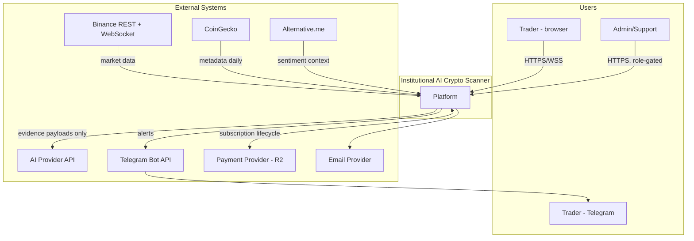

### 1.3 Container View (C4 Level 2)

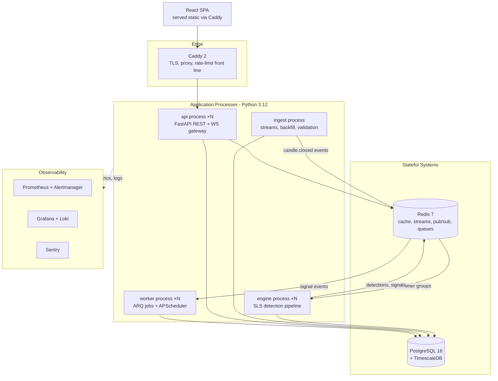

### 1.4 Core Architectural Rules (Binding)

1. **Dependency direction:** `domain ← application ← (infrastructure | interfaces)`. Domain imports nothing outside itself and `shared`. Enforced by import-linter contracts in CI (§27, §31) — a violating import is a build failure, not a review comment.
2. **Ports and adapters:** every external system (exchange, DB, Redis, AI, Telegram, email, payments, clock) is accessed exclusively through an application-layer port (interface); adapters live in infrastructure. No business logic in adapters; no I/O in domain.
3. **Events over calls between contexts:** detection flow is event-driven via Redis Streams (Constitution §7.4); bounded contexts never import each other's internals — they consume each other's published events or application services.
4. **One composition root per process** (`runtime/`): the only place concrete adapters are bound to ports. Dependency injection is constructor-based and explicit — no global service locators, no import-time side effects.
5. **Determinism isolation:** everything the SLS defines lives in `domain/` as pure, side-effect-free logic operating on in-memory state + candle inputs. The engine process feeds it; it never fetches.

---

## 2. Complete Backend Architecture

### 2.1 Layer Model

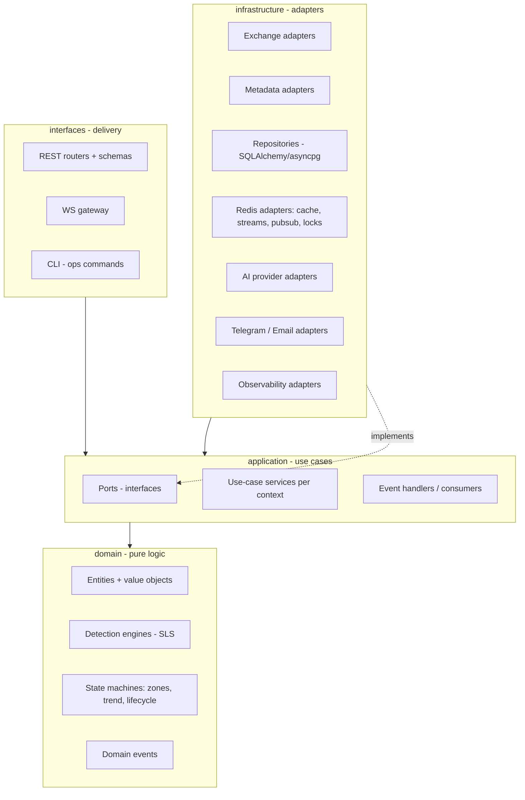

### 2.2 Bounded Contexts (Constitution §7.3)

| Context | Owns | Emits (events) | Consumes |
|---|---|---|---|
| **Market Data** | Candles, trades aggregates, freshness, universe symbols/tiers | `candle.closed`, `data.degraded`, `universe.changed` | Exchange feeds |
| **Detection** | All SLS engines, zones, structure, signals through lifecycle | `detection.created`, `signal.published`, `signal.resolved` | `candle.closed` |
| **Alerting** | Subscriptions, routing, cooldowns, delivery records | `alert.dispatched`, `alert.suppressed` | `signal.*` |
| **AI** | Explanation generation, validation, versioned prompts | `explanation.ready` | `signal.published`, on-demand requests |
| **Identity & Access** | Users, auth, sessions, tenants, entitlements | `user.*`, `entitlement.changed` | Payment events (R2) |
| **Trader Workspace** | Watchlists, preferences, notifications inbox, (R2: portfolio, journal) | `notification.created` | `signal.*`, `alert.*` |
| **Platform Ops** | Admin actions, audit, quality metrics aggregation | `admin.action` | Everything (read) |

Contexts map 1:1 to application sub-packages (§31); cross-context access is events or exported application services only.

### 2.3 Backend Module Specifications

Format per mandate: Purpose / Responsibilities / Inputs / Outputs / Dependencies / Internal Comm / External Comm / Failure Scenarios / Extension Points. Engine-specific modules are specified in §4–§8; data modules in §9–§10; delivery layers in §11–§15.

#### Module: Composition Root (`runtime/`)

- **Purpose:** Assemble each process from layers; the only concrete-wiring location.
- **Responsibilities:** Read validated config; construct adapters; bind ports; start process loop (uvicorn / stream consumers / ARQ); own graceful shutdown ordering (drain → flush → close).
- **Inputs:** Environment configuration; CLI process selector.
- **Outputs:** Running process; readiness/liveness state.
- **Dependencies:** All layers (uniquely privileged); DI container is hand-rolled constructor wiring (explicitness over framework magic).
- **Internal Communication:** Constructor injection only.
- **External Communication:** None directly.
- **Failure Scenarios:** Config validation failure ⇒ refuse to start with explicit error (never half-boot); dependency unreachable at boot ⇒ bounded retry with backoff, then exit non-zero (orchestrator restarts).
- **Future Extension Points:** New process types (e.g., extracted realtime gateway) are new composition roots — zero changes elsewhere.

#### Module: Domain Core (`domain/`)

- **Purpose:** The SLS made executable — pure, deterministic, versioned.
- **Responsibilities:** Entities (Candle, Symbol, Swing, Zone, Pool, Signal…); engine algorithms; state machines; domain events as immutable records; algo/param version constants.
- **Inputs:** In-memory state + closed-candle inputs (pushed by application layer).
- **Outputs:** New state + emitted domain events + detection records with evidence.
- **Dependencies:** `shared/` only (Decimal utilities, time primitives, result types). **Zero I/O, zero framework imports, zero clock access** (time is an input).
- **Internal Communication:** Plain function/method calls; events returned, not published (application publishes).
- **External Communication:** Prohibited.
- **Failure Scenarios:** Any exception here is a defect by definition (invalid input must be rejected at boundaries before reaching domain); determinism violations caught by golden/property tests (Constitution §32.5).
- **Future Extension Points:** New detectors = new domain modules consuming shared swing engine (SLS §3.1); Rust hot-path replacement slots behind identical function signatures (TDR §1.11).

---

## 3. Complete Frontend Architecture

### 3.1 Application Shape

React 18 + TypeScript strict SPA (TDR §3–§7), built with Vite, organized **feature-first** with shared foundations — the frontend mirror of bounded contexts.

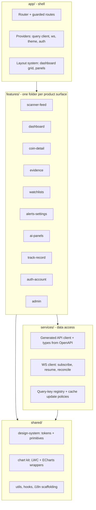

### 3.2 Frontend Architectural Rules

1. **Server state vs client state hard split (TDR §7):** everything from the platform lives in TanStack Query caches keyed by the central query-key registry; Zustand holds only UI state (layout, selections, filter drafts). No signal data ever stored in Zustand.
2. **Realtime as cache maintenance:** the WS client translates versioned push messages into query-cache updates/invalidations. REST remains source of truth: on reconnect, `last_event_id` gap-reconciliation refetches affected keys (mirrors SLS data-integrity posture).
3. **Generated contract:** API types + client generated from backend OpenAPI in CI; a backend schema change that breaks the frontend breaks the build, not production (TDR §4).
4. **Feature isolation:** features import from `shared/` and `services/`, never from each other; cross-feature composition happens in `app/` routes/layouts. Enforced by ESLint boundary rules.
5. **Design-system discipline:** raw Tailwind classes allowed only inside `shared/design-system` primitives and feature-local composition of those primitives; tokens are the single theming source (Constitution §22).
6. **Streaming-render discipline:** live surfaces use virtualized lists + row-level memoized subscriptions; a ticking price cell re-renders itself, never its table (PRD NFR 9.1 no-jank).

#### Module: Frontend Application

- **Purpose:** Deliver PRD surfaces on the professional dark-first design system.
- **Responsibilities:** Routing/guards (auth, entitlement-aware feature gating with honest locked states); realtime subscription lifecycle per visible surface; designed loading/empty/error/degraded states everywhere (Constitution §22.8).
- **Inputs:** REST responses, WS messages, user interaction.
- **Outputs:** Rendered UI; API mutations; analytics events (privacy-scoped).
- **Dependencies:** Generated client, WS client, design system.
- **Internal Communication:** Query cache as the data bus; typed props; no global event bus.
- **External Communication:** HTTPS/WSS to `api` process only — never to third parties directly (all external data is platform-mediated).
- **Failure Scenarios:** WS drop → auto-reconnect with backoff + visible staleness banner + reconciliation on resume; API errors → typed error envelope rendering (§16); entitlement rejection → locked-state UI, never silent absence.
- **Future Extension Points:** React Native app consumes the same `services/` + `entities/` packages (pnpm workspace, TDR §25.11); plugin-rendered panels (Phase 6) mount into the layout system's sandboxed slots.

---

## 4. Scanner Engine Architecture (Detection Pipeline Host)

The `engine` process: consumes `candle.closed` events and drives the SLS pipeline in dependency order (SLS §0.4). "Scanner Engine" = the orchestration host; individual analytical engines are domain modules it invokes.

### 4.1 Pipeline Orchestration

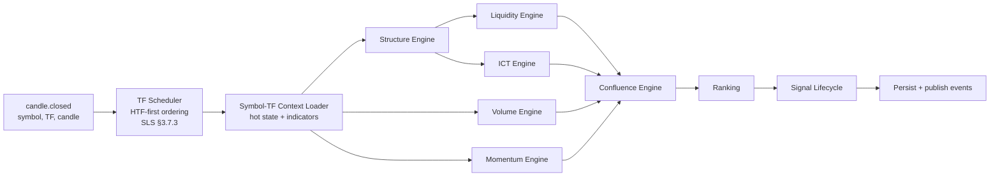

#### Module: Detection Orchestrator

- **Purpose:** Feed the pure domain pipeline with ordered inputs and publish its outputs — the bridge between event world and deterministic world.
- **Responsibilities:** Consumer-group consumption (sharded streams); simultaneous-close ordering (W1→…→M5 within a boundary); per-symbol-TF sequential execution guarantee (no concurrent mutation of one context); evidence persistence; event publication; processing-latency metrics (SLS §14 budget: close→detected ≤ 2 s).
- **Inputs:** `candle.closed`, `data.degraded`, `universe.changed` events.
- **Outputs:** Persisted detections/signals; `detection.created`, `signal.published` events; engine-state snapshots.
- **Dependencies:** Domain engines; state manager (§4.2); repositories; event bus port.
- **Internal Communication:** Direct calls into domain; async I/O around it.
- **External Communication:** None (only via ports to Redis/PG).
- **Failure Scenarios:** Crash mid-candle ⇒ at-least-once redelivery + idempotent processing (detections keyed by `(symbol, TF, open_time, detector, algo_version)` — replays are no-ops); poison event ⇒ bounded retries → dead-letter stream + alert; sustained lag > budget ⇒ scaling trigger fires (§24).
- **Future Extension Points:** New engines slot into the declared pipeline order; shard count is config; extracted detection service keeps identical event contracts.

### 4.2 Engine State Management

- **Doctrine:** engine state is a pure function of candle history (SLS §2.16) — therefore *rebuildable, cacheable, and disposable*.
- **Design:** in-memory per-`(symbol, TF)` context objects (swings, active zones, pools, trend state, rolling indicators) owned exclusively by one shard consumer. Cold start: rebuild from last 500–1,000 candles (SLS lookbacks) via replay. Warm restart: Redis snapshot (versioned, checksummed) → validate → else rebuild. Snapshots written on graceful shutdown + periodic checkpoint.
- **Memory envelope:** bounded object counts per SLS (max pools 40, max zones 60, hot window 1,000) ⇒ predictable per-context footprint; capacity math is config-verifiable (Constitution §20.4).

---

## 5. ICT Engine Architecture

The ICT engine is a **domain module cluster**, not a service — specified here for its structural contracts; all logic per SLS §5.

#### Module: ICT Engine (`domain/ict/`)

- **Purpose:** Zone intelligence: OB/Breaker/Mitigation/FVG/IFVG/BPR/OTE detection and state machines; PD context; displacement primitive.
- **Responsibilities:** Detect on closed-candle input; run the uniform zone interaction grammar (SLS §5.9) each close; maintain zone state transitions (close-confirmed, forward-only); emit zone events with full evidence (creating candles, measurements, grades).
- **Inputs:** Candle window; confirmed swings + structure events (from Structure engine output — passed in, never fetched); displacement measurements; dealing-range context.
- **Outputs:** Zone objects + state-transition events; PD context per close; displacement records.
- **Dependencies:** Shared Swing Engine outputs (single implementation — Constitution §30.3); `domain/common` value objects. **No dependency on liquidity/volume/momentum modules** — confluence combines outputs; engines stay decoupled.
- **Internal Communication:** Pure calls from orchestrator; returns events.
- **External Communication:** None (domain law).
- **Failure Scenarios:** Contradictory state transition attempt (e.g., MITIGATED→FRESH) ⇒ domain invariant violation ⇒ hard error + quarantine of that context + alert (never silently corrected); gap-adjacent inputs carry flags that propagate into every zone's evidence (SLS §2.16).
- **Future Extension Points:** New zone types register into the shared interaction grammar + state persistence without touching existing detectors; volume-profile enrichment lands as additional evidence fields (SLS §5.1 future).

**Structure, Liquidity, Volume, Momentum engines** follow the identical module contract shape (pure domain clusters, orchestrator-fed, event-emitting) with their SLS sections (§3, §4, §6, §7) as logic authority — repeated specs would duplicate; deltas only:

| Engine | Key inputs beyond candles | Key outputs | Notable failure rule |
|---|---|---|---|
| Structure (`domain/structure/`) | k-params | Swings, HH/HL labels, trend states, BOS/CHoCH/MSS + evidence | Swing engine is THE shared instance — duplication is a constitutional violation |
| Liquidity (`domain/liquidity/`) | Swings, ranges | Pools, EQH/EQL clusters, sweeps, stop hunts | Pool-state resurrection prohibited (terminal states permanent) |
| Volume (`domain/volume/`) | Trade aggregates, book stats | RVOL classes, spike/expansion flags, institutional/fake-volume scores | `wash_risk` caps enforced in scoring output itself, not downstream courtesy |
| Momentum (`domain/momentum/`) | — | Momentum score + components, accel, compression, legs | NEUTRAL forcing on no-dominance windows (SLS §7.1) is engine-internal, not caller-optional |

---

## 6. Ranking Engine Architecture

#### Module: Confluence + Ranking (`domain/confluence/`, `domain/ranking/`)

- **Purpose:** Deterministic evidence combination (gates → factors → adjustments → archetypes, SLS §8) and market-wide ordering/grading (SLS §9).
- **Responsibilities:** Per-candidate gate evaluation with recorded gate results; factor scoring with itemized attribution; archetype classification (rule-ordered, first-match); FinalConfidence assembly; deterministic cross-symbol ranking with full tie-break chain; grade assignment.
- **Inputs:** All engine outputs for the symbol-TF close + HTF states (provided by orchestrator from context registry).
- **Outputs:** Setup candidates (published and below-floor-recorded), ranked signal set, per-factor evidence trees.
- **Dependencies:** Versioned weight/parameter set (injected as data, never read from env — SLS §0.4/TDR §23).
- **Internal Communication:** Pure; consumed by lifecycle module.
- **External Communication:** None.
- **Failure Scenarios:** Missing factor input (an engine produced nothing for this close) ⇒ gate G1 fails by definition — absence is never defaulted to neutral scores; weight-set checksum mismatch vs deployed `param_set_version` ⇒ refuse to score (config corruption).
- **Future Extension Points:** New archetypes append to the rule-ordered classifier; advisory AI re-rank (PRD FC-4.1 future) consumes ranked output downstream — constitutionally barred from this module.

---

## 7. AI Explanation Engine

### 7.1 Flow

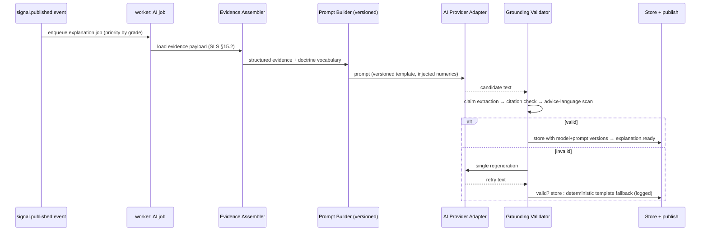

#### Module: AI Engine (`application/ai/` + `infrastructure/ai_providers/`)

- **Purpose:** SLS §11 functions (Explain, Thesis, Risk, Teach, Compare, Digest) under the grounding contract — AI never detects, never blocks publication (SLS §11.2.5).
- **Responsibilities:** Job consumption; evidence assembly (structured payloads only — no raw candles, SLS §11.2.1); versioned prompt management; provider adapter invocation with budgets/timeouts; post-generation validation (citation binding, numeric-injection integrity, prohibited-language scan); fallback template rendering; cost metering per tenant tier (Constitution §26.7).
- **Inputs:** `signal.published` events; on-demand user requests (Teach/Compare) via API → queue.
- **Outputs:** Stored explanations (versioned: model, prompt, evidence hash); `explanation.ready` events; rejection logs.
- **Dependencies:** Signal/evidence repositories; AI provider port (swappable per TDR/Constitution §26.6); validator (application-layer, deterministic).
- **Internal Communication:** Queue in, events out.
- **External Communication:** AI provider API (the only module that touches it); circuit-broken, budget-capped.
- **Failure Scenarios:** Provider outage ⇒ fallback templates keep product functional (PRD FC-8.1 AC); validation double-failure ⇒ template + logged for prompt-engineering review; budget exhaustion ⇒ per-tier queue deprioritization with honest UI state ("explanation queued").
- **Future Extension Points:** Multi-provider routing (cost/quality tiers); persona-adaptive depth (PRD FC-8.1 future) as prompt-template variants — same validator; conversational assistant (Phase 6) reuses assembler+validator with session context.

---

## 8. Alert Engine

#### Module: Alert Engine (`application/alerts/` + channel adapters)

- **Purpose:** SLS §10 delivered: priority routing, noise discipline, honest suppression, multi-channel dispatch.
- **Responsibilities:** Consume `signal.published`/`signal.resolved`; match against user subscriptions (watchlist/filter/strategy scopes compiled to matchable predicates); enforce priority rules, cooldowns (Redis-keyed per SLS §10.3 duplicate keys), quiet hours, caps, storm mode; render channel-specific templates (advice-language-free, versioned copy); dispatch with per-delivery status tracking; emit `alert.dispatched`/`alert.suppressed`.
- **Inputs:** Signal events; user subscription state; entitlement caps.
- **Outputs:** Telegram/email/in-app deliveries; delivery + suppression records (user-visible per PRD FC-11.1).
- **Dependencies:** Notification channel ports (Telegram, email, in-app inbox writer); entitlements service; subscription repository.
- **Internal Communication:** Queue consumption; fan-out jobs per channel.
- **External Communication:** Telegram Bot API, SMTP — retry with backoff, circuit breakers, delivery-failure fallback chain (Telegram fail → in-app + email notice, PRD FC-7.1).
- **Failure Scenarios:** Channel outage ⇒ queue with TTL (stale alerts die honestly rather than arriving late — an alert about an expired signal is noise); cap-boundary races resolved by atomic Redis counters; duplicate-delivery prevention via idempotency keys per `(alert, channel)`.
- **Future Extension Points:** Webhook channel (C3 API program); mobile push adapter (FCM/APNs) behind the same channel port; per-strategy routing (FC-19).

---

## 9. Data Collection Layer

#### Module: Ingestion Service (`ingest` process: `application/marketdata/` + exchange adapters)

- **Purpose:** The platform's sensory system: complete, validated, gap-free market data per SLS §2.
- **Responsibilities:** WS stream lifecycle (combined kline/aggTrade streams, connection budgets per Constitution §20.5, heartbeat + resume); candle close detection + verification (native TF vs 1m aggregation cross-check, SLS §2.1); validation battery (SLS §2.15) pre-publication; REST backfill on gaps (token-bucket budget authority); trade aggregation (1m buckets with taker sides); order-book snapshot sampling; freshness bookkeeping + `data.degraded` transitions; universe manager execution (tiering runs scheduled via worker, applied here).
- **Inputs:** Binance WS/REST; CoinGecko/Alternative.me (worker-scheduled pulls, stored via same layer); universe configuration.
- **Outputs:** Persisted candles/aggregates (Timescale hypertables via repository); `candle.closed` events (only after validation passes — a candle that reaches the stream is trustworthy by contract); freshness states; `SUSPECT`/`DEGRADED` markers.
- **Dependencies:** Exchange provider port (Binance adapter v1 — premium adapters slot in per TDR §29.2); market-data repositories; event bus.
- **Internal Communication:** Publishes events; exposes no callable API to other contexts.
- **External Communication:** The ONLY module speaking to market-data providers.
- **Failure Scenarios:** WS disconnect ⇒ resume protocol + gap detection + backfill before resuming publication (ordering guarantee: events for a symbol-TF are strictly time-ordered); rate-limit pressure ⇒ budget authority throttles non-critical (backfill defers to live); validation failure ⇒ quarantine + re-fetch, never publish (SLS §2.15); process death ⇒ standby promotion with replay from last persisted candle (no event loss: publication is transactional-outbox-patterned — persist then publish with dedup).
- **Future Extension Points:** Additional venue adapters (one canonical series per symbol — SLS §1.1); futures data channels (funding/OI/liquidations) as new stream handlers publishing new event types; tick-capture module (Phase 6 whale tracking) as parallel consumer of the same adapter.

---

## 10. Data Processing Pipeline (End-to-End)

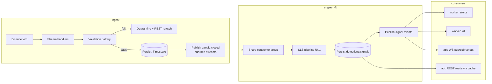

**Pipeline guarantees (binding):** (1) validated-before-published; (2) per-symbol-TF strict ordering; (3) at-least-once delivery + idempotent consumers everywhere; (4) evidence persisted before dependent events publish (a consumer can always dereference what an event cites); (5) every stage exports latency metrics against its SLS §14 budget slice.

**Budget allocation of the 2 s close→detection target:** ingest close-detection + validation ≤ 500 ms; stream transit ≤ 100 ms; context load ≤ 200 ms (hot: in-memory); pipeline compute ≤ 900 ms p95; persist + publish ≤ 300 ms. Measured per stage; regression on any slice alarms before the total breaches (Constitution §34.2).

---

## 11. API Layer

#### Module: REST API (`interfaces/api/`)

- **Purpose:** The platform's synchronous contract surface: resource reads, user mutations, admin operations — versioned, validated, entitlement-aware (Constitution §15).
- **Responsibilities:** Routers per bounded context (thin: parse → authorize → delegate to application service → shape response); Pydantic request/response schemas (the OpenAPI source of truth, TDR §28); pagination/filtering conventions; error envelope rendering (§16); rate-limit enforcement per tier; correlation-ID propagation.
- **Inputs:** HTTPS requests via Caddy.
- **Outputs:** JSON responses; OpenAPI 3.1 schema; audit events for mutating admin calls.
- **Dependencies:** Application services only — **routers never touch repositories or Redis directly** (layering law).
- **Internal Communication:** DI-provided service references.
- **External Communication:** None outbound.
- **Failure Scenarios:** Downstream service failure ⇒ typed 5xx envelope with correlation ID, never stack traces (Constitution §17.10); read-path Redis miss ⇒ PG fallback with latency metric; overload ⇒ backpressure via bounded worker pools + 429 before collapse.
- **Future Extension Points:** `/v2` versioned evolution (Constitution §15.4 deprecation windows); public API program (C3) = same routers + API-key auth scheme + partner rate tiers.

## 12. Services Layer (Application Use-Cases)

- **Purpose:** All orchestration: the verbs of the system (`PublishSignal`, `LinkTelegram`, `EvaluateUniverse`, `GenerateExplanation`…).
- **Responsibilities:** Transaction boundaries (unit-of-work per use case); port coordination; domain invocation; event publication; entitlement checks via Identity context service; idempotency for event-driven handlers.
- **Inputs:** Interface-layer calls; consumed events.
- **Outputs:** State changes via repositories; published events; DTOs to interfaces.
- **Dependencies:** Ports (never adapters); domain.
- **Internal Communication:** Service→service within a context: direct; across contexts: events or exported context facade (one public service per context — internals private).
- **External Communication:** None directly (ports only).
- **Failure Scenarios:** Partial-failure discipline: DB commit + event publish uses transactional outbox (persist event in-tx, relay publishes) — the system never has "saved but unannounced" or "announced but unsaved" states; port timeout ⇒ typed InfraError with retry policy per call class.
- **Future Extension Points:** Service extraction lifts a context's application package + its ports behind an RPC/event boundary — the facade already defines the seam.

## 13. Repository Layer

- **Purpose:** All persistence behind intent-named interfaces (Constitution §16.2): `CandleRepository`, `SignalRepository`, `ZoneStateRepository`, `UserRepository`…
- **Responsibilities:** SQLAlchemy 2.0 async implementations; Timescale-aware query patterns (hypertable windows, continuous aggregates); asyncpg COPY bulk paths for ingestion (TDR §26); tenant scoping enforced *in the repository* (every user-scoped query requires tenant context — forgetting is structurally impossible via required constructor parameter); migration ownership (Alembic, expand-migrate-contract).
- **Inputs:** Application-layer calls with typed parameters.
- **Outputs:** Domain entities / immutable records — never ORM models above the repository boundary (mapping at the edge).
- **Dependencies:** Database engine adapters; `domain` entity types.
- **Internal Communication:** Unit-of-work session management provided by composition root scope.
- **External Communication:** PostgreSQL only.
- **Failure Scenarios:** Connection-pool exhaustion ⇒ bounded wait + typed error + pool metrics alarm (Constitution §20.4); serialization conflicts on hot rows ⇒ bounded retry with jitter; migration failure ⇒ deploy halts pre-traffic (§33.6-Constitution).
- **Future Extension Points:** ClickHouse analytics repositories (TDR §8.11) as new implementations of new read-model ports; read-replica routing per repository read/write split.

## 14. Configuration Layer

- **Purpose:** Typed, validated, boot-time-fatal configuration (TDR §23); the *infrastructure config vs doctrine parameters* split enforced structurally.
- **Responsibilities:** Pydantic Settings schemas per process (api/ingest/engine/worker declare only what they need); environment injection; SLS parameter sets loaded as versioned data via repository (checksummed against `param_set_version`, never from env); feature flags (Constitution §33.7) as typed config with default-off.
- **Inputs:** Environment variables, secret-injected values (§24-TDR SOPS flow), parameter-set records.
- **Outputs:** Immutable config objects injected at composition.
- **Dependencies:** `shared` validation utilities.
- **Internal / External Communication:** None post-boot (config is frozen; dynamic doctrine config constitutionally prohibited).
- **Failure Scenarios:** Missing/invalid variable ⇒ refuse boot with field-precise error; param-set checksum mismatch ⇒ engine refuses to score (§6 failure rule).
- **Future Extension Points:** K3s ConfigMap/sealed-secret injection — schemas unchanged (TDR §23.11).

## 15. Utility Layer (`shared/`)

- **Purpose:** The small, jealously-guarded standard library of the platform (Constitution §10 duplication rules).
- **Responsibilities:** Decimal money/price math (float-free, §45.8); UTC time primitives + TF arithmetic (candle boundary math in exactly one place); ID generation (ULIDs — sortable, collision-safe); Result/error types; correlation-context propagation helpers; structured-event base classes.
- **Inputs/Outputs:** Pure functions and types.
- **Dependencies:** None (leaf).
- **Internal/External Communication:** None.
- **Failure Scenarios:** None tolerable — 100% property-tested (time/decimal bugs poison everything above).
- **Future Extension Points:** Additions require the §10.6-Constitution "used ≥ 3 places" rule — `shared` is not a dumping ground.

---

## 16. Error Handling Strategy

### 16.1 Error Taxonomy (One Platform-Wide Model)

| Class | Meaning | Retry? | Surface |
|---|---|---|---|
| `ValidationError` | Boundary input rejected | No | 400/422 envelope; never reaches domain |
| `DomainInvariantError` | Impossible state attempted — a defect | No | 500 + Sentry + context quarantine (§5 failure rule) |
| `NotFoundError` / `ConflictError` | Resource semantics | No | 404/409 envelope |
| `AuthError` / `EntitlementError` | Identity/capability rejection | No | 401/403 + honest locked-state contract for UI |
| `InfraError` | Own-infrastructure failure (DB, Redis) | Policy-bound | 503 envelope; circuit metrics |
| `ExternalError` | Third-party failure (exchange, AI, Telegram) | Adapter policy (backoff+jitter, breaker) | Degrades per feature contract (fallbacks §7/§8) |

### 16.2 Binding Rules

1. **Error envelope** (Constitution §15.6): every API error = `{code, message, correlation_id, details?}` — machine-readable code enumerated per endpoint in OpenAPI.
2. **Fail loudly, degrade honestly** (Constitution §18): no silent catches; every degradation sets user-visible state (PRD FC-1.2). Empty `except` blocks are lint-fatal.
3. **Retries belong to adapters:** application code sees one attempt semantics; adapters own policy (idempotency prerequisite documented per operation).
4. **Circuit breakers on every external port** with half-open probes; breaker state exported as metrics + feeds degradation surfaces.
5. **Crash-only posture** (Constitution §18.9): unknown states exit; supervisors restart; recovery = state rebuild (§4.2), never in-place guesswork.

## 17. Logging Architecture

- **Stack:** structlog → JSON stdout → Loki (TDR §21); Sentry for exceptions with context.
- **Structure (every line):** timestamp, level, service, process, correlation_id, tenant_id (where applicable), event key (dot-namespaced: `ingest.gap.detected`, `signal.published`, `alert.suppressed`), typed payload fields.
- **Correlation:** ID born at edge (request) or event origin (candle close carries `flow_id` through the whole pipeline: a signal's log trail traces to the candle that started it — the audit dimension of SLS evidence).
- **Levels doctrine (Constitution §19.2):** ERROR = human should look; WARN = degradation absorbed; INFO = business events; DEBUG = development (sampled off in prod).
- **Prohibitions:** secrets/tokens/PII in logs (redaction processors + CI-checked patterns); logging inside domain modules (domain returns events; application logs them).
- **Retention:** prod 30 d hot / 180 d archived; audit-relevant events (admin actions, signal publication records) → PG audit tables, not just logs (logs are diagnostics, not the system of record).

## 18. Caching Strategy

| Layer | Where | Contents | Invalidation |
|---|---|---|---|
| L1 in-process | engine contexts | Hot candle windows, engine state | Owned by state manager (§4.2); event-driven append |
| L1 in-process | api (short TTL) | OpenAPI doc, plan/entitlement definitions | TTL 60 s + `entitlement.changed` bust |
| L2 Redis | shared | Published-signal working set, latest ranks, resting-liquidity snapshots, symbol/universe registry, user session/revocation, rate/cooldown counters | Event-driven (writers update on publish) + TTL backstop; **every key family documented: owner, shape, TTL, invalidation trigger** (Constitution §20.6 registry lives in `docs/cache-registry.md`) |
| Source | PostgreSQL | Everything durable | — |

**Rules:** cache-aside for reads with single-flight protection (dogpile lock) on hot keys; caches are *disposable* — cold Redis start degrades latency, never correctness; no cache is ever the only holder of truth (Constitution §16.5); WS fanout payloads come from the same L2 working set the REST API reads (one truth per datum).

## 19. WebSocket Architecture

```mermaid
sequenceDiagram
    participant C as Client (SPA)
    participant A as api process (WS gateway)
    participant R as Redis pub/sub
    participant API as REST
    C->>API: POST ws-ticket (authenticated)
    API-->>C: one-time ticket (30 s TTL)
    C->>A: WSS connect + ticket
    A->>A: validate ticket → bind identity + entitlements
    C->>A: subscribe(channels: signals.global, symbol.BTCUSDT, notif.self)
    A->>A: entitlement filter per channel (tier TF/delay rules applied server-side)
    R-->>A: published events (fanout backbone)
    A-->>C: versioned messages {v, channel, event_id, payload}
    Note over C,A: heartbeat 20 s; missed 2 ⇒ client reconnects
    C->>A: reconnect + last_event_id per channel
    A-->>C: gap small ⇒ replay from Redis stream tail; gap large ⇒ resync directive
    C->>API: resync: refetch affected query keys
```

- **Channel model:** `signals.global`, `signals.watchlist.{id}`, `symbol.{sym}.{tf}`, `notifications.{user}`, `system.status`. Server-side entitlement enforcement per subscription (free-tier delay implemented at gateway: delayed channel variants — the client cannot request its way past it).
- **Backpressure:** per-connection bounded send queue; slow consumer ⇒ drop-oldest for market channels (stale ticks worthless) + `resync` directive; never unbounded memory (Constitution §20.4).
- **Message contract:** versioned schemas, JSON Schema published alongside OpenAPI (Constitution §15.2); every message carries `event_id` for resume.
- **Extraction seam:** gateway isolated behind the pub/sub backbone — Centrifugo swap per TDR §12.11 changes adapters, not contracts.

## 20. Authentication Flow

```mermaid
sequenceDiagram
    participant U as User
    participant FE as SPA
    participant API as api: Identity service
    participant R as Redis (sessions/revocation)
    U->>FE: credentials (+ TOTP if enrolled)
    FE->>API: login
    API->>API: Argon2id verify + TOTP verify + rate-limit check
    API->>R: create session family record
    API-->>FE: access JWT (≤15 min) + refresh token (rotating, httpOnly secure cookie)
    Note over FE,API: requests carry access token; gateway verifies signature + revocation bitmap
    FE->>API: refresh (on expiry)
    API->>R: validate family + rotation state
    alt reuse detected (old refresh presented)
        API->>R: revoke entire family
        API-->>FE: 401 → full re-auth (possible theft)
    else valid
        API-->>FE: new access + new refresh (family preserved)
    end
```

Additional rules: WS uses the ticket flow (§19) — tokens never in query strings; password reset and email flows are single-use, expiring, audited; session list + revocation surfaces per PRD FC-9.2; all auth events audit-logged (Constitution §17.6).

## 21. Authorization Flow

- **Model:** layered — (1) **authentication** established identity; (2) **tenant scoping** structurally applied at repositories (§13); (3) **entitlements** (subscription capabilities — Constitution §36.2) evaluated by the Identity context's policy service: declarative capability checks (`can_stream_tf(M15)`, `alert_quota_remaining`); (4) **RBAC** for staff (support/ops/superadmin roles) with per-action audit.
- **Enforcement points:** REST dependency layer (route-level policy declaration — a route without a policy declaration fails CI); WS subscription filter (§19); alert engine caps (§8); *never* frontend-only (UI locked-states are honesty, not security).
- **Decision inputs:** entitlement claims in access token (fast path) + Redis-cached entitlement record (authoritative, 60 s TTL + event bust) — token claims are optimization, the record is truth (grace-state transitions per Constitution §36.5 apply within token lifetime).
- **Failure behavior:** deny-by-default; missing entitlement definition = denied + alarmed (config drift detector).

---

## 22. Deployment Architecture

### 22.1 v1 Production Topology (TDR §15/§18/§19)

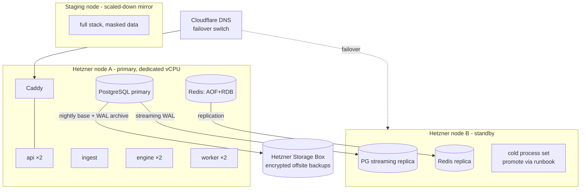

- **Deploy mechanics:** pipeline-only (Constitution §33.2): image build (pinned digests) → staging auto-deploy → verification suite → manual gate → prod rolling replacement per process behind health checks; DB migrations expand-migrate-contract, executed pre-traffic (§33.6).
- **Process supervision:** Compose restart policies + health endpoints (liveness = process alive; readiness = dependencies reachable + state warm); ingest standby promotion runbook'd.
- **Rollback:** previous image tag redeploy ≤ 5 min; contract-phase migration deferral makes DB-compatible rollback the default state (Constitution §33.4).

## 23. Security Architecture

| Layer | Controls |
|---|---|
| Edge | TLS 1.2+ only (Caddy auto-cert), HSTS, security headers, request-size caps, IP rate limits, admin routes IP-allowlisted + VPN-only |
| Application | Boundary validation everywhere (Pydantic); output encoding; CSRF-safe token handling (httpOnly refresh cookie + bearer access); per-tier rate limits; audit trail on all mutations of value |
| Identity | Argon2id, TOTP 2FA, rotating refresh + reuse detection (§20), session revocation ≤ 30 s, deny-by-default authz (§21) |
| Data | Encryption in transit everywhere incl. internal (private network + TLS where crossing hosts); at-rest via encrypted volumes + encrypted backups (keys offline); tenant isolation structural (§13); PII minimization (email + optional handle is the entire v1 PII surface) |
| Secrets | SOPS/age flow (TDR §24); runtime env injection; gitleaks in CI; quarterly rotation runbook |
| Supply chain | Lockfile-pinned deps (uv/pnpm), CVE scans blocking merge, container base pinning, non-root read-only-fs containers |
| Monitoring | Auth anomaly alarms (velocity, geo-novelty), breaker/ratelimit dashboards, Sentry triage SLA |
| Boundaries | No withdrawal-permission exchange keys ever (Constitution §17.7); AI receives evidence payloads only — user PII never enters prompts (§26.9); payment data lives at provider, platform stores references (§36.4) |

Threat-model review is a release-gate item each phase (Constitution §17.11); the STRIDE worksheet lives in `docs/security/`.

## 24. Scalability Strategy

| Component | v1 capacity posture | Scale trigger (measured) | Scale action |
|---|---|---|---|
| api | 2 replicas, stateless | p95 latency or CPU >70% sustained | Add replicas (same node → node B → K3s) |
| engine | 2 shards (symbol-hash) | close→detection p95 > 1.5 s | Add shards; rebalance consumer groups |
| ingest | Singleton + standby | Stream lag > 2 s sustained | Vertical first; split by market segment second |
| worker | 2 replicas | Queue latency > budget (alerts 3 s) | Add replicas per queue class |
| WS connections | In api replicas | >10k concurrent or WS CPU >30% | Extract Centrifugo (TDR §12.11) |
| Redis | Single + replica | Memory >70% / ops ceiling | Role-split instances (cache vs streams) → cluster |
| PostgreSQL | Primary + replica | Read saturation / storage growth curve | Read-replica routing; compression tuning; ClickHouse offload for analytics (TDR §8.11) |
| Events | Redis Streams | >50k events/min sustained | NATS/Kafka per TDR §13.11 behind publisher port |

Scaling doctrine: capacity decisions are made from dashboards, not incidents (Constitution §21.8); every ceiling above has its successor named in the TDR — this table is the operational trigger map.

## 25. Monitoring Strategy

- **Golden signals per process** (latency/traffic/errors/saturation) + **domain truth metrics**: scan-cycle time, per-stage pipeline latency (§10 budget slices), feed freshness gauges, funnel ratios (candidates→published→alerted, drift alarm per SLS §14), alert delivery p95/p99, WS connection/queue stats, AI validation rejection rate, entitlement-denial anomalies.
- **Dashboards:** Ops (per process), Doctrine (funnel, quality, freshness), Business (activation, conversion, churn feeds from product events), Release (deploy markers overlaid on all).
- **Alerting:** every alert has severity, runbook link, and owner (Constitution §34.4); page-worthy = user-visible impact or data-integrity risk; everything else is ticket-class. Alert review monthly prunes noise (alert fatigue is an ops defect).
- **SLOs** (PRD NFR 9.3): per-capability SLOs with error budgets; budget burn feeds release-pace decisions (§35.2-Constitution).
- **Synthetic probes:** external black-box checks: login, feed fetch, WS subscribe, Telegram test-bot delivery — measuring what users experience, not what processes report.

## 26. Disaster Recovery Strategy

| Objective | Target (v1) |
|---|---|
| RPO (data loss ceiling) | ≤ 5 min (WAL streaming to replica; ≤ 24 h for offsite-only scenarios) |
| RTO (service restoration) | ≤ 60 min full-node loss (runbook'd promotion); ≤ 5 min single-process failure (supervision) |

- **Backup regime:** PG nightly base + continuous WAL archive → encrypted Storage Box (independent failure domain); Redis AOF for warm state (disposable by design — §18); config/secrets recoverable from repo + offline keys; **quarterly restore drills are mandatory and timed** (Constitution §16.8 — an untested backup is a hope, not a backup).
- **Failure playbook (top scenarios):** node A loss → DNS failover to node B, promote replica, start process set (runbook, target ≤ 60 min); PG corruption → PITR from WAL to pre-corruption point + engine state rebuild (§4.2 — derived state is never restored, always recomputed); Redis loss → cold-start latency degradation only; region event → restore to fresh nodes from offsite (documented, drilled annually); exchange outage → not a DR event: degradation states + honest UI (SLS §2.13).
- **Signal-record integrity:** the immutable signal history is the crown jewel — it gets checksum verification in every backup cycle and its own restore-verification step in drills.

## 27. Module Dependency Diagram

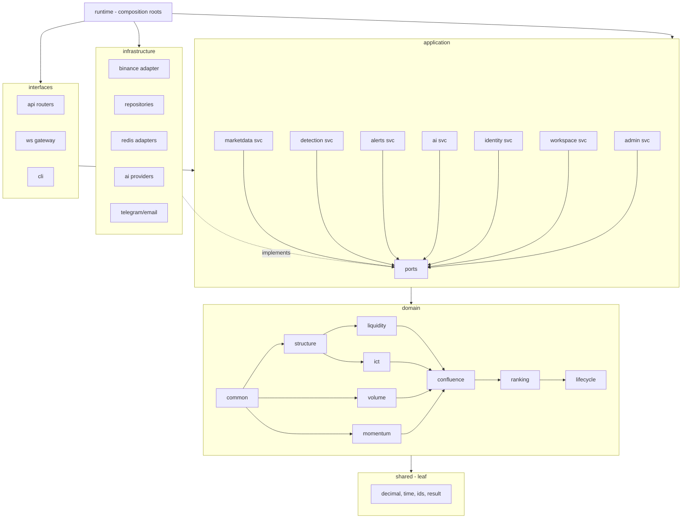

Import-linter contracts (CI-enforced): `domain` imports only `shared`; `application` imports `domain`+`shared`; `infrastructure`/`interfaces` import `application` downward; only `runtime` sees everything; domain engine order is acyclic exactly as drawn.

## 28. Data Flow Diagram

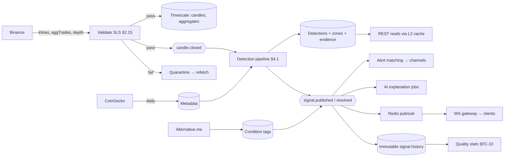

## 29. Sequence Diagrams

### 29.1 Candle Close → Alert (the golden path)

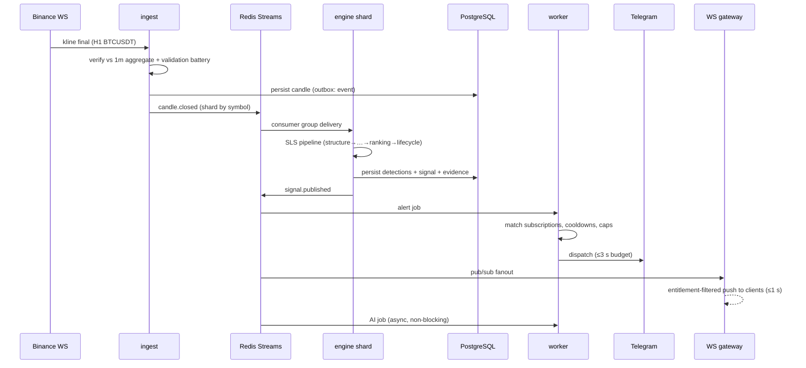

### 29.2 Gap Recovery

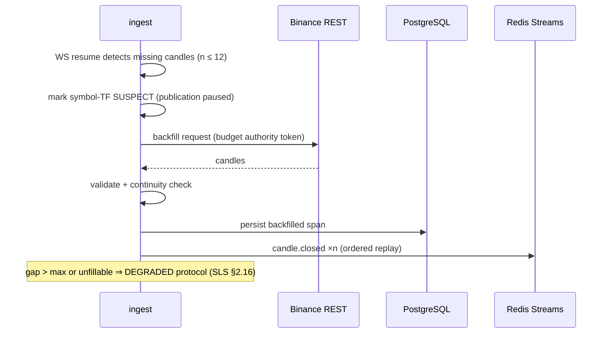

### 29.3 On-Demand AI Teach Request

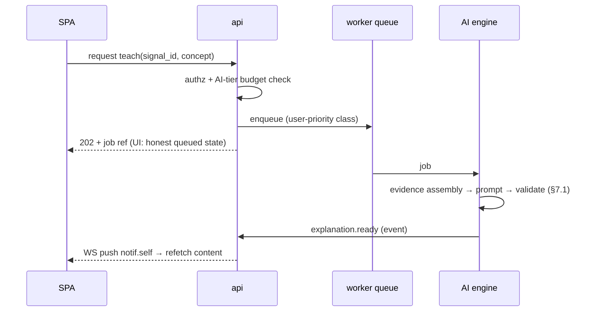

## 30. Professional Folder Structure

```text
crypto-scanner/                          # monorepo root
├── backend/
│   ├── pyproject.toml                   # uv-managed; single package
│   ├── src/scanner/
│   │   ├── shared/                      # §15: decimal, time, ids, result, events-base
│   │   ├── domain/
│   │   │   ├── common/                  # value objects: Candle, Symbol, TF, Price, evidence records
│   │   │   ├── structure/               # swing engine (THE shared one), labels, trend, BOS/CHoCH/MSS
│   │   │   ├── liquidity/               # pools, EQ clusters, sweeps, stop hunts
│   │   │   ├── ict/                     # OB/breaker/mitigation/FVG/IFVG/BPR/OTE, PD, displacement
│   │   │   ├── volume/                  # RVOL, spikes, institutional/fake-volume scoring
│   │   │   ├── momentum/                # score, accel, compression, legs
│   │   │   ├── confluence/              # gates, factors, adjustments, archetypes
│   │   │   ├── ranking/                 # confidence, grades, ordering
│   │   │   └── lifecycle/               # signal state machine, outcomes, TTL
│   │   ├── application/
│   │   │   ├── ports/                   # all interfaces: providers, repos, bus, channels, ai, clock
│   │   │   ├── marketdata/              # ingestion orchestration, universe, freshness
│   │   │   ├── detection/               # pipeline orchestrator, state manager, scheduler
│   │   │   ├── alerts/                  # matching, discipline, dispatch coordination
│   │   │   ├── ai/                      # jobs, evidence assembly, prompt mgmt, validator
│   │   │   ├── identity/                # auth, sessions, entitlements, tenants
│   │   │   ├── workspace/               # watchlists, preferences, notifications (R2: portfolio, journal)
│   │   │   └── admin/                   # ops services, audit, quality aggregation
│   │   ├── infrastructure/
│   │   │   ├── exchanges/binance/       # WS + REST adapters, rate-budget authority
│   │   │   ├── metadata/coingecko/
│   │   │   ├── sentiment/alternative_me/
│   │   │   ├── persistence/             # SQLAlchemy models, repositories, alembic/
│   │   │   ├── redis/                   # cache, streams, pubsub, locks, counters
│   │   │   ├── ai_providers/
│   │   │   ├── channels/                # telegram, email, inapp
│   │   │   └── observability/           # metrics, log processors, sentry
│   │   ├── interfaces/
│   │   │   ├── api/                     # routers/, schemas/, deps/, middleware/
│   │   │   ├── ws/                      # gateway, channels, subscriptions
│   │   │   └── cli/                     # ops commands: rebuild-state, backfill, verify-golden
│   │   ├── runtime/                     # api.py, ingest.py, engine.py, worker.py + wiring/
│   │   └── config/                      # settings schemas per process, feature flags
│   └── tests/
│       ├── unit/                        # mirrors src structure
│       ├── golden/                      # curated SLS datasets + expected outputs
│       ├── property/                    # hypothesis suites (detectors, shared)
│       ├── integration/                 # repo/adapter tests vs real PG+Redis (testcontainers)
│       ├── e2e/                         # pipeline: candles in → signals out
│       └── load/                        # locust scenarios
├── frontend/
│   ├── package.json                     # pnpm
│   └── src/
│       ├── app/                         # routes, providers, layouts, guards
│       ├── features/                    # scanner-feed/ dashboard/ coin-detail/ evidence/
│       │                                # watchlists/ alerts-settings/ ai-panels/ track-record/
│       │                                # auth-account/ admin/
│       ├── entities/                    # generated domain types + view models
│       ├── services/                    # api-client(gen)/ ws/ query-keys/
│       └── shared/                      # design-system/ charts/ hooks/ utils/ config/
├── ops/
│   ├── compose/                         # dev / staging / prod compose files
│   ├── caddy/  prometheus/  grafana/  loki/
│   ├── backup/                          # scripts + restore runbooks
│   └── terraform/                       # Hetzner provisioning
├── docs/
│   ├── PROJECT_CONSTITUTION.md  SCANNER_LOGIC_SPECIFICATION.md
│   ├── TECHNOLOGY_DECISION_RECORD.md  PRODUCT_REQUIREMENTS_DOCUMENT.md
│   ├── TECHNICAL_ARCHITECTURE_DOCUMENT.md
│   ├── adr/                             # numbered decision records
│   ├── runbooks/  security/  cache-registry.md
└── .github/workflows/                   # ci.yml, deploy-staging.yml, deploy-prod.yml
```

## 31. Package Structure

- **Backend: one Python distribution (`scanner`)** with the five top-level packages above. Sub-packages are the bounded-context boundaries; **import-linter contracts** (§27) are the structural law in CI. Test layout mirrors source 1:1 (Constitution §32.6).
- **Frontend: pnpm workspace-ready** — v1 is one app package; `entities/` + `services/` + `shared/design-system` are structured as future workspace packages so the React Native app (Phase 7) extracts them without surgery (TDR §25.11).
- **Naming law (Constitution §11):** packages/modules named by domain meaning (`liquidity`, not `utils2`); SLS vocabulary is the naming vocabulary — a `Sweep` in code is a sweep per SLS §4.6, nothing else.
- **Versioning:** one repo version (SemVer) + independent `algo_version`/`param_set_version` constants in `domain/` (SLS §0.4); OpenAPI version tracks API surface.

## 32. Environment Strategy

| Environment | Purpose | Data | Deploy |
|---|---|---|---|
| `dev` (local) | Development; full stack via compose | Recorded fixture streams + synthetic universe (deterministic replays for detector work) | Manual |
| `staging` | Verification against live free-tier feeds, scaled universe (~50 symbols) | Live market data; masked/synthetic user data (Constitution §33.5 — never production PII) | Auto on main merge |
| `production` | The platform | Real everything | Manual gate post-staging verification |

Parity rule: same images, same compose topology shape, config-only differences (Constitution §33.1/§33.5); staging runs the full observability stack — monitoring is verified *as a feature*, not assumed.

## 33. Configuration Management

Consolidates §14 layer + operational practice: environment variables per process via SOPS-decrypted env files (TDR §24); every config field typed, documented, and defaulted-or-required explicitly; feature flags default-off with owner + removal condition recorded (Constitution §33.7); SLS parameter sets as versioned DB records with checksum verification at engine boot; config changes to production travel through the same pipeline as code (auditable, rollbackable) — **no SSH-edited config ever** (Constitution §33.2).

## 34. Extension / Plugin Architecture

**v1 builds the seams, not the plugin system** (Constitution §37 requires a governance amendment before third-party code executes).

- **Seams built now:** (1) every integration behind a port — first-party adapters are "plugins with trust"; (2) versioned event contracts — future plugins consume events, never internals; (3) WS/REST schemas versioned — external consumers already possible read-only; (4) frontend layout slots — panel components mount declaratively; (5) manifest pattern reserved (JSON Schema, TDR §27.11) for capability declaration.
- **Phase-6 target model (pre-decided direction):** out-of-process plugins (separate containers) consuming a scoped event/API surface with per-plugin auth, quotas, and kill switches — never in-process code loading (memory-safety + tenancy isolation).
- **Hard boundaries (permanent):** plugins may *never* alter detection doctrine, inject into engine pipeline, loosen quality floors, or access other tenants — the SLS §13 constraint table extends to plugins wholesale.

## 35. Future Expansion Strategy

| Expansion | Architectural readiness already in place |
|---|---|
| Futures universe (SLS §1.3) | New ingest stream handlers + event types; engine consumes same pipeline; perp context enriches confluence via SLS amendment |
| Multi-exchange | Provider ports (§9); one-canonical-series rule; venue-scoped universe manager |
| Mobile app | Workspace-extractable frontend packages (§31); token auth reusable; push via new channel adapter |
| Service extraction | Bounded contexts + transactional outbox + facades = lift-and-wrap per context (Constitution §7.1); first candidates: WS gateway (Centrifugo), AI worker |
| ClickHouse analytics | New read-model ports; CDC feed from PG (TDR §8.11) |
| Public API program | Same routers + API-key scheme + partner tiers (§11); OpenAPI already the contract |
| Whale/tick module | Parallel consumer of exchange adapters; separate storage budget decision (SLS §2.3) |
| Backtesting (R3) | Domain purity makes the backtester = orchestrator variant replaying stored candles through identical domain code — live/backtest parity by construction (SLS §13) |

---

## 36. Closing Statement

This architecture has one organizing conviction: **the deterministic heart of the platform is pure and everything impure orbits it through ports and events.** That single decision buys live/backtest parity, testability to the golden-dataset standard, service extraction without rewrites, and the honesty guarantees the product sells. Engineers implementing this document make no structural decisions — where structure is not specified here, the answer is a TAD amendment, never an improvisation.

Governance stack complete: Constitution (law) → SLS (brain) → TDR (materials) → PRD (product) → **TAD (blueprint)**. Implementation may begin.

**— End of Technical Architecture Document v1.0.0 —**
