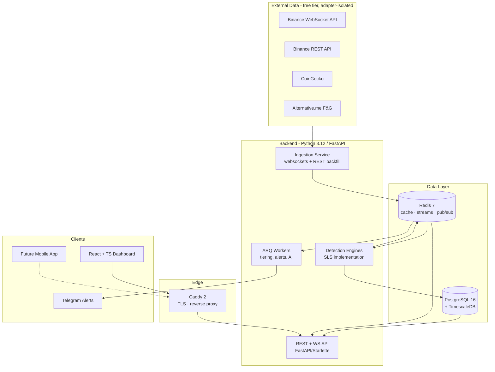

# TECHNOLOGY DECISION RECORD (TDR)

## Institutional AI Crypto Scanner — Official Technology Foundation

**Document Status:** Official Technology Decision Record — the reference for every future engineering decision
**Authority:** Subordinate to `PROJECT_CONSTITUTION.md` v1.0.0 and `SCANNER_LOGIC_SPECIFICATION.md` v1.0.0; authoritative over all technology selection
**Version:** 1.0.0 | **Ratified:** 2026-07-12
**Amendment Rule:** Technology changes require a versioned TDR revision with an ADR recording context, options, and consequences (Constitution §12.3, §42)

> Every technology below was selected against the constitutional evaluation order: correctness → security → data integrity → reliability → maintainability → performance → delivery speed → convenience (Constitution §42.3). Nothing was selected for popularity. Where multiple candidates were viable, a scored decision matrix records the comparison. Scores are 1–5; they express fitness *for this project's requirements*, not general quality.

---

## 0. Executive Summary

### 0.1 The Stack at a Glance

| Layer | Selection |
|---|---|
| Backend language | Python 3.12+ |
| Backend framework | FastAPI (async) |
| Frontend framework | React 18+ |
| Frontend language | TypeScript (strict mode) |
| UI system | Tailwind CSS + shadcn/ui (Radix primitives) |
| Charts | TradingView Lightweight Charts (price) + Apache ECharts (analytics/heatmaps) |
| State management | TanStack Query (server state) + Zustand (client state) |
| Database | PostgreSQL 16 + TimescaleDB extension |
| Caching | Redis 7 |
| Authentication | Self-hosted OAuth2/JWT (rotating refresh), Argon2id, TOTP 2FA |
| Background jobs | ARQ + APScheduler (Redis-backed, async-native) |
| Realtime | Native WebSockets (Starlette) + Redis pub/sub fan-out |
| Message queue | Redis Streams (consumer groups) |
| Containerization | Docker + Docker Compose |
| Deployment | Staged: Compose on dedicated VPS → K3s/Kubernetes at defined triggers |
| CI/CD | GitHub Actions |
| Reverse proxy | Caddy 2 |
| Hosting model | Dedicated VPS (EU) |
| Cloud provider | Hetzner (primary) → AWS/GCP at enterprise scale |
| Monitoring | Prometheus + Grafana + Alertmanager + Sentry |
| Logging | structlog (JSON) → Grafana Loki |
| Testing | pytest ecosystem (backend) · Vitest + Playwright (frontend) |
| Configuration | Pydantic Settings (typed, 12-factor) |
| Secrets | SOPS + age (v1) → HashiCorp Vault (scale) |
| Package managers | uv (Python) · pnpm (JS/TS) |
| ORM | SQLAlchemy 2.0 async + Alembic |
| Validation | Pydantic v2 |
| API documentation | OpenAPI 3.1 auto-generated + Scalar UI |

### 0.2 Stack Topology

### 0.3 Decision Doctrine Applied Throughout

1. **One system per responsibility, fewest systems overall.** Every additional infrastructure component is a 24/7 operational liability. Redis deliberately serves cache + queue + pub/sub in v1; PostgreSQL+TimescaleDB deliberately serves OLTP + time-series. Splitting comes when measured load demands it — with the migration path already named.
2. **Free-tier now, adapter-isolated forever.** Every external data source sits behind a provider interface (Constitution §7.7, SLS §1.1). Migrating Binance→premium (CoinGlass, Hyblock) is an adapter addition, never a refactor.
3. **Boring where boring wins, modern where it pays.** Battle-tested infrastructure (Postgres, Redis, Docker, Nginx-class proxying) + modern developer tooling (uv, Pydantic v2, TanStack) — risk lives in infrastructure, velocity lives in tooling.
4. **Every choice has a written exit.** Each record ends with its upgrade path; §31 consolidates them.

---

## 1. Programming Language (Backend)

**1. Recommended:** **Python 3.12+** (CPython; 3.13+ adopted after ecosystem verification).

**2. Why it is the best choice.** This platform is a quantitative data system with an AI layer — Python's two strongest domains simultaneously. The SLS demands `Decimal`-safe arithmetic (native), heavy time-series computation (NumPy/pandas/Polars), deterministic testable detection logic (pytest + hypothesis golden-dataset workflow), and first-class AI integration (every major LLM SDK is Python-first). Asyncio handles thousands of concurrent WebSocket subscriptions in the ingestion layer. Engineering velocity for a small team building a large doctrine is decisive: the SLS is ~50 detectors and state machines — the language that expresses them most directly and testably wins.

**3. Advantages.** Unmatched quant/data ecosystem; native decimal arithmetic; asyncio maturity; AI-native; largest hiring pool for quant developers; readable implementations of specification logic (SLS→code review is nearly line-by-line); typing now production-grade (mypy/pyright strict).

**4. Disadvantages.** Raw single-thread CPU speed well below Go/Rust; GIL constrains in-process CPU parallelism (mitigated: process-based engine workers + vectorized NumPy hot paths); deployment requires discipline (solved by uv lockfiles + containers).

**5. Alternatives.** Node.js/TypeScript; Go; Rust; Java/Kotlin; C#/.NET.

**6. Why alternatives were rejected.**
- *Node.js/TS:* excellent I/O, but numeric computing is weak (no native decimal, poor vectorization story), quant libraries thin, and CPU-bound detection would need native addons immediately.
- *Go:* superb concurrency and deployment, but no quant ecosystem, verbose expression of detection state machines, weak AI SDK support — the detection doctrine would take 2–3× the code.
- *Rust:* performance ceiling champion, but iteration speed on evolving spec logic is poorest; reserved as the *hot-path extension* language (see upgrade path), which captures its value without paying its velocity cost everywhere.
- *Java/Kotlin, C#:* mature platforms, but heavier operational and cognitive footprint for a lean team; no advantage in the quant/AI dimensions that dominate this project.

**7. Performance impact.** Ingestion and API layers are I/O-bound — asyncio handles them at target scale (§14-SLS: 400 symbols × 5 TFs). Detection is CPU-bound but candle-batched: vectorized operations against 1,000-candle windows are NumPy-class workloads, comfortably within the 2 s close-to-detection budget. Measured profiling, not assumption, guards this (Constitution §20.7).

**8. Scalability.** Horizontal: stateless API workers + partitioned engine workers (symbols sharded across processes) — the modular-monolith extraction plan (Constitution §7.1) maps directly onto process boundaries.

**9. Learning curve.** Low-moderate; strict typing + async discipline enforced by lint/CI rather than by language novelty.

**10. Commercial suitability.** Proven at institutional scale in quant trading and data SaaS; zero licensing risk; enormous talent pool.

**11. Future upgrade path.** Profile-identified hot loops → Rust extension modules (PyO3) behind existing interfaces — an optimization, not a rewrite, because repositories and engine boundaries already isolate the logic (Constitution §7).

**Decision matrix — backend language**

| Criterion | Python | Node/TS | Go | Rust |
|---|---|---|---|---|
| Performance | 3 | 3 | 5 | 5 |
| Scalability | 4 | 4 | 5 | 5 |
| Security | 4 | 4 | 4 | 5 |
| Community | 5 | 5 | 4 | 4 |
| Maintainability | 5 | 4 | 4 | 3 |
| Learning curve | 5 | 4 | 4 | 2 |
| Commercial readiness | 5 | 4 | 4 | 4 |
| **Fit for quant+AI doctrine** | **5** | **3** | **2** | **3** |
| **Overall** | **4.5** | **3.9** | **4.0** | **3.9** |

Weighted by this project's dominant requirement (doctrine expression + AI), Python wins decisively; Go/Rust's performance edge is purchasable later exactly where profiling proves it matters.

---

## 2. Backend Framework

**1. Recommended:** **FastAPI** (on Starlette/Uvicorn).

**2. Why.** Async-native end to end (ingestion, WS serving, API in one concurrency model); Pydantic v2 integration gives boundary validation as architecture (Constitution §9.3) rather than convention; OpenAPI generation satisfies schema-first documentation (Constitution §12.5) automatically; dependency-injection primitives support Clean Architecture composition without a heavyweight container.

**3. Advantages.** Performance at the top of Python web benchmarks; typed request/response contracts; native WebSocket support; enormous adoption (hiring, patterns, longevity); minimal magic — explicit wiring suits constitutional layering.

**4. Disadvantages.** Not batteries-included (auth, admin, ORM chosen separately — acceptable: we *want* those decisions explicit); background-task primitives too weak for real jobs (solved by §11 record).

**5. Alternatives.** Django + DRF; Litestar; Flask; aiohttp bare.

**6. Rejected because.** *Django/DRF:* sync-first heritage, ORM tightly coupled (conflicts with repository doctrine), admin/ecosystem weight serves CRUD apps, not streaming detection platforms. *Litestar:* technically excellent, but community an order of magnitude smaller — longevity risk for a commercial foundation. *Flask:* WSGI-era core, async bolted on, typing weak. *aiohttp bare:* rebuilding validation/docs/DI that FastAPI provides audited and free.

**7. Performance.** Uvicorn + uvloop handles tens of thousands of req/s and thousands of concurrent WS connections per node — above §14-SLS targets with headroom.

**8. Scalability.** Stateless workers scale horizontally behind the proxy; WS fan-out via Redis pub/sub decouples connection count from compute (record §12).

**9. Learning curve.** Low; the framework's patterns match modern Python idiom.

**10. Commercial suitability.** De facto standard for Python API products; MIT licensed.

**11. Upgrade path.** Starlette-level customization available without leaving the framework; service extraction keeps FastAPI per service.

**Decision matrix — backend framework**

| Criterion | FastAPI | Django+DRF | Litestar | Flask |
|---|---|---|---|---|
| Performance | 5 | 3 | 5 | 3 |
| Scalability | 5 | 4 | 5 | 3 |
| Security | 4 | 5 | 4 | 3 |
| Community | 5 | 5 | 3 | 4 |
| Maintainability | 5 | 4 | 4 | 3 |
| Learning curve | 5 | 3 | 4 | 5 |
| Commercial readiness | 5 | 5 | 3 | 4 |
| **Overall** | **4.9** | **4.1** | **4.0** | **3.6** |

---

## 3. Frontend Framework

**1. Recommended:** **React 18+**.

**2. Why.** The dashboard is a dense, real-time, component-heavy professional instrument (Constitution §23). React's ecosystem owns exactly this niche: virtualized tables, trading chart wrappers, headless component systems, and battle-tested realtime patterns. Decisively: **React Native/Expo is the constitutionally anticipated mobile path** (Constitution §38) — one component mental model, shared design tokens, shared TypeScript domain types across web and mobile.

**3. Advantages.** Largest ecosystem and hiring pool; concurrent rendering handles high-frequency data updates without UI jank; headless UI maturity (Radix) enables the dark-first custom design system; TanStack/Zustand ecosystem purpose-built for server-state-heavy apps.

**4. Disadvantages.** Requires discipline (it is a library, not a framework — our own conventions must govern, which Constitution §22.10 already mandates); re-render management on streaming data needs deliberate memoization patterns.

**5. Alternatives.** Vue 3; Svelte/SvelteKit; Angular; SolidJS.

**6. Rejected because.** *Vue 3:* excellent, but smaller trading-UI ecosystem and weaker mobile story (no first-party RN equivalent). *Svelte:* elegant and fast, but ecosystem depth for professional data-grid/charting integrations is years behind; hiring pool small. *Angular:* framework weight and opinionation exceed need; slowest iteration for a design-system-driven product. *SolidJS:* performance star, ecosystem too young for a commercial foundation.

**7. Performance.** With virtualization + selective subscription (Zustand slices), React sustains the ≤1 s dashboard propagation target (§14-SLS) at hundreds of visible updating cells.

**8. Scalability.** Component/model scaling proven at the largest dashboards in industry; code-splitting per platform surface.

**9. Learning curve.** Moderate; mainstream knowledge.

**10. Commercial suitability.** Maximum — ecosystem, longevity, talent.

**11. Upgrade path.** React Native (Expo) mobile app sharing types/tokens; React Server Components if a marketing/docs surface ever needs them (dashboard itself stays SPA).

**Decision matrix — frontend framework**

| Criterion | React | Vue 3 | Svelte | Angular |
|---|---|---|---|---|
| Performance | 4 | 4 | 5 | 3 |
| Scalability | 5 | 4 | 3 | 4 |
| Security | 4 | 4 | 4 | 4 |
| Community | 5 | 4 | 3 | 4 |
| Maintainability | 4 | 4 | 4 | 4 |
| Learning curve | 4 | 5 | 5 | 2 |
| Commercial readiness | 5 | 4 | 3 | 4 |
| Mobile path (Constitution §38) | 5 | 2 | 2 | 2 |
| **Overall** | **4.5** | **3.9** | **3.6** | **3.4** |

---

## 4. Language for Frontend

**1. Recommended:** **TypeScript, strict mode, no exceptions.**

**2. Why.** Constitution §9.4 mandates full type safety on every public interface. The frontend consumes versioned API schemas; TypeScript types are **generated from the backend's OpenAPI schema**, making the API contract compiler-enforced across the boundary — a structural defense against the classic SaaS failure mode of silent frontend/backend drift.

**3. Advantages.** Compile-time contract enforcement; refactoring safety in a large component tree; self-documenting domain types (Signal, Zone, PoolStrength mirror SLS vocabulary per Constitution §11.1).

**4. Disadvantages.** Build-step complexity (absorbed by Vite defaults); occasional type-gymnastics cost on advanced generics.

**5. Alternatives.** Plain JavaScript; JSDoc-typed JS.

**6. Rejected because.** Plain JS violates the Constitution outright (§9.4). JSDoc typing is TypeScript's benefits at half strength with worse tooling — an inferior compromise with no offsetting advantage.

**7. Performance.** Zero runtime cost (erased at build).
**8. Scalability.** The enabling technology for a codebase that grows across web + mobile.
**9. Learning curve.** Low increment over JS for professionals.
**10. Commercial suitability.** Industry default for commercial frontends.
**11. Upgrade path.** Shared type packages consumed by the future React Native app; runtime schema validation at WS boundaries via generated validators.

---

## 5. UI Framework

**1. Recommended:** **Tailwind CSS + shadcn/ui pattern (Radix UI primitives), custom dark-first design tokens.**

**2. Why.** Constitution §22 demands a *single custom design system*: dark-mode-first, professional, dense-but-clear, with semantic color. Component libraries with strong default aesthetics (MUI, Ant) fight that mandate — you rent their look. The shadcn/ui approach vendors accessible, unstyled primitives (Radix) into our codebase, styled entirely by our tokens: full ownership, zero design-language rent, accessibility built in (§22.9).

**3. Advantages.** Complete visual control (glassmorphism where appropriate, exact spacing/typography discipline); design tokens shared with future mobile; no runtime CSS-in-JS cost; components live in our repo — no breaking upstream redesigns.

**4. Disadvantages.** More initial design-system work than adopting MUI (accepted deliberately: the dashboard *is* the product's face); requires taste discipline (governed by Constitution §22).

**5. Alternatives.** MUI; Ant Design; Chakra UI; Mantine; CSS Modules hand-rolled.

**6. Rejected because.** *MUI/Ant:* heavy runtime, strong foreign aesthetic, dark-first retrofitting; Ant's enterprise look reads as generic admin, not trading instrument. *Chakra/Mantine:* better theming but still library-owned visual language + runtime style cost. *Hand-rolled:* rebuilds Radix's accessibility layer — wasted risk.

**7. Performance.** Utility CSS = one static stylesheet; no style recalculation under streaming updates (critical for §23.6 no-jank rule).
**8. Scalability.** Token-driven scaling to new surfaces (heatmaps, journal, mobile).
**9. Learning curve.** Low-moderate; Tailwind idiom is quickly internalized.
**10. Commercial suitability.** The dominant pattern for differentiated SaaS UIs.
**11. Upgrade path.** Tokens → React Native (NativeWind) for §38 mobile; theming layer already structured for a light mode if commercial demand ever justifies it.

---

## 6. Chart Library

**1. Recommended:** **TradingView Lightweight Charts** for all price/candle surfaces; **Apache ECharts** for analytics, heatmaps, and portfolio visuals.

**2. Why.** Price charting for traders has one credibility standard: TradingView. Lightweight Charts is their open-source (Apache-2.0) canvas engine — finance-native (candles, overlays, price scales), tiny (~45 KB), and performant to hundreds of thousands of points. Our zone/level rendering (OBs, FVGs, pools from SLS §4–§5) maps to its primitive/overlay APIs. ECharts covers what it deliberately doesn't: treemap heatmaps (Constitution §6-roadmap), distributions, performance analytics — with canvas/WebGL rendering at scale.

**3. Advantages.** Trader-familiar interaction grammar; both libraries free, permissive, actively maintained; canvas rendering keeps the streaming dashboard within frame budget.

**4. Disadvantages.** Lightweight Charts is charting, not a drawing platform — complex custom zone rendering uses its plugin/primitives API (bounded, documented work). Two libraries = two idioms (accepted: each is best-in-class for its half; one-library compromises lose both halves).

**5. Alternatives.** TradingView Advanced Charts (license agreement + brand requirements); Highcharts Stock (commercial license cost, heavier); D3 (build-a-chart-engine project — months of undifferentiated work); Chart.js (not finance-grade at series scale); Recharts (SVG re-render cost under streaming).

**6. Rejected because.** Each alternative either costs licensing money without adding trader-relevant capability (Highcharts), demands months of engine-building (D3), or degrades under real-time series load (SVG-based options).

**7. Performance.** Canvas both; incremental update APIs align with candle-close streaming; 60 fps at dashboard densities.
**8. Scalability.** Chart count scales with virtualization + on-demand mounting (§22.8 designed states).
**9. Learning curve.** Low (LWC) / moderate (ECharts option surface).
**10. Commercial suitability.** Apache-2.0 both — clean for SaaS and enterprise licensing.
**11. Upgrade path.** TradingView Advanced Charts license if full drawing-tool parity ever becomes a commercial requirement; the charting layer is componentized so the swap is contained.

---

## 7. State Management

**1. Recommended:** **TanStack Query** (server state) + **Zustand** (client/UI state) + native WS subscription layer feeding both.

**2. Why.** A scanner dashboard's state is ~90% *server state*: signals, ranks, zones, market data — cached, streamed, invalidated. TanStack Query is the category-defining tool for exactly that (caching, staleness, background refetch, optimistic updates). The residual client state (layout, filters, selections, theme) is small and local — Zustand handles it with minimal ceremony and precise subscription granularity (critical for §23.6: a ticking cell must not re-render the page).

**3. Advantages.** Clear architectural split matching Clean Architecture thinking; WS push integrates via query-cache updates (stream keeps cache fresh; REST is source of truth on reconnect — mirrors SLS data-integrity posture); tiny bundle; both libraries dominant in modern React practice.

**4. Disadvantages.** Two small libraries instead of one monolith (accepted: they answer different questions); discipline needed on what belongs where (enforced by review rules).

**5. Alternatives.** Redux Toolkit (+RTK Query); MobX; Jotai/Recoil; React Context alone.

**6. Rejected because.** *Redux Toolkit:* boilerplate weight to model what is mostly server cache; RTK Query is capable but TanStack's cache semantics and WS-update ergonomics are stronger. *MobX:* implicit reactivity fights explicit-evidence culture. *Jotai/Recoil:* atom model fine, ecosystem/maintenance signal weaker (Recoil effectively dormant). *Context alone:* re-render storms at exactly our update frequencies.

**7. Performance.** Slice-level subscriptions + query-key granularity keep streaming updates surgical.
**8. Scalability.** Query keys scale with API surface; no central store bottleneck.
**9. Learning curve.** Low; the pattern is current mainstream practice.
**10. Commercial suitability.** Ubiquitous, MIT, healthy maintenance.
**11. Upgrade path.** Same pair works in React Native unchanged — mobile inherits the entire data layer design.

---

## 8. Database

**1. Recommended:** **PostgreSQL 16 + TimescaleDB extension** (single database engine, two workload profiles).

**2. Why.** The platform has two data shapes: transactional/relational (tenants, users, subscriptions, entitlements, signals, journal) and time-series at volume (candles, detections, metrics). Postgres is the strongest OLTP choice per Constitution §16 (integrity, migrations, multi-tenant row security), and TimescaleDB turns the *same engine* into a credible time-series store: hypertable partitioning, native compression (10–20× on OHLCV), continuous aggregates, retention policies — exactly SLS §2's retention/downsampling mandates, implemented as database policy. One engine = one backup discipline, one operational skill set, transactional joins between signals and their evidence without cross-store choreography.

**3. Advantages.** ACID everywhere including tenant/billing paths; `NUMERIC` decimal storage (Constitution §45.8); row-level security available for tenant isolation defense-in-depth; TimescaleDB compression + continuous aggregates purpose-match candle workloads; battle-tested backup/replication story.

**4. Disadvantages.** TimescaleDB is an extension dependency (version-coupling discipline required); extreme analytical scans (billions of rows, market-wide backtests) eventually outpace it — that boundary is named in the upgrade path rather than discovered in production.

**5. Alternatives.** Vanilla PostgreSQL + manual partitioning; ClickHouse (+Postgres); InfluxDB (+Postgres); MongoDB; CockroachDB.

**6. Rejected because.** *Vanilla PG partitioning:* re-implements hypertables/compression by hand — undifferentiated toil. *ClickHouse:* superb OLAP, wrong OLTP; running it *now* doubles 24/7 ops for load we don't yet have. *InfluxDB:* weak relational joins, second query language, licensing churn history. *MongoDB:* document model fights relational integrity for tenancy/billing (Constitution §16.1); schema flexibility is an anti-feature for evidence records that must be exact. *CockroachDB:* distributed guarantees we don't need at 10–100× the operational novelty.

**7. Performance.** Compressed hypertables serve candle-window reads (1,000-candle hot windows, SLS §2.1) in single-digit ms; continuous aggregates precompute rollups; OLTP paths are classic Postgres speed.

**8. Scalability.** Vertical headroom is large (this workload is read-pattern friendly); read replicas next; workload split (OLTP PG + analytics store) is the defined scale event.

**9. Learning curve.** Low — SQL + one extension's concepts.

**10. Commercial suitability.** Postgres license is unencumbered; TimescaleDB Apache/TSL split noted — self-hosted community features suffice for v1 (compression included); licensing reviewed at managed-hosting decision points.

**11. Upgrade path.** Read replicas → tiered storage/archival (Constitution §21.5) → ClickHouse as *additive* analytics store for backtesting-scale scans, fed by CDC, with Postgres remaining the transactional source of truth.

**Decision matrix — database**

| Criterion | PG+Timescale | PG alone | ClickHouse+PG | InfluxDB+PG | MongoDB |
|---|---|---|---|---|---|
| Performance (mixed workload) | 5 | 3 | 5 | 4 | 3 |
| Scalability | 4 | 3 | 5 | 4 | 4 |
| Security/integrity | 5 | 5 | 4 | 3 | 3 |
| Community | 4 | 5 | 4 | 3 | 4 |
| Maintainability (ops count) | 5 | 5 | 2 | 2 | 3 |
| Learning curve | 4 | 5 | 3 | 3 | 4 |
| Commercial readiness | 5 | 5 | 4 | 3 | 4 |
| **Overall** | **4.6** | **4.4** | **3.9** | **3.1** | **3.5** |

---

## 9. Caching

**1. Recommended:** **Redis 7** — deliberately multi-role in v1: cache, hot detection state, rate limiting, pub/sub fan-out, and Streams (record §13).

**2. Why.** Every hot path needs it: last-N candles per symbol-TF for engines, resting-liquidity snapshots, published-signal working set, WS fan-out, API rate limits, dedup/cooldown keys (SLS §10.3). Redis does all of it with one operational surface — the strongest possible ratio of capability to 24/7 burden for a lean team. Every cache use must declare key model + TTL/invalidation per Constitution §20.6.

**3. Advantages.** Sub-ms operations; rich structures (sorted sets = live ranking boards; hashes = zone state; streams = queue); AOF+RDB persistence for warm restarts (crash-only discipline, Constitution §18.9); universally understood.

**4. Disadvantages.** Single-threaded core (irrelevant at our op mix/volume; cluster exists beyond that); memory cost governs — bounded keyspaces and eviction policies are mandatory design inputs (Constitution §20.4).

**5. Alternatives.** Memcached; Dragonfly; KeyDB; in-process caches only.

**6. Rejected because.** *Memcached:* cache-only — no structures, no pub/sub, no streams; would force a second system immediately. *Dragonfly:* impressive multi-threaded Redis-compatible engine, but younger battle record than a 24/7 financial platform should bet on in v1 — named as drop-in upgrade. *KeyDB:* maintenance momentum concerns. *In-process only:* dies with the process and cannot serve multi-worker consistency.

**7. Performance.** Orders of magnitude above targets; the network hop is the cost, mitigated by pipeline/batch discipline.
**8. Scalability.** Read replicas → Redis Cluster; role-splitting (cache vs streams instances) is the first, trivial scale move.
**9. Learning curve.** Low.
**10. Commercial suitability.** RSALv2/SSPL licensing noted: self-hosted use is unaffected; Valkey (LF fork, BSD) is a compatible fallback if licensing posture ever matters — exit documented, risk neutralized.
**11. Upgrade path.** Dragonfly or Valkey drop-in if throughput/licensing demand; Streams→Kafka/NATS migration path lives in record §13.

---

## 10. Authentication

**1. Recommended:** **Self-hosted OAuth2/OIDC-pattern JWT auth** built on audited libraries: short-lived access tokens (≤15 min) + rotating refresh tokens with reuse detection, **Argon2id** password hashing, **TOTP 2FA**, full server-side session revocation list in Redis. No custom cryptography — standard flows on standard libraries (Constitution §17.4).

**2. Why.** Auth sits on every request of a financial-adjacent SaaS: it must be owned, inspectable, and cost-stable. Managed identity (Auth0/Clerk) prices per-MAU — at "thousands of users" the bill rivals infrastructure while adding a hard runtime dependency and data-residency questions. Self-hosting the *standard flows* (never inventing protocols) keeps tenant isolation, entitlement checks, and token semantics inside our security boundary where the Constitution already governs them.

**3. Advantages.** Zero per-user cost; tokens carry tenant/entitlement claims consumed by the API layer and future plugin sandbox; WS auth (ticket-based handshake) integrates naturally; revocation semantics under our control (past-due subscription → capability downgrade in one place).

**4. Disadvantages.** We own the implementation risk — mitigated by: audited libraries only, heightened review class (Constitution §40.7), dedicated security test suite, brute-force/rate protections at the edge (Constitution §17.9).

**5. Alternatives.** Auth0/Clerk/Supabase Auth (managed); Keycloak/Zitadel (self-hosted IdP); FastAPI-Users library.

**6. Rejected because.** *Managed:* MAU pricing scales against us; vendor outage = platform outage; enterprise licensing (Constitution roadmap) eventually demands SSO federation flexibility that gets expensive fast. *Keycloak/Zitadel:* full IdP servers — real operational weight (Java/Go stacks, their own HA story) exceeding v1 need; named as the enterprise-SSO upgrade. *FastAPI-Users:* convenient scaffolding but couples auth shape to a third-party package's opinions on exactly the component we must own.

**7. Performance.** JWT verification is microseconds; Redis revocation check sub-ms.
**8. Scalability.** Stateless verification scales with API workers.
**9. Learning curve.** Moderate — concentrated in one well-reviewed module.
**10. Commercial suitability.** Supports subscription states, entitlement claims, API keys for the public API program (Constitution roadmap Phase 7).
**11. Upgrade path.** Enterprise SSO: add SAML/OIDC federation via Keycloak/Zitadel *in front of* our token layer — internal token semantics unchanged.

---

## 11. Background Jobs

**1. Recommended:** **ARQ** (Redis-based, asyncio-native) for queued jobs + **APScheduler** for cron-class scheduling (daily tiering, universe evaluation, fake-volume batch, digest builds).

**2. Why.** The scanner itself is **not** a background job — it is a long-running service (an architectural decision this record makes explicit). What remains is genuinely queued work: alert dispatch, AI explanation generation, report builds, tier evaluations. ARQ shares our event loop model, our Redis, our typing idiom — no second concurrency paradigm imported into the codebase. Celery's prefork/thread worldview would sit alongside asyncio as a permanent impedance mismatch.

**3. Advantages.** Async end-to-end (AI calls are I/O-bound — perfect fit); tiny operational surface (Redis already present); retries/backoff/cron built in; jobs are plain typed async functions — testable per Constitution §32.

**4. Disadvantages.** Smaller ecosystem than Celery (accepted: our job needs are conventional); no built-in dashboard (job metrics exported to Prometheus instead — consistent with §20 monitoring doctrine).

**5. Alternatives.** Celery; Dramatiq; Taskiq; RQ; Temporal.

**6. Rejected because.** *Celery:* the incumbent, but sync-rooted execution model + heavyweight config for features we don't need; async support remains bolt-on. *Dramatiq/RQ:* solid but sync-first, same mismatch. *Taskiq:* right paradigm, younger community than ARQ's (both small; ARQ has longer production record via pydantic team lineage). *Temporal:* durable-workflow power tool — named upgrade for billing/onboarding sagas, overkill for v1 dispatch work.

**7. Performance.** Alert dispatch p95 well inside the 3 s budget (§14-SLS); AI jobs parallelize on the loop.
**8. Scalability.** Horizontal worker processes on shared Redis queues; priority queues per alert class.
**9. Learning curve.** Trivial for an asyncio codebase.
**10. Commercial suitability.** MIT; no per-worker costs.
**11. Upgrade path.** Temporal for durable multi-step commercial workflows (subscription lifecycle, enterprise onboarding) when Phase 7 demands them; queue backend swap rides the §13 record if Streams→Kafka ever happens.

---

## 12. Realtime Communication

**1. Recommended:** **Native WebSockets** (Starlette/FastAPI) with **Redis pub/sub** as the fan-out backbone; **SSE fallback** for restrictive networks; versioned message schemas (Constitution §15.2).

**2. Why.** The dashboard needs server→client push of signals, ranks, and state changes (≤1 s budget, SLS §14). Native WS keeps the realtime layer inside our typed, tested codebase with zero additional infrastructure. Redis pub/sub decouples publishers (engines, lifecycle) from connection-holding API workers, so connection count scales by adding stateless workers — the "thousands of simultaneous WebSocket connections" requirement is a horizontal-worker problem, not a technology problem.

**3. Advantages.** One stack, one auth model (ticket handshake from record §10), one schema discipline; heartbeat/resume semantics specified by us (Constitution §27.7 applies to our own streams too); SSE fallback nearly free at the Starlette level.

**4. Disadvantages.** We own reconnect/backpressure logic (bounded, testable, and constitutionally required to be designed anyway — §18.4); very large fan-out (>50k connections) would strain per-worker memory (named trigger below).

**5. Alternatives.** Centrifugo (dedicated realtime server); Socket.IO; managed realtime (Pusher/Ably); polling.

**6. Rejected because.** *Centrifugo:* excellent, but a new 24/7 stateful service in v1 for scale we haven't reached — it is the *named extraction target*, not the starting point. *Socket.IO:* protocol wrapper whose fallbacks solved 2012 problems; adds client weight and a nonstandard protocol between our own services. *Pusher/Ably:* per-message/per-connection pricing on our highest-volume path + data residency questions. *Polling:* fails the 1 s budget honestly at any scale worth having.

**7. Performance.** Uvicorn WS: tens of thousands of idle connections per node; our payloads are small JSON deltas on candle-close cadence — bandwidth trivial.
**8. Scalability.** Workers scale horizontally; Redis pub/sub → Redis Streams consumer fan-out if delivery guarantees per-connection ever tighten.
**9. Learning curve.** Low.
**10. Commercial suitability.** No per-connection vendor economics; enterprise deployments (Constitution licensing path) stay self-contained.
**11. Upgrade path.** Trigger: sustained >10k concurrent connections or WS CPU >30% of API fleet ⇒ extract to Centrifugo (its Redis engine slots into our existing backbone). Mobile push (Constitution §38.4) rides FCM/APNs via the §11 job layer, not WS.

---

## 13. Message Queue

**1. Recommended:** **Redis Streams** with consumer groups — the internal event backbone (candle-close events, detection events, signal lifecycle events, alert commands).

**2. Why.** The Constitution mandates event-driven flow between engines (§7.4). Our real event volume is modest by queue standards: ~400 symbols × 5 TFs on candle-close boundaries plus signal/alert events — thousands per minute at peak, not millions per second. Redis Streams provides ordered, persisted, replayable, consumer-group-acknowledged delivery *on infrastructure we already run*, with per-stream retention. Kafka's power costs a ZooKeeper-less-but-still-real cluster discipline that would be our most complex component — serving headroom we may not need for years.

**3. Advantages.** At-least-once with acks + pending-entry reclaim (crash-safe workers); replay for reprocessing (SLS backtest/live parity checks); one infra system; microsecond-class latency helps the 1 s publish budget.

**4. Disadvantages.** Not infinite-retention by design (streams are capped; durable history lives in Postgres — correct separation anyway per Constitution §16.5); no cross-datacenter replication story like Kafka's (not a v1 requirement).

**5. Alternatives.** Kafka/Redpanda; NATS JetStream; RabbitMQ.

**6. Rejected because.** *Kafka:* the right answer at 100× our event volume or multi-consumer analytical fan-out — a named upgrade, premature now. *Redpanda:* better ops than Kafka, same prematurity. *NATS JetStream:* genuinely attractive lightweight contender; rejected only because it adds a *new* system where Redis Streams adds *zero* — at equal capability for our volumes, fewest-systems doctrine (§0.3.1) decides. *RabbitMQ:* work-queue semantics without event-log replay; the replay property matters to us (parity verification), so Rabbit loses both ways.

**7. Performance.** Sub-ms append/read; consumer groups scale per stream partition-key discipline (symbol-sharded streams).
**8. Scalability.** Shard streams by symbol hash; the migration seam is the event-publisher interface — Constitution §7.5 contract boundaries make transport swappable.
**9. Learning curve.** Low on existing Redis knowledge.
**10. Commercial suitability.** No added licensing; enterprise single-box deployments stay simple.
**11. Upgrade path.** Triggers: sustained >50k events/min, multi-team consumer sprawl, or cross-region replication ⇒ NATS JetStream (lean path) or Kafka/Redpanda (analytics-heavy path), behind the existing publisher contract.

**Decision matrix — internal event backbone**

| Criterion | Redis Streams | Kafka | NATS JetStream | RabbitMQ |
|---|---|---|---|---|
| Performance (our volumes) | 5 | 5 | 5 | 4 |
| Scalability ceiling | 3 | 5 | 4 | 3 |
| Security | 4 | 4 | 4 | 4 |
| Community | 5 | 5 | 4 | 4 |
| Maintainability (added ops) | 5 | 2 | 4 | 3 |
| Learning curve | 5 | 2 | 4 | 3 |
| Commercial readiness | 5 | 5 | 4 | 4 |
| **Overall** | **4.6** | **4.0** | **4.1** | **3.6** |

---

## 14. Containerization

**1. Recommended:** **Docker** (BuildKit, multi-stage builds, non-root images, pinned digests) + **Docker Compose** for local/dev and v1 production topology.

**2. Why.** Environments-as-code is constitutional (§33.1); containers are the unit that makes the staged deployment path (Compose → K8s) a *promotion*, not a rebuild. Docker remains the ecosystem center of gravity for tooling, registries, and CI integration.

**3. Advantages.** Identical artifact dev→staging→prod (Constitution §33.5); multi-stage builds keep images lean; vulnerability scanning hooks into CI (§17.8).
**4. Disadvantages.** Daemon-root model needs hardening discipline (non-root users, read-only filesystems — build standards, enforced in review).
**5. Alternatives.** Podman; Nix; bare-metal systemd deployments.
**6. Rejected because.** *Podman:* daemonless is nice, but Compose fidelity and CI ubiquity still trail — no benefit worth divergence. *Nix:* reproducibility crown, team-wide learning tax too high for v1. *Bare metal:* hand-configured environments are constitutionally prohibited (§33.1).
**7. Performance.** Negligible overhead for our workloads.
**8. Scalability.** The container is the unit K8s later schedules — the upgrade path exists *because* of this choice.
**9. Learning curve.** Industry baseline knowledge.
**10. Commercial suitability.** Standard for SaaS and for future enterprise on-prem licensing (a compose bundle is a deliverable).
**11. Upgrade path.** Same images → K3s/Kubernetes at §15 triggers; SBOM generation added to builds when enterprise compliance demands.

---

## 15. Deployment

**1. Recommended:** **Staged strategy with named triggers.** v1: Docker Compose stack on a dedicated VPS pair (app node + standby), zero-downtime via health-checked rolling container replacement behind Caddy, expand-migrate-contract DB migrations (Constitution §33.6). Stage 2: **K3s** (lightweight Kubernetes) when *any* trigger fires: >3 nodes needed, WS extraction event (§12.11), team >4 engineers, or enterprise deployment contracts requiring orchestration parity.

**2. Why.** Kubernetes on day one is the classic startup self-wound: a control plane to operate 24/7 *before* there is load to orchestrate. Compose delivers reproducible, pipeline-deployed, rollback-capable operation (all §33 constitutional requirements) at a fraction of the operational surface. The discipline that makes later K8s adoption cheap — stateless services, health endpoints, config injection, image promotion — is already constitutionally mandated, so the migration is scheduling, not re-architecture.

**3. Advantages.** Minimal 24/7 surface at launch; deploys are pipeline-only (§33.2) with tagged rollbacks (§33.4); K3s stage reuses identical images and env contracts.
**4. Disadvantages.** Compose lacks auto-rescheduling on node death (mitigated: standby node + externalized state in PG/Redis + documented failover runbook per §34.4 — RTO measured in minutes, acceptable pre-scale and honest about it).
**5. Alternatives.** Kubernetes/K3s from day one; managed PaaS (Fly.io, Railway, Render); Nomad; serverless.
**6. Rejected because.** *K8s day-one:* operational cost precedes need. *PaaS:* per-service pricing + WS/long-running-process constraints + less control over the EU placement required by data-source access (§18); fine for toys, wrong for a 24/7 market platform. *Nomad:* capable but niche — hiring/community risk. *Serverless:* antithetical to persistent WS ingestion and stateful engine processes.
**7. Performance.** No orchestration overhead at v1; deploy time minutes.
**8. Scalability.** The trigger list makes scaling a *decision with a date*, not an emergency.
**9. Learning curve.** Compose: trivial. K3s stage: moderate, deferred until justified.
**10. Commercial suitability.** Enterprise on-prem licensing ships as the same Compose bundle initially — a real go-to-market asset.
**11. Upgrade path.** Compose → K3s → managed K8s (EKS/GKE) only if multi-region SaaS demands it.

---

## 16. CI/CD

**1. Recommended:** **GitHub Actions** — pipeline: lint (ruff, eslint) → type-check (mypy/pyright, tsc) → tests (unit/integration + golden datasets) → security scan (dependency + container CVE) → build (pinned multi-stage images) → staging deploy → verification → manual-gate production deploy. Red pipeline blocks merge, no human waiver (Constitution §32.8, §13.6).

**2. Why.** The repository lives on GitHub; Actions gives zero-infrastructure CI with the largest action ecosystem, native branch-protection integration (enforcing the Constitution's review gates), and encrypted secrets handling adequate for CI scope. Self-hosted runners remain available for heavier golden-dataset regression suites later.

**3. Advantages.** No CI servers to run 24/7; marketplace coverage for every scan step; matrix builds for future multi-arch (ARM VPS economics).
**4. Disadvantages.** Vendor coupling for pipeline definitions (mitigated: steps are script-first — `make`/`uv run` targets — so YAML is a thin shell, portable in a day); minutes cost at heavy usage (self-hosted runner escape hatch).
**5. Alternatives.** GitLab CI; Jenkins; CircleCI; Drone/Woodpecker.
**6. Rejected because.** *GitLab CI:* excellent, but only with a platform move nothing else justifies. *Jenkins:* a 24/7 pet server plus plugin archaeology — maintenance liability incarnate. *CircleCI:* fine product, adds a vendor without adding capability. *Drone:* self-hosting CI contradicts fewest-systems doctrine at v1.
**7. Performance.** Cached uv/pnpm installs keep pipelines minutes-class.
**8. Scalability.** Self-hosted runners for golden-dataset suites; concurrency scales with plan.
**9. Learning curve.** Low; industry lingua franca.
**10. Commercial suitability.** SOC2-friendly audit trails on the release path (Constitution §33.8).
**11. Upgrade path.** Heavier compliance ⇒ artifact signing (cosign) + SBOM steps slot into the same pipeline.

---

## 17. Reverse Proxy

**1. Recommended:** **Caddy 2** — TLS termination, HTTP/2+3, WS proxying, rate-limit front line, security headers.

**2. Why.** Caddy's automatic certificate lifecycle removes an entire class of 24/7 operational failure (expired certs) with configuration an order of magnitude smaller than Nginx's for identical duties. Its WS proxying is first-class, and its config-as-code fits §33.1. At our edge concurrency (thousands of connections, not hundreds of thousands), Caddy's throughput delta vs Nginx is irrelevant; the operational delta is not.

**3. Advantages.** Auto-HTTPS (Let's Encrypt/ZeroSSL, OCSP stapling); sane secure defaults; single static binary; readable config = fewer edge misconfigurations (a top real-world breach vector).
**4. Disadvantages.** Smaller tuning folklore than Nginx at extreme scale (named trigger below); fewer third-party modules (we need none exotic).
**5. Alternatives.** Nginx; Traefik; HAProxy; cloud load balancers.
**6. Rejected because.** *Nginx:* the incumbent and a fine choice — loses only on cert automation and config ergonomics; it is the named alternative if edge tuning ever demands it. *Traefik:* shines with container-label discovery in orchestrators — its moment arrives with K3s, noted for stage 2. *HAProxy:* L4/L7 powerhouse aimed at problems we don't have yet. *Cloud LBs:* couple us to a provider before §19 says so.
**7. Performance.** Comfortably above our edge targets; HTTP/3 for dashboard latency.
**8. Scalability.** Horizontal API workers behind it; at K3s stage, ingress moves to Traefik/Caddy-ingress with the same TLS posture.
**9. Learning curve.** Minimal.
**10. Commercial suitability.** Apache-2.0; enterprise bundles ship the same edge.
**11. Upgrade path.** K3s ingress (stage 2); CDN/WAF layer (Cloudflare) in front when public-API rate abuse justifies it.

---

## 18. Hosting Model

**1. Recommended:** **Dedicated VPS / dedicated-core cloud servers, EU region** (primary + standby + separate staging), provider per §19.

**2. Why.** A 24/7 scanner is the *worst* fit for burst-priced compute: it runs hot around the clock, so hyperscaler on-demand pricing pays a 4–8× premium for elasticity we don't use. Dedicated-core EU VPS delivers predictable latency to Binance's endpoints, unmetered-enough bandwidth for stream volume, and flat economics that keep the free-API-era burn rate near zero. **Geo note (operationally material):** Binance restricts several jurisdictions; EU placement (Germany/Finland) is compliant, well-peered, and GDPR-aligned for future EU customers.

**3. Advantages.** Flat cost; dedicated cores for detection latency determinism (§14-SLS budgets); trivial egress economics vs hyperscalers.
**4. Disadvantages.** No managed-database/queue conveniences (accepted: our stack is deliberately self-hostable); hardware failure handling is ours (standby + runbooks + provider snapshots).
**5. Alternatives.** Hyperscaler VMs; managed PaaS; colocation; home-lab (no).
**6. Rejected because.** *Hyperscaler v1:* cost multiple without corresponding v1 benefit — its managed services become relevant at Phase 7 scale, not before. *PaaS:* §15 reasoning. *Colo:* capex + hands-on ops absurd at this stage.
**7. Performance.** Dedicated cores remove noisy-neighbor jitter from the scan-cycle budget.
**8. Scalability.** Vertical headroom generous; horizontal = add nodes (K3s trigger).
**9. Learning curve.** Standard Linux ops, already required by the stack.
**10. Commercial suitability.** Margin-friendly COGS during subscription ramp — pricing power later.
**11. Upgrade path.** Phase 7 / multi-region ⇒ managed K8s + managed PG on a hyperscaler; the container/12-factor discipline makes it a lift, not a rewrite.

---

## 19. Cloud Provider

**1. Recommended:** **Hetzner** (Germany/Finland, dedicated-vCPU line + storage boxes for encrypted offsite backups). Secondary DNS/failover via an independent provider (e.g., Cloudflare DNS).

**2. Why.** Best price-performance in the industry for exactly our shape (always-on CPU + RAM + bandwidth), EU jurisdiction fitting §18's geo requirement, mature API/Terraform provider for environments-as-code (§33.1), and a long reliability record. At v1 economics, Hetzner vs AWS is often the difference between profitable and underwater unit costs during the free-tier growth phase.

**3. Advantages.** ~3–6× cheaper than hyperscalers for equivalent sustained compute; 20 TB-class included traffic absorbs stream volume; snapshots/backup primitives adequate to §16.8 with our own encrypted offsite layer.
**4. Disadvantages.** No managed PG/Redis (we self-host by design — mitigated via automated backup + restore drills, §16.8); fewer regions (EU-first acceptable; latency-sensitive users are traders reading H1/H4 signals, not HFT).
**5. Alternatives.** AWS; GCP; Azure; OVH; DigitalOcean/Vultr.
**6. Rejected because.** *AWS/GCP/Azure v1:* cost structure (§18); they re-enter at Phase 7 as the managed-scale path. *OVH:* comparable pricing, weaker API/tooling story and support reputation. *DO/Vultr:* good DX, meaningfully worse price-performance than Hetzner at dedicated-core tiers.
**7. Performance.** Well-peered EU routes to exchange endpoints; NVMe local storage suits TimescaleDB.
**8. Scalability.** Enough instance ceiling for years of Phase 1–6 growth; the §15/§18 triggers govern beyond.
**9. Learning curve.** Minimal.
**10. Commercial suitability.** GDPR-aligned EU hosting is a selling point to EU professional customers.
**11. Upgrade path.** Multi-region SaaS or enterprise-mandated hyperscaler hosting ⇒ AWS (EKS + RDS/Timescale Cloud + ElastiCache) with Terraform state already in place.

**Decision matrix — provider (v1 economics)**

| Criterion | Hetzner | AWS | GCP | DigitalOcean |
|---|---|---|---|---|
| Performance/price | 5 | 2 | 2 | 3 |
| Scalability ceiling | 3 | 5 | 5 | 3 |
| Security/compliance surface | 4 | 5 | 5 | 4 |
| Community/tooling | 4 | 5 | 4 | 4 |
| Maintainability (v1 stack) | 4 | 3 | 3 | 4 |
| Learning curve | 5 | 2 | 2 | 5 |
| Commercial readiness (v1 margins) | 5 | 3 | 3 | 4 |
| **Overall (v1 mandate)** | **4.3** | **3.6** | **3.4** | **3.9** |

---

## 20. Monitoring

**1. Recommended:** **Prometheus + Grafana + Alertmanager**, plus **Sentry** for exception tracking. Domain metrics are first-class citizens: scan-cycle time, close→detection latency, feed freshness, signal funnel ratios, alert delivery p95 (Constitution §34.2, SLS §14).

**2. Why.** The Constitution demands observability-by-construction with golden signals *and* business-truth monitoring (§34). Prometheus's pull model + client libraries make every service self-describing; Grafana renders both infra and doctrine dashboards; Alertmanager routes runbook-owned alerts (§34.4). Sentry catches the exception-with-context class that metrics can't.

**3. Advantages.** Self-hosted (data sovereignty, no per-metric pricing); PromQL expressiveness for funnel/drift alerts (SLS §14's ±50% funnel-shift detector is one rule); massive ecosystem of exporters (Postgres, Redis, Caddy, node).
**4. Disadvantages.** Self-hosted retention needs disk planning (long-horizon metrics → Thanos/Mimir later); Sentry self-hosted is heavy ⇒ start with Sentry SaaS free/team tier (errors only, no market data leaves).
**5. Alternatives.** Datadog/New Relic; ELK APM; VictoriaMetrics; Netdata.
**6. Rejected because.** *Datadog:* superb and priced like it — per-host+custom-metrics pricing punishes exactly our metric-rich doctrine; *ELK APM:* heaviest ops for the value; *VictoriaMetrics:* strong Prometheus alternative, adopted only if retention scale demands (drop-in); *Netdata:* great node views, not a platform monitoring core.
**7. Performance.** Negligible scrape overhead; metrics endpoints are counters in memory.
**8. Scalability.** Thanos/Mimir path for long retention; per-service scrape isolation.
**9. Learning curve.** Moderate (PromQL), high-value skill.
**10. Commercial suitability.** SLO reporting (Constitution §35.2) built from our own data, no vendor bill scaling with success.
**11. Upgrade path.** Thanos for long-term metrics; OpenTelemetry traces added when service extraction (Phase 2 architecture) makes distributed tracing meaningful — instrumentation hooks placed from day one.

---

## 21. Logging

**1. Recommended:** **structlog** (structured JSON, correlation-ID bound) → stdout → **Grafana Loki** (+ Promtail/Alloy) with per-environment retention policies.

**2. Why.** Constitution §19 specifies structured, correlation-propagated, non-blocking logging with defined retention. structlog is the Python standard for typed, processor-pipeline logging and binds correlation IDs across async boundaries. Loki indexes labels (not full text), making it an order of magnitude cheaper to run than Elasticsearch while living inside the Grafana pane we already operate — logs, metrics, and (later) traces in one query surface.

**3. Advantages.** One observability UI; log→metric correlation by labels + correlation IDs (§19.7); cheap retention; async-safe emission (§19.5).
**4. Disadvantages.** Weaker full-text search than Elasticsearch (accepted: structured logs + labels make full-text mostly unnecessary; grep-class LogQL suffices).
**5. Alternatives.** ELK/OpenSearch; Graylog; plain files + logrotate; CloudWatch-class vendor logging.
**6. Rejected because.** *ELK:* the JVM cluster tax for search power we rarely need; *Graylog:* same class of weight; *plain files:* fails §19 structure/correlation requirements; *vendor logging:* couples the audit trail (signals provenance!) to a vendor before §19 provider decisions do.
**7. Performance.** JSON serialization off hot paths; sampling rules for high-frequency debug categories.
**8. Scalability.** Loki scales horizontally; object-storage backend at growth.
**9. Learning curve.** Low.
**10. Commercial suitability.** Signal provenance audit trails (§19.3) retained under our control — a compliance asset.
**11. Upgrade path.** OpenSearch added *only* if a forensic full-text need emerges; OTel log correlation when tracing lands.

---

## 22. Testing Framework

**1. Recommended:** Backend: **pytest** + pytest-asyncio + **hypothesis** (property-based testing for detector edge cases) + coverage gates + **golden-dataset harness** as first-class fixtures (SLS/Constitution §32.3). Frontend: **Vitest** + React Testing Library; E2E: **Playwright**. Load: **Locust** (Python — team-native) for WS/API soak per §32.2.

**2. Why.** The Constitution's testing pyramid and golden-dataset mandates are explicit. pytest's fixture model turns curated market scenarios into parametrized detector suites; hypothesis mechanically hunts the edge cases the SLS enumerates (ties, gaps, outside bars) plus ones we didn't imagine. Vitest shares Vite's config/transform pipeline (no Jest Babel drift); Playwright covers real-browser WS behavior and the §22.8 designed-states matrix; determinism tests (§32.5) are plain pytest comparisons of engine output hashes.

**3. Advantages.** One assertion idiom per language; property-based + golden-data is the strongest evidence pairing for deterministic doctrine; Playwright's trace viewer accelerates realtime-UI debugging.
**4. Disadvantages.** Hypothesis run-time cost on CI (bounded profiles per suite class); Playwright browser matrix maintenance (kept to Chromium+WebKit initially).
**5. Alternatives.** unittest; nose2 (dead); Robot Framework; Jest; Cypress; k6 (load).
**6. Rejected because.** *unittest:* verbose fixtures, weaker parametrization for dataset-driven testing; *Robot:* keyword indirection wrong for engineer-owned suites; *Jest:* slower + config drift vs Vitest in a Vite app; *Cypress:* architectural limits on multi-tab/WS + slower; *k6:* excellent, but Locust keeps load scenarios in Python where domain models already live (JS scenarios in k6 duplicate domain logic).
**7. Performance.** pytest-xdist parallelism; Vitest thread pools — CI stays minutes-class with caching.
**8. Scalability.** Golden datasets grow monotonically (§32.4) — suite design shards by detector.
**9. Learning curve.** Low; ecosystem-standard everywhere.
**10. Commercial suitability.** Coverage + determinism evidence supports enterprise due-diligence.
**11. Upgrade path.** Mutation testing (mutmut) on detector modules when the suite matures; contract tests (schemathesis against OpenAPI) as the public API program approaches.

---

## 23. Configuration Management

**1. Recommended:** **Pydantic Settings** — typed, validated configuration objects loaded from environment (12-factor), per-environment env files injected at deploy; every SLS parameter set versioned as `param_set_version` data (SLS §0.4) in the database, *not* in env config.

**2. Why.** Constitution §8.8 externalizes all configuration; Pydantic Settings validates it at boot with types and constraints — a misconfigured deployment fails fast and loudly instead of trading wrongly. The split matters: *infrastructure config* (URLs, pools, credentials refs) lives in environment; *doctrine parameters* (SLS Appendix A) are versioned data with migration discipline — because changing a sweep-expiry is a governed spec event, not an ops tweak.

**3. Advantages.** One validation idiom platform-wide; config schema is self-documenting; boot-time failure semantics.
**4. Disadvantages.** None material; discipline required to keep secrets out of config files (enforced by §24 record).
**5. Alternatives.** Dynaconf; python-decouple; Consul config; Spring-style config servers.
**6. Rejected because.** All add machinery over the same env-var substrate without adding validation quality; Consul-class dynamic config is unneeded until multi-service scale (and dynamic *doctrine* config is constitutionally prohibited anyway — parameters change by versioned deployment).
**7–10.** Zero runtime cost; scales as data; trivial learning; standard for commercial Python.
**11. Upgrade path.** K3s stage: env injection via sealed secrets/ConfigMaps, same Pydantic schemas unchanged.

---

## 24. Secrets Management

**1. Recommended:** v1: **SOPS + age** — secrets encrypted in-repo (auditable, versioned, PR-reviewed as ciphertext), decrypted only at deploy into runtime env; CI secrets in GitHub encrypted secrets; strict no-secrets-in-code enforcement via pre-commit + CI scanners (gitleaks). Scale stage: **HashiCorp Vault** (or OpenBao) when team size / rotation cadence / enterprise audits demand dynamic secrets.

**2. Why.** Constitution §17.2 bans secrets from code/logs/history; the practical v1 question is *where the encrypted truth lives*. SOPS gives versioned, access-controlled, mergeable secret management with zero standing infrastructure — the correct risk/ops balance for a small team. Vault's dynamic credentials and audit logging earn their 24/7 operational cost at organizational scale, not before.

**3. Advantages.** No secrets server to keep alive; full change history; per-environment keys; disaster recovery = repo + age keys in offline storage.
**4. Disadvantages.** Rotation is manual-with-checklist at v1 (scheduled, runbook'd); no per-request dynamic credentials yet.
**5. Alternatives.** Vault day-one; cloud KMS/secret managers; Doppler/Infisical; .env files handed around (prohibited).
**6. Rejected because.** *Vault v1:* highest-value target + real ops burden before the team exists to run it; *cloud secret managers:* provider coupling ahead of §19's schedule; *Doppler-class SaaS:* third party holding exchange keys — wrong trust direction for a trading platform; *loose .env:* constitutionally banned.
**7–10.** Negligible runtime cost; scales to Vault when triggered; low curve; enterprise path defined.
**11. Upgrade path.** Vault/OpenBao with dynamic DB credentials + short-lived tokens; user exchange-API-key custody (future portfolio features) goes straight to envelope encryption with KMS-class custody — **never** SOPS-in-repo.

---

## 25. Package Manager

**1. Recommended:** Python: **uv** (with `uv.lock`, locked, hash-verified installs). Frontend: **pnpm** (strict node_modules, lockfile-enforced).

**2. Why.** Supply-chain integrity is a security control (Constitution §17.8): both tools produce deterministic, hash-verified dependency trees. uv is 10–100× faster than pip/poetry (CI minutes are money and feedback latency), manages Python versions, and has become the de facto modern standard. pnpm's content-addressed store + strict linking kills phantom dependencies and halves CI install times vs npm.

**3. Advantages.** Reproducible builds (image = lockfile); fast CI; single-tool Python workflow (venv+lock+run).
**4. Disadvantages.** uv is young-ish under Astral's stewardship (mitigation: standard `pyproject.toml` means pip-compatibility is a fallback flag away); pnpm occasionally hits packages with hoisting assumptions (rare, patchable).
**5. Alternatives.** poetry; pip-tools; conda; npm; yarn.
**6. Rejected because.** *poetry:* slower resolver, historic lock instability; *pip-tools:* works, but multi-tool assembly vs uv's one binary; *conda:* solves binary-science problems we don't have; *npm:* slower, weaker strictness; *yarn:* berry's PnP friction without pnpm's simplicity.
**7–10.** Directly improves CI performance; scales with monorepo growth (pnpm workspaces for future shared mobile packages); trivial curve; both standard in commercial stacks.
**11. Upgrade path.** pnpm workspaces when the React Native app lands (shared types/tokens packages); uv workspaces for backend module split at service extraction.

---

## 26. ORM

**1. Recommended:** **SQLAlchemy 2.0 (async) + Alembic**, strictly behind repository interfaces (Constitution §16.2). Hot-path market-data writes may drop to **asyncpg** COPY/batch inside the same repository boundary — an implementation detail the domain never sees.

**2. Why.** SQLAlchemy 2.0's typed, explicit style matches constitutional explicitness; Alembic is the migration standard implementing §16.3's ordered, reversible discipline (expand-migrate-contract per §33.6). The repository rule keeps ORM choice reversible forever — which is precisely why a full-featured, battle-tested ORM is safe to adopt.

**3. Advantages.** Deep Postgres/Timescale feature access (CTEs, window functions for evidence queries); typed models mirror SLS vocabulary; Alembic autogenerate + review; async sessions match stack concurrency.
**4. Disadvantages.** Power = learning surface (bounded by repository encapsulation and reviewed query patterns); naive ORM use can hide N+1s (§16.9 makes these defects; query review + SQL logging in dev enforce).
**5. Alternatives.** Django ORM; Tortoise ORM; SQLModel; raw asyncpg everywhere; Prisma-style external tools.
**6. Rejected because.** *Django ORM:* inseparable from Django (§2 record); *Tortoise:* thinner feature depth and migration tooling; *SQLModel:* attractive Pydantic fusion but a thin layer over SQLAlchemy with lagging coverage — adopt the substrate directly; *raw-everywhere:* discards migrations/typing for uniform hand-rolled mapping toil (asyncpg is retained surgically where COPY throughput matters); *Prisma:* JS-ecosystem tool, wrong side of the stack.
**7. Performance.** ORM on OLTP paths (fine), asyncpg bulk on ingestion paths (fast) — each where it wins.
**8. Scalability.** Repository seams are the service-extraction seams.
**9. Learning curve.** Moderate; highest-leverage Python data skill.
**10. Commercial suitability.** Migration discipline + typed models = auditability.
**11. Upgrade path.** If ClickHouse analytics store arrives (§8.11), its client lives in new repositories — zero domain change.

---

## 27. Validation Library

**1. Recommended:** **Pydantic v2** — every boundary: API request/response, WS messages, external API payloads (Binance/CoinGecko adapters), config, event schemas on Redis Streams.

**2. Why.** Constitution §9.3: validate at boundaries, trust typed internals. Pydantic v2's Rust core validates at wire speed; it *is* FastAPI's contract layer; its JSON Schema output feeds OpenAPI (§28 record) and event-schema versioning (§15.2-Constitution). One validation idiom everywhere collapses a whole class of drift bugs.

**3. Advantages.** Speed (Rust core); schema generation; strict/lax modes per boundary type; `Decimal` handling honoring §45.8.
**4. Disadvantages.** v2 strictness surprises on migration-era code (we start on v2 — non-issue); heavy nested models need conscious reuse (schema module discipline).
**5. Alternatives.** msgspec; attrs+cattrs; marshmallow; hand validation.
**6. Rejected because.** *msgspec:* faster still and excellent — but loses the FastAPI-native integration and schema ecosystem; adopted later *surgically* if profiling shows serialization hot spots on the WS fan-out path (compatible coexistence). *attrs/cattrs:* assembly required, no schema story. *marshmallow:* pre-type-hints era ergonomics. *hand validation:* constitutionally reckless.
**7–10.** Wire-speed validation; scales with schema reuse; low curve (stack-native); commercial standard.
**11. Upgrade path.** msgspec on measured hot serialization paths; JSON Schema registry for public API + plugin manifests (Constitution §37.2).

---

## 28. API Documentation

**1. Recommended:** **OpenAPI 3.1 auto-generated from FastAPI/Pydantic** as the single source of truth (Constitution §12.5), rendered via **Scalar** (modern reference UI), with Redoc export for enterprise PDF-style handoffs; WS message schemas published as JSON Schema alongside; TypeScript client types generated from the same spec (§4 record).

**2. Why.** Documentation generated *from* the contract cannot drift from it — prose-first docs constitutionally require verification against schemas anyway (§12.5), so generation is the only honest default. Scalar renders professional, searchable API docs suitable for the future public API program without a docs team.

**3. Advantages.** Zero-drift by construction; try-it consoles for internal velocity; one spec feeds docs + client generation + contract tests (schemathesis, §22 record).
**4. Disadvantages.** Narrative guides (auth flows, rate-limit strategy) still need human-written pages — kept in-repo Markdown, versioned with releases (§12.6).
**5. Alternatives.** Swagger UI (default, dated UX); Stoplight; Postman collections as docs; hand-written docs.
**6. Rejected because.** *Swagger UI:* functional but weakest presentation for a commercial API; *Stoplight:* design-first workflow duplicates our code-first source of truth; *Postman-as-docs:* collections drift, spec doesn't; *hand-written:* constitutionally prohibited as primary (§12.5).
**7–10.** Build-time cost only; scales with API surface automatically; zero curve; public-API-program ready.
**11. Upgrade path.** Developer portal (docs + key management + usage dashboards) at Phase 7, generated from the same OpenAPI artifacts.

---

## 29. External Data Source Strategy (Free Tier → Premium Migration)

### 29.1 v1 Free Sources

| Source | Provides | Constraints honored |
|---|---|---|
| Binance WebSocket API | Klines, aggTrades, book tickers, depth | Connection/stream limits budgeted centrally (Constitution §20.5); combined streams; heartbeat + resume per SLS §2 |
| Binance REST API | Backfill, exchange info, 24h stats, snapshot depth | Weight-based rate budget managed by a single token-bucket authority — no ad-hoc calls |
| CoinGecko (free tier) | Market cap, FDV, categories, metadata | Daily refresh only (SLS §2.11-class data is non-detection); cache-first; graceful staleness labels |
| Alternative.me | Fear & Greed index | Context tag only; never gates detection (SLS §0.1.5) |

### 29.2 Migration Architecture

Every source implements a provider port (`MarketDataProvider`, `MetadataProvider`, `SentimentProvider`, future `DerivativesDataProvider`, `FlowDataProvider`) per Constitution §7.7 and SLS §1.1. Premium adoption (CoinGlass, Hyblock, exchange-paid tiers) is: implement adapter → shadow-run against incumbent (data-parity report) → flip provider config → keep fallback. **No engine, no detector, no API surface changes.** Provider identity and data provenance ride every stored datum (SLS §2), so mixed-provider history remains auditable.

### 29.3 Free-Tier Risk Register

| Risk | Mitigation |
|---|---|
| Binance rate/stream policy changes | Central budget authority + config headroom margin ≥ 30%; REST/WS degradation states already specified (SLS §2.13) |
| CoinGecko free-tier throttling | Metadata is non-critical path; 48 h staleness tolerance (SLS §2.12-class) |
| Geo-restriction shifts | EU hosting (§18); provider adapters make venue addition a scheduled project, not an emergency |
| Free API discontinuation | Adapter ports mean replacement is bounded work; premium budget line pre-approved in principle at Phase 4 commercial readiness |

---

## 30. Non-Negotiable Requirements → Technology Traceability

| Requirement | Satisfied by |
|---|---|
| 24/7 operation | Dedicated VPS + standby (§15/§18), self-healing container policies, Prometheus/Alertmanager runbooks (§20), crash-only services (Constitution §18.9) |
| Thousands of users | Stateless FastAPI workers (§2), Redis-backed sessions/entitlements (§9/§10), PG row-security tenancy (§8) |
| Thousands of simultaneous WS connections | Uvicorn WS + Redis pub/sub fan-out (§12), extraction trigger to Centrifugo defined |
| Real-time scanning | Async ingestion + Streams backbone (§13), TimescaleDB hot windows (§8), SLS §14 budgets monitored (§20) |
| AI explanation engine | Python AI ecosystem (§1), ARQ async AI jobs (§11), provider-adapter isolation (Constitution §26.6) |
| Telegram alerts | ARQ dispatch workers (§11) against alert-engine events (§13) |
| Future mobile app | React → React Native path (§3), shared TS types (§4), tokens (§5), TanStack/Zustand reuse (§7) |
| SaaS subscriptions | Entitlement-claim auth (§10), PG billing integrity (§8), Temporal upgrade path for billing sagas (§11) |
| Enterprise licensing | Self-hostable stack end-to-end (every record), Compose deliverable (§14/§15), Keycloak SSO path (§10) |
| Plugin system | Process/container sandbox capability (§14), JSON Schema manifests (§27), quota primitives in Redis (§9) |
| Multi-exchange support | Provider ports (§29.2), one-venue-per-price-series rule (§1.2-TDR per SLS §1.1) |
| High performance | ATR-of-the-stack: async I/O, canvas charts, Rust escape hatches (§1), measured budgets (§20) |
| Modular architecture / Clean Architecture / easy maintenance | Repository/adapter seams (§26/§29), fewest-systems doctrine (§0.3), typed boundaries everywhere (§4/§27) |

## 31. Consolidated Upgrade Roadmap

| Trigger (measured, not vibes) | Change |
|---|---|
| Profiled CPU hot loop > budget | Rust (PyO3) extension for that loop (§1) |
| >10k WS connections or WS CPU >30% fleet | Extract realtime to Centrifugo (§12) |
| >50k events/min sustained or consumer sprawl | Streams → NATS JetStream / Kafka (§13) |
| >3 nodes, team >4, or enterprise orchestration contracts | Compose → K3s (§15) |
| Backtesting-scale analytical scans | Add ClickHouse via CDC, PG stays OLTP truth (§8) |
| Team scale / audit requirements | SOPS → Vault/OpenBao (§24) |
| Enterprise SSO demands | Keycloak/Zitadel federation layer (§10) |
| Multi-region SaaS | Hetzner → managed K8s + managed data on hyperscaler (§19) |
| WS serialization hot spot | msgspec on that path (§27) |
| Metrics retention growth | Thanos/Mimir (§20); OTel tracing at service extraction |

Every upgrade preserves contracts at constitutional seams — that is the test of whether this TDR did its job.

---

## 32. Final Statement

This stack is deliberately **lean at the edges and boring at the core**: two stateful systems (PostgreSQL+Timescale, Redis), one language per side of the wire, one container discipline, and adapter seams at every place the future will push. It runs 24/7 on flat-cost EU infrastructure within free-API constraints today, and every named scale event has a named, contract-preserving successor.

Approved as the official technology foundation of the Institutional AI Crypto Scanner, subordinate to the Constitution and the SLS.

**— End of Technology Decision Record v1.0.0 —**
