# UI/UX BLUEPRINT

## Institutional AI Crypto Scanner — Design Language & Experience Architecture

**Document Status:** Official UI/UX Blueprint — defines the complete design system and every product surface
**Authority:** Subordinate to `PROJECT_CONSTITUTION.md` (§22–§23 design doctrine binding), `SCANNER_LOGIC_SPECIFICATION.md`, `TECHNOLOGY_DECISION_RECORD.md`, `PRODUCT_REQUIREMENTS_DOCUMENT.md`, `TECHNICAL_ARCHITECTURE_DOCUMENT.md`, `DATABASE_DESIGN_DOCUMENT.md`, and `API_SPECIFICATION.md` (all v1.0.0)
**Version:** 1.0.0 | **Ratified:** 2026-07-12
**Amendment Rule:** Design-language changes require a Blueprint revision; per-screen refinements within the token system are implementation latitude

> The interface is where the platform's honesty becomes visible. Every design decision below serves one test: *does this help a professional make a faster, better-calibrated decision?* Decoration that fails the test does not ship (Constitution §22.6). This is a blueprint, not code — components and screens are specified for builders working inside the TAD §3 frontend architecture and the API Contract.

---

## 1. Design Philosophy

**Name of the design language: "Evidence Terminal."**

The product must read as an *instrument*, not a website. The emotional register is a professional trading desk at 02:00 UTC: calm, dark, precise, alive with data but never shouting. We borrow principles — never pixels — from the reference set:

| Source | Principle adopted | Principle rejected |
|---|---|---|
| Bloomberg Terminal | Density with hierarchy; keyboard-first power; everything has a code/ID | Hostile learning curve; 1980s chrome |
| TradingView | Chart as the trusted centerpiece; direct manipulation; restrained color on canvas | Social-feed noise; publish-your-idea clutter |
| Bookmap | Data as texture — heat and intensity readable at a glance | Single-purpose rigidity |
| CoinGlass | Dense multi-metric tables that stay legible | Ad-driven layout pollution |
| DexScreener | Live-updating boards with tight latency feel | Meme-casino aesthetics |
| CoinMarketCap | Instant global search; approachable metadata | Retail portal identity |
| Arkham / DefiLlama | Evidence-first presentation; provenance visible; anti-hype tone | Sparse-to-a-fault layouts |

**The original synthesis:** a dark, dense, evidence-forward terminal where every number can open its own proof, every state is honest (fresh/stale/degraded/suppressed are first-class visuals), and the visual temperature stays cold so that *signal semantics own all the warm colors*.

## 2. Design Principles (Binding)

1. **Evidence is one gesture away.** Any score, grade, rank, or level opens its provenance in ≤ 2 interactions (Constitution §23.5). The Evidence Panel is a platform-wide pattern, not a feature of one screen.
2. **Honesty outranks beauty.** Degradation banners, staleness chips, suppression notices, and small-sample labels are designed *as prominently as successes* (Constitution §45.3; PRD FC-1.2). Nothing is ever visually smoothed over.
3. **Color is semantics, never decoration.** Direction, state, and priority own the palette (Constitution §22.5). If a color doesn't mean something, it's a neutral.
4. **Density with progressive disclosure.** Professional-dense by default (P3/P4), every surface layered: glance → scan → inspect → verify (Constitution §23.3). Nothing important hides; nothing verbose crowds.
5. **No jank, ever.** Live updates never shift layout (Constitution §23.6). Cells tick in place; lists virtualize; new items enter through reserved space.
6. **Keyboard is a first-class citizen.** Global search, feed navigation, panel toggles all keyboard-driven (Constitution §23.4); pointer required only where charts demand it.
7. **The forming candle is visibly provisional.** Anything derived from unclosed data carries the `forming` treatment (dashed/ghosted) — the closed-candle law (SLS §0.1) made visual.
8. **One design system, zero exceptions.** Every screen composes tokens and library components (§19–§20). A one-off style is a defect (Constitution §22.10).
9. **Calm under storm.** High-volume moments (signal storms, cascades) compress into digest patterns rather than flooding — attention is the scarcest resource (SLS §10).
10. **No dark patterns.** Upgrade prompts appear at genuine capability boundaries, honestly labeled (PRD J6); locked features show exactly what unlocks them (API §4.3); cancellation is as easy as checkout (PRD FC-15.3).

## 3. User Experience Philosophy

- **The 15-minute session-prep covenant (PRD J2):** the IA is built so a day trader completes prep in ≤ 15 minutes: Dashboard (regime) → Feed (ranked candidates) → Coin Detail (verification) → Watchlist/Alerts (armament). Every screen in that loop is ≤ 2 interactions from the previous.
- **Skeptic-first onboarding (PRD J4):** the product assumes the user doesn't trust us yet. Track record, evidence panels, and published logic are reachable from every signal — conversion through verification, not persuasion.
- **Persona-adaptive, never persona-locked:** presets (API §18.14) tune density, default TFs, and filters per persona; every user can reach every honest view (P1's beginner mode explains more, hides nothing — PRD §12.3).
- **Away-from-desk continuity (PRD J3):** the alert → phone-browser → decision path is a designed experience, not a responsive afterthought (§13).
- **Quiet markets are designed, not apologized for:** zero-signal states show regime context and coil watchboards — "silence is a feature" made visible (PRD §12.3).

## 4. Information Architecture

```mermaid
flowchart TD
    ROOT[App Root] --> AUTH[Auth Zone<br/>login, register, verify, reset]
    ROOT --> SHELL[Terminal Shell - authenticated]
    SHELL --> D[Dashboard<br/>market regime + top signals]
    SHELL --> SC[Scanner<br/>feed, momentum, compression boards]
    SHELL --> CD[Coin Detail<br/>chart + doctrine objects per symbol]
    SHELL --> SIG[Signal Detail<br/>evidence, AI, lifecycle]
    SHELL --> RK[Rankings<br/>graded board + weights doc]
    SHELL --> WL[Watchlists]
    SHELL --> TR[Track Record<br/>history + statistics]
    SHELL --> NC[Notification Center]
    SHELL --> AL[Alert Rules]
    SHELL --> ST[Settings<br/>prefs, security, channels, presets]
    SHELL --> SUB[Subscription]
    SHELL --> PF[Portfolio - R2]
    SHELL --> JR[Journal - R2]
    SHELL --> ADM[Admin Console - staff only]
    SHELL -.overlay.-> SRCH[Global Search ⌘K]
    SHELL -.overlay.-> EVD[Evidence Panel - universal]
    SHELL -.persistent.-> STAT[Status Strip - honesty surface]
```

IA rules: **3-level depth maximum** (zone → screen → inspector overlay); Signal Detail and Coin Detail are *hubs*, not leaves — everything links into them; the Evidence Panel and Global Search are overlays available from every screen; the Status Strip is omnipresent.

## 5. Navigation Structure

| Element | Placement | Contents | Behavior |
|---|---|---|---|
| **Primary rail** | Left, icon+label, collapsible to icons | Dashboard · Scanner · Rankings · Watchlists · Track Record · Portfolio(R2) · Journal(R2) · Alerts · Settings | Persistent; active state; badge dots for unread/degraded |
| **Status strip** | Top, full-width, 28px | Data freshness cluster, scan-cycle tick, storm-mode chip, connection state, clock (UTC + local) | Always visible; degradation expands it to banner (PRD FC-1.2) |
| **Global header** | Below strip | Global search (⌘K), notification bell + count, user menu, plan chip | Search is the universal jump: symbols, signals, concepts, screens |
| **Context bar** | Per screen, below header | Screen title, scope controls (TF tabs, watchlist selector), saved filter presets, view actions | Screen-owned; consistent position |
| **Inspector stack** | Right slide-over, 400–560px | Evidence Panel, AI Panel, object inspectors | Stackable (max 2), dismissible, deep-linkable URLs |
| **Keyboard map** | ⌘K search · g+d/s/r/w/t go-to · j/k feed nav · e evidence · a AI panel · f filters · ? help | | Discoverable via `?` overlay |

## 6. Screen Hierarchy

| Level | Screens | Chrome |
|---|---|---|
| L0 Auth | Login, Registration, Verify, Reset | Minimal: logo, form card, track-record teaser |
| L1 Primary | Dashboard, Scanner, Rankings, Watchlists, Track Record, Portfolio, Journal | Full shell |
| L1 Utility | Alerts, Notification Center, Settings, Profile, Subscription | Full shell, single-column max-width |
| L2 Hub | Coin Detail, Signal Detail | Full shell + inspector affinity |
| L3 Overlay | Search, Filters, Evidence Panel, AI Panel, confirmations | Modal/slide-over on any L1/L2 |
| System | Error pages, empty/loading/degraded states | Designed states per component (Constitution §22.8) |
| Staff | Admin Console (separate route zone) | Distinct admin chrome + environment banner |

## 7. Layout System

- **Shell:** fixed rail (240px / 64px collapsed) + status strip (28px) + header (56px) + content region. Content = 12-column grid (§8) with screen-defined regions.
- **Region archetypes** (every screen composes these): `Board` (dense virtualized table/cards), `Canvas` (chart region, flexible), `Stack` (vertical panel list), `Inspector` (right slide-over), `Ribbon` (horizontal metric strip).
- **Panel discipline:** panels are self-contained cards with uniform header (title, freshness chip, actions) — the unit of layout composition and of designed empty/loading/error states.
- **Density modes:** `dense` (default: 32px rows) and `comfortable` (44px rows) — a token-level switch (PRD FC-9.1), never a per-screen improvisation.

## 8. Grid System

| Property | Value |
|---|---|
| Columns | 12, fluid |
| Gutter | 16px (dense) / 20px (comfortable) |
| Margins | 24px desktop, 16px tablet, 12px mobile |
| Baseline | 4px atomic unit — all spacing multiples of 4 (§18) |
| Panel spans | Defined per screen in col-units (e.g., Dashboard: regime 4 + feed 8) |
| Breakpoints | `xl ≥ 1600` · `lg 1280–1599` · `md 1024–1279` · `sm 768–1023` · `xs < 768` |

## 9. Responsive Rules

1. **Desktop-first product, mobile-honest companion** (PRD NFR 9.10): full experience ≥ 1280px; functional ≥ 768px; the J3 alert→decision journey designed for phone browsers.
2. **Reflow, never hide truth:** below breakpoints, panels stack and tables shed *secondary* columns by declared priority — but freshness chips, grades, and degradation markers never shed (honesty is not a responsive casualty).
3. Inspector overlays become full-screen sheets < `md`.
4. Charts degrade gracefully: overlay classes toggleable; < `sm` chart defaults to signal-relevant objects only (entry/invalidation/target + active zones).
5. Touch targets ≥ 44px on `sm`/`xs` regardless of density mode.

## 10. Desktop Experience (≥ 1600px, multi-monitor)

- The reference experience: Dashboard and Scanner support **side-by-side board+canvas** layouts; inspector stack usable without occluding boards.
- Multi-window: Coin Detail and Signal Detail open in new browser windows cleanly (self-sufficient routes) for multi-monitor desks (P3).
- Hover affordances rich (previews on feed rows, mini-charts on symbol hover), but **nothing is hover-only** (accessibility + touch parity).
- Keyboard workflow complete: a P3 user can run the whole session-prep loop without the mouse except chart drawing.

## 11. Laptop Experience (1280–1599px)

- Same layouts, tightened: rail auto-collapses to icons; dashboard regime ribbon compresses to 2 rows; inspector overlays shift from push to overlay mode.
- No feature loss versus desktop — only compression. This is the P2/P7 primary tier and receives equal QA priority with §10.

## 12. Tablet Experience (768–1279px)

- Two-column max: boards full-width, panels stack; context bar gains a layout switcher (board / canvas focus).
- Coin Detail: chart-first with swipeable object-class tabs (Structure / Zones / Liquidity).
- Filters and inspectors are full-height sheets; feed rows gain 44px touch height automatically.
- Position: capable monitoring + decent analysis; deep multi-panel workflows deferred to desktop honestly (no pretend parity).

## 13. Mobile Experience (< 768px, browser)

- **Scope: the J3 journey + monitoring.** Surfaces: Dashboard-lite (regime + top signals), Feed (card mode), Signal Detail (full, single column: verdict → levels → risk → evidence accordion → AI), Notification Center, Watchlist quick-view, quota/status.
- Explicitly not attempted on mobile web: multi-panel scanner, chart drawing, admin, journal review (listed in a "best on desktop" affordance, honestly).
- Bottom action bar on Signal Detail: Watchlist ⭐ · Risk calc · Journal note (R2) · Dismiss.
- Performance budget: Signal Detail readable ≤ 2s on 4G (the alert click moment).

## 14. Accessibility Rules (Constitution §22.9 binding)

1. WCAG 2.1 AA contrast minimums on all text and semantic colors against dark surfaces (§16 palette pre-verified).
2. **Color never sole carrier:** direction = color + arrow glyph; states = color + icon + label; grades = color + letter.
3. Full keyboard operability incl. feed navigation, panel focus management, focus-visible rings (2px, `focus` token); overlay focus traps with Escape-consistent dismissal.
4. Screen-reader semantics: live regions for feed updates **rate-limited to polite announcements** (a ticking terminal must not scream); tables with proper headers; charts carry structured text alternatives (the SLS object list *is* the alt content — a native advantage).
5. `prefers-reduced-motion` honored globally: tick-flashes become underline pulses; slide-overs become fades.
6. Density modes are also an accessibility feature; `comfortable` + 125% root scaling verified layouts.
7. All timestamps carry full ISO tooltips; relative times ("2m ago") always paired with absolute on focus/hover.

---

## 15. Typography

| Role | Face | Rationale |
|---|---|---|
| UI text | **Inter** (variable) | Neutral, dense-legible, tabular-numeral support, industry-proven at terminal density |
| Data/numerics | **IBM Plex Mono** | All prices, quantities, IDs, and code-like values; `tabular-nums` everywhere numbers tick — no width-shift jank (§2.5) |
| No display face | — | The data is the brand; a decorative face would fight it |

**Type scale (4px-locked line heights):**

| Token | Size/Line | Use |
|---|---|---|
| `type.micro` | 11/16 | Chips, meta, axis labels |
| `type.caption` | 12/16 | Table secondary, timestamps, provenance lines |
| `type.body` | 13/20 | Default UI + table primary (dense) |
| `type.body-lg` | 14/20 | Comfortable-mode body, forms |
| `type.title-sm` | 16/24 | Panel headers |
| `type.title` | 20/28 | Screen titles |
| `type.display` | 28/36 | Auth pages, big empty states only |
| `type.num-lg` | 24/28 mono | Hero numerics (confidence, price) |

Weights: 400/500/600 only. Rules: prices and R-values always mono; SLS vocabulary terms render with a subtle dotted-underline affordance (opens Teach explainer — PRD FC-8.2) in body contexts.

## 16. Color System

**Dark-first; light mode is a future token remap, not a v1 deliverable (Constitution §22.2).**

### 16.1 Neutral Foundation ("cold graphite")

| Token | Value | Use |
|---|---|---|
| `bg.base` | #0B0E14 | App background (blue-black, not pure black — reduces smearing on OLED, keeps depth) |
| `bg.surface` | #11151E | Panels/cards |
| `bg.raised` | #171C28 | Overlays, inspectors, popovers |
| `bg.inset` | #070A10 | Chart canvas, input wells |
| `line.subtle` | #1F2635 | Hairlines, panel borders |
| `line.strong` | #2E3850 | Active borders, dividers |
| `text.primary` | #E8ECF4 | Primary text (AA on all bg) |
| `text.secondary` | #9AA5BC | Secondary, labels |
| `text.muted` | #5C6785 | Meta, disabled (AA-large only — never for essential info) |

### 16.2 Semantic Palette (color = meaning, §2.3)

| Token | Value | Meaning — exclusive use |
|---|---|---|
| `sem.long` | #2ED3A0 | Bullish/long/success (teal-green: distinct from generic "web green") |
| `sem.short` | #F0517B | Bearish/short/failure (rose-red: high contrast on graphite, distinguishable for deuteranopia with paired glyphs) |
| `sem.caution` | #F5B84A | CAUTION states, warnings, PAST_DUE, stress-test events |
| `sem.info` | #5B9DFF | Links, informational, selected |
| `sem.stale` | #8B93A9 desaturation + hatch | Stale/delayed data treatment (a *treatment*, not just a color: desaturate + diagonal hatch chip) |
| `sem.degraded` | #FF8A5C | Degradation banners/chips — deliberately loud, never reused elsewhere |
| `sem.ai` | #A78BFA | AI-generated content marker (violet: instantly separates interpretation from deterministic fact — SLS §31.4-Constitution separation made chromatic) |

### 16.3 Grade & State Scales

| Scale | Values |
|---|---|
| Grades | S `#FFD666` (gold) · A `#2ED3A0` · B `#5B9DFF` — always paired with the letter badge |
| Zone states | FRESH `sem.long`@70% · TESTED `sem.info`@60% · MITIGATED `text.muted` · INVALIDATED `sem.short`@50% + strikethrough · EXPIRED ghost 30% |
| Priority | High `sem.short`-family pulse · Medium `sem.caution` · Low `text.secondary` |
| Confidence bar | Single-hue teal ramp (30→100), never a red-green gradient (confidence ≠ direction) |

Chart canvas rule: candles in muted neutral duotone; **doctrine objects own the color** — the inversion that makes zones/levels/sweeps pop (original signature of the language).

## 17. Iconography

- **Set:** Lucide (TDR §3 ecosystem) at 16/20px, 1.5px stroke — consistent geometry, tree-shakeable.
- **Custom doctrine glyph set (designed, 12 glyphs):** BOS, CHoCH, MSS, sweep (wick-through-line), OB, FVG (three-bar gap), breaker, EQH/EQL, OTE, displacement, compression coil, liquidity pool. Same 16px grid/stroke as Lucide; used on charts, feed rows, evidence trees — the doctrine's visual vocabulary, taught once in the legend and reused everywhere.
- Rules: icons always paired with labels in navigation and states (never icon-only for meaning-critical elements); direction arrows are glyphs (▲▼) not icon-font characters (screen-reader + font-fallback safety).

## 18. Spacing System

4px base: `space.1`=4 · `2`=8 · `3`=12 · `4`=16 · `5`=20 · `6`=24 · `8`=32 · `10`=40 · `12`=48. Component-internal ≤ `4`; panel padding `4` (dense)/`5` (comfortable); inter-panel gutter per §8; section rhythm `8`. Radius: `rad.sm`=4 (chips), `rad.md`=8 (panels/cards), `rad.lg`=12 (overlays); no pill shapes except state chips. Elevation: borders + subtle shadow at `raised` only — flat, terminal-appropriate; **glassmorphism restricted** to the two overlay layers (search, inspector scrim) at low blur, never on data panels (legibility law).

## 19. Component Library (Design-System Contract)

Foundational primitives (Radix-based per TDR §5) assumed; platform-specific components specified:

| # | Component | Definition & rules |
|---|---|---|
| C1 | **SignalCard / SignalRow** | Two projections of one model (API `summary`): symbol+TF, direction glyph, archetype chip, grade badge, confidence bar+number, entry/invalid/target mini-ladder, TTL decay ring, freshness chip. Row = 32px dense scanner unit; Card = feed/mobile |
| C2 | **EvidencePanel** | Universal inspector: evidence tree (grouped by engine), each item → chart deep-link; factor table F1–F6 with itemized contributions; gate results; versions footer. The platform's signature component (PRD FC-3.2) |
| C3 | **ConfidenceMeter** | Number (mono) + single-hue bar + expandable factor breakdown — never renders bare (SLS §15.4) |
| C4 | **GradeBadge** | Letter + grade color; fixed sizes; tooltip = grade definition |
| C5 | **FreshnessChip** | fresh(quiet)/stale(hatch)/degraded(loud)/delayed("15m delay" explicit — PRD FC-15.2); attaches to any panel/row/value; omnipresent honesty atom |
| C6 | **DoctrineChart** | LWC wrapper (TDR §6): candle canvas + object overlay layers (toggle groups: Structure/Zones/Liquidity/PD), object click → inspector, evidence deep-link highlighting, forming-candle ghost treatment |
| C7 | **ZoneStateTag** | Zone type glyph + state color/treatment per §16.3 scale |
| C8 | **LiveBoard** | Virtualized table: keyset pagination, cell-level tick animation (150ms fade, reduced-motion safe), column priority classes for responsive shedding, sort/filter header integration |
| C9 | **RankDelta** | Rank number + movement arrow + decay indicator (SLS §9.3 visualized) |
| C10 | **AIBlock** | `sem.ai` left border + violet glyph; citation superscripts → evidence items; model/prompt version footer; `validation: fallback` renders labeled template style — AI is *never* visually confusable with deterministic fact |
| C11 | **AlertRuleBuilder** | Scope picker + filter-grammar predicate builder (validated live per API §9) + channel/priority/quiet-hours matrix |
| C12 | **QuotaMeter** | Used/cap bar + reset time; honest suppression count link (SLS §10.3) |
| C13 | **StatusStrip** | §5 contents; expands to degradation banner; storm-mode chip with count |
| C14 | **LevelLadder** | Entry band / invalidation / targets as horizontal price ladder with R-multiples (mono), used in cards, detail, mobile |
| C15 | **StatCard** | KPI display with small-sample CI label slot ("n=14 — insufficient") — honesty built into the stat primitive (PRD FC-10.1) |
| C16 | **EmptyState / ErrorState / LoadingState / LockedState** | Four designed states per Constitution §22.8: Empty = context + next action (never blank); Error = typed message + correlation ID + retry; Loading = skeletons mirroring final layout (no spinners on boards); Locked = capability name + unlocking plan + honest preview (API §4.3) |
| C17 | **TeachUnderline** | Dotted underline on doctrine terms → concept popover (API `/ai/concepts/{term}`) with "learn more" to full Teach |
| C18 | **CommandPalette** | ⌘K: symbols, signals (by ID), screens, concepts, actions; grouped results; keyboard-complete |

Composition law: screens may compose these and Radix primitives; a new component requires a Blueprint addendum (mirrors Constitution §22.10).

## 20. Design Tokens

Token namespace (single source, consumed by Tailwind config + future React Native per TDR §5.11):

```text
color.bg.{base|surface|raised|inset}        color.line.{subtle|strong}
color.text.{primary|secondary|muted}        color.sem.{long|short|caution|info|stale|degraded|ai}
color.grade.{s|a|b}                         color.zone.{fresh|tested|mitigated|invalidated|expired}
color.priority.{high|medium|low}            color.focus
type.{micro|caption|body|body-lg|title-sm|title|display|num-lg}
font.{ui|mono}                              weight.{regular|medium|semibold}
space.{1..12}                               rad.{sm|md|lg}
density.{dense|comfortable}                 motion.{tick|slide|fade} + reduced-motion variants
z.{base|raised|overlay|toast}               size.row.{dense|comfortable}   size.touch.min
```

Rules: components consume tokens only (no literal values); density and future light-theme are token-set swaps; token changes are design-system releases with visual regression checks.

---

## 21. Screen Specifications

Every screen: Purpose / Layout / Sections / Components / User Actions / Navigation / UX Decisions / Responsive Behaviour. Wireframes are structural (regions + priority), not pixel art.

### 21.1 Login

- **Purpose:** Re-entry with zero friction and zero doubt about where you are (PRD FC-15.1: auth is only noticed when it fails).
- **Layout:** `Form` region, centered 400px card on `bg.base`; product wordmark + live platform status line beneath the card (an honest touch: you see system health *before* logging in).
- **Sections:** Credential form → TOTP step (conditional second stage, same card, no page swap) → links row (reset, register).
- **Components:** Input primitives, C16 error states, status line (mini C13).
- **User Actions:** Email+password submit; TOTP entry (auto-advance 6-digit); recovery-code fallback link; "forgot password".
- **Navigation:** → Dashboard on success (or deep-link target if arriving from an alert URL — the J3 path never loses its destination); → Register; → Reset.
- **UX Decisions:** Failed login shows one neutral message (no user-enumeration, API §18.1); progressive-lockout state shows a countdown honestly rather than mystery failures; TOTP stage keeps email context visible; no social-login clutter (v1 scope).
- **Responsive:** Card is 100%-width ≤ `xs` with 24px margins; identical flow at all sizes.

```text
┌──────────────────────────────────────────────┐
│                  ◆ WORDMARK                  │
│   ┌────────────────────────────────────┐     │
│   │  Email        [________________]   │     │
│   │  Password     [________________]   │     │
│   │  [        Sign in  ⏎          ]    │     │
│   │  Forgot password?      Register →  │     │
│   └────────────────────────────────────┘     │
│      ● All systems operational  · status     │
└──────────────────────────────────────────────┘
```

### 21.2 Registration

- **Purpose:** Account creation → scanning in under 2 minutes (PRD FC-15.1 AC).
- **Layout:** `Form` card, two stages: credentials → persona preset picker (the J1 moment).
- **Sections:** (1) email/password + terms checkbox; (2) verification-pending state with resend; (3) first-login persona picker: 8 persona cards (trading-style framing, not "skill level" condescension) + "skip — default professional".
- **Components:** Inputs, password-strength meter (rule-listing, not color-shaming), persona preset cards, C16 states.
- **User Actions:** Register; resend verification; pick/skip preset (applies API `/settings/presets/{persona}`).
- **Navigation:** → verification-pending → (email link) → persona picker → Dashboard with a one-time "your preset armed X filters" toast.
- **UX Decisions:** Persona picker is *after* verification (zero-friction registration form); preset cards state exactly what they configure (density, TFs, filters) — configuration transparency from minute one; no trial-pressure copy anywhere (free beta is genuinely free, PRD R1).
- **Responsive:** Persona cards 4×2 grid → 2×4 (`md`) → vertical list (`xs`).

### 21.3 Dashboard

- **Purpose:** Market state in one glance; the session-start surface (PRD FC-2.1, J2 step 1).
- **Layout:** `Grid`: Ribbon (regime, full-width) + Board (top signals, 8 cols) + Stack (right, 4 cols).
- **Sections:** Regime ribbon (HTF breadth, aggregate RVOL, F&G context tag, universe stats); Top Signals board (rank-ordered C1 rows, capped at 15); right stack: Recent Sweeps panel, Compression Watchboard, Watchlist pulse (user's lists w/ signal counts), Data Status panel.
- **Components:** C1, C8, C9, C13, C15, C5 on every panel.
- **User Actions:** Click signal → Signal Detail; click sweep/coil → Coin Detail at that TF; density toggle; panel collapse (persisted).
- **Navigation:** Hub — one click to Scanner (feed "view all"), Coin Detail, Signal Detail, Watchlists.
- **UX Decisions:** *No P&L, no portfolio value on the landing surface* — the product opens on the market, not on the user's ego (PRD FC-2.1); quiet-market state is a designed regime panel that says "no qualifying setups — here's context" (PRD edge case honesty); storm mode renders a banner + switches feed to digest grouping (SLS §10).
- **Responsive:** Stack drops below board (`md`); ribbon compresses to 2 rows (`lg`), horizontal scroll chips (`xs`); Dashboard-lite on mobile = ribbon + top-5 signals.

```text
┌ STATUS STRIP ──────────────────────────────── ● FRESH · WS ● ┐
├ REGIME RIBBON: HTF bias map | RVOL agg | F&G tag | universe ─┤
├──────────────────────────────┬───────────────────────────────┤
│ TOP SIGNALS (ranked board)   │  RECENT SWEEPS                │
│ #1 BTC H4 ▲ A1 [S] 94 ▓▓▓▓░  │  SOL M15 SSL swept 12:04     │
│ #2 ETH H1 ▲ A3 [A] 86 ▓▓▓░░  │  …                            │
│ #3 …                         ├───────────────────────────────┤
│                              │  COMPRESSION WATCH            │
│                              ├───────────────────────────────┤
│                              │  WATCHLIST PULSE · DATA STATUS│
└──────────────────────────────┴───────────────────────────────┘
```

### 21.4 Live Scanner

- **Purpose:** THE product surface — the whole market, ranked and live (PRD FC-2.2).
- **Layout:** `Board` full-bleed; context bar carries filter chips + saved presets + density + column config; optional right `Inspector` (pinned signal preview).
- **Sections:** Filter/context bar; virtualized signal board (C8 of C1 rows); board footer (result count, last update, param version).
- **Components:** C1, C5, C8, C9, C18 filter integration, C16 states.
- **User Actions:** Filter (chips or filter sheet §21.13); save/apply presets; click row → Signal Detail; keyboard j/k row-walk + Enter; pin row to inspector (preview without leaving); promote current filter to alert rule (one-click, PRD FC-5.1).
- **Navigation:** → Signal Detail, → Coin Detail (symbol cell), preset → Alerts builder.
- **UX Decisions:** New signals enter at rank position with a 1.5s `sem.long/short` left-edge pulse — never a popup, never a reflow (P2/§2.5); rank changes animate the C9 delta, rows never jump mid-read (positions settle on interaction pause); delayed tier renders the permanent `15m` chip on every row (chrome + row honesty, both); "signals I can't see" never happens — locked TFs appear as C16 locked rows at their true rank *(you see that an M15 signal exists, not its content — honest capability marketing, no fake scarcity)*.
- **Responsive:** Column shed order (drop → row-expand): volume ctx → HTF chip → TTL ring → archetype label (glyph stays) → confidence bar (number stays). Card mode < `sm`.

```text
┌ FILTERS: [TF ▾][Grade ▾][Archetype ▾][Dir ▾] ★presets  ⚙cols ┐
├───────────────────────────────────────────────────────────────┤
│ RK SYM    TF  DIR ARCH GRADE CONF        LEVELS       AGE  ⋯ │
│ 1  BTC    H4  ▲   A1   [S]  94 ▓▓▓▓▓░  e|i|t ladder  4m     │
│ 2  ETH    H1  ▲   A3   [A]  86 ▓▓▓▓░░  e|i|t         11m    │
│ 3  🔒 M15 signal exists — Pro unlocks M15            2m      │
│ …  (virtualized)                                              │
├───────────────────────────────────────────────────────────────┤
│ 41 signals · updated 12:04:31Z · params v1.0.0               │
└───────────────────────────────────────────────────────────────┘
```

### 21.5 Coin Details

- **Purpose:** The 30-minute manual markup, delivered instantly (PRD FC-3.1) — chart + doctrine objects + context.
- **Layout:** `Split`: Canvas (chart, ~70%) + right `Stack` (context panels); TF tabs above canvas; HTF bias chain header.
- **Sections:** Header (symbol, price mono-ticking, tier badge, metadata as_of, freshness); TF tab row (locked TFs = C16 locked chips); DoctrineChart with layer toggles (Structure/Zones/Liquidity/PD/VWAP); right stack: Active Signals (this symbol), Object Inspector (click target), Liquidity Map summary, Recent Events timeline.
- **Components:** C6 (the star), C7, C5, C1 (compact), C14, C17.
- **User Actions:** TF switch; layer toggles (persisted per user); object click → inspector w/ state history; evidence deep-link arrival highlights the cited object (pulse + camera pan); add to watchlist; create symbol-scoped alert rule.
- **Navigation:** ← feed/dashboard/search; → Signal Detail (active signal); evidence backlinks land here with `?highlight=object_id`.
- **UX Decisions:** Candles muted duotone, objects own color (§16.3 inversion) — the chart reads as *annotated market*, not decoration; forming candle ghosted with dashed border (§2.7 — visually provisional); object states render their full §16.3 treatment so a MITIGATED zone can never be mistaken for FRESH; delisting/quarantine states banner the whole screen (`sem.caution`).
- **Responsive:** Stack tabs under chart (`md`); chart-first single column with object-class tabs (`sm`); mobile shows signal-relevant objects only (§9.4).

```text
┌ BTCUSDT · $67,431.20 ▲ · Tier 1 · [W1▸D1▸H4 bias ▲▲▲] ● FRESH┐
├ [M5][M15🔒][H1][H4][D1][W1]   layers: ☑Struct ☑Zones ☑Liq ☐PD ┤
├──────────────────────────────────────────────┬────────────────┤
│                                              │ ACTIVE SIGNALS │
│        CANDLE CANVAS (muted)                 │  A1 [S] 94 →   │
│    ── BOS ─────────── ▓▓ OB(FRESH)           ├────────────────┤
│      ✕ sweep    ░░ FVG(TESTED)               │ OBJECT INSPECT │
│  ────────────── EQH ····· pool ▓             │ OB H4 FRESH    │
│                                              │ created 03-11  │
│                                              │ evidence ↗     │
├──────────────────────────────────────────────┴────────────────┤
│ EVENT TIMELINE: sweep 12:04 · CHoCH 11:00 · OB created 09:00  │
└────────────────────────────────────────────────────────────────┘
```

### 21.6 Signal Details

- **Purpose:** The conviction surface: everything about one signal — verdict, levels, evidence, AI, lifecycle (PRD FC-3.2; J4's audit room).
- **Layout:** `Split`: left evidence column (55%) + right chart canvas locked to the signal's symbol/TF with evidence-object highlighting; sticky header.
- **Sections:** Header (symbol/TF/direction/archetype/C4 grade/C3 confidence/lifecycle state/TTL); C14 level ladder w/ R-multiples; Factor breakdown (F1–F6 bars, expandable itemization); Evidence tree (C2 — grouped by engine, each item chart-linked); AI blocks (C10: thesis/risk, on-demand Teach/regenerate per entitlement); Lifecycle timeline (transitions incl. stress-tests); provenance footer (versions, payload hash, published_at).
- **Components:** C2 (signature), C3, C4, C10, C14, C6 (companion mode), C5, C17.
- **User Actions:** Evidence item click → chart highlight; factor expand; AI request (Teach this / Compare — 202-pattern with honest "queued" state); add symbol to watchlist; copy deep link; open full Coin Detail.
- **Navigation:** ← feed/alert/notification deep-link (the J3 landing); → Coin Detail; evidence items ↔ chart bidirectional.
- **UX Decisions:** The page renders fully without AI (deterministic first — AI blocks stream in when ready, SLS §11.2.5); resolved signals render their outcome banner (`SUCCESS/FAILED/EXPIRED` + MFE/MAE) with zero cosmetic softening for failures — the J4 trust moment; `stress_test` events visible in timeline (`sem.caution`) so wick-tests aren't hidden; payload hash visible under "verify" disclosure (the skeptic's receipt).
- **Responsive:** Single column `md`↓: verdict → ladder → factors → evidence accordion → AI → timeline; chart becomes a "view on chart" jump; mobile bottom action bar (§13).

```text
┌ ETHUSDT H1 ▲ LONG · A3 Continuation [A] · ACTIVE · TTL ◔ 9/15┐
│ CONFIDENCE 86 ▓▓▓▓▓▓▓▓░░  · published 12:04:07Z · v1.0.0    │
├──────────────────────────────┬────────────────────────────────┤
│ LEVELS  entry 3,412–3,425    │                                │
│ mono    invalid 3,381 (1R)   │      CHART (companion)         │
│         t1 3,489 · t2 3,551  │   evidence objects highlighted │
├──────────────────────────────┤   on hover/click ←→            │
│ FACTORS F1 ▓▓▓▓ 85 struct ⌄  │                                │
│         F3 ▓▓▓▓ 90 ICT   ⌄  │                                │
│         … itemized on expand │                                │
├──────────────────────────────┤                                │
│ EVIDENCE ▸ Sweep of SSL ↗    │                                │
│          ▸ MSS + displace ↗  │                                │
│          ▸ OB FRESH (H1) ↗   │                                │
├──────────────────────────────┴────────────────────────────────┤
│ ◆AI THESIS (violet border) …cites [1][2] · model+prompt ver  │
│ LIFECYCLE: published→active · stress_test 13:10 ⚠ · …        │
└────────────────────────────────────────────────────────────────┘
```

### 21.7 AI Analysis

- **Purpose:** The AI surface pattern — not one screen but a *docked panel system* (TAD §3 slots) + a digest reading view (PRD FC-8).
- **Layout:** `Inspector` slide-over (420px) available on Signal Detail, Coin Detail, Dashboard; Digest = `Form`-width reading page.
- **Sections:** Panel: content blocks (C10) per function (Explain/Thesis/Risk/Teach/Compare) with citation superscripts; request bar (entitled functions + quota meter C12); Digest page: period header, sections (new signals, closes w/ outcomes, regime shifts), all items deep-linked.
- **Components:** C10, C12, C17, C16 (locked state for `ai:on_demand`).
- **User Actions:** Request Teach/Compare (picker for compare targets); regenerate (Pro); citation click → evidence item/chart; digest item click → source surface.
- **Navigation:** Summonable everywhere via context actions; digest via notification/inbox deep-link.
- **UX Decisions:** Violet `sem.ai` boundary is *absolute* — no AI text ever renders outside a C10 block (interpretation never masquerades as fact, the platform's §31.4-Constitution separation); fallback content is labeled "template (AI unavailable)" honestly; every citation resolves — an uncited claim is a rendering defect; quota exhaustion shows the honest meter, never a spinner that won't end.
- **Responsive:** Full-height sheet < `md`; digest is natively mobile-friendly (reading surface).

### 21.8 Rankings

- **Purpose:** The deterministic market leaderboard (PRD FC-4.1) + the published weight table — ranked *by evidence, with the math shown*.
- **Layout:** `Board` + collapsible "How ranking works" panel (top, dismissible-but-recallable).
- **Sections:** Rank board (C8: rank, C9 delta, symbol, grade, confidence, factor mini-bars, age/decay); weights panel (SLS §9.1 table verbatim + param_set_version); grade legend strip.
- **Components:** C8, C9, C3 (mini), C4, C15.
- **User Actions:** Grade/TF/archetype filter chips; row → Signal Detail; weight panel toggle; no custom sort (fixed doctrine order — sort headers absent by design, API §10).
- **Navigation:** → Signal Detail; ← Dashboard "view all".
- **UX Decisions:** Absent sort controls are *deliberate and explained* in the weights panel ("ranking is deterministic — SLS §9"); rank decay renders as the C9 fade so stale leaders visibly age (SLS §9.3); ties display their tie-break chain on hover (the determinism is inspectable).
- **Responsive:** Standard board shed; weights panel becomes a modal < `md`.

### 21.9 Watchlist

- **Purpose:** The trader's own market slice — focus without losing the whole (PRD FC-6.1).
- **Layout:** `Board` with list-tab row (user's lists + counts); right mini-inspector for item notes.
- **Sections:** List tabs (+ new-list button w/ cap meter); watchlist board (symbol rows: price tick, HTF bias chain, active signal chips, user note/bias tag preview); item note editor (inspector).
- **Components:** C8, C1 (chips), C5, C12 (cap), C16 (over-cap read-only state).
- **User Actions:** Switch/create/rename/delete lists; add symbol (inline search); annotate (note + own-bias tag); row → Coin Detail; signal chip → Signal Detail; create list-scoped alert rule (header action).
- **Navigation:** ↔ Coin Detail, Signal Detail; ← "add to watchlist" actions everywhere.
- **UX Decisions:** Bias tag renders *beside* platform state — when the user's tagged bias contradicts current HTF state, a quiet `⚠ divergence` chip appears (self-honesty tooling, PRD FC-6.1 future hook made cheap); delisted symbols banner their row (`sem.caution`, SLS §1.7) rather than vanishing; downgrade over-cap = read-only lists with honest unlock labeling, zero data loss (PRD FC-15.2).
- **Responsive:** Tabs scroll horizontally; board sheds per priority; mobile quick-view = symbol + price + signal chips.

### 21.10 Alerts

- **Purpose:** Configure the always-on market watcher (PRD FC-7.1) and audit everything it did (FC-11.1 ledger half).
- **Layout:** Two-tab `Board`: **Rules** | **Delivery Log**; C11 builder as inspector.
- **Sections:** Rules tab (rule cards: scope, predicate chips, priority threshold, channels, quiet hours, enabled toggle, per-rule stats); Delivery Log tab (C8: time, signal ref, rule matched, decision — `dispatched ✓ / suppressed + reason`, per-channel status); quota header (C12).
- **Components:** C11, C12, C8, C5, C16.
- **User Actions:** Create/edit/toggle/delete rules; test rule (per-channel test dispatch); log row → Signal Detail; filter log by decision; link Telegram (inline flow if unlinked).
- **Navigation:** → Signal Detail from log; ← "promote filter to alert" from Scanner; ← Settings (channels).
- **UX Decisions:** Suppressions are *rows in the same log*, same visual weight as deliveries, with reason chips (`cooldown`, `cap`, `quiet-hours`, `storm`) — the SLS §10.3 honesty rule as UI; rule builder previews "this would have matched N signals last 7d" before saving (calibration, not surprise); Telegram-unlinked state renders the rule's channel as an actionable warning, not a silent failure.
- **Responsive:** Rule cards stack; log board sheds to time+signal+decision core; builder = full sheet < `md`.

### 21.11 Notification Center

- **Purpose:** The chronological record of everything the platform told this user (PRD FC-11.1) — external-channel parity guaranteed.
- **Layout:** Bell → `Inspector` drawer (quick triage) + full-page `Board` (archive).
- **Sections:** Drawer: unread-first list grouped by category (Signals/Alerts/AI/System/Account), per-category unread counts, mark-all-read; Full page: filterable board with category tabs + date range.
- **Components:** Notification rows (category glyph + payload + deep link + relative/absolute time), C5, C16.
- **User Actions:** Click → deep-link to source (signal, digest, billing, incident); mark read/unread; mark all; per-category mute (links to Settings matrix).
- **Navigation:** Bell (persistent chrome); deep-links out everywhere; `notifications.self` WS keeps counts live.
- **UX Decisions:** System/degradation notices render with `sem.degraded` treatment *in the list* — honesty events look like what they are; unread state is a left-edge bar + weight change (not color-only, §14.2); 90-day retention stated in the footer (no silent disappearance, DDD T31).
- **Responsive:** Drawer is full-sheet < `md`; the page is natively narrow-friendly.

### 21.12 Search

- **Purpose:** Everything is ≤ 3 keystrokes + Enter away (C18; Constitution §23.4).
- **Layout:** ⌘K modal overlay, 640px, results grouped.
- **Sections:** Input (fuzzy); result groups: Symbols (price + tier + active-signal chips) / Signals (by symbol or ID) / Screens & Actions ("Create alert rule", "Toggle density") / Concepts (SLS glossary → Teach) / Settings.
- **Components:** C18, C1 (chips), C17.
- **User Actions:** Type → arrow/Enter; group-jump (Tab); recent items on empty input.
- **Navigation:** Global (chrome + shortcut); results deep-link everywhere.
- **UX Decisions:** Symbol results show *live context* (price tick + signal chips) so search doubles as a quick-quote; concept search makes the palette a doctrine reference (P1's fastest teacher); zero-result state suggests: check universe (maybe not listed/quarantined — honest reason, not a shrug).
- **Responsive:** Full-screen sheet < `md` with the same grouping.

### 21.13 Filters

- **Purpose:** The one filter grammar, visualized (PRD FC-5.1; API §9) — used by Scanner, History, and the alert builder.
- **Layout:** `Inspector` sheet: dimension groups + live result preview.
- **Sections:** Dimension groups (TF · Grade · Archetype · Direction · Confidence range · Tier · Category · HTF alignment · RVOL class · Freshness · Watchlist scope); active-filter chip rail; preset manager (save/rename/delete; shipped presets copy-on-write); live count ("41 signals match").
- **Components:** Chip toggles, range sliders (with mono value readouts), C16 locked chips (unentitled TFs), preset rows.
- **User Actions:** Toggle/adjust → live count updates; save as preset; apply preset; promote to alert rule (hands predicate to C11); clear-all.
- **Navigation:** Summoned from any board context bar; presets appear in context bars as chips.
- **UX Decisions:** Filters *narrow only* — the sheet's header states "filters never add signals below quality floors" (Constitution §23.7 made explicit, kills a whole support-ticket class); locked dimensions visible with unlock labeling (capability honesty); the live count prevents the "empty result surprise".
- **Responsive:** Full sheet < `md`; chip rail scrolls horizontally on boards at all sizes.

### 21.14 Settings

- **Purpose:** Configuration without archaeology (PRD FC-9.1) — presentation powers only, doctrine untouchable.
- **Layout:** Two-pane `Form`: left section nav, right content (1120px max).
- **Sections:** Display (density, timezone, TF defaults, chart layer defaults) · Notifications (category×channel matrix, digest schedule, quiet hours) · Filter Presets (§21.13 manager) · Security (→ §21.15 profile security block) · Plan & Billing (→ §21.16) · Data (export, account deletion).
- **Components:** Form primitives, matrix grid, C12, C16.
- **User Actions:** Edit-in-place with explicit save per section (autosave only for toggles); re-apply persona preset; export account data (202 + notification).
- **Navigation:** Sidebar zone; sections deep-linkable (`/settings/notifications`).
- **UX Decisions:** Every setting states its scope ("affects display only — detection parameters are platform-versioned: v1.0.0" in the footer) — the Constitution §23.7 boundary as copy; destructive actions (deletion) use typed-confirmation + step-up auth, with the 7-day grace period stated up front (API §18.2).
- **Responsive:** Section nav becomes a dropdown < `md`.

### 21.15 User Profile

- **Purpose:** Identity + security self-service (PRD FC-9.2).
- **Layout:** `Form` sections within Settings zone.
- **Sections:** Identity (email w/ verified badge, display name, handle); Security (password change, TOTP enroll/disable w/ recovery codes shown-once pattern, active sessions list w/ device+last-used+revoke, login history board); Channels (Telegram link status + deep-link flow, email verification states).
- **Components:** Form primitives, session rows, C16, step-up modal.
- **User Actions:** Edit identity; change password (revokes other sessions — stated before confirm); manage 2FA; revoke sessions ("this device" labeled); review login history; link/unlink channels.
- **Navigation:** Settings zone section; unlink warnings link to affected alert rules.
- **UX Decisions:** Security actions narrate their consequences *before* execution ("Revoking ends 2 active sessions within 30 seconds"); login history shows failures too (the user sees what an attacker tried — honest security); recovery codes render in mono with print/copy affordance and a "shown once" banner.
- **Responsive:** Single column; session rows stack their metadata.

### 21.16 Subscription

- **Purpose:** Plans, upgrade, billing — commerce with zero dark patterns (PRD FC-15.2/15.3; J6).
- **Layout:** Plan comparison `Grid` (3 columns) + current-plan status card + invoice board.
- **Sections:** Current plan card (state incl. PAST_DUE grace with `sem.caution` + days remaining); plan matrix (capability rows × Free/Pro/Desk — every row honest, including "15-min delayed" on Free); invoices table; cancel/change flows.
- **Components:** Plan cards, capability matrix, C16, C12 (usage vs caps).
- **User Actions:** Upgrade (→ provider checkout, Idempotency-Key handled invisibly); downgrade (consequence preview: "2 watchlists become read-only — nothing is deleted"); cancel (≤ 3 clicks, immediate confirmation of period-end date); download invoices.
- **Navigation:** Settings zone + honest upgrade links from C16 locked states everywhere.
- **UX Decisions:** The matrix states Free's *full track-record access* proudly (the anti-paywall as marketing, PRD FC-15.2); downgrade preview enumerates exact consequences before confirm; usage meters show where the user actually is vs caps (upgrade prompts appear only at genuine boundaries — PRD J6 conversion doctrine); no countdown timers, no "only today" — ever.
- **Responsive:** Plan columns stack with sticky compare header.

### 21.17 Admin Panel

- **Purpose:** Staff operations under visibly different chrome (TAD §4-IA rule; PRD FC-16).
- **Layout:** `Console`: distinct top bar color band + "ADMIN" wordmark variant; left nav: Users / Subscriptions / System / Incidents / Quality / Universe / Audit.
- **Sections:** Users (search board → user context panel: account, plan, channels, recent events — content-privacy note rendered where journal/watchlist content is masked); System (feed freshness wall, engine lag, funnel ratios, queue depths, storm state); Incidents (open/closed board + annotate); Quality console (per-version stats, funnel drift, floor-reject calibration views); Universe ops (tier states, quarantine actions w/ mandatory reason); Audit (T38 board, hash-chain verify indicator).
- **Components:** C8 boards, C15 stats, C5, reason-required action modals.
- **User Actions:** Search/inspect users; grant time-boxed overrides (expiry mandatory in the form); billing remediation actions; annotate incidents; quarantine symbol (reason required); read audit.
- **Navigation:** Separate zone `/admin`; every action modal shows the audit line it will write.
- **UX Decisions:** Every mutating action's modal includes the `X-Admin-Reason` field as *the primary input* (audit-first design, API §18.15); no admin path renders signal-mutation affordances — the capability is structurally absent, and the Quality console is read-only by design (Constitution §45.5); staff see the same public stats math the users see (one-truth surfaces).
- **Responsive:** Desktop-only by policy (≥ `lg`); smaller viewports get an honest "admin requires desktop" state.

### 21.18 Error Pages

- **Purpose:** Failure with dignity and a route out (Constitution §22.8).
- **Layout:** Centered `Form`-width states, chrome preserved when authenticated (never a white void).
- **Variants:** 404 (true absence: "not found — if you followed an alert link, the signal may predate your history window" + search); 403 entitlement (C16 locked full-page: capability + plan named); 5xx (correlation ID displayed with one-tap copy + "already reported" line + status link); maintenance (window + progress if known); offline/WS-lost (banner-first — full page only if REST also fails; reconnection countdown per API §19.3).
- **Components:** C16 error patterns, C13.
- **User Actions:** Retry; copy correlation ID; go to status; back to Dashboard.
- **Navigation:** Chrome intact where auth allows; status page always reachable.
- **UX Decisions:** Correlation ID front-and-center (support tickets that start with the answer, TAD §16); degraded-but-usable beats error-page whenever any data can honestly render — full-page errors are the last resort; error illustrations are typographic, not cute (register discipline).
- **Responsive:** Identical at all sizes.

### 21.19 Empty States

- **Purpose:** Absence as information (Constitution §22.8) — every empty is a designed answer to "why is this empty and what now?"
- **Layout:** In-place within the emptied region (panel/board keeps its geometry — an empty panel is still a panel); centered content block, `type.display` only on full-screen empties.
- **Sections:** Reason line + context line + primary action — the universal three-part anatomy, in that order.
- **Components:** C16 empty patterns; contextual action buttons; regime line (quiet feed).
- **User Actions:** Always exactly one primary action (add, clear filter, create rule) + optional secondary (learn why).
- **Navigation:** Empties never dead-end — the primary action navigates or opens the relevant creator.
- **Catalog (binding):** Quiet feed ("No qualifying setups — floors held. Market context: …" + regime line — silence is a feature, PRD §12); empty watchlist (add-first affordance + starter suggestions from Tier 1); no alert rules (one-click "alert my watchlist" starter); empty history filter (state the filter, offer clear); no notifications ("all caught up" + last-checked time); search zero-result (§21.12 honest reasons); locked-empty combinations (locked state wins — capability first).
- **UX Decisions:** Empties never blame the user, never render as failure red, and never fake urgency; the quiet-feed empty is the single most important — it converts the scariest moment (paying for silence) into doctrine proof.
- **Responsive:** Text-first patterns scale trivially.

### 21.20 Loading States

- **Purpose:** Perceived performance + zero-jank arrival (P2; PRD NFR 9.1).
- **Layout:** In-place within final geometry — skeletons occupy the exact space content will fill (rows at configured density, columns at persisted widths); no layout reflow at content arrival.
- **Sections:** Per-panel independence: each panel loads/fails alone (§7 panel discipline); page-level = shell instantly + panels streaming.
- **Components:** C16 loading patterns; shimmer at 1.2s cycle, `prefers-reduced-motion` → static placeholder; in-button spinners for action feedback.
- **User Actions:** Loading never blocks navigation away; long loads (>5s) surface a cancel/retry affordance.
- **Navigation:** Route transitions render target shell ≤ 150ms; back/forward restore scroll + panel states.
- **Rules (binding):** Boards/panels load as *skeletons that exactly mirror final geometry* — content replaces skeleton in place; charts render canvas immediately, objects layer in (visible progress, no chart-shaped void); numbers never show as `0` while loading (skeleton bar, never a fake value — a loading zero is a lie); WS-dependent surfaces render REST snapshot first, then go live (staleness chip during the gap); AI blocks show a labeled "generating" state with elapsed time, never an unbounded spinner.
- **UX Decisions:** Spinners are permitted only inside buttons (action feedback); anything larger than a button uses structure-preserving skeletons; loading states >5s escalate to honest slow-state copy ("still fetching — feed is busy") rather than silent eternity.
- **Responsive:** Skeletons derive from the active responsive layout automatically.

---

## 22. User Flows

### 22.1 Login Flow

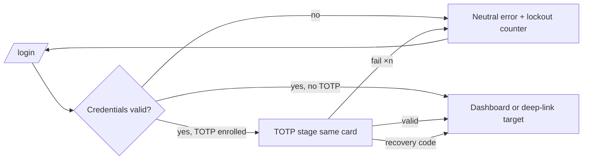

### 22.2 Scanner Flow (J2 session prep)

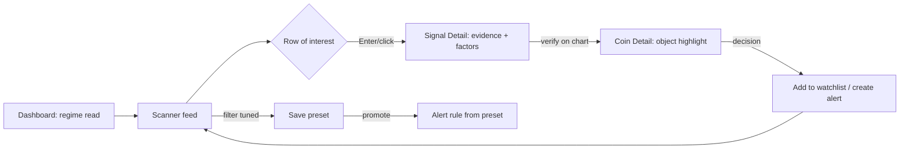

### 22.3 Alert Flow (J3 away-from-desk)

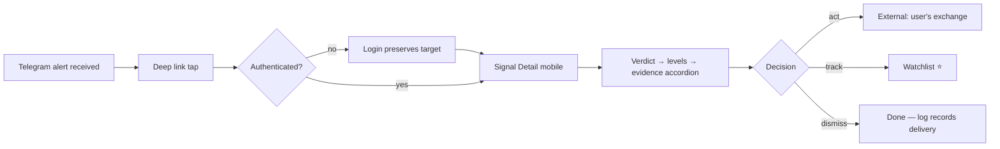

### 22.4 Watchlist Flow

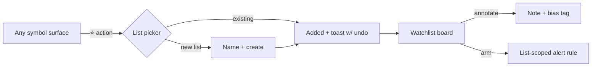

### 22.5 AI Analysis Flow

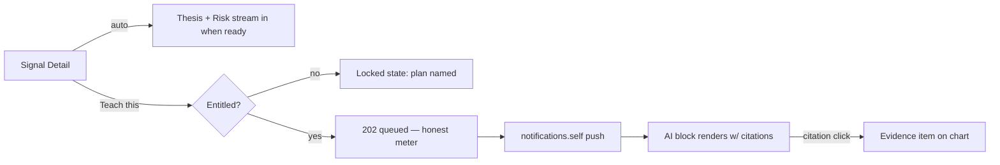

### 22.6 Search Flow

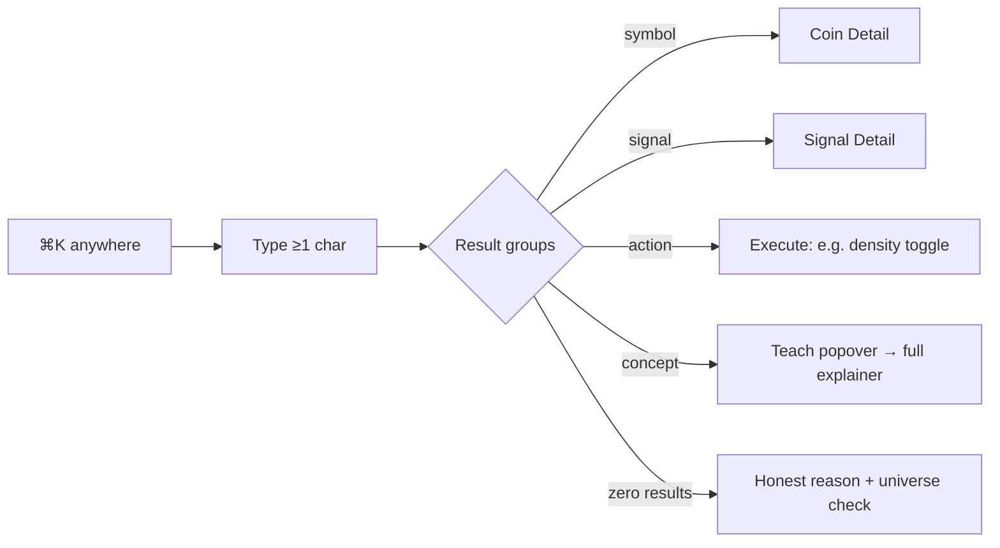

### 22.7 Settings Flow

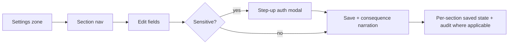

### 22.8 Subscription Flow (J6)

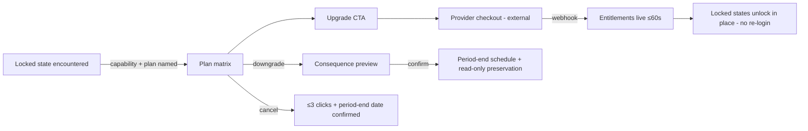

---

## 23. Navigation Map

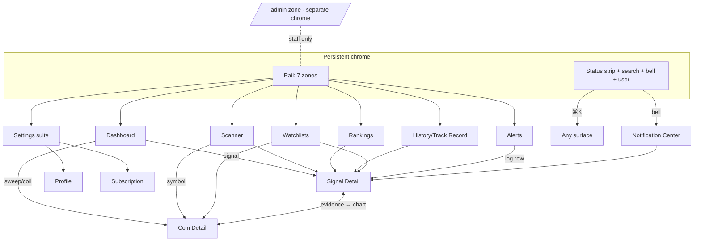

## 24. Component Hierarchy

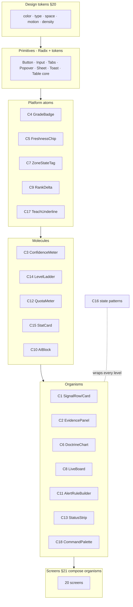

---

## 25. Closing Statement

Evidence Terminal has one design conviction: **trust is rendered, not claimed.** Every screen above routes attention through the same covenant — what the market did, why the platform believes it matters, how fresh the data is, and where the proof lives — in a visual language cold enough that the doctrine's own semantics provide all the heat. Builders implement inside the token system and component contract; where a surface question is not answered here, the answer is a Blueprint amendment, never an improvised pixel.

**— End of UI/UX Blueprint v1.0.0 —**